

# הרצאה 4 - סיווג דיסקרימינטיבי

<a href="./slides/" class="link-button" target="_blank">Slides</a>
<a href="/assets/lecture04.pdf" class="link-button" target="_blank">PDF</a>
<a href="./code/" class="link-button" target="_blank">Code</a>

## מה נלמד היום

## בעיות סיווג

בעיות סיווג הם בעיות supervised learning שבהם המשתנה האקראי שאותו מנסים לחזות $\text{y}$ הוא משתנה אקראי בדיד אשר יכול לקבל סט ערכים סופי (לרוב קטן).

דוגמאות לבעיות סיווג:

- מערכת להתראה על מכשולים בכביש (הולך רגל, קרבה לרכב שמלפנים וכו') מתוך תמונות ממצלמת דרך.
- מערכת לסינון דואר זבל.
- מערכת לזיהוי כתב יד בתמונה.
- מערכות speach-to-text אשר הופכות קטע אודיו למילים.
- מערכת לזיהוי פנים בתמונות.

 ההבדל באופי של המשתנה שאותו מסנים לחזות בין בעיות רגרסיה לבעיות סיווג, הוא למעשה מאד משמעותי משפיע באופן ניכר על המודלים והשיטות שבהם נשתמש על מנת לפתור בעיות סיווג. שני הסיבות העיקריות לשוני הינם:

- בבעיות סיווג אנו נחפש חזאי אשר מייצר ערכים בדידים (בדומה ל$\text{y}$) ולכן לא נוכל להשתמש במודלים רציפים, כגון פולינומים, כפי שהם. בנוסף, בפונקציות אשר מוציאות ערכים בדידים אין טעם לדבר על הנגזרת (היא קבועה בכל מקום מלבד נקודות אי הרציפות שבהם היא עוברת מערך אחד לאחר). לכן לא נוכל לחפש את החזאי האופטימאלי על ידי גזירה והשוואה ל-0 או בעזרת שיטות כמו gradient descent.

- בבעיות סיווג לרוב לא תהיה משמעות למרחק בין החיזוי $\hat{y}$ לערך האימיתי של $y$. לדוגמא, בניסיון לזהות את האות $g$, חיזוי של האות $f$ (אשר מופיעה בצמוד ל$g$ באלף בית) הוא לא בהרכח חיזוי טוב יותר מ $q$ (אשר נמצא רחוק יותר). עקב כך פונקצות מחיר כמו MSE אשר מתייחסות לגודל של שגיאת החיזוי יהיו לא רלוונטיות ונאלץ להשתמש בפונקציות מחיר אחרות כגון misclassification rate (שאותה נזכיר מיד).

בהרצאה הקרובה נכיר שתי שיטות דיסקרימינטיביות לפתרון בעיות סיווג.

**הגישה הדיסקרימינטיבית - תזכורת**: תחת הגישה הדיסקרימינטיבית אנו מנסים לבנות חזאי בעל ביצועיים טובים ככל האפשר על המדגם. בכדי לנסות ולהגביל את מידת ה overfitting אנו נשים מגבלות על פונקציית החיזוי, כפי שראינו בהרצאה האחרונה.

## בעיה לדוגמא

בחברות כרטיסי אשראי משתמשים במערכות אוטומטית שאומרות להתריע על עסקואות חשודות שעשויות להיות הונאות אשראי, לדוגמא כאשר מבצע העיסקה משתמש בכרטיס האשראי גנוב. מערכות אלו מנסות לבצע סיווג של העיסקה לעיסקה לגיטימית או חשודה על סמך פרטי העיסקה, כגון:

- הסכום.
- מרחק העיסקה (נניח המיקום של החנות) מהעיסקה האחרונה.
- מרחק העיסקה מהכתובת של הלקוח.
- השעה ביום.
- אופי המוצרים שהחנות מוכרת (מכולת, מוצרי חשמל, ביגוד, רכב, נדל"ן, וכו')

דרך אחת לבנות מערכת שכזו היא בעזרת supervised learning על ידי שימוש במדגם גדול של דוגמאות מתוייגות מהעבר. בהרצאה זו נשתמש בעיה זו כדוגמא. נתייחס למדגם הבא:

נרצה למצוא חזאי אשר לכל צמד חדש של מרחק ומחיר יחזיר חיזוי של האם העסקה חשודה או לא. לדוגמא:

(החיזוי בכל נקודה הוא הצבע של הרקע)

### חלוקה ל train-test

נחלק את המדגם ל80% train ו 20% test:

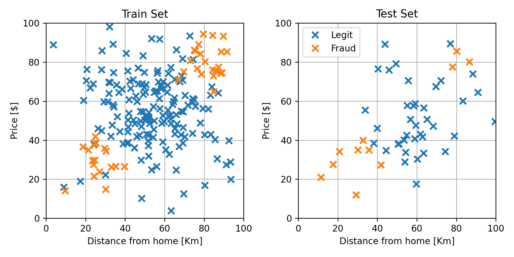

## שמות וסימונים

נציג את השמות הסימונים המקובלים בבעיות סיווג:

- בבעיות סיווג נהוג להתייחס לחזאי כאל מסווג (classifier) או discriminator (מקטלג).
- את הערכים השונים שאותם התוויות יכול לקבל מכנים **מחלקות**.
- את מספר המחלקות נסמן בקרוס ב $C$.
- בעיות סיווג שבהם יש רק 2 מחלקות, $C=2$, מכוונות בעיות **סיווג בינארי**.
- בסיווג בינארי, מקובל להשתמש באחד מהאופציות הבאות לסימון המחלקות:
  - $y\in\{0,1\}$.
  - $y\in\{-1,1\}$.
- בסיווג לא בינארי, מקובל להשתמש באחד מהאופציות הבאות לסימון המחלקות:
  - $y\in\{1,2,\dots,C\}$.
  - $y\in\{0,1,\dots,C-1\}$.

## Misclassification rate

פונקציית המחיר הנפוצה בבעיות סיווג הינה פונקציית ה misclassification rate. פונקציה זו מחשבת את התדירות שבה צפוי החזאי לבצע שגיאות חיזוי (ללא קשר לגודל השגיאה). בדומה לרוב פונקציות השגיאה הנפוצות גם פונקציה זו מוגדרת כפונקציית risk והיא משתמשת בפונקציית ה loss הבאה:

$$
l(\hat{y},y)=I\{\hat{y}\neq y\}
$$

פונקציית loss זו נקראת פונקציית ה zero-one loss. תחת פונקציה זו חיזויים נכונים יקבלו ציון 0 ושגיאות יקבלו ציון 1 (לא תלות בגודל השגיאה). פונקציית ה misclassification rate נראית כך:

$$
R(h)=\mathbb{E}\left[I\{h(\mathbf{x})\neq\text{y}\}\right]
$$

### החזאי האופטימאלי

בהינתן הפילוג המשותף של $\mathbf{x}$ ו $\text{y}$ ניתן לחשב את החזאי האופטימאלי של ה misclassification rate. חזאי זה נתון על ידי:

$$
h^*(\boldsymbol{x})=\underset{y}{\arg\max}\ p(y|\mathbf{x}=\boldsymbol{x})
$$

חזאי זה למעשה מחזיר את ה $\text{y}$ הכי סביר (הכי שכיח, ה mode) בהסתברות של $\text{y}$ בהינתן $\mathbf{x}$.

(הפיתוח למקרה של חיזוי לא מותנה מופיע בתרגול 2 והפיתוח למקרה המותנה ינתן בתרגיל בית 1)

## 1-NN (1-Nearest Neighbours)

1-NN הוא אחד האלגוריתמים הפשוטים ביותר לבניית חזאי לבעיות superviesed learning. בשיטה זו החיזוי מתבצע באופן הבא, בעבור $\boldsymbol{x}$ מסויים, שבעבורו נרצה לבצא את החיזוי, נחפש במדגם את הדגימה עם ה $\boldsymbol{x}^{(i)}$ הקרוב עליו ביותר (השכן הקרוב ביותר) ונבצע את החיזוי על פי ה $y^{(i)}$ שמתאים לאותה דגימה. בחזאי זה למעשה אין שלב של לימוד (בניה של מודל) והחיזוי נעשה ישירות על פי המדגם. שיטות מסוג זה מכונות שיטות א-פרמטריות.

נרשום זאת באופן מתמטי. נתון מדגם $\mathcal{D}=\{\boldsymbol{x}^{(i)},y^{(i)}\}$ ודגימה נוספת $\boldsymbol{x}$ (אשר אינה חלק מהמדגם) שעליה נרצה לבצע את החיזוי. נבצע חיזוי בשיטת ה 1-NN באופן הבא:

1. נמצא את האינדקס של השכן הקרוב ביותר $i=\underset{i}{\arg\min} \lVert \boldsymbol{x}^{(i)}-\boldsymbol{x}\rVert_2$
2. החיזוי יהיה התווית של השכן הקרוב ביותר $\hat{y}=y^{(i)}$

כאן השתמשנו במרחק אוקלידי (נורמת $l_2$ של המרחק בין ה $\boldsymbol{x}$-ים). ניתן כמובן להחליף מדד זה בכל מדד מרחק אחר כתלות בצרכי הבעיה.

### דוגמא

נפעיל את 1-NN על הדוגמא שלנו:

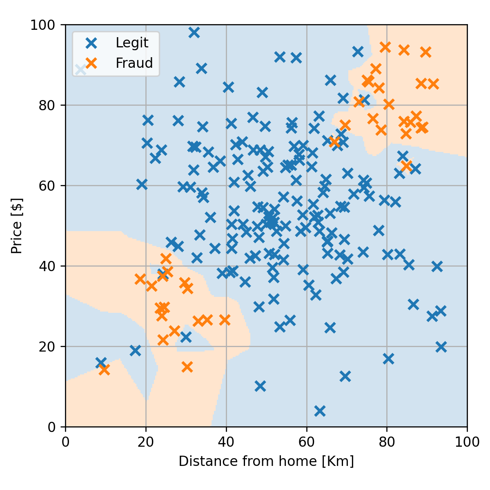

אלגוריתם זה ידאג כמובן שהחיזוי בנקודות של המדגם ובסביבתם המיידית תתאים לתיוות שלהם. זאת אומרת של על הנקודות מהמדגם אנו מצפים לקבל חיזוי מושלם. נשים אבל לב שחזאי זה יוצר הרבה "איים", למשל במקרים שבהם ישנה נקודה כתומה באיזור של הרבה נקודות כחולות ולהיפך. סביר להניח שאיים אלו מתאימים ספציפית למדגם הנתון ולא בהכרח יהיו נכונים בעבור מדגם אחר. זוהי בדיוק בעיית ה **overfitting**.

נתייחס לרגע לצורה של הגבולות בין שני איזורי ההחלטה השונים. לשם כך נחלק לרגע את המרחב לאיזורים שונים על פי השכן הכי קרוב המשוייך לכל נקודה במרחב. חלוקה שכזו תיצור למעשה תאים המוכונים Voronoi cells אשר מקיפים כל אחת מהנקודות. נשרטט חלוקה זו בגרף מוגדל:

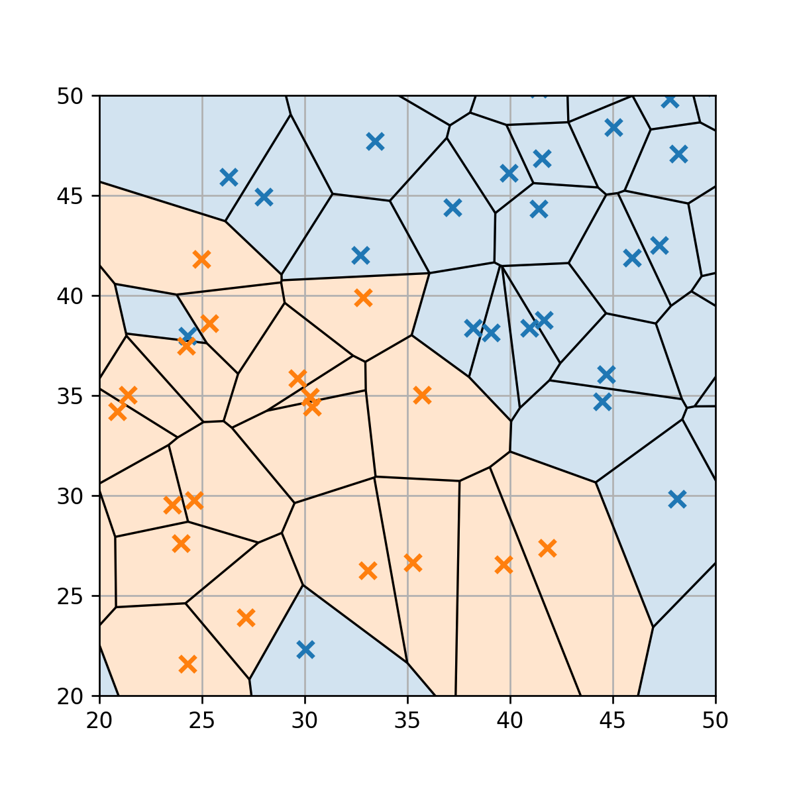

חלוקה זו לתאים קטנים יכולה לעזור לנו הבין את הצורה הכולל של פונקציית החיזוי. למעשה האיזור שבו החיזוי שהוא שהעיסקה חשודה מורכב מאוסף כל התאים של הדגימות במדגם של עסקאות חשודות, ובנ"ל לגבי העקאות החוקיות.

נבדוק את ביצועי החזאי על ה test set לפי פונקציית ה miscalssification rate:

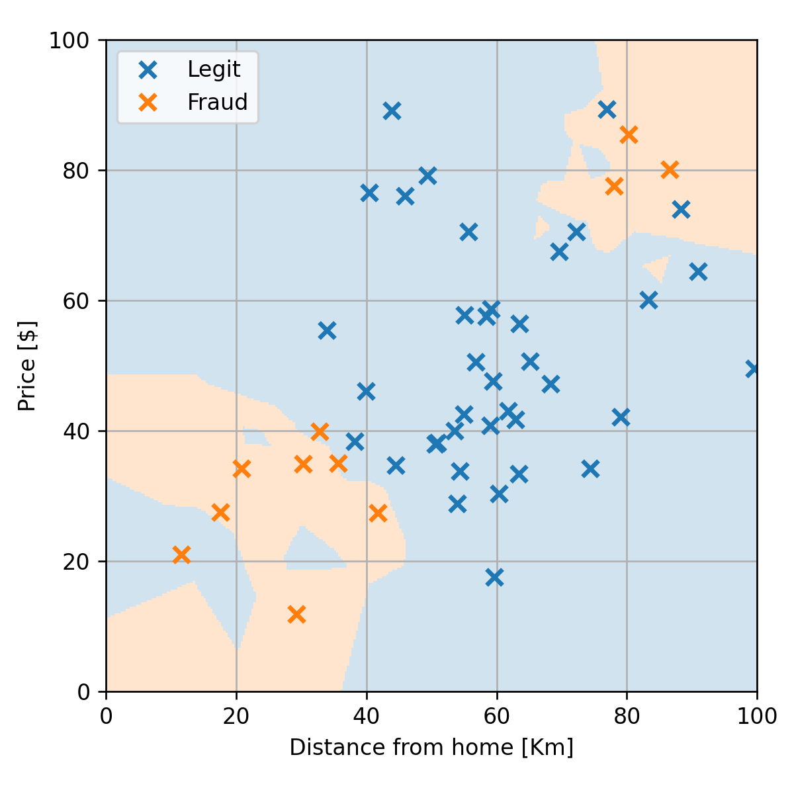

$$
\text{test score}=\frac{1}{N_{\text{test}}}\sum_{\{\boldsymbol{x}^{(i)},y^{(i)}\}\in\mathcal{D}_{\text{test}}}I\{h(\boldsymbol{x}^{(i)})\neq y^{(i)}\}=0.12
$$

זאת אומרת שעל ידי שימוש ב 1-NN אנו צפויים לצדוק ב88% מהחיזויים שלנו.

### התלות ביחידות של $\mathbf{x}$

מכיוון שאלגוריתם ה 1-NN תלוי במרחק בין נקודות במרחב, ישנה חשיבות רבה ליחידות, או יותר נכון לסדר הגדול, של הרכיבים של $\boldsymbol{x}$. רכיבים בעלי גודל אופייני גדול יותר יקבלו משקל גדול יותר. למשל, אם בדוגמא שלנו היינו מודדים את המרחק במטרים הערכים של רכיב המרחק היו באלפים. לכן כאשר ננסה לחשב את המרחק בין שתי נקדות נקבל שהשוני ברכיב של המרחק יהיה הרבה יותר משמעותי.

למעשה הדרך הנכונה יותר לצייר את המדגם במקרה זה תהיה:

לכן באלגוריתם זה יש לדאוג שהרכיבים של $\boldsymbol{x}$ יהיו בערך באותו סדר גודל.

## K-NN

ניתן לקלות לשפר את הביצועים של האלגוריתם על ידי שימוש במספר שכנים. את מספר השכנים נסמן ב $K$. גודל זה הוא hyper-parameter של האלגוריתם. החיזוי ב K-NN יתבצע לפי התווית הכי שכיחה מבין $K$ השכנים:

1. נמצא את $K$ השכנים בעלי ה $\boldsymbol{x}^{(i)}$ הקרובים ביותר ל $\boldsymbol{x}$. (לרוב נשתמש במרחק אוקלידי, אך ניתן גם לבחור פונקציות מחיר אחרות).
2. תוצאת החיזוי תהיה התווית השכיחה ביותר (majorety vote) מבין $K$ התוויות של הדגימות שנבחרו בשלב 1.

במקרה של שיוון:

- במקרה של שיוויון בשלב 2, נשווה גם את המרחק הממוצע בין ה $\boldsymbol{x}$-ים השייכים לכל תווית. אנו נבחר בתווית בעלת המרחק הממוצע הקצר ביותר.
- במקרה של שיווון גם בין המרחקים הממוצעים, נבחר אקראית.

### דוגמא

נשתמש ב 5-NN על מנת לבנות את החזאי שלנו:

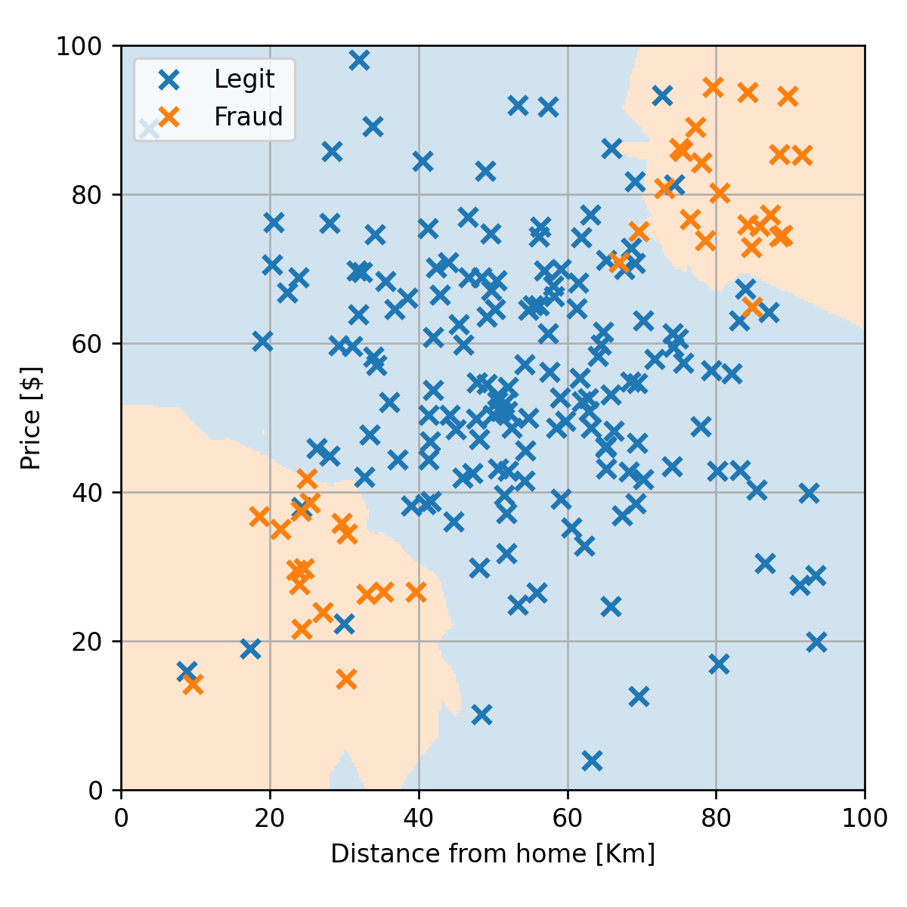

נשים לב שכמות האיים הצטמצמה הגבולות בין האיזורים נעשו יותר חלקים. נבדוק את התתוצאות על ה test set:

$$
\text{test score}=\frac{1}{N_{\text{test}}}\sum_{\{\boldsymbol{x}^{(i)},y^{(i)}\}\in\mathcal{D}_{\text{test}}}I\{h(\boldsymbol{x}^{(i)})\neq y^{(i)}\}=0.10
$$

הורדנו את תדירות השגיאות ל10%.

#### בחירת ה $K$ האופטימאלי

נחלק את ה train set ל 75% train ו 25% validation:

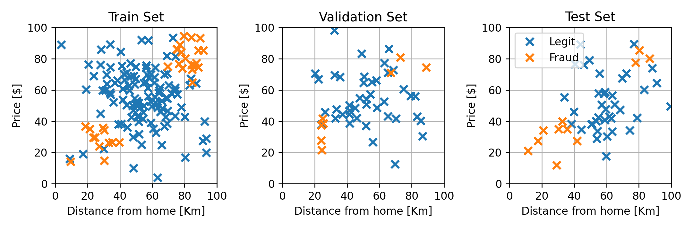

נחשב את ביצועי החזאי בעבור ערכי $K$ השונים על ה validation set

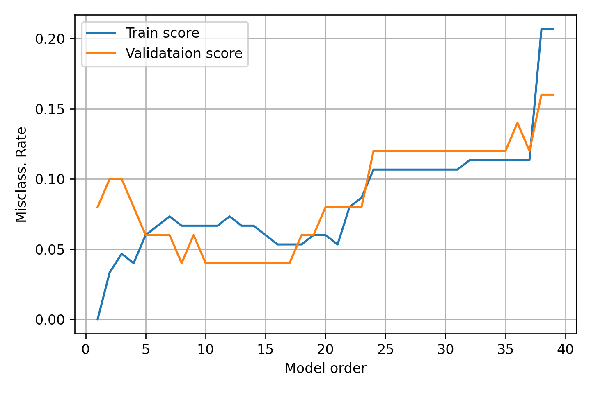

אנו רואים פה שוב את ה bias-variance tradeoff, שימו לב אבל שהתלות ב $K$  כאן היא הפוכה. כפי שציינו קודם, בעבור 1-NN ישנה כמות גבוהה של overfitting וניתן לראות עדות לזה בגרף זה בכך שה train score יורד ל0. ככל שנגדיל את $K$ האלגוריתם יעשה פחות overfitting אך הוא גם ימצע על איזור גדול יותר ובכך יחליק מאד את השפות של איזורי ההחלטה, עד לנקודה שבה יהיה רק איזור החלטה 1.

נשרטט את החזאי של 40-NN:

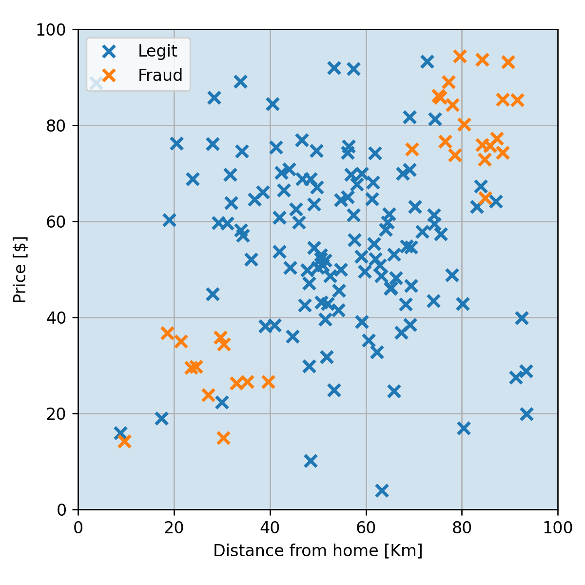

זהו כמובן מקרה קיצוני של underfitting, שבו החזאי מתאים למדגם רק באופן מאד גס וניתן עוד לשפר את החיזוי על ידי בחירת חזאי יותר מתאים למדגם.

בחירה של $K=13$ (שנמצא במרכז התחום שבו $K$ נותן ציון מינמאלי) נותן misclassification rate של 10%.

### K-NN לבעיות רגרסיה

ניתן להשתמש ב K-NN גם לפתרון בעיות רגרסיה, אם כי פתרון זה יהיה לרוב פחות יעיל. בבעיות רגרסיה אנו נבצע את החיזוי לפי הממוצע על התוויות של השכנים (במקום לבחור את תווית השכיחה).

## Decision trees (עצי החלטה)

עצי החלטה הם כלי נפוץ לקבלת החלטות והם מופיעים במקומות רבים גם מחוץ לתחום של מערכות לומדות. הם מבוססים על סדרה של שאלות כאשר התשובה לכל שאלה מובילה אותנו למסלול אחר בעץ, עד אשר אנו מגיעים לתשובה הסופית שנמצאת בקצה העץ:

לדוגמא, כאשר אנו באים עם כאב בבטן לרופא, הוא לרוב ישאל אותנו בכל פעם שאלה ועל פי התשובה ישאל שאלה נוספת (או יבצע בדיקה מסויימת) ובסוף סידרת השאלות (והבדיקות) יגיע להחלטה לגבי האיבחון שהוא חוזה.

דוגמא נוספת היא זו:

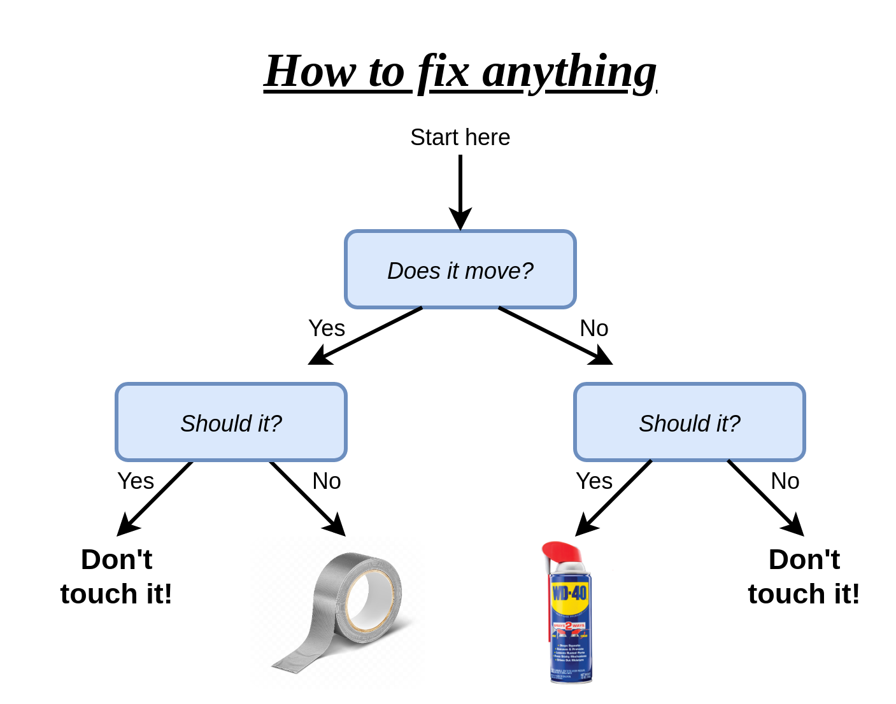

בהקשר של בעיות supervised learning נוכל לנסות לבנות עץ אשר ישמש כחזאי מ $\mathbf{x}$ ל $\text{y}$. תחת הגישה הדיסקרימינטיבית, אנו ננסה לבנות אותו כך שיתן חיזוי כמה שיותר טוב על המדגם תחת אילוצים מסויימים שנשים עליו.

היתרונות של השימוש בעץ החלטה כחזאי:

1. פשוט למימוש (אוסף של תנאי if .. else ..).
2. מתאים לעבודה עם משתנים קטגוריים (רכיבים של $\mathbf{x}$ שהם משתנים בדדים אשר מקבלים אחד מסט מצומצם של ערכים).
3. Explainable - ניתן להבין בדיוק מה היו השיקולים שלפיהם התקבל חיזוי מסויים.

### טרמינולוגיה

נציג את השמות המקובלים בעבודה עם עצים:

- **Root (שורש)** - נקודת הכניסה לעץ.
- **Node (צומת)** - נקודות ההחלטה / פיצול של העץ - השאלות.
- **Leaves (עלים)** - הקצוות של העץ - התשובות.
- **Branch (ענף)** - חלק מתוך העץ המלא (תת-עץ).
- **Depth (עומק)** - מספר ה nodes במסלול הארוך ביותר.

### ה nodes

באופן כללי ניתן להשתמש בכל שאלה שרוצים על $\boldsymbol{x}$ בכל node, אך לשם השמירה על הפשטות של העץ (אשר נחוץ גם לשם המימוש וגם למניעת overfitting) מקובל להגביל את השאלות ב nodes לתנאים פשוטים על **רכיב בודד** של $\mathbf{x}$ בכל פעם (זאת אומרת ל $\text{x}_i$ מסויים). תנאים אלו יהיו:

- בעבור רכיבים רציפים: נשתמש בתנאי מהצורה של $x_i>a$, כאשר יש לבחור את הרכיב שאותו נרצה לבדוק $i$ וערך הסף (threshold) $a$ שלפיו נרצה לפצל.
- בעבור רכיבים קטגוריים (בדידים אשר מקבלים סט קטן של ערכים - אחדות בודדות): נשתמש בתנאי אשר מפצל את העץ לכל אחד מהערכים שאותם יכול המשתנה לקבל.

לדוגמא, חזאי אשר מנסה לחזור הונאות אשראי על סמך נתוני העיסקה יכול להראות כך:

הפיצול הראשון בעץ הוא קטגורי לפי סוג המוצר ושאר הפיצולים הם לפי השווה ל threshold מסויים.

### בניית עץ החלטה לסיווג

מצד אחד, ככל שנגדיל את כמות ה nodes בעץ כך תגדל גם יכולת הביטוי שלו ונוכל להקטין את שגיאת החיזוי על המדגם. מצד שני, ככל שהעץ יכיל יותר nodes ויכולת הביטוי תגדל וכך תגדל גם כמות ה overfitting שהוא יעשה. דרך אחת למניעת overfitting הינה להגביל את כמות ה nodes. במקרים רבים אנו נרצה להגביל את הכמות ה nodes גם משיקולים פרקטיים של חישוביות וזיכרון. לכן המטרה שלנו בשלב בניית העץ הינה לבנות עץ אשר מקטין את שגיאת החיזוי תוך שימוש בכמה שפחות nodes.

 באופן כללי מלבד במקרים שבהם ישנם שתי דגימות עם $\boldsymbol{x}$-ים זהים אך עם $y$ שונה, תמיד ניתן יהיה למצוא עץ עם מספיק nodes אשר יגיע לחיזוי מושלם. (במקרה הקיצוני ניתן לפצל את כל המדגם כך שלכל עלה תגיע דגימה בודדת ולקבוע את התוצאת החיזוי בעלה זה להיות הערך של אותה דגימה).

ישנם אלגוריתמים רבים לבניה של עץ החלטה. שני האלגוריתמים הנפוצים ביותר הם שני אלגרותמים יחסית דומים בשם C4.5 (Ross Quinlan, 1986) ו CART (Breiman *et al.*, 1984). בקורס זה נתאר גירסא אשר מערבת בין שניהם. נציין רק שכיום נמצאים בשימוש הרבה וריאציות שונות של שיטות לבניית עצי החלטה אשר מבוססים על שיטות אלו.

בניית העץ תעשה בשני שלבים:

1. גידול העץ: ננסה לבנות עץ אשר מגיע לחיזוי הטוב ביותר שניתן על train set.
2. גיזום (pruning): נשתמש ב validation set על מנת להסיר nodes.

### שלב 1: גידול העץ

הבעיה של מציאת העץ אשר מגיע לחיזוי האופטימאלי על המדגם בכמה שפחות רמות דורשת לעבור על כל העצים האפשריים, וכמובן שפתרון זה לא פרקטי. במקום זאת ננסה לבנות את העץ שלב אחר שלב בצורה חמדנית (greedy). אנו נתחיל מהשורש ובכל פעם נוסיף node לעץ כאשר אנו בוחרים את התנאי המופיע ב node על ידי מעבר על כל התנאים האפשריים ובחירת התנאי אשר נותן את שגיאת החיזוי הקטנה ביותר על ה train set.

##### דוגמא

נגדים זאת על הדוגמא של זיהוי הונאות האשראי:

נתחיל מה node הראשון:

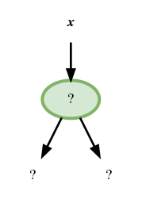

נבדוק כעת בעבור כל ערך של $\boldsymbol{x}$ בעבור כל threshold אפשרי מיהו התנאי אשר ייצר את העץ בעל שגיאת החיזוי הנמוכה ביותר. את הערכים בעלים של ה node אנו נקבע על ידי פיצול של המדגם על פי התנאי ובכל עלה נשים את הערך של התווית השכיחה ביותר בדגימות שהגיעו לאותו עלה.

בכדי להבין מהם ערכי ה treshold שעליהם נרצה לעבור נסתכל לרגע על סידרת המספרים הבאה:

$$
\{3,5,8\}
$$

את סדרת המספרים הזו ניתן לפצל (על פי ערך סף) ל 2 פיצולים אפשריים על ידי:

- העברת סף בין ה 3 ל 5
- העברת סף בין ה 5 ל 8

(המקרים שבהם אחד הפיצולים ריק לא מעניין אותנו)

לכן מספיק לבחון שני תנאים שיתאימו לשני הפיצולים האפשריים, לדוגמא:

- $x\geq 5$
- $x\geq 8$

נבדוק אם כן את כל הפיצולים האפשריים על המדגם שלנו. בעבור המרחק נקבל את שגיאות החזיוי (misclassification rate) הבאות:

בעבור המחיר נקבל את שגיאות החיזוי הבאות:

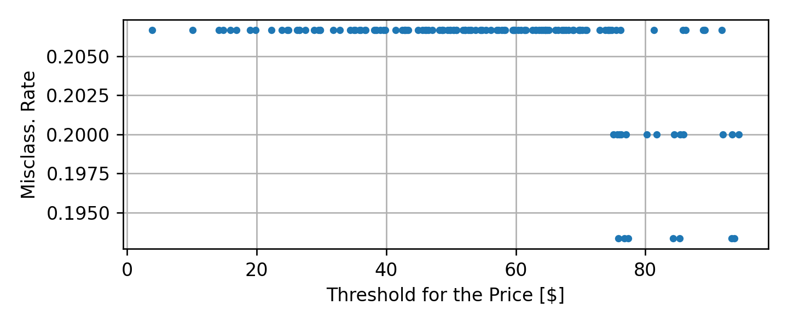

מן הגרפים האלה נוכל להסיק כי התוצאה הטובה ביותר (0.16) מתקבל בעבור התנאי של $x_{\text{Distance}}\geq 75$.

ולכן נבחר את ה node להיות:

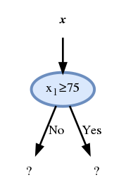

- מכיוון שלעלה השמאלי מגיעים 13 דגימות של הונאה ו 108 חוקיות החיזוי בעלה זה יהיה שהעסקה חוקית
- מכיוון שלעלה הימני מגיעים 18 דגימות של הונאה ו 11 חוקיות החיזוי בעלה זה יהיה שהעסקה חשודה כהונאה

נקבל אם כן את החזאי הזה:

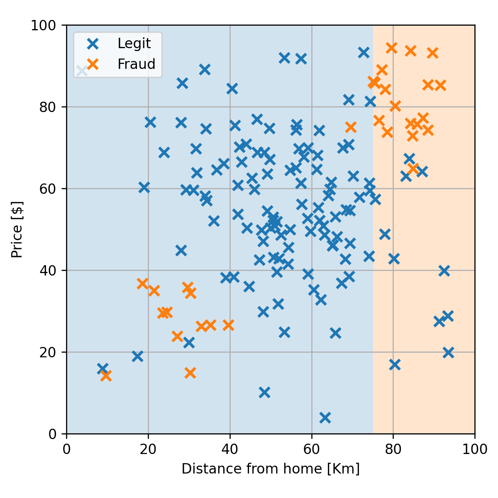

נוכל להמשיך כך ולהוסיף nodes עד אשר נגיע לשגיאה 0 או לעומק מקסימאלי שאותו הגדרנו מראש. אך לפני כן אנו נכניס שינוי קטן באלגוריתם שישפר את ביצועיו.

### מדדי חוסר הומוגניות

בדוגמא שהראנו המדד שאותו ניסינו לשפר בכל הוספה של ה node היה ה misclassification rate. מסתבר שניתן על ידי החלפה של מדד זה במדד טיפה שונה לשפר את ביצועי החזאי. המדדים האלטרנטיבים שנציג מנסים להתייחס לא רק לשגיאת החיזוי המיידית אלא גם להסתכל קדימה ולנסות לשפר את המצב לפיצולים הבאים.

מדדים אלו מסתמכים על הרעיון הבא. נסתכל על התפלגות של התוויות שהגיעו לעלה מסויים. בכדי לקבל בעלה זה מעט שגיאות חיזוי עלינו לדאוג שהפילוג של הדגימות יהיה מרוכז כמה שיותר בערך אחד מסויים שאותו נבחר להיות החיזוי של אותו עלה. כאשר זה לא המצב, והתוויות מפולגות על פני מספר ערכים נקבל הרבה שגיאות חיזוי.

במקרה שבו התוויות מרוכזות סביב ערך יחיד אנו נאומר שהם מפולגות בצורה **הומוגנית** (או לחילופין שהפילוג טהור - pure). לעומת זאת, במקרה שבו התוויות מפולגות בצורה אחידה על פני כל הערכים אנו נאומר שהם מפולגים בצורה **הטרוגנית**:

נשאף אם כן, שהתווית בכל עלה יהיו כמה שיותר הומוגניות. מיזעור מדד ה misclassification rate אומנם יוביל באופן ישיר להגדלת ההומוגניות, אך ניתן לחילופין להשתמש גם במדדי חוסר הומוגניות אחרים.

בהינתן משתנה דיסקרטי מסויים $\text{y}$ בעל פילוג $p(y)$, נגדיר עוד שני ממדי חוסר ההומוגניות נוספים, בנוסף ל misclassification rate:

- misclassification rate (כמות השגיאות אשר צפויה להתקבל בעבור חיזוי של הערך הכי סביר)

    $$
    Q(p)=1-\max_{y\in\{1,\dots,C\}}p(y)
    $$

- אינדקס Gini:

    $$
    Q(p)=\sum_{y\in\{1,\dots,C\}}p(y)(1-p(y))
    $$

- אנטרופיה (אשר מסומן במקרים רבים גם כ $H$):

    $$
    Q(p)(=H(p))=\sum_{y\in\{1,\dots,C\}}-p(y)\log_2 p(y)
    $$

מדדים אלו שווים ל-0 בעבור פילוגים הומוגנים והם גדלים ככל שהפילוג הולך ונעשה הטרוגני. השרטוטים הבאים מראים את ההתנהגות של הממדים האלה במקרה של משתנה אקראי בינארי:

#### חוסר הומוגניות ממוצעת של עץ

בהינתן מדגם מסויים, עץ מסויים ומדד חוסר הומוגניות נוכל לחשב את חוסר ההומוגניות הממוצעת על העלים של העץ באופן הבא:

1. נעביר את הדגימות מהמדגם דרך העץ ונפצל אותם לתתי מדגמים על פי העלים שאליהם הם הגיעו. נסמן את אוסף האינדקסים של הדגימות שהגיעו לעלה ה $j$ ב $\mathcal{I}_j$. נסמן את כמות הדגימות שהגיעו לעלה ה $j$ ב $N_j$.

2. לכל עלה נחשב את הפילוג האמפירי של התויות שהגיעו עליו באופן הבא:

    $$
    \hat{p}_{j,y}=\frac{1}{N_j}\sum_{i\in\mathcal{I}_j} I\{y_i=y\}
    $$

    ($p_{j,y}$ הוא פשוט השכיחות של הערך $y$ מבין התוויות בעלה ה $j$)

3. בעזרת הפילוג האמפירי נחשב את חוסר ההומוגניות של כל עלה:

    $$
    Q(\hat{p}_j)
    $$

4. הציון הכולל של העץ יהיה הממוצע המושכלל של חוסר ההומוגניות של העלים ביחס לכמות הדגימות שהגיעה לכל עלה:

    $$
    Q_{\text{total}}=\sum_j \frac{N_j}{N}Q(\hat{p}_j)
    $$

כעת נוכל לבנות את העץ תוך נסיון למזער את ממדי השגיאה האלטרנטיבים במקום את ה misclassification rate. לרוב שימוש ב Gini או באנטרופיה יוביל לביצועים טובים יותר.

### בחזרה לדוגמא

נתחיל מחדש את הבניה של העץ אך הפעם נמזער את מדד Gini.

בעבור ה node הראשון נחפש את התנאי אשר ממזער את המדד:

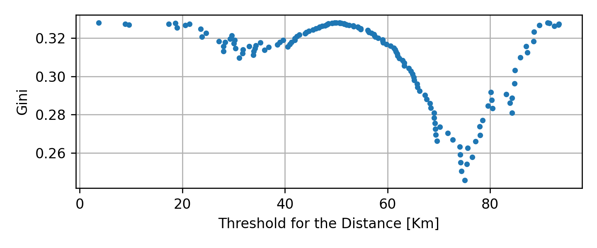

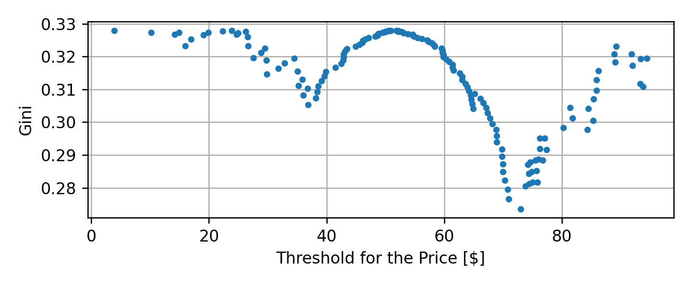

בדומה לקודם, נקבל כי התוצאה הטובה ביותר (0.25) מתקבל בעבור התנאי של $x_{\text{Distance}}\geq 75$.

נמשיך באותה השיטה ונקבל

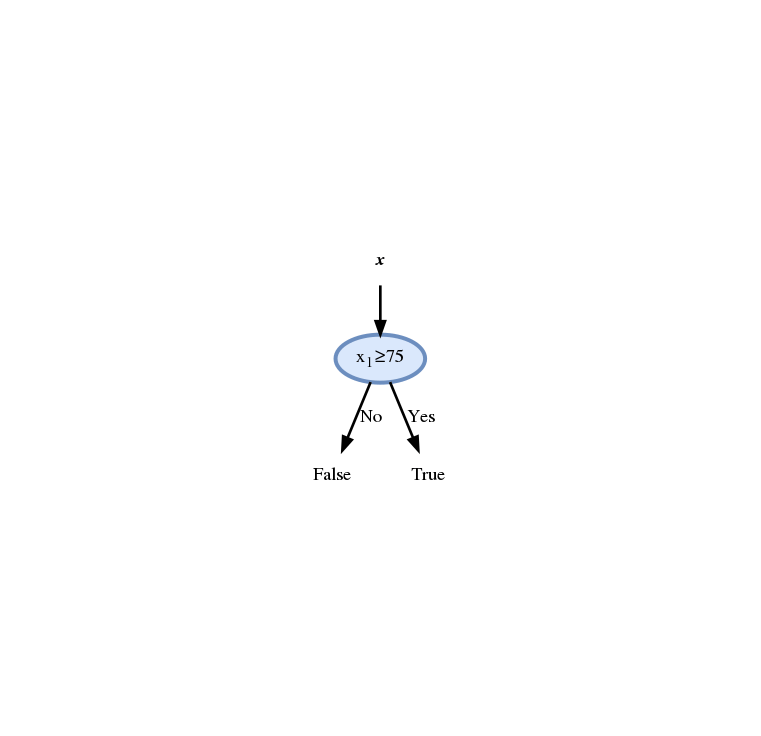

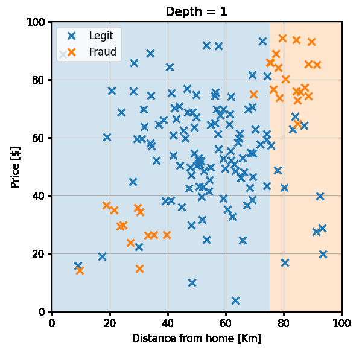

נבדוק את ביצועי החזאי על ה test set לפי פונקציית ה miscalssification rate:

$$
\text{test score}=\frac{1}{N_{\text{test}}}\sum_{\{\boldsymbol{x}^{(i)},y^{(i)}\}\in\mathcal{D}_{\text{test}}}I\{h(\boldsymbol{x}^{(i)})\neq y^{(i)}\}=0.14
$$

### שלב שני - pruning (גיזום)

על מנת לקטין את כמות ה overfitting אנו נשתמש ב validation set על מנת לאתר ענפים אשר אינם משפרים או פוגעים בביצעי החזאי. אנו נעשה זאת על ידי מעבר של על כל ה nodes שנמצאים בקצוות העץ ננסה להסירם. נבדוק את הציון המתקבל על ה validation set איתם ובלעדיהם. אם הנוכחות שלהם לא משפרת את ביצועי החזאי אנו נסיר אותם. אנו נמשיך ונבדוק את הענפים בקצוות העץ עד שלא ישארו node שיש להסיר.

#### דוגמא

נשתמש ב validation set על מנת לעשות pruning לעץ שקיבלנו. העץ לפני ה pruning הינו:

ולאחריו הינו:

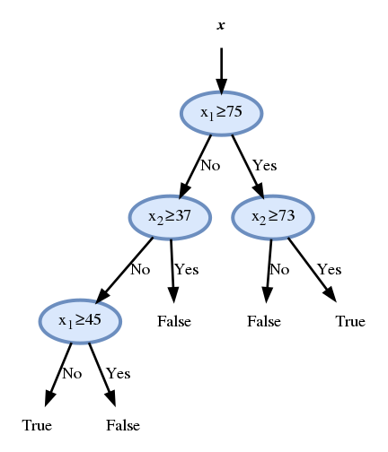

הביצועים על ה test set יהיו כעת 8% שגיאה.

## Regression Tree

ניתן להשתמש בעצים גם לפתרון בעיות רגרסיה. במקרה של רגרסיה עם פונקציית מחיר של MSE, הבניה של העץ תהיה זהה מלבד שני הבדלים:

1. תוצאת החיזוי בעלה מסויים תהיה הערך הממוצע של התוויות באותו עלה. (במקום הערך השכיח)
2. את מדד החוסר הומוגניות נחליף בשגיאה הריבועית של החיזוי של העץ.

