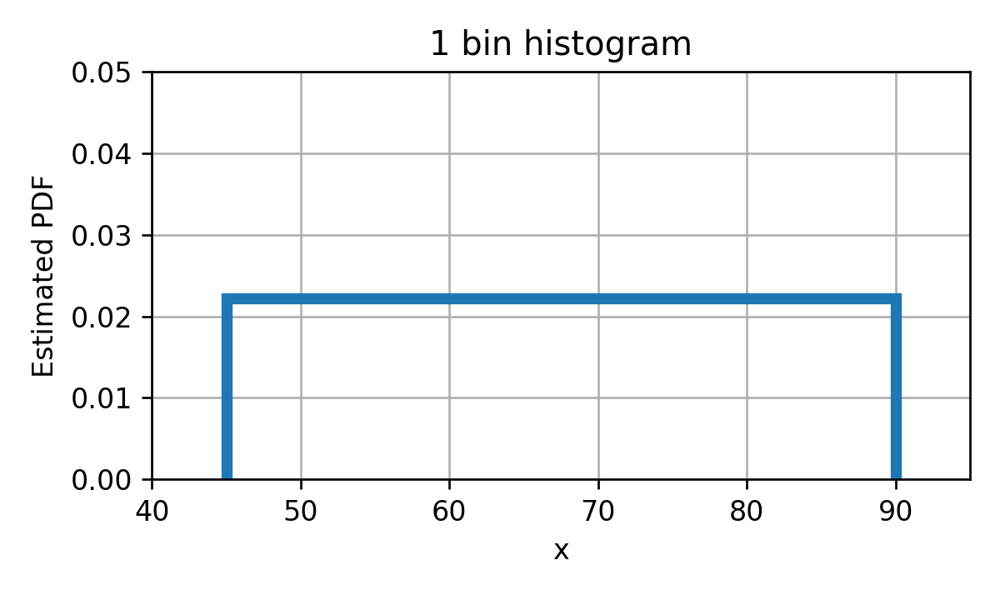
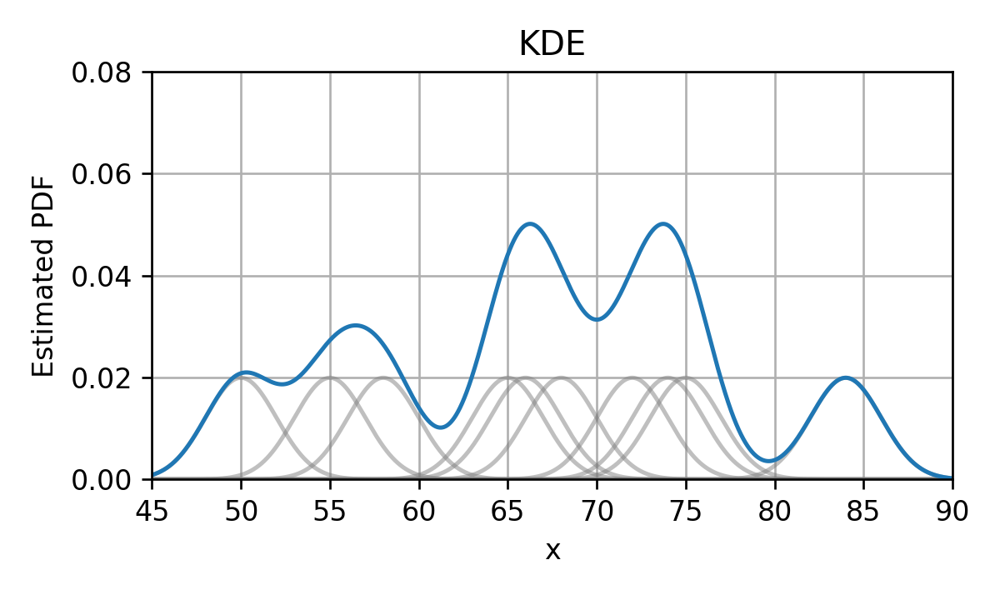
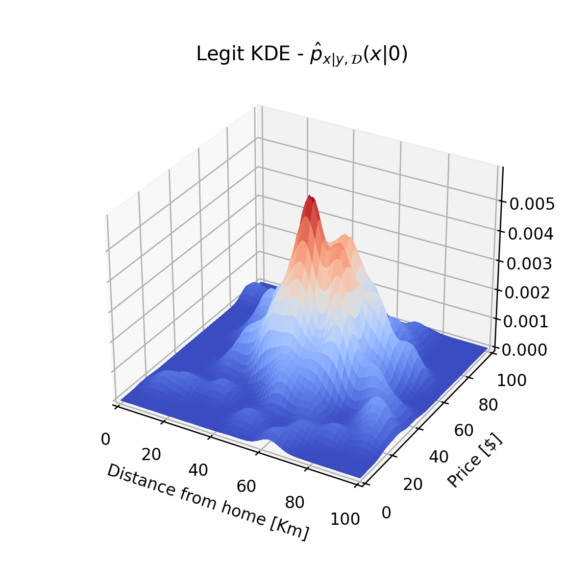
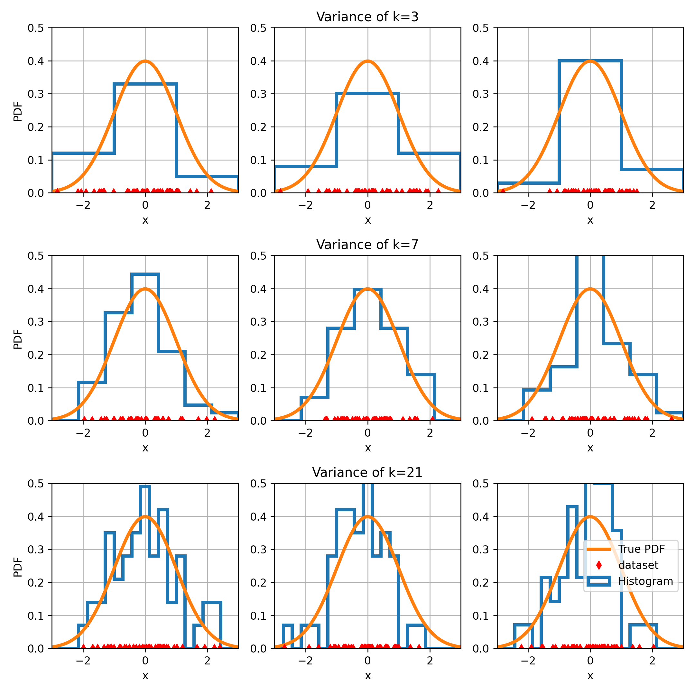

# הרצאה 5 - שיערוך פילוג בשיטות לא פרמטריות

<a href="./slides/" class="link-button" target="_blank">Slides</a>
<a href="/assets/lecture05.pdf" class="link-button" target="_blank">PDF</a>
<a href="./code/" class="link-button" target="_blank">Code</a>

## הגישה הגנרטיבית

### דיסקרימינטיבי vs. גנרטיבי

עד כה, עסקנו בשיטות לפתרון בעיות supervised learning אשר פעלו תחת הגישה הדיסקרימינטיבית שבה ניסינו באופן ישיר למצוא חזאי אשר יתאים למדגם. בשלושת השבועות הקרובים אנו נכיר גישה אחרת לפתרון בעיות supervised learning אשר נקראת הגישה הגנרטיבית.

כפי שציינו בעבר, ההבדל העיקרי בין בעיות חיזוי קלאסיות לבעיות supervised learning היא העובדה שאין בידינו את הפילוג של המשתנים האקראיים ובמקום זה יש בידינו מדגם מייצג שלהם. בגישה הגינרטיבית ננסה לגשר על פער זה על ידי שימוש במדגם לצורך שיערוך הפילוג של המשתנים האקראיים. בהינתן הפילוג המשוערך אנו נקבל בעיית חיזוי קלאסית אשר לרוב ניתן לפתרון בצורה פשוטה.

ננסה לתאר את ההבדל בין הגישה הדיסקרימינטיבית לגנרטיבית בעזרת השרטוט הבא:

#### הגישה הדיסקרימינטיבית

מדגם 
▼ 
חזאי בעל ביצועים טובים על המדגם

#### הגישה הגנרטיבית

מדגם 
▼ 
פילוג על סמך המדגם 
▼ 
חזאי אופטימאלי בהינתן הפילוג

הגישה הגנרטיבית מקבלת את שמה מהעובדה שהיא מנסה ללמוד את החוקיות אשר יצרה (generate) את הדגימות, בעוד שהשיטה הדיסקרימינטיבית רק מנסה להתאים לכל מדידה תווית מתאימה (discriminate).

### הקשר לבעיות unsupervised learning

בקרוס זה לא נעסוק כמעט בבעיות unsupervised learning אך כן ננצל הזדמות זו בכדי לתאר בקצרה את הקשר של שיטות גנרטיביות לבעיות מסוג זה. בבעיות unsupervised learning המדגם לא מכיל שני סוגי משתנים $\mathbf{x}$ ו $\text{y}$, אלא רק סוג בודד. לדוגמא אוסף של תמונות פנים, או אוסף של הקלטות דיבור של אדם מסויים. בבעיות מסוג זה, ננסה לרוב ללמוד מהם התכונות שמאפיינות את הדגימות במדגם. אחת הדרכים הטובות ביותר לתאר את המאפיינים של הדגימות היא על ידי שיערוך של הפילוג שלהם ואכן שיטות גנרטיביות דומות שאלו שנלמד בפרק זה משמשות גם בבעיות unsupervised learning.

## שיערוך הפילוג

הבעיה של בניית מודל הסתברותי של משתנים אקראיים מתוך מדגם מכונה **בעיית שיערוך (estimation)**. את המודל ההסתברותי אנו נבטא בעזרת אחת מהפונקציות הבאות:

- פונקציית ההסתברות (probablity mass function - PMF)
- פונקציית צפיפות ההסתברות (probability density function - PDF)
- פונקציית הפילוג המצרפית (cumulative distribution function CDF).

### חיזוי ושיערוך

בעיות חיזוי (prediction) ובעיות שיערוך (estimation) קרובים מאד באופי, ובמקרים רבים מבלבלים בין השתיים. ננסה לחדד את ההבדלים בניהם:

- **בבעיות חיזוי** אנו מועניינים לחזות את ערכו של **משתנה אקראי**, לרוב על סמך משתנה / וקטור אקראי בודד (**דגימה יחידה**).
- **בבעיות שיערוך** אנו מעוניינים לבנות **מודל הסתברותי** של משתנה / משתנים אקראיים לרוב על סמך **הרבה דגימות**.

### דוגמא לבעיית שיערוך

נסתכל לדוגמא על המדגם של הונאות אשראי מהרצאה הקודמת:

היינו מעוניינים לבנות על סמך מדגם זה את הפילוג של המשתנים האקראיים. לדוגמא היינו רוצים למצוא פונקציות כדוגמאת אלה אשר יתארו את הפילוג של הדגימות החוקיות ושל ההונאות:

בשלושת ההרצאות הקרובות אנו נעסוק בשאלה של כיצד לשערך פילוגים מסוגים אלו מתוך המדגם, וכיצד ניתם לבנות על סמך שיערוכים אלו את פונקציית החיזוי.

### שיערוך של פונקציות פילוג בשיטות א-פרמטריות

בהרצאה הקרובה נעסוק בשיטות שיערוך אשר מכונות שיטות לא פרמטריות או א-פרמטריות, מהות השם תהיה ברורה יותר אחרי שנציג בהרצאה הבאה את הנושא של שיטות פרמטריות.

## שיערוך ההסתברות של מאורע

נתחיל בבעיה פשוטה. ננסה לשערך את ההסתברות להתרחשות של מאורע מסויים על סמך מדגם.

### דוגמא

נניח שיש בידינו את המדגם הבא של מדידות של זמני נסיעה (בדקות) מחיפה לתל אביב על כביש החוף:

$$
\mathcal{D}=\{x^{(i)}\}=\{55, 68, 75, 50, 72, 84, 65, 58, 74, 66\}
$$

ברצונינו לשערך את ההסתברות של המאורע שנסיעה מסויימת תיקח יותר משעה, $A=\{x<60\}$. המשערך הטבעי ביותר לבעיה זו הינו משערך אשר שווה למספר הפעמים היחסי שמאורע זה קרה במדגם הנתון. בדוגמא זו יש 3 מתוך 10 נסיעות שבהן זמן הנסיעה היה קצר משעה, לכן נשערך שההסתברות של מאורע זה הינה:

$$
\text{Pr}(A)\approx\hat{p}_{A,\mathcal{D}}=0.3
$$

בדומה לסימון בבעיות חיזוי, נשתמש בסימון "כובע" לציון גודל שאותו אנו חוזים / משערכים באופן אמפירי (על סמך מדגם). בנוסף אנו נקפיד לציין את העובדה שמשערך תלוי במדגם שבו השתמשנו על ידי הוספת $\mathcal{D}$ מתחת למשערך.

שיטת שיערוך זו מכונה **מדידה אמפירית (empirical measure)** או משערך הצבה. נרשום את המשערך בצורה פורמלית.

### מדידה אמפירית / משערך הצבה (empirical measure)

בהינתן מדגם מסויים $\mathcal{D}=\{\boldsymbol{x}^{(i)}\}_{i=0}^N$, המדידה האמפירית, $\hat{p}_{A,\mathcal{D}}$, הינה שיערוך של הההסתברות, $Pr\left(A\right)$, והיא מחושבת באופן הבא:

$$
\hat{p}_{A,\mathcal{D}}=\tfrac{1}{N}\sum_{i=1}^N I\{\boldsymbol{x}^{(i)}\in A\}
$$

נוכל כעת להשתמש בשיטה זו על מנת לנסות ולשערך את הפילוג של משתנים אקראיים.

## שיערוך פונקציית ההסתברות של משתנה אקראי דיסקרטי

שיערוך פונקציית ההסתברות (ה PMF) של משתנים אקראיים דיסקרטיים הוא לרוב משימה פשוטה. נסתכל על שתי דוגמאות:

### דוגמא 1 - משתנה ביארי

יש בידינו מטבע לא הוגן (כזה שההסתברות שיפול על עץ או על פלי היא לא חצי-חצי). נסמן את תוצאת ההטלה של המטבע ב $\text{x}$ כך ש 1 מציין עץ ו 0 מציין פלי. בכדי לקבוע את ה PMF של $\text{x}$ הטלנו את המטבע 10 פעמים וקיבלנו:

$$
\mathcal{D}=\{x^{(i)}\}=\{0, 0, 0, 0, 1, 0, 0, 1, 0, 0\}
$$

גם פה הפתרון הטבעי הוא לשערך את הסתברות לקבל כל ערך של $\text{x}$ על פי השכיחות של אותו ערך במדגם. זאת אומרת כיוון שמתוך ה10 דגימות יש 2 פעמים את הערך 1 ו8 פעמים את הערך 0 נשערך את ה PMF להיות:

$$
p_{\text{x}}(x)\approx\hat{p}_{\text{x},\mathcal{D}}(x)=
\begin{cases}
  0.8 & 0 \\
  0.2 & 1
\end{cases}
$$

למעשה אנו משתמשים כאן במדידה אמפירית של המאורע ש $\{\text{x}=x\}$ לשיערוך של כל אחד מהערכים.

### דוגמא 2 - משתנה לא בינארי

את אותו השיערוך נוכל כמובן לבצע גם על משתנים דיסקטיים אשר יכולים לקבל מספר כל שהוא של ערכים. דגומא נסתכל על בעיה דומה עם קוביה לא הוגנת שב 10 הטלות שלה התקבלו הדגימות הבאות:

$$
\mathcal{D}=\{x^{(i)}\}=\{3, 2, 5, 1, 2, 6, 2, 5, 5, 3\}
$$

גם כאן נשערך את ההסתברות לקבל כל ערך לפי השכיחות שלו במדגם:

$$
p_{\text{x}}(x)\approx\hat{p}_{\text{x},\mathcal{D}}(x)=
\begin{cases}
  0.1 & 1 \\
  0.3 & 2 \\
  0.2 & 3 \\
  0 & 4 \\
  0.3 & 5 \\
  0.1 & 6 \\
\end{cases}
$$

### ניסוח פורמאלי

בהינתן מדגם מסויים $\mathcal{D}=\{\boldsymbol{x}^{(i)}\}_{i=0}^N$, נוכל לשערך את ה PMF של משתנה / וקטור אקראי דיסקרטי באופן הבא:

$$
\hat{p}_{\mathbf{x},\mathcal{D}}(\boldsymbol{x})=\frac{1}{N}\sum_{i=1}^N I\{\boldsymbol{x}^{(i)}=\boldsymbol{x}\}
$$

שימו לב שמובטח לנו שנקבל פונקציית הסתברות חוקית (חיובית שהסכום עליה שווה ל1).

## שיערוך פונקציית הפילוג המצרפי של משתנה אקראי

### ECDF (Empirical Cumulative Distribution Function)

נזכור כי פונקציית הפילוג המצרפי (ה CDF) מוגדרת באופן הבא:

$$
F_{\mathbf{x}}(\boldsymbol{x})=\text{Pr}\left(\{\mathbf{x}_j\leq\boldsymbol{x}_j\ \forall j\}\right)
$$

נוכל אם כן לשערך גודל זה על ידי שימוש במדידה האמפירית בעבור המאורע של $\{\mathbf{x}_j\leq\boldsymbol{x}_j\ \forall j\}$ באופן הבא:

$$
\hat{F}_{\mathbf{x},\mathcal{D}}(\boldsymbol{x})=\hat{p}_{\{\mathbf{x}_j\leq\boldsymbol{x}_j\ \forall j\},\mathcal{D}}=\frac{1}{N}\sum_{i=1}^N  I\{\boldsymbol{x}^{(i)}_j\leq\boldsymbol{x}_j\ \forall j\}
$$

משערך זה נקרא empirical cumulative distribtuion function (ECDF).

#### דוגמא

נשערך את פונקציית הפילוג המצרפי של המדגם של 10 זמני הנסיעה בכביש החוף

$$
\mathcal{D}=\{x^{(i)}\}=\{55, 68, 75, 50, 72, 84, 65, 58, 74, 66\}
$$

משערך ה ECDF של $\text{x}$ יהיה במקרה זה:

$$
\hat{F}_{\mathbf{x},\mathcal{D}}(\boldsymbol{x})=
\begin{cases}
  0 & x<50 \\
  0.1 & 50\leq x<55 \\
  0.2 & 55\leq x<58 \\
  0.3 & 58\leq x<65 \\
  0.4 & 65\leq x<66 \\
  0.5 & 66\leq x<68 \\
  0.6 & 68\leq x<72 \\
  0.7 & 72\leq x<74 \\
  0.8 & 74\leq x<75 \\
  0.9 & 75\leq x<84 \\
  1 & 84\leq x  \\
\end{cases}
$$

זוהי למעשה פונקציה קבועה למקוטעין אשר נראית כך:

#### הבעיה עם ECDF

הבעיה העיקרית עם משערך ה ECDF הינה שהוא מייצר פונקציה שהיא קבועה למקוטעין, כאשר בעבור משתנים רציפים היינו מצפים לפונקציה רציפה אשר עולה בהדרגה מ 0 ל 1. אחד הבעיות העיקריות עם העובדה שהפונקציה אינה רציפה הינה פונקציית ה PDF המתקבלת מתוך נסיון לגזור את ה ECDF. פונקציית ה PDF שנקבל תהיה מורכבת מאוסף של פונקציות דלתא:

ופונקציה כזו היא לא מאד שימושית.

## היסטוגרמה

היסטוגרמה היא מעיין נסיון לשערך פילוג של משתנה רציף על ידי כך שנעשה לו קוונטיזציה. בשיטה זו נחלק את טווח הערכים שמשתנה אקראי יכול לקבל למספר סופי של חלקים המכוונים bins (תאים). אחרי חלוקה זו נשתמש במדידה אמפירת על מנת לשערך את ההסתברות להימצא בכל תא.

### דוגמא

לדוגמא בעבור המקרה של של זמני הנסיעה, נוכל לחלק את התחום ל 5 קטעים:

$$
[45,54),[54,63),[63,72),[72,81),[81,90]
$$

הבחירה של ה bins נעשתה כך שהם יכסו את כל התחום ולא תהיה בניהם חפיפה (כולל בקצוות ה bin). באופן כללי ניתן לבחור את ה bins בכל צורה שהיא כל עוד הם מקיימים את אותם שני תנאים של כיסוי מלא וחוסר חפיפה.

נחשב את ההסתברות להיות בכל bin בעזרת המדידה האמפירית:

$$
\begin{aligned}
\hat{p}_{\{45\leq\text{x}<54\},\mathcal{D}}&=0.1\\
\hat{p}_{\{54\leq\text{x}<63\},\mathcal{D}}&=0.2\\
\hat{p}_{\{63\leq\text{x}<72\},\mathcal{D}}&=0.3\\
\hat{p}_{\{72\leq\text{x}<81\},\mathcal{D}}&=0.3\\
\hat{p}_{\{81\leq\text{x}\leq90\},\mathcal{D}}&=0.1\\
\end{aligned}
$$

בכדי להפוך את ההסתברויות של המאורעות האלה לצפיפות הסתברות נרצה "למרוח" את ההסתברות שקיבלנו להיות ב bin מסויים באופן אחיד על פני ה bin. זאת אומרת שצפיפות ההסתברות בכל נקודה ב bin תהיה ההסתברות להימצא ב bin חלקי גודל ה bin. נקבל אם כן את פונקציית צפיפות הפילוג הבאה:

$$
\hat{p}_{\text{x},\mathcal{D}}(x)
=\begin{cases}
  \frac{1}{\text{size of bin }1}\hat{p}_{\{\text{x in bin }1\},\mathcal{D}}&\text{x in bin }1\\
  \vdots\\
  \frac{1}{\text{size of bin }B}\hat{p}_{\{\text{x in bin }B\},\mathcal{D}}&\text{x in bin }B
\end{cases}
$$

### ניסוח פורמאלי

בהינתן מדגם מסויים $\mathcal{D}=\{\boldsymbol{x}^{(i)}\}_{i=0}^N$, ההיסטוגרמה הינה שיערוך של ה PDF של משתנה / וקטור אקראי והיא מחושבת באופן הבא:

1. מחלקים את תחום הערכים ש $\mathbf{x}$ יכול לקבל ל bins (תאים) לא חופפים אשר מכסים את כל התחום.
2. לכל bin משערכים את ההסתברות של המאורע שבו $\mathbf{x}$ יהיה בתוך התא.
3. הערך של פונקציית הצפיפות בכל תא תהיה ההסתברות המשוערכת להיות בתא חלקי גודל התא.

נרשום זאת בעבור המקרה של משתנה אקראי סקלרי. נסמן ב $B$ את מספר התאים וב $l_b$ ו $r_b$ את הגבול השמאלי והימני בהתאמה של התא ה $b$. ההסטוגרמה תהיה נתונה על ידי:

$$
\hat{p}_{\text{x},\mathcal{D}}(x)
\begin{cases}
  \frac{1}{N(r_1-l_1)}\sum_{i=1}^N I\{l_1\leq x^{(i)}<r_1\}&l_1\leq x<r_1\\
  \vdots\\
  \frac{1}{N(r_B-l_B)}\sum_{i=1}^N I\{l_B\leq x^{(i)}<r_B\}&l_B\leq x<r_B\\
\end{cases}
$$

לבחירת ה bins יש השפעה גדולה על איכות השיערוך שנקבל. ננסה להבין את השיקולים בבחירת ה bins.

## Overfitting ו underfitting של היסטוגרמה

### דוגמא

נסתכל על שני מקרים קיצוניים. בעבור בחירה של bin יחיד אשר מכסה את כל התחום, נקבל את ההיסטוגרמה הבאה:

בעבור חלוקה של התחום ל 100 bins בעלי גודל אחיד, נקבל את ההיסטוגרמה הבאה:

כאשר מספר התאים מאד קטן היכולת שלנו לקרב את ה PDF האמיתי תהיה מאד מוגבלת ולכן נקבל PDF משוערך שמאד שונה מה PDF האמיתי. זהו למעשה מקרה קלאסי של underfitting שבו אנו משתמשים במודל מוגבל אשר יכול ללמוד רק מאפיינים מאד גסים של המדגם וניתן לשפר את התוצאה על ידי שימוש במודל בעל יכול ביטוי גדולה יותר.

מצד שני כאשר מספר ה bin מאד גדול ההיסטוגרמה תתאר בצורה טובה את הפילוג של הדגימות **הספציפיות שבמדגם** אך כנראה שפילוג זה לא יתאר בצורה טובה את הפילוג של מדגם אקראי אחר, או לחילופין את הפילוג האמיתי של המשתנה האקראי. זהו מקרה קלאסי של overfitting.

גם כאן החלוקה האופטימלית ל bins, שתייצר את פונקציית ההיסטוגרמה הקרובה ביותר ל PDF האמתי, תהיה לרוב איזו שהיא נקודת ביניים בין חלוקה למספר גדול של bins אשר תיצור overfitting לבין חלוקה למספר קטן של bins אשר תייצר underfitting.

**הערה**: בפסקה האחרונה ציינו את פונקציית ההיסטוגרמה הקרובה ביותר ל PDF האמיתי, כאשר למעשה לא הגדרנו מדד למרחק בין פונקציות צפיפות. מסתבר שזהו נושא חשוב ויש הרבה דרכים לעשות זאת, אך בקורס זה לא נספיק לעסוק בו ונסתפק בהערכה איכותית של השיערוך ולא בהערכה כמותית.

### בחירת התאים

בחירה מקובלת של החלוקה לתאים הינה החלוקה של התחום ל $k$ תאים אחידים בגודלם. נשאר אם כן לבחור את $k$. מיכוון שה $k$ האופטימאלי ישתנה מבעיה לבעיה, נאלץ לרוב לבחור אותו בעזרת ניסוי וטעיה. אך אם זאת, ישנם מספר כללי אצבע אשר במרבית המקרים יתנו תוצאה לא רעה. הכלל הנפוץ ביותר הינו לבחירה של $k$ הינה שורש מספר הדגימות במדגם (מעוגל כלפי מעלה): $\left\lceil\sqrt{N}\right\rceil$

## Kernel Density Estimation (KDE)

נציג כעת שיטה נוספת מאד פופולרית לשיערוך פונקציית pdf מתוך מדגם המכונה kernel density estimation (KDE). בכדי להבין איך השיטה פועלת נתחיל מ PDF שבו אנו ממקמים פונקציית דלתא בגובה $\frac{1}{N}$ בכל נקודה אשר מופיעה במדגם. לדוגמא, בעבור 10 הדגימות של זמני הנסיעה בכביש החוף נקבל:

ראינו קודם כי שיטה אחת שבה PDF שכזה מתקבל הינה מתוך נסיון לגזור את פונקציית ה ECDF.

בכדי להפוך את הפילוג הזה ליותר סימפטי ננסה "למרוח" את פונקציות הדלתא על ידי החלפתם בפונקציות בעלות רוחב גדול מ-0 (בניגוד לרוחב 0 של פונקציות הדלתא). לדוגמא, בחירה נפוצה להחלפה שכזו היא החלפה של כל פונקציית דלתא בגאוסיאן:

הפונקציות שבהם אנו מחליפים את פונקציות הדלתא מכונות **פונקציות גרעין (kernel)** או **Parzen window** ומקובל לסמנם ב $\phi(\boldsymbol{x})$. לאחר ההחלפה של הדלתאות בפונקציות הגרעין, נסכום את כל פונקציות הגרעין שקיבלנו לקבלת ה PDF המשוערך:

אם כן, משערך ה KDE נתון על ידי:

$$
\hat{p}_{\mathbf{x},\phi,\mathcal{D}}(\boldsymbol{x})=\frac{1}{N}\sum_{i=1}^N \phi(\boldsymbol{x}-\boldsymbol{x}^{(i)})
$$

**הערה למי שלקח קורסים בעיבוד אותות**: למעשה אנו מבצעים קונבולוציה בין פונקציית הדלתאות לבין פונקציית גרעין כל שהיא. לרוב אנו נרצה שהגרעין ישמש כמעיין low pass filter שמטרתו להחליק את פונקציית הדלתאות. 

**הערה**: תנאי מספיק והכרחי בכדי שנקבל PDF חוקי, הינו שפונקציית הגרעיון תהיה בעצמה PDF חוקי. זאת אומרת שהיא חייבת להיות חיוביות ושהאינטרגל עליה יהיה שווה ל 1.

##### הוספת פרמטר רוחב

מקובל להוסיף לפונקציות הגרעין פרמטר $h$ אשר שולט ברוחב שלה באופן הבא:

$$
\phi_h(\boldsymbol{x})=\frac{1}{h^D}\phi\left(\frac{\boldsymbol{x}}{h}\right)
$$

החלוקה ב $h^D$ היא על מנת לשמור על הנרמול של הפונקציה. כאשר $D$ הוא המימד של $\mathbf{x}$.

בתוספת פרמטר זה המשערך יהיה:

$$
\hat{p}_{\mathbf{x},\phi,h,\mathcal{D}}(\boldsymbol{x})=\frac{1}{Nh^D}\sum_{i=1}^N \phi\left(\frac{\boldsymbol{x}-\boldsymbol{x}^{(i)}}{h}\right)
$$

בדומה לבחירה של מספר התאים בהיסטוגרמה גם כאן רוחב הגרעין ישלוט במידת ה overfitting. בעבור $h$ גדול נקבל underfitting ובעבור $h$ קטן נקבל overfitting.

##### פונקציות גרעין נפוצות

שתי הבחירות הנפוצות ביותר לפונקציית הגרעין הינן:

1. חלון מרובע:

    $$
    \phi_h(\boldsymbol{x})=\frac{1}{h^D}I\{|x_j|\leq \tfrac{h}{2}\quad\forall j\}
    $$

2. גאוסיאן:

    $$
    \phi_{\sigma}\left(x\right)=\frac{1}{\sqrt{2\pi}\sigma^D}\exp\left(-\frac{\lVert x\rVert_2^2}{2\sigma^2}\right)
    $$

כלל אצבע לבחירת רוחב הגרעין במקרה הגאוסי הסקלרי הינו $$\sigma=\left(\frac{4\cdot\text{std}(\text{x})^5}{3N}\right)^\frac{1}{5}\approx1.06\ \text{std}(\text{x})N^{-\tfrac{1}{5}}$$, כאשר $\text{std}(\text{x})$ הינה הסטיית תקן של $\text{x}$ (אשר לרוב תהיה משוערכת גם היא מתוך המדגם)

## שיערוך של פילוגים מעורבים

במקרים רבים אנו נרצה לשערך פילוגים אשר מערבים משתנים רציפים ומשתנים בדידים. נניח לדוגמא שאנו רוצים לשערך את הפילוג המשותף של $\text{x}$ ו $\text{y}$ כאשר $\text{x}$ הוא משתנה רציף ו $\text{y}$ הוא משתנה בדיד. במקרים כאלה נוח לפרק את פונקציית הפילוג המשותף באופן הבא:

$$
p_{\mathbf{x},\text{y}}(\boldsymbol{x},y)
=p_{\mathbf{x}|\text{y}}(\boldsymbol{x}|y)p_{\text{y}}(y)
$$

ואז להפריד את בעיית השיערוך לשני חלקים:

1. השיערוך של $p_{\text{y}}(y)$ - שיערוך זה יהיה לרוב פשוט שכן שיערוך זה לא תלוי כלל בערכו של $\text{x}$, ו $\text{y}$ הוא משתנה אקראי דיסקרטי שאותו קל יותר לשערך.
2. השיערוך של $p_{\mathbf{x}|\text{y}}(\boldsymbol{x}|y)$ - כאן יהיה לרוב נוח לפצל את השיערוך למספר שיערוכים שונים בעבור כל ערך אפשרי של $\text{y}$. זאת אומרת $p_{\mathbf{x}|\text{y}}(\boldsymbol{x}|1)$, $p_{\mathbf{x}|\text{y}}(\boldsymbol{x}|2)$, וכו'. הדרך לעשות זאת היא על ידי פיצול של המדגם על פי הערכים של $\text{y}$ ושיערוך הפילוג של $\mathbf{x}|\text{y}$ בנפרד על כל חלק של המדגם.

הצורך לשערך פילוגים משותפים מופיע לדוגמא בבעיות סיווג שבהם התוויות $\text{y}$ הם דיסקרטיות והמדידות $\mathbf{x}$ הם רציפות.

### דוגמא

נחזור לדוגמא של הונאות האשראי:

נתחיל אם כן בשיערוך של הפילוג של התוויות. כפי שציינו, מכיוון ש $\text{y}$ בדיד נוכל לשערך בפשטות את ה PMF שלו על פי השכיחות של כל אחד מהערכים 0 ו 1 במדגם. מכיוון שמתוך ה 200 עסקאות שיש במדגם (ב train set) ישנם 160 עסקאות חוקיות ($y=0$) ו 40 עסקאות שחשודות כהונאה ($y=1$) השיערוך של ה PMF של $\text{y}$ יהיה:

$$
\hat{p}_{\text{y},\mathcal{D}}(y)
=\begin{cases}
  \frac{160}{200} & 0 \\
  \frac{40}{200} & 1
\end{cases}
=\begin{cases}
  0.8 & 0 \\
  0.2 & 1
\end{cases}
$$

נמשיך לשיערוך של $p_{\mathbf{x}|\text{y}}(\boldsymbol{x}|y)$. נשערך בנפרד את $p_{\mathbf{x}|\text{y}}(\boldsymbol{x}|0)$ ואת $p_{\mathbf{x}|\text{y}}(\boldsymbol{x}|1)$.

נתחיל מ $p_{\mathbf{x}|\text{y}}(\boldsymbol{x}|0)$. בשביל לשערך פילוג זה נסתכל רק על הדגימות השייכות של $\text{y}=0$:

נשתמש ב KDE על מנת לשערך את פונקציית הפילוג של מדגם זה:

באופן דומה נשערך גם את $p_{\mathbf{x}|\text{y}}(\boldsymbol{x}|1)$:

שלושת הפילוגים ששיערכנו, $p_{\text{y}}(y)$, $p_{\mathbf{x}|\text{y}}(\boldsymbol{x}|0)$ ו $p_{\mathbf{x}|\text{y}}(\boldsymbol{x}|1)$, מרכיבים למעשה את הפילוג המשותף המלא של $\mathbf{x}$ ו $\text{y}$. זאת מכיוון שבעבור כל צמד ערכים של $\boldsymbol{x}$ ו $y$ נוכל לחשב את הפילוג המשותף שלהם על פי:

$$
p_{\mathbf{x},\text{y}}(\boldsymbol{x},y)
=p_{\mathbf{x}|\text{y}}(\boldsymbol{x}|y)p_{\text{y}}(y)
$$

## שימוש בפילוג המשוערך לפתרון בעיות supervised learning

נחזור כעת לסיבה שבגללה אנו רוצים לנסות לשערך את פונקציית הפילוג של משתנים אקראיים. כפי שציינו קודם, בכדי לפתור בעיות supervised learning בגישה הגנרטיבית נרצה לשערך את פונקציית הפילוג על מנת שנוכל לבנות עלפיה את פונקציית החיזוי. נזכיר כי בעבור פונקציות המחיר הנפוצות אנו כבר יודעים משהו החזאי האופטימאלי בהינתן הפילוג:

- **MSE**: התוחלת המותנית:

    $$
    h^*(\boldsymbol{x})=\mathbb{E}[y|x]
    $$

- **MAE**: החציון של הפילוג המותנה:

    $$
    h^*(\boldsymbol{x})=y_{\text{median}}\qquad
    \text{s.t.}\ F_{\text{y}|\mathbf{x}}(y_{\text{median}}|\boldsymbol{x})=0.5
    $$

    (כאשר $F_{\text{y}|\mathbf{x}}$ היא פונקציית הפילוג המצרפי של $\text{y}$ בהינתן $\mathbf{x}$).
- **Misclassification rate**: הערך הכי סביר (ה mode):

    $$
    h^*(\boldsymbol{x})=\underset{y}{\arg\max}\ p_{\text{y}|\mathbf{x}}(y|\boldsymbol{x})
    $$

לכן במקרים אלו כל שעלינו לעשות זה להציב את הפילוג שמצאנו לביטוי לחזאי האופטימאלי.

### דוגמא

בעבור הפילוג שמצאנו על פי המדגם של הונאות האשראי נחפש את החזאי אשר ממזער את ה misclassification rate. אנו יודעים כי חזאי זה נתון על ידי:

$$
h(\boldsymbol{x})=\underset{y}{\arg\max}\ p_{\text{y}|\mathbf{x}}(y|\boldsymbol{x})
$$

במקרה הבנארי חזאי זה שווה ל:

$$
h(\boldsymbol{x})=
\begin{cases}
  1 & p_{\text{y}|\mathbf{x}}(1|\boldsymbol{x}) > p_{\text{y}|\mathbf{x}}(0|\boldsymbol{x}) \\
  0 & \text{else}
\end{cases}
$$

את $p_{\text{y}|\mathbf{x}}(y|\boldsymbol{x})$ נוכל לחשב מתוך הפילוג המשותף באופן הבא:

$$
p_{\text{y}|\mathbf{x}}(y|\boldsymbol{x})
=\frac{p_{\mathbf{x},\text{y}}(\boldsymbol{x},y)}
      {p_{\mathbf{x}}(\boldsymbol{x})}
=\frac{p_{\mathbf{x}|\text{y}}(\boldsymbol{x}|y)p_{\text{y}}(y)}
      {p_{\mathbf{x}}(\boldsymbol{x})}
$$

(זהו למעשה חוק בייס). אם כן, בכדי לבדוק האם עסקה מסויימת הינה הונאה או לא, עלינו לבדוק האם:

$$
\begin{aligned}
p_{\text{y}|\mathbf{x}}(1|\boldsymbol{x}) &> p_{\text{y}|\mathbf{x}}(0|\boldsymbol{x}) \\
\Leftrightarrow \frac{p_{\mathbf{x}|\text{y}}(\boldsymbol{x}|1)p_{\text{y}}(1)}{p_{\mathbf{x}}(\boldsymbol{x})} &>
                \frac{p_{\mathbf{x}|\text{y}}(\boldsymbol{x}|0)p_{\text{y}}(0)}{p_{\mathbf{x}}(\boldsymbol{x})}\\
\Leftrightarrow p_{\mathbf{x}|\text{y}}(\boldsymbol{x}|1)p_{\text{y}}(1) &>
                p_{\mathbf{x}|\text{y}}(\boldsymbol{x}|0)p_{\text{y}}(0)\\
\end{aligned}
$$

אם נציב את פונקציות הפילוג ששיערכנו קודם לכן ונקבל את החזאי הבא:

ה misclassification rate של חזאי זה על ה test set הינו 0.12.

## ה bias וה variance של משערך

בדומה לחזאים שבנינו בגישה הגנריטיבית, גם המשערכים שתיארנו כאן תלויים בצורה חזקה במדגם שאיתו אנו עובדים. לכן, בדומה לאנליזה שעשינו כאשר דיברנו על ה bias-variance tradeoff, גם כאן נוכל להסתכל על האקראיות של השיערוך הנובעת מהאקראיות של המדגם.

נשתמש שוב בסימון $\mathbb{E}_{\mathcal{D}}$ בכדי לסמן תוחלת על פני הפילוג של המדגם. בעזרת תוחלת זו נגדיר את המושגים של ה bias וה variance של משערך מסויים:

#### Bias

בעבור שיערוך של גודל כל שהוא $z$ בעזרת משערך $\hat{z}_{\mathcal{D}}$, ה bias (היסט) של השיערוך מוגדר כ:

$$
\text{Bias}\left(\hat{z}\right)=\mathbb{E}_{\mathcal{D}}\left[\hat{z}_{\mathcal{D}}\right]-z
$$

כאשר ההטיה שווה ל-0, אנו אומרים שהמשערך **אינו מוטה** (**Unbiased**).

#### Variance

ה variance (שונות) של המשערך יהיה:

$$
\text{Var}\left(\hat{z}\right)
=\mathbb{E}_{\mathcal{D}}\left[\left(\hat{z}_{\mathcal{D}}-\mathbb{E}_{\mathcal{D}}\left[\hat{z}_{\mathcal{D}}\right]\right)^2\right]
=\mathbb{E}_{\mathcal{D}}\left[\hat{z}_{\mathcal{D}}^2\right]-\mathbb{E}_{\mathcal{D}}\left[\hat{z}_{\mathcal{D}}\right]^2
$$

אנו נהיה מעוניינים כמובן במשערך שגם ה bias וגם ה variance שלו קטנים.

מלבד במקרים מאד מנוונים לרוב לא נוכל באמת לחשב את הגדלים האלה. השימוש העיקרי שלנו בהם יהיה בכדי לנסות ולהבין כיצד שינוי מסויים בשיטת ישפיע על איכות השיערוך מתוך ההבנה של האם הוא מקטין או מגדיל את הגדלים האלה.

#### דוגמא: אנליזה של מספר ה bins במונחים של bias ו variance

כפי שציינו קודם בעבור היסטוגרמה עם $k$ נמוך אנו נקבל תופעה של underfitting ובעבור $k$ גדול נקבל overfitting. נראה איך זה מתקשר ל bias וה variance של המשערך.

לצורך הדוגמא ננסה לשערך את ה PDF של משתנה אקראי עם פילוג נורמאלי (גאוסי). נעשה זאת בעזרת היסטוגרמות בעלות 3, 7 ו 21 bins. נתחיל בבחינה של ה bias של ההיסטוגרמות, לשם כך נשרטט את ההיסטוגרמה הממוצעת לצד ה PDF האמיתי. בדוגמאות מסוג זה, בהם אנו מייצרים את המדגם בצורה מלאכותית, ניתן לחשב בקירוב את ההיסטוגרמה הממוצעת על ידי מיצוע על מספר גדול של מדגמים או לחילופין (ספציפית במקרה הזה) ניתן לקחת מדגם מאד גדול (לא לכל משערך זה יהיה נכון).

ה bias בגרפים אלו הוא ההפרש בין ההיסטוגרמה הממוצעת ל PDF האמיתי (ההפשר בין הקו הכחול לכתום). ניתן לראות שככל שמספר ה bins גדל כך ההיסטוגרמה הממוצעת מתקרבת ל PDF האמיתי, ניתן אם כך להסיק שבעבור מקרה זה, ה bias של ההיסטוגרמה קטן ככל שמספר ה bins גדל.

נבחן כעת את ה variance של ההיסטוגרמה בעבור כל אחת מהבחירות של כמות ה bins. לשם כך נקח כמה מדגמים שונים ונחשב את ההיסטוגרמה של כל אחד מהם. נסתכל עד כמה משתנה ההיסטוגרמה ביןמדגמם למדגם. אנו מצפים שבעבור מקרים שבהם ה variance נמוך השינויים יהיו קטנים ובעבור variance גבוה השינויים יהיו גדולים.

בכל שורה בגרף הזה אנו מגרילים שלושה מדגמים שונים (הנקודות האדומות בתחתית של כל גרף) ומחשבים להם את ההיסטוגרמה. ניתן לראות כי בעבור שלושה bins (השורה הראשונה) אנו מקבלים בערך את אותה התוצאה בעבור כל שלושת המדגמים. מנגד ניתן לראות כי בעבור 21 bins ישנם הבדלים מאד גדולים בין התוצאות המתקבלות בעבור כל אחד מהמדגמים. המשמעות אם כן הינה שבמקרה זה ה variance של ההיסטוגרמה גדל ככל שאנו מגדילים את כמות ה bins.

ראינו עם כן, שבדומה לחזאים שבנינו בגישה הדיסקרימינטיבית, גם בהיסטוגרמה ישנו bias-variance tradeoff וגם כאן אנו נחפש את נקודת האופטימום שמוצאת איזון בין השניים.

