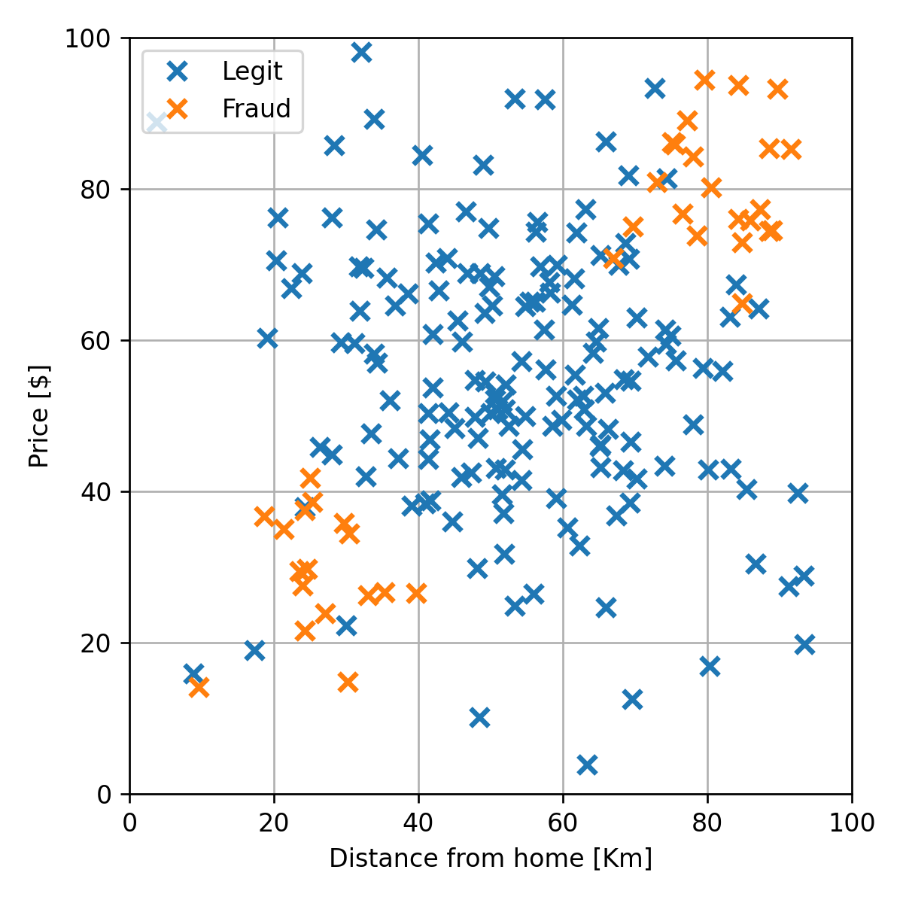
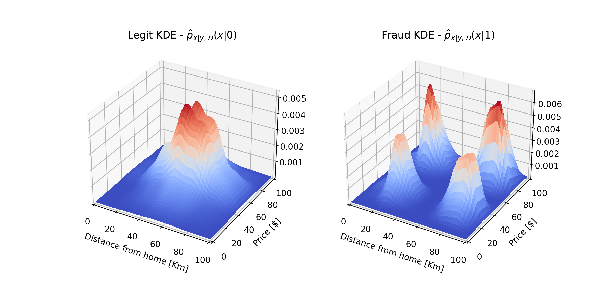
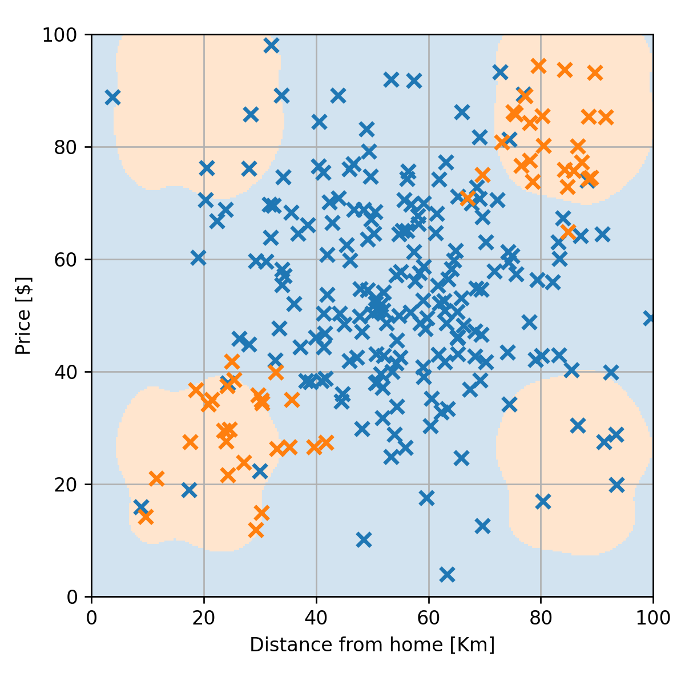
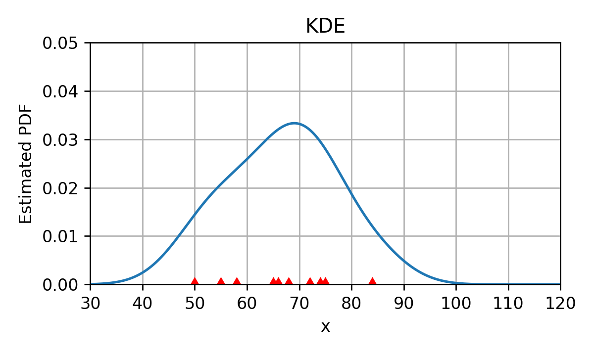
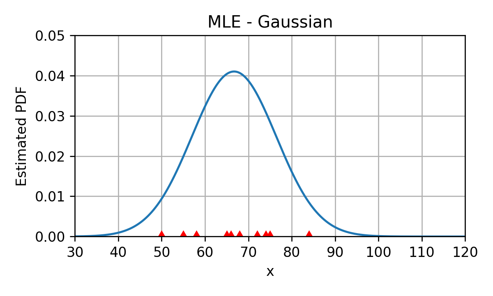

# הרצאה 6 - שיערוך פילוג בשיטות פרמטריות וסיווג גנרטיבי

<a href="./slides/" class="link-button" target="_blank">Slides</a>
<a href="/assets/lecture06.pdf" class="link-button" target="_blank">PDF</a>
<a href="./code/" class="link-button" target="_blank">Code</a>

## מה נלמד היום

## בעיות בגישה הלא פרמטרית

### פונקציות שקשה לעבוד איתם

בעיה זו מתייחס בעיקר ל KDE ול ECDF. בשיטות אלו הפונקציות שקיבלנו מכילות סכום על כל האיברים ב train set, זאת אומרת שבכל פעם שנרצה להשתמש בפונקציה יהיה עלינו לרוץ על כל ה train set. פעולה זו יכולה להיות מאד איטית במקרים בהם ה train set הוא גדול. בנוסף יש לדבר גם משמעות מבחינת כמות הזיכרון שאלגוריתם צריך בזמן החיזוי, שכן החיזוי דורש גישה למדגם כולו.

#### הערה לגבי זמן הריצה בשלב בניית המודל ובשלב החיזוי

במרבית המקרים בשלב בניית המודל כמות המשאבים שיעמדו לרשותינו (זמן ריצה, כוח חישוב זיכרון וכו') תהיה מאד גדולה. לדוגמא יש כיום הרבה מודלים אשר מאומנים בחוות שרתים על מחשבים מאד חזקים, לרוב עם חומרה יעודית, במשך כמה ימים. מצד שני, בזמן החיזוי אנו לנרצה במקרים רבים לבצע את החישוב על פלטפורמה יחסית חלשה ולקבל תוצאות מאד מהירות. לדוגמא מערכת להתראה על סכנות בכביש צריכה לבצע חיזוי בעבור תמונות שמצולמות בקצב של מספר תמונות בשניה ולרוץ על מערכת פשוטה יחסית שיושבת בתוך האוטו.

### הבעיה של כיסוי המרחב

בשיטות שראינו עד כה ניסינו לשערך את הפילוג בכל איזור במרחב על פי הדגימות אשר נמצאות באותו איזור. שיטות אלו מניחות שיש בידינו מספיק דגימות בכדי לכסות את כל המרחב. הנחה זו נעשית מאד בעייתית כאשר אנו מנסים לשערך פילוגים משותפים של הרבה משתנים אקראיים (או לחילופין את הפילוג של וקטור אקראי ארוך). מכיוון שהגדול האפקטיבי של המרחב גדל בצורה מעריכית עם מספר המשתנים, במקרים בהם מספר המשתנים גדול המדגם לרוב יכסה רק חלק קטן מכלל המרחב.

נסתכל לדגומא על ניסיון לשערך את פונקציית ההסתברות של וקטור בינארי באורך 10 (אשר שקול לשיערוך פונקציית ההסתברות של 10 משנים אקראיים בינאריים). כמות הערכים השונים שהוקטור יכול לקבל הינה $2^{10}$. בשיטה שראינו בהרצאה האחרונה לשערוך משתנים דיסקרטיים (על פי השכיחות היחסית) שיערוך ההסתברות של ערך מסויים מתוך $1024$ הערכים נעשה רק על פי כמות הדגימות במדגם בעלות הערך הספציפי הזה. במקרה זה, גם עם מדגם של 500 דגימות השיערוך של לפחות חצי מהדגימות יהיה 0, ולא בהכרח משום שהם פחות סבירות.

נסתכל גם על דוגמא מספרית. נניח שאנו רוצים לחזות האם אדם מסויים שקיבל מכה בכתף פרק אותה על פי הסימפטומים שלו. לשם כך נסתכל על המדגם הבא

|   | פריקה | כאב בכתף | נפיחות | סימנים כחולים | נימול ביד | נזלת |
| - |:-----:|:--------:|:------:|:-------------:|:---------:|:----:|
| 1 | +     | +        | +      | +             | +         | -    |
| 2 | +     | +        | +      | +             | -         | -    |
| 3 | +     | +        | +      | -             | +         | -    |
| 4 | +     | +        | +      | +             | -         | +    |
| 5 | -     | -        | -      | -             | -         | -    |
| 6 | -     | +        | -      | -             | -         | +    |
| 7 | -     | -        | -      | +             | -         | -    |
| 8 | -     | +        | -      | -             | -         | -    |

נסתכל על ניסיון לחזות את הסבירות שלאדם עם כל הסימפטומים יש פריקה בכתף.

מתוך הטבלה ניתן לראות שמרבית הסימפטומים (מלבד נזלת) מהווים אינדיקציה טובה לפריקה של הכתף שכן הם מופיעים בשיכוחות גבוה יותר במקרים שבהם יש פריקה מאשר במקרים שאין. לכן בעבור אדם עם כל הסימפטימים החיזוי ההגיוני יהיה שכנראה יש לו פריקה של הכתף. בפועל, בגישה הלא פרמטרית, כאשר נחשב, על פי השכיחות במדגם, את ההסתברות שלאדם עם פריקה של כתף יהיו את כל הסימפטומים נקבל הסתברות 0. זאת מכיוון שבמקרה אין במדגם אף דגימה כזו.

בדומא זו המרחב שאותו ניסינו לשערך היה המרחב אשר נפרש על ידי 6 משתנים בינאריים.בשביל לקבל שיערוך סביר אנחנו צריכים כמות דגימות שהיא גדולה בלפחות סדר גודל מכמות ערכים שהוקטור יכול לקבל, זאת אומרת יותר מ $2^6\times10=640$. הבעיה הזו תלך ותחמיר ככל שנוסיף עוד שדות. בעבור כל שדה בינארי שנוסיף כמות דגימות שנצטרך תגדל פי 2. כאן הדגמנו את הבעיה עם משתנים בינאריים אך התופעה מתרחשת בעבור משתנים מכל סוג שהוא. התופעה שבה המורכבות של הבעיה גדלה בצורה מעריכית עם המימד של הבעיה מופיע בהרבה תחומים וידוע בתור ה **curse of dimensionality**.

## שיערוך נאיבי - הנחת חוסר תלות בין המשתנים

שיטה מאד נאיבית (לא מתוחכמת) לפתור את הבעיה היא להתעלם מהקשר בין המשתנים השונים ולהניח שהם בלתי תלויים סטטיסטית. זאת אומרת ש:

$$
p_{\mathbf{x}}(\boldsymbol{x})=
p_{\text{x}_1}(x_1)
p_{\text{x}_2}(x_2)
\dots
p_{\text{x}_D}(x_D)
=\prod_{d=1}^D p_{\text{x}_d}(x_d)
$$

תחת הנחה זו נוכל לשערך את הפילוג של כל אחד מה $p_{\text{x}_d}(x_d)$ בנפרד. בשיטה זו אנו משערכים בכל פעם פילוג של משתנה אקראי סקלרי על פי כל הדגימות שבמדגם ולכן לא נסבול מה curse of dimesionality. החיסרון של שיטה זו הוא שהיא מגבילה מאד את הפילוגים שניתן ללמוד.

### מסווג בייס נאיבי

נוכל להשתמש בשיערוך הנאיבי לפתרון בעיות סיווג. לשם כך אנו נשתמש בהנחת החוסר תלות לשיערוך של $p_{\mathbf{x}|\text{y}}(\boldsymbol{x}|y)$ ונניח כי ניתן לרשום את הפונקציית ההסתברות / צפיפות הסתברות המונתית באופן הבא:

$$
p_{\mathbf{x}|\text{y}}(\boldsymbol{x}|y)=
p_{\text{x}_1|\text{y}}(x_1|y)
p_{\text{x}_2|\text{y}}(x_2|y)
\dots
p_{\text{x}_D|\text{y}}(x_D|y)
=\prod_{d=1}^D p_{\text{x}_d|\text{y}}(x_d|y)
$$

זאת אומרת ש**בהינתן $\text{y}$** הרכיבים של $\mathbf{x}$ בלתי תלויים סטטיסטית. אנו **לא** נרצה להניח חוסר תלות בין $\mathbf{x}$ ל $\text{y}$ מיכוון שזוהי בדיוק התלות שאנו מחפשים על מנת לבנות עלפיה את החיזוי של $\text{y}$ בהינתן $\mathbf{x}$.

בעזרת הנחה זו נוכל לבנות חזאים אשר מבוססים על הפילוג של כל אחד מהמשתנים בנפרד. לדוגמא, אם נסתכל על החזאי אשר ממזער את ה misclassifcation rate:

$$
\hat{y}=h(\boldsymbol{x})=\underset{y}{\arg\max}\ p_{\text{y}|\boldsymbol{x}}(y|\boldsymbol{x})
$$

נוכל תחת הנחת החוסר תלות (ובעזרת חוק בייס) לרשום את החזאי כ:

$$
\hat{y}
=\underset{y}{\arg\max}\ p_{\boldsymbol{x}|\text{y}}(\boldsymbol{x}|y)p_{\text{y}}(y)
=\underset{y}{\arg\max}\ p_{\text{y}}(y)\prod_{d=1}^D p_{\text{x}_d|\text{y}}(x_d|y)
$$

שיטה זו לחיזוי בעזרת הנחת החוסר תלות מכונה **סיווג בייס נאיבי (naïve Bayes classification)**.

### דוגמא 1 - זיהוי פריקה של הכתף

נסתכל שוב על הדוגמא של הפריקה של הכתף. על מנת לבנות חזאי, נשערך את $p_{\text{y}}(y)$ ואז נשתמש בהנחת החוסר תלות ונשערך בנפרד את ההסתברות המותנית של כל אחד מהרכיבים $p_{\text{x}_d|\text{y}}(x_d|y)$. (לשם הפשטות נשתמש ב1 ו0 במקום ה"+" וה"-" (בהתאמה) אשר מופיעים בטבלה):

$$
p_{\text{y}}(y)=\begin{cases}
\tfrac{4}{8}=0.5&1\\
\tfrac{4}{8}=0.5&0
\end{cases}
$$

$$
p_{\text{x}_{\text{pain}}|\text{y}}(x_{\text{pain}}|1)=\begin{cases}
\tfrac{4}{4}=1&1\\
\tfrac{0}{4}=0&0
\end{cases}
$$

$$
p_{\text{x}_{\text{pain}}|\text{y}}(x_{\text{pain}}|0)=\begin{cases}
\tfrac{2}{4}=0.5&1\\
\tfrac{2}{4}=0.5&0
\end{cases}
$$

$$
p_{\text{x}_{\text{swelling}}|\text{y}}(x_{\text{swelling}}|1)=\begin{cases}
\tfrac{4}{4}=1&1\\
\tfrac{0}{4}=0&0
\end{cases}
$$

$$
p_{\text{x}_{\text{swelling}}|\text{y}}(x_{\text{swelling}}|0)=\begin{cases}
\tfrac{0}{4}=0&1\\
\tfrac{1}{4}=1&0
\end{cases}
$$

נמשיך כך גם לשלושת העמודות של "סימנים כחולים", "נימול" ונזלת".

החיזוי בעבור המקרה שבו מופיעים כל שלושת הסימטומים יהיה:

$$
\hat{y}
=\underset{y}{\arg\max}\ p_{\text{y}}(y)\prod_{d=1}^D p_{\text{x}_d|\text{y}}(1|y)
$$

זאת אומרת שהחיזוי יהיה 1 (שאכן יש פריקה) כאשר:

$$
\begin{aligned}
p_{\text{y}}(0)\prod_{d=1}^D p_{\text{x}_d|\text{y}}(1|1)\overset{?}{>}
&p_{\text{y}}(1)\prod_{d=1}^D p_{\text{x}_d|\text{y}}(1|0)\\
0.5 \times 1 \times 1 \times 0.75 \times 0.5 \times 0.25 \overset{?}{>}
&0.5 \times 0.5 \times 0 \times 0.25 \times 0 \times 0.25\\
0.09375 \overset{?}{>}
& 0
\end{aligned}
$$

מכיוון שהתנאי זה מתקיים, החיזוי במקרה שבו מופיעים כל הסימפטומים יהיה שאכן ישנה פריקה של כתף.

### דוגמא 2 - זיהוי הונאות אשראי

ננסה להשתמש בשיטה זו לבעיית חיזוי הונאות האשראי

נשתמש ב KDE חד מימד לשיערוך של $p_{\text{x}_d|\text{y}}(x_d|y)$. נקבל את השיערוך הבא:

שימו לב שקיבלנו הסתברות גבוהה להונאה גם במקרים של מחיר נמוך ומרחק גדול וגם במקרים של מחיר גבוהה ומרחק נמוך למרות שבמדגם לא היו שום דגימות של הונאות באיזורים אלו. הסיבה לכך היא כמובן הנחת החוסר תלות שעל פיה אנו משערכים את הצפיפות שלכל משתנה  בנפרד ואז מכפילים אותם לקבלת הפילוג המלא. ההנחה של חוסר תלות לא מתאימה במקרה זה מכיוון שכן ישנה תלות גבוהה בין המחיר והמרחק במקרה של הונאות (מחיר נמוך יבוא עם מרחק נמוך ולהיפך).

פונקציית החיזוי תהיה

## שיטות פרמטריות

דרך נוספת לשיערוך פילוגים היא על ידי שימוש במודל פרמטרי. הדבר מאד דומה לשימוש שעשינו במודלים פרמטרים כאשר עסקנו בגישה הדטרמיניסטית. בשיטה זו אנו נגביל את הצורה של הפונקציה שאותה אנו רוצים לשערך (לרוב פונקציית צפיפות ההסתברות) למשפחה מומצמת של פונקציות על ידי שימוש במודל פרמטרי. גם כאן אנו נסמן את וקטור הפרמטרים של המודל ב $\boldsymbol{\theta}$.

חשוב לשים לב שבניגוד לשימוש במודלים פרמטרים בגישה הדטרמיניסטית, שם לא הייתה שום מגבלה על המודל הפרמטרי, כאן המודל חייב לייצר פילוג חוקי בעבור כל בחירה של פרמטרים (במקרה של PDF זה אומר פונקציה חיובית שאינטרגל עליה נותן 1). מגבלה זו הינה מגבלה קשה אשר מצמצמת מאד את המודלים הפרמטריים שאיתם ניתן לעבוד. מגבלה זו למשל מונעת מאיתנו מלהשתמש אפילו במודל לינארי פשוט. המודלים שאיתם נעבוד יהיו לרוב פונקציות פילוג ידועות כגון פילוג אחיד, נורמאלי, אקפוננציאלי וכו'.

בכדי למצוא את הפרמטרים של המודל נרצה גם כאן למצוא דרך לתת "ציון" לכל בחירה של פרמטרים ולחפש את הפרמטריים אשר מניבים את הציון הטוב ביותר. נציג כעת שני דרכים שונות להתייחס לפרמטרים של המודל. שני דרכים אלו מגיעות משתי גישות הקיימות בתחום של תורת השיערוך. כל גישה מובילה לדרך מעט שונה לבחירה של הפרמטרים האופטימאליים.

### דוגמא: שיערוך הפילוג של זמן הנסיעה בכביש החוף

בהרצאה הקודמת הסתכלנו על שיערוך של הפילוג של זמן הנסיעה בכביש החוף מתוך הדגם הבא:

$$
\mathcal{D}=\{x^{(i)}\}=\{55, 68, 75, 50, 72, 84, 65, 58, 74, 66\}
$$

משערך ה KDE (עם גרעין גאוסיאני עם הרוחב אשר נקבע על פי כלל האצבע) של הפילוג הינו:

(הנקודות האדומות על ציר ה $x$ מסמנות את המיקומים של הדגימות מהמדגם)

בהרצאה זו ננסה לשערך פרמטרים של פילוג נורמאלי שיתאר בצורה טובה את הדגימות במדגם.

#### הגישה הלא-בייסיאנית (המכונה גם: קלאסית או תדירותית (**Frequintist**))

תחת גישה זו אנו נתייחס לפרמטרים בצורה פשוטה כאל מספרים שאותם יש לקבוע על מנת שהמודל יתאר בצורה טובה את המדגם הנתון. בניגוד לגישה השניה שאותה נציג, תחת גישה זו אין כל העדפה של ערך מסויים של הפרמטרים על פני ערך אחר. את המודל הפרמטרי להסתברות / צפיפות הסתברות של משתנה אקראי $\mathbf{x}$ נסמן ב:

$$
p_{\mathbf{x}}(\boldsymbol{x};\boldsymbol{\theta})
$$

ונרצה לבחון עד כמה טוב מתאר מודל עם פרמטרים מסויימים את הפילוג של הדגימות במדגם. אחת הדרכים הנפוצות ביותר לעשות זאת הינה בעזרת פונקציית הסבירות.

##### משערך Maximum Likelyhood Estimator (MLE)

נסמן ב $p_{\mathcal{D}}(\mathcal{D};\boldsymbol{\theta})$ את ההסתברות לקבלת המדגם הנתון $\mathcal{D}=\{\boldsymbol{x}^{(i)}\}$ על פי המודל שבידינו. גודל זה מכונה ה**סבירות** (**likelihood**) של המדגם. אנו מעוניינים למצוא את הפרמטרים $\boldsymbol{\theta}$ אשר מניבים את הסבירות הכי גבוהה. על מנת להדגיש את העובדה שהמדגם הוא למעשה גודל ידוע ואילו הגודל הלא ידוע, שאותו נרצה לבדוק, הינו $\boldsymbol{\theta}$, מקובל לסמן את פונקציית ה likelihood באופן הבא:

$$
\mathcal{L}(\boldsymbol{\theta};\mathcal{D})\triangleq p_{\mathcal{D}}(D;\boldsymbol{\theta})
$$

משערך ה MLE של $\boldsymbol{\theta}$ הוא הערך אשר ממקסמים את פונקציית ה likelihood:

$$
\hat{\boldsymbol{\theta}}_{\text{MLE}}
=\underset{\boldsymbol{\theta}}{\arg\max}\ \mathcal{L}(\boldsymbol{\theta};\mathcal{D})
$$

מקבול לרשום בעיות אופטימיזציה כבעיות מינימיזציה, לכן במקרים רבים נרשום אותה כבעיה של מציאת הפרמטריים אשר ממזערים את המינוס של פונקציית הסבירות:

$$
\hat{\boldsymbol{\theta}}_{\text{MLE}}
=\underset{\boldsymbol{\theta}}{\arg\min}\ -\mathcal{L}(\boldsymbol{\theta};\mathcal{D})
$$

כאשר הדגימות במדגם הם i.i.d (בעלות פילוג זהה ובלתי תלויות, כפי שנניח תמיד שמתקיים בבעיות supervised learning) נוכל להסיק כי:

$$
p_{\mathcal{D}}(\mathcal{D};\boldsymbol{\theta})=\prod_i p_{\mathbf{x}}(\boldsymbol{x}^{(i)};\boldsymbol{\theta})
$$

ולכן:

$$
\hat{\boldsymbol{\theta}}_{\text{MLE}}
=\underset{\boldsymbol{\theta}}{\arg\min}\ -\mathcal{L}(\boldsymbol{\theta};\mathcal{D})
=\underset{\boldsymbol{\theta}}{\arg\min}\ -\prod_i p_{\mathbf{x}}(\boldsymbol{x}^{(i)};\boldsymbol{\theta})
$$

במקרים רבים נוכל להחליף את המכפלה על כל הדגימות בסכום, על ידי החלפת פונקציית ה likelihood ב log-likelihood (בזכות המונוטוניות העולה של פונקציית ה log מובטח לנו שנקבל את אותם פרמטרים אופטימאלים בשני הבעיות):

$$
\hat{\boldsymbol{\theta}}_{\text{MLE}}
=\underset{\boldsymbol{\theta}}{\arg\min}\ -\log\mathcal{L}(\boldsymbol{\theta};\mathcal{D})
=\underset{\boldsymbol{\theta}}{\arg\min}\ -\sum_i \log\left(p_{\mathbf{x}}(\boldsymbol{x}^{(i)};\boldsymbol{\theta})\right)
$$

#### דוגמא

נסתכל על הדוגמא של התאמת פילוג נורמאלי לנסיעות בכביש החוף. הפרמטרים של מודל זה הינם התוחלת $\mu$ וסטיית התקן $\sigma$. נסמן את וקטור הפרמטרים ב $\boldsymbol{\theta}=[\mu,\sigma]^\top$. המודל שלנו יהיה:

$$
p_{\text{x}}(x;\boldsymbol{\theta})=\frac{1}{\sqrt{{2\pi}}\sigma}\exp\left(-\frac{(x-\mu)^2}{2\sigma^2}\right)
$$

נרשום את בעיית האופטימיזציה של מציאת משערך ה MLE:

$$
\begin{aligned}
\hat{\boldsymbol{\theta}}_{\text{MLE}}
&=\underset{\boldsymbol{\theta}}{\arg\min}\ -\sum_i \log\left(p_{\text{x}}(x^{(i)};\boldsymbol{\theta})\right)\\
&=\underset{\boldsymbol{\theta}}{\arg\min}\ -\sum_i \log\left(\frac{1}{\sqrt{{2\pi}}\sigma}\exp\left(-\frac{(x-\mu)^2}{2\sigma^2}\right)\right)\\
&=\underset{\boldsymbol{\theta}}{\arg\min}\ \sum_i \log(\sigma) + \tfrac{1}{2}\log(2\pi) + \frac{(x^{(i)}-\mu)^2}{2\sigma^2}\\
&=\underset{\boldsymbol{\theta}}{\arg\min}\ N\log(\sigma) + \frac{1}{2\sigma^2}\sum_i (x^{(i)}-\mu)^2\\
\end{aligned}
$$

את בעיית האופטימיזציה הזו ניתן לפתור על ידי גזירה והשוואה ל-0. נסמן את הפונקציה שאותה יש למזער (ה objective \ פונקציית המטרה) ב $f$:

$$
f(\boldsymbol{\theta};\mathcal{x})=N\log(\sigma) + \frac{1}{2\sigma^2}\sum_i (x^{(i)}-\mu)^2
$$

$$
\begin{aligned}
&\begin{cases}
  \frac{\partial f(\boldsymbol{\theta};\mathcal{x})}{\partial\mu} = 0\\
  \frac{\partial f(\boldsymbol{\theta};\mathcal{x})}{\partial\sigma} = 0
\end{cases}\\
\Leftrightarrow&\begin{cases}
  -\frac{1}{\sigma^2}\sum_i (x^{(i)}-\mu)=0\\
  \frac{N}{\sigma}-\frac{1}{\sigma^3}\sum_i (x^{(i)}-\mu)^2=0
\end{cases}\\
\Leftrightarrow&\begin{cases}
  N\mu-\sum_i x^{(i)}=0\\
  N\sigma^2-\sum_i (x^{(i)}-\mu)^2=0
\end{cases}\\
\Leftrightarrow&\begin{cases}
  \mu=\frac{1}{N}\sum_i x^{(i)}\\
  \sigma=\sqrt{\frac{1}{N}\sum_i (x^{(i)}-\mu)^2}
\end{cases}\\
\end{aligned}
$$

במקרה של הנסיעות בכביש החוף נקבל:

$$
\mu=66.7\ \text{[min]}
$$

$$
\sigma=9.7\ \text{[min]}
$$

וה PDF המתקבל יראה כך:

#### הגישה הבייסיאנית

בגישה זו אנו נניח כי בדומה למדגם, גם הפרמטרים של המודל הם ריאליזציות (הגרלות) של משתנה אקראי בעל פילוג כל שהוא. גישה זו למעשה מניחה שיש בידינו מודל לפילוג המשותף של הפרמטרים והמדגם. לרוב הפילוג משותף יהיה נתון בצורה של:

$$
p_{\mathcal{D},\boldsymbol{\theta}}(\mathcal{D},\boldsymbol{\theta})
=p_{\mathcal{D}|\boldsymbol{\theta}}(\mathcal{D}|\boldsymbol{\theta})p_{\boldsymbol{\theta}}(\boldsymbol{\theta})
$$

תחת ההנחה שבהינתן הפרמטרים הדגימות במדגם הם i.i.d, הפילוג המשותף יהיה:

$$
p_{\mathcal{D},\boldsymbol{\theta}}(\mathcal{D},\boldsymbol{\theta})
=p_{\boldsymbol{\theta}}(\boldsymbol{\theta})\prod_i p_{\mathbf{x}|\boldsymbol{\theta}}(\boldsymbol{x}^{(i)}|\boldsymbol{\theta})
$$

תחת גישה זו עלינו לקבוע בנוסף לפילוג של הדגימות בהינתן הפרמטרים $p_{\mathbf{x}|\boldsymbol{\theta}}(\boldsymbol{x}|\boldsymbol{\theta})$ וגם את הפילוג השולי של הפרמטרים $p_{\boldsymbol{\theta}}(\boldsymbol{\theta})$.

##### A Prioiri Distribution

הפילוג השולי של הפרמרטים $p_{\boldsymbol{\theta}}(\boldsymbol{\theta})$, מכונה לרוב ה**פילוג הפריורי** (**prior distribution**) או ה**א-פריורי** (**a priori distribution**), זאת אומרת הפילוג של $\boldsymbol{\theta}$ לפני שראינו את המדגם.

##### A Posteriori Distribution

פילוג חשוב נוסף שנרצה להתייחס אליו הוא הפילוג של הפרמטרים בהינתן המדגם $p_{,\boldsymbol{\theta}|\mathcal{D}}(\boldsymbol{\theta}|\mathcal{D})$. פילוג זה מכונה ה**פילוג הפוסטריורי** (**posterior distribution**) או **א-פוסטריורי** (**a posteriori distribution**) (או הפילוג בדיעבד), זאת אומרת, הפילוג אחרי שראינו את המדגם.

##### משערך Maximum A-posteriori Probaility (MAP)

הדרך הנפוצה ביותר לשערך את הפרמטרים $\boldsymbol{\theta}$ היא למצוא את הערך אשר ממקסם את הפילוג הא-פוסריורי (הערך הכי סביר של $\boldsymbol{\theta}$ בהינתן המדגם $p_{\boldsymbol{\theta}|\mathcal{D}}(\boldsymbol{\theta}|\mathcal{D})$):

$$
\hat{\boldsymbol{\theta}}_{\text{MAP}}
=\underset{\boldsymbol{\theta}}{\arg\max}\ p_{\boldsymbol{\theta}|\mathcal{D}}(\boldsymbol{\theta}|\mathcal{D})
=\underset{\boldsymbol{\theta}}{\arg\min}\ -p_{\boldsymbol{\theta}|\mathcal{D}}(\boldsymbol{\theta}|\mathcal{D})
$$

על פי חוק בייס, נוכל לכתוב זאת כ:

$$
\hat{\boldsymbol{\theta}}_{\text{MAP}}
=\underset{\boldsymbol{\theta}}{\arg\min}\ 
-\frac{
  p_{\mathcal{D}|\boldsymbol{\theta}}(\mathcal{D}|\boldsymbol{\theta})
  p_{\boldsymbol{\theta}}(\boldsymbol{\theta})
}{
  p_{\mathcal{D}}(\mathcal{D})
}
=\underset{\boldsymbol{\theta}}{\arg\min}\ 
-p_{\mathcal{D}|\boldsymbol{\theta}}(\mathcal{D}|\boldsymbol{\theta})
p_{\boldsymbol{\theta}}(\boldsymbol{\theta})
$$

 כאשר הדגימות במדגם **בהינתן** $\boldsymbol{\theta}$ הן i.i.d, מתקיים:

$$
\hat{\boldsymbol{\theta}}_{\text{MAP}}
=\underset{\boldsymbol{\theta}}{\arg\min}\ 
-p_{\boldsymbol{\theta}}(\boldsymbol{\theta})
\prod_i p_{\mathbf{x}|\boldsymbol{\theta}}(\boldsymbol{x}^{(i)}|\boldsymbol{\theta})
$$

גם כאן נוכל להפוך את המכפלה לסכום על ידי מזעור מינוס הלוג של הפונקציה:

$$
\hat{\boldsymbol{\theta}}_{\text{MAP}}
=\underset{\boldsymbol{\theta}}{\arg\min}\ -\log\left(p_{\boldsymbol{\theta}}(\boldsymbol{\theta})\right)-\sum_i \log\left(p_{\mathbf{x}|\boldsymbol{\theta}}(\boldsymbol{x}^{(i)}|\boldsymbol{\theta})\right)
$$

##### ההבדל בין MLE ל MAP

ההבדל בין משערך ה MLE למשערך ה MAP הינו התוספת של האיבר $-\log\left(p_{\boldsymbol{\theta}}(\boldsymbol{\theta})\right)$. איבר זה, ששווה ללוג של הפילוג הא-פריורי, מוסיף למעשה את הידע שיש לנו לגבי איזה ערכים של $\boldsymbol{\theta}$ יותר סבירים. ראינו תוספת שכזו כאשר דיברנו על רגולריזציה, שם הוספנו איבר לבעיית האופטימיזציה במטרה למשוך את הפתרון לאיזורים שהנחנו שהם יותר סבירים. לכן, ניתן למעשה לחשוב על בעיית ה MAP כעל בעיית MLE עם רגולריזציה. בתרגיל הבית אתם תראו את השקילות שבין בעיית MAP לבין לבעיית MLE עם רגולריזציה.

#### בגישה בייסיאנית בעיית השיערוך היא בעיית חיזוי

כפי שציינו, בגישה הבייסיאנית אנו מתייחסים גם למדגם וגם לפרמטרים כאלה ריאליזציות של משתנים אקראיים, בנוסף, אנו מניחים שאנו יודעים את הפילוג המשותף שלהם ואנו מנסים למצוא את הערך של הפרמטרים בהינתן המדגם. זוהי בדיוק בעיית חיזוי קלאסית של משתנה אקראי אחד בהינתן משתנה אקראי אחר על סמך הפילוג המשותף (חיזוי של הפרמטרים בהינתן המדגם).

הבחירה לשערך את הפרמרטים כערכים אשר ממקסמים את הפילוג המותנה (הפילוג הא-פריורי) נובעת בעיקר מהסיבה שזהו הפתרון הפשוט ביותר. במרבית המקרים המקרים פונקציית הצפיפות המשותפת יהיו מסובכות יכללו מכפלה של הרבה מאד איברים. לכן, חיזויים אחרים כגון התוחלת המותנית או החציון יהיו לרוב מסובכים מידי לחישוב.

#### דוגמא - הוספת prior

נחזור לדוגמא של התאמת מודל של פילוג נורמאלי לפילוג של זמן הנסיעה בכביש החוף. לשם הפשטות בדוגמא זו נקבע את סטיית התקן של המודל ל $\sigma=10$ כך שיהיה לנו מודל פרמטרי בעל פרמטר יחיד $\mu$:

$$
p_{\text{x}|\mu}(x|\mu)=\frac{1}{\sqrt{2\pi}\sigma}\exp\left(-\frac{(x-\mu)^2}{2\sigma^2}\right)
$$

נניח כעת שיש לנו ידע קודם על פילוג הצפוי של $\mu$. ידע כזה יכול לדוגמא להגיע מתוך סטטיסטיקה שאספנו על מהירויות הנסיעה בכבישים אחרים בארץ. הפילוג הצפוי של $\mu$ יהיה הפילוג הא-פריורי של פרמטר זה. נניח אם כן שהפילוג הא-פריורי של $\mu$ הוא גם פילוג נורמאלי עם תוחלת $\mu_{\mu}=60$ וסטיית תקן של $\sigma_{\mu}=5$:

$$
p_{\mu}(\mu)=\frac{1}{\sqrt{2\pi}\sigma_{\mu}}\exp\left(-\frac{(\mu-\mu_{\mu})^2}{2\cdot\sigma_{\mu}^2}\right)
$$

התיאור פה מעט מבלבל משום שאנו מניחים שגם הפילוג של זמן הנסיעה הוא נורמאלי וגם הפילוג הא-פריורי של $\mu$ נורמאלי. אלא שני פילוגים שונים שבמקרה נבחרו להיות בעלי אותו מבנה. ניתן לחשוב על התהליך של ייצור זמני הנסיעה באופן הבא. בתחילה באופן חד פעמי (לצורך העניין עם הבניה של כביש החוף) מוגרל הפרמטר $\mu$ מתוך הפילוג $p_{\mu}$ אשר מאפיין את הנסיעות בכביש החוף. אחרי שפרמטר זה נקבע, בעבור כל נסיעה מחדש מגרילים את זמן נסיעה מתוך $p_{\text{x}|\mu}$ תוך שימוש בערך של $\mu$ אשר הגרלנו.

נרשום את משערך ה MAP של $\mu$:

$$
\begin{aligned}
\hat{\mu}_{\text{MAP}}
=\underset{\mu}{\arg\min}\ -\log\left(p_{\mu}(\mu)\right)-\sum_i \log\left(p_{\mathbf{x}|\mu}(\boldsymbol{x}^{(i)}|\mu)\right)
\end{aligned}
$$

גזירה והשוואה ל-0 נותנת את התוצאה הבאה:

$$
\begin{aligned}
  \frac{\partial f(\boldsymbol{\theta};\mathcal{x})}{\partial\mu} &= 0\\
\Leftrightarrow
  \frac{1}{\sigma_{\mu}^2}(\mu-\mu_{\mu})-\frac{1}{\sigma^2}\sum_i (x^{(i)}-\mu)&=0\\
\Leftrightarrow
  \left(\frac{1}{\sigma_{\mu}^2}+\frac{N}{\sigma^2}\right)\mu&=\frac{\mu_{\mu}}{\sigma_{\mu}^2}+\frac{1}{\sigma^2}\sum_i x^{(i)}\\
\Leftrightarrow
  \mu&=\frac{\frac{\sigma}{N\sigma_{\mu}^2}\mu_{\mu}+\frac{1}{N}\sum_i x^{(i)}}{\frac{\sigma}{N\sigma_{\mu}^2}+1}
\end{aligned}
$$

זו למעשה ממוצע ממושקל בין הערך הממוצע של $x$ במדגם לבין $\mu_{\mu}$. בעבור הדוגמא שלנו נקבל:

$$
\mu=64.8\ \text{[min]}
$$

ערך זה מעט יותר קרוב ל60 משאר התוצאה שקיבלנו בשיערוך ה MLE. זאת משום ה prior ש"מושך" את הפרמטרים לאיזורים הסבירים יותר ולכן הוא מקרב אותו ל $\mu_{\mu}=60$.

## שימוש בשיערוך פרמטרי לפתרון בעיות supervised learning

בדומה לאופן שבו השתמשנו בשיערוכים הלא פרמטריים לפתרון בעיות supervised learning נוכל לעשות זאת גם בעזרת שיערוכים פרמטריים. נציג שיטה אשר משתמשת במודל של פילוג נורמאלי וב MLE לפתרון בעיות סיווג.

### Quadric Discriminant Analysis (QDA)

בשיטה זו אנו נשתמש במודל של פילוג נורמאלי וב MLE על מנת לשערך את הפילוג המותנה של $\mathbf{x}$ בהינתן $\text{y}$. אנו למעשה צריכים לשערך מודל נורמלי אחד בעבור כל אחת מ $C$ המחלקות של $\text{y}$ יכול לקבל. זאת אומרת שאנו נרצה לשערך את הפרמטרים הבאים:

- וקטור תוחלת $\boldsymbol{\mu}_c$ בעבור כל אחד מהמחלקות ($c\in\{1,2,\dots,C\}$).
- מטריצת קווריאנס $\Sigma_c$ בעבור כל אחד מהמחלקות.

כאשר המודל של הפילוג של $\mathbf{x}$ בהינתן ש $\text{y}=c$ יהיה:

$$
p_{\mathbf{x}|\text{y}}(\boldsymbol{x}|c;\boldsymbol{\mu}_c,\Sigma_c)=
\frac{1}{\sqrt{(2\pi)^D|\Sigma_c|}}
\exp\left(-\frac{1}{2}(\boldsymbol{x}-\boldsymbol{\mu}_c)^{\top}\Sigma_c^{-1}(\boldsymbol{x}-\boldsymbol{\mu}_c)\right)
$$

(כאשר $D$ הוא המימד של $\mathbf{x}$).

בנוסף יהיה עלינו לשערך את $p_{\text{y}}(y)$. (זה פילוג דיסקרטי אותו ניתן לשערך בקלות על פי השכיחות היחסית במדגם).

הפילוג המשותף של $\mathbf{x}$ ו $\text{y}$ יהיה:

$$
p_{\mathbf{x},\text{y}}(\boldsymbol{x},y;\{\boldsymbol{\mu}_c\},\{\Sigma_c\})=
p_{\mathbf{x}|\text{y}}(\boldsymbol{x}|y;\boldsymbol{\mu}_y,\Sigma_y)
p_{\text{y}}(y)
$$

את הפרמטרים של המודל מוצאים בעזרת MLE. בעיית האופטימיזציה תהיה:

$$
\begin{aligned}
\hat{\boldsymbol{\theta}}_{\text{MLE}}
&=\underset{\boldsymbol{\theta}}{\arg\min}\ -\log\mathcal{L}(\boldsymbol{\theta};\mathcal{D})\\
&=\underset{\boldsymbol{\theta}}{\arg\min}\ 
-\sum_i \log\left(
  p_{\mathbf{x}|\text{y}}(\boldsymbol{x}^{(i)}|y^{(i)};\boldsymbol{\mu}_y,\Sigma_y)
  p_{\text{y}}(y^{(i)})
\right)\\
&=\underset{\boldsymbol{\theta}}{\arg\min}\ 
-\sum_i
  \log\left(p_{\mathbf{x}|\text{y}}(\boldsymbol{x}^{(i)}|y^{(i)};\boldsymbol{\mu}_y,\Sigma_y)\right)
  +\log\left(p_{\text{y}}(y^{(i)})\right)
\\
&=\underset{\boldsymbol{\theta}}{\arg\min}\ 
-\sum_i \log\left(p_{\mathbf{x}|\text{y}}(\boldsymbol{x}^{(i)}|y^{(i)};\boldsymbol{\mu}_y,\Sigma_y)\right)\\
\end{aligned}
$$

נפשט מעט את הביטוי על ידי חלוקה של הסכימה לסכימות ניפרדות על כל אחת מהמחלקות. לשם הפשטות נגדיר את הסימונים הבאים:

- $\mathcal{I}_c=\{i:\ y^{(i)}=c\}$ - זאת אומרת, אוסף האינדקסים של הדגמים במדגם שמקיימים $y^{(i)}=c$.
- $|\mathcal{I}_c|$ - מספר האינדקסים ב $\mathcal{I}_c$

נוכל כעת לרשום את בעיית האופטימיזציה באופן הבא:

$$
\hat{\boldsymbol{\theta}}_{\text{MLE}}
=\underset{\boldsymbol{\theta}}{\arg\min}\ 
-\sum_{i\in\mathcal{I}_1} \log\left(p_{\mathbf{x}|\text{y}}(\boldsymbol{x}^{(i)}|1;\boldsymbol{\mu}_1,\Sigma_1)\right)
-\sum_{i\in\mathcal{I}_2} \log\left(p_{\mathbf{x}|\text{y}}(\boldsymbol{x}^{(i)}|2;\boldsymbol{\mu}_1,\Sigma_2)\right)
-\dots
$$

בשביל למצוא את הערכים האופטימאלים של $\boldsymbol{\mu}_1$ ו $\Sigma_1$ מספיק להסתכל על האיבר הראשון. לכן ניתן למעשה לפרק את הבעיה ל $C$ בעיות נפרדות שבהם משערכים בנפרד את הפרמטרים של כל מחלקה.

בעבור המחלקה ה $c$ נקבל את בעיית האופטימיזציה הבאה:

$$
\begin{aligned}
\hat{\boldsymbol{\mu}}_{c,\text{MLE}},\hat{\Sigma}_{c,\text{MLE}}
&=\underset{\boldsymbol{\mu}_c,\Sigma_c}{\arg\min}\ 
-\sum_{i\in\mathcal{I}_c} \log\left(p_{\mathbf{x}|\text{y}}(\boldsymbol{x}^{(i)}|c;\boldsymbol{\mu}_c,\Sigma_c)\right)\\
&=\underset{\boldsymbol{\mu}_c,\Sigma_c}{\arg\min}\ 
\sum_{i\in\mathcal{I}_c}
\log\left(\sqrt{|\Sigma_c|})\right)+
\frac{1}{2}(\boldsymbol{x}^{(i)}-\boldsymbol{\mu}_c)^{\top}\Sigma_c^{-1}(\boldsymbol{x}^{(i)}-\boldsymbol{\mu}_c)\\
\end{aligned}
$$

ניתן לפתור את הבעיה הזו על ידי גזירה והשוואה ל-0. הפיתוח בעבור $\Sigma_c$ הוא מעט מורכב ואנו לא נראה אותו בקורס זה ונקפור לפתרון. נראה אבל את החישוב של $\boldsymbol{\mu}_c$

את בעיית האופטימיזציה הזו ניתן לפתור על ידי גזירה והשוואה ל-0. נסמן את ה objective ב $f$:

$$
f(\boldsymbol{\theta};\mathcal{x})
=\sum_{i\in\mathcal{I}_c}
\log\left(\sqrt{|\Sigma_c|})\right)+
\frac{1}{2}(\boldsymbol{x}^{(i)}-\boldsymbol{\mu}_c)^{\top}\Sigma_c^{-1}(\boldsymbol{x}^{(i)}-\boldsymbol{\mu}_c)
$$

$$
\begin{aligned}
\frac{\partial f}{\partial\boldsymbol{\mu}_c}&=0\\
\Leftrightarrow-\sum_{i\in\mathcal{I}_c}\Sigma_c^{-1}(\boldsymbol{x}^{(i)}-\boldsymbol{\mu}_c)&=0\\
\Leftrightarrow|\mathcal{I}_c|\boldsymbol{\mu}_c-\sum_{i\in\mathcal{I}_c}\boldsymbol{x}^{(i)}&=0\\
\Leftrightarrow\boldsymbol{\mu}_c&=\frac{1}{|\mathcal{I}_c|}\sum_{i\in\mathcal{I}_c}\boldsymbol{x}^{(i)}\\
\end{aligned}
$$

שאר הפרמטרים של המודל יהיו:

$$
p_{\text{y}}(c)=\frac{|\mathcal{I}_c|}{N}
$$

$$
\Sigma_c = \frac{1}{|\mathcal{I}_c|}\sum_{i\in\mathcal{I}_c}\left(\boldsymbol{x}^{(i)}-\boldsymbol{\mu}_c\right)\left(\boldsymbol{x}^{(i)}-\boldsymbol{\mu}_c\right)^T
$$

כעת נוכל למצוא את החזאי האופטימאלי לבעיה בהינתן הפילוג שמצאנו. בעבור פונקציית מחיר של miscalssification rate, החזאי האופטימאלי יהיה:

$$
\begin{aligned}
\hat{y}=h(\boldsymbol{x})
&=\underset{y}{\arg\max}\ 
  p_{\mathbf{x}|\text{y}}(\boldsymbol{x}|y;\boldsymbol{\mu}_y,\Sigma_y)
  p_{\text{y}}(y)\\
&=\underset{y}{\arg\max}\ 
  -\frac{1}{2}(\boldsymbol{x}-\boldsymbol{\mu}_y)^{\top}\Sigma_y^{-1}(\boldsymbol{x}-\boldsymbol{\mu}_y)
  +\log\left(\frac{p_{\text{y}}(y))}{\sqrt{|\Sigma_y|}}\right)\\
\end{aligned}
$$

#### המקרה הבנארי - משטח הפרדה ריבועי

בעבור המקרה של סיווג בינארי (סיווג לשני מחלקות) מתקבל החזאי הבא:

$$
\begin{aligned}
h\left(x\right)
&=\begin{cases}
  1\qquad
    -\frac{1}{2}(\boldsymbol{x}-\boldsymbol{\mu}_1)^{\top}\Sigma_1^{-1}(\boldsymbol{x}-\boldsymbol{\mu}_1)
    +\log\left(\frac{p_{\text{y}}(1))}{\sqrt{|\Sigma_1|}}\right)>
    -\frac{1}{2}(\boldsymbol{x}-\boldsymbol{\mu}_0)^{\top}\Sigma_0^{-1}(\boldsymbol{x}-\boldsymbol{\mu}_0)
    +\log\left(\frac{p_{\text{y}}(0))}{\sqrt{|\Sigma_0|}}\right)\\
  0\qquad \text{otherwise}\\
\end{cases}\\
&=\begin{cases}
  1\qquad \boldsymbol{x}^T C \boldsymbol{x} + \boldsymbol{a}^T \boldsymbol{x} + b > 0 \\
  0\qquad \text{otherwise}\\
\end{cases}
\end{aligned}
$$

כאשר:

$$
C=\frac{1}{2}(\Sigma^{-1}_0-\Sigma^{-1}_1)
$$

$$
\boldsymbol{a}=\Sigma^{-1}\boldsymbol{\mu}_1-\Sigma^{-1}_0\boldsymbol{\mu}_0
$$

$$
b=\tfrac{1}{2}\left(\boldsymbol{\mu}_0^T\Sigma_0^{-1}\boldsymbol{\mu}_0 - \boldsymbol{\mu}_1^T\Sigma_1^{-1}\boldsymbol{\mu}_1\right) + \log\left(\frac{\sqrt{|\Sigma_0|}p_\text{y}(1)}{\sqrt{|\Sigma_1|}p_\text{y}(0)}\right)
$$

התנאי שקיבלנו $\boldsymbol{x}^T C \boldsymbol{x} + \boldsymbol{a}^T \boldsymbol{x} + b > 0$ הוא ריבועי ב $\boldsymbol{x}$ ומכאן מקבל האלגוריתם את שמו.

### Linear Discriminant Analysis (LDA)

LDA שונה מ QDA בשינוי קטן בהנחות על מודל. על מנת להקטין את כמות הפרמטרים של המודל LDA מניח שלפונקציות הפילוג של המחלקות השונות יש את אותה מטריצת הקווריאנס. זאת אומרת שיש $\Sigma$ יחידה אשר משותפת לכולם.

שהפרמטרים של המודל יהיו כעת:

- וקטור תוחלת $\boldsymbol{\mu}_c$ בעבור כל אחד מהמחלקות ($c\in\{1,2,\dots,C\}$).
- מטריצת covariance אחת $\Sigma$ אשר משותפת לפילוגים של כל המחלקות.

והמודל של הפילוג של $\mathbf{x}$ בהינתן ש $\text{y}=c$ הינו:

$$
p_{\mathbf{x}|\text{y}}(\boldsymbol{x}|c;\boldsymbol{\mu}_c,\Sigma)=
\frac{1}{\sqrt{(2\pi)^D|\Sigma|}}
\exp\left(-\frac{1}{2}(\boldsymbol{x}-\boldsymbol{\mu}_c)^{\top}\Sigma^{-1}(\boldsymbol{x}-\boldsymbol{\mu}_c)\right)
$$

גם כאן ניתן למצוא את הפתרון של בעיית האופטימיזציה על ידי גזירה והשןןאה לאפס. במקרה זה בחיפוש אחר ה $\Sigma$ האידאלי לא ניתן להתייחס רק לחלק מהמדגם משום מהטריצה משותפת לכל המחלקות. הפתרון המתקבל הינו:

$$
p_{\text{y}}(c)=\frac{|\mathcal{I}_c|}{N}
$$

$$
\boldsymbol{\mu}_c = \frac{1}{|\mathcal{I}_c|}\sum_{i\in \mathcal{I}_c}\boldsymbol{x}^{(i)}
$$

$$
\Sigma = \frac{1}{N}\sum_{i}\left(\boldsymbol{x}^{(i)}-\boldsymbol{\mu}_{y^{(i)}}\right)\left(\boldsymbol{x}^{(i)}-\boldsymbol{\mu}_{y^{(i)}}\right)^T
$$

בעבור פונקציית מחיר של miscalssification rate, החזאי האופטימאלי המתקבל ממודל זה הינו:

$$
\begin{aligned}
\hat{y}=h(\boldsymbol{x})
&=\underset{y}{\arg\max}\ 
  p_{\mathbf{x}|\text{y}}(\boldsymbol{x}|y;\boldsymbol{\mu}_c,\Sigma)
  p_{\text{y}}(y)\\
&=\underset{y}{\arg\max}\ 
  -\frac{1}{2}(\boldsymbol{x}-\boldsymbol{\mu}_y)^{\top}\Sigma^{-1}(\boldsymbol{x}-\boldsymbol{\mu}_y)
  +\log(p_{\text{y}}(y))\\
&=\underset{y}{\arg\min}\ 
  \boldsymbol{x}^{\top}\Sigma^{-1}\boldsymbol{\mu}_y
  -\frac{1}{2}\boldsymbol{\mu}_y^{\top}\Sigma^{-1}\boldsymbol{\mu}_y
  -\log(p_{\text{y}}(y))\\
\end{aligned}
$$

#### המקרה הבנארי - הפרדה לינארית

בעבור המקרה של סיווג בינארי (סיווג לשני מחלקות) מתקבל החזאי הבא:

$$
\begin{aligned}
h\left(x\right)
&=\begin{cases}
  1\qquad 
    \boldsymbol{x}^{\top}\Sigma^{-1}\boldsymbol{\mu}_1
    -\frac{1}{2}\boldsymbol{\mu}_1^{\top}\Sigma^{-1}\boldsymbol{\mu}_1
    -\log(p_{\text{y}}(1)) >
    \boldsymbol{x}^{\top}\Sigma^{-1}\boldsymbol{\mu}_0
    -\frac{1}{2}\boldsymbol{\mu}_0^{\top}\Sigma^{-1}\boldsymbol{\mu}_0
    -\log(p_{\text{y}}(0))\\
  0\qquad \text{otherwise}\\
\end{cases}\\
&=\begin{cases}
  1\qquad \boldsymbol{a}^T \boldsymbol{x} + b > 0 \\
  0\qquad \text{otherwise}\\
\end{cases}
\end{aligned}
$$

כאשר:

$$
\boldsymbol{a}=\Sigma^{-1}\left(\boldsymbol{\mu}_1-\boldsymbol{\mu}_0\right)
$$

$$
b=\tfrac{1}{2}\left(\boldsymbol{\mu}_0^T\Sigma^{-1}\boldsymbol{\mu}_0 - \boldsymbol{\mu}_1^T\Sigma^{-1}\boldsymbol{\mu}_1\right) + \log\left(\frac{p_\text{y}\left(1\right)}{p_\text{y}\left(0\right)}\right)
$$

התנאי שקיבלנו $\boldsymbol{a}^T \boldsymbol{x} + b > 0$ הוא לינארי ב $\boldsymbol{x}$ ומכאן מקבל האלגוריתם את שמו. תנאי זה מחלק את המרחב של $\boldsymbol{x}$ לשני חלקים המופרדים על ידי המישור $\boldsymbol{a}^T \boldsymbol{x} + b = 0$.

#### המקרה הכללי (לא בינארי)

במקרה הכללי המרחב יהיה מחולק ל $C$ איזורים שהשפות שלהם יהיו מורכבות מהמישורים המתקבלים מהשפות שבין כל זוג מחלקות. דוגמא למקרה עם 3 מחלקות תופיע בתרגול.

