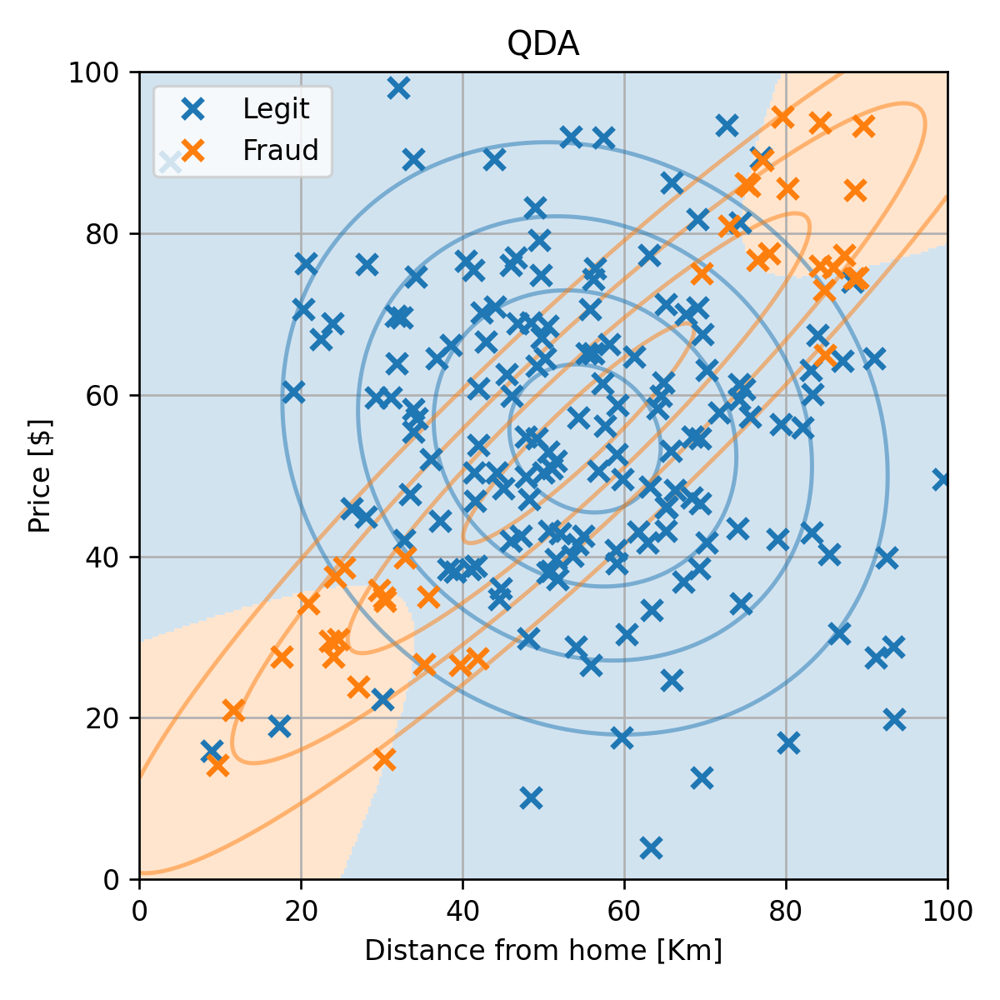
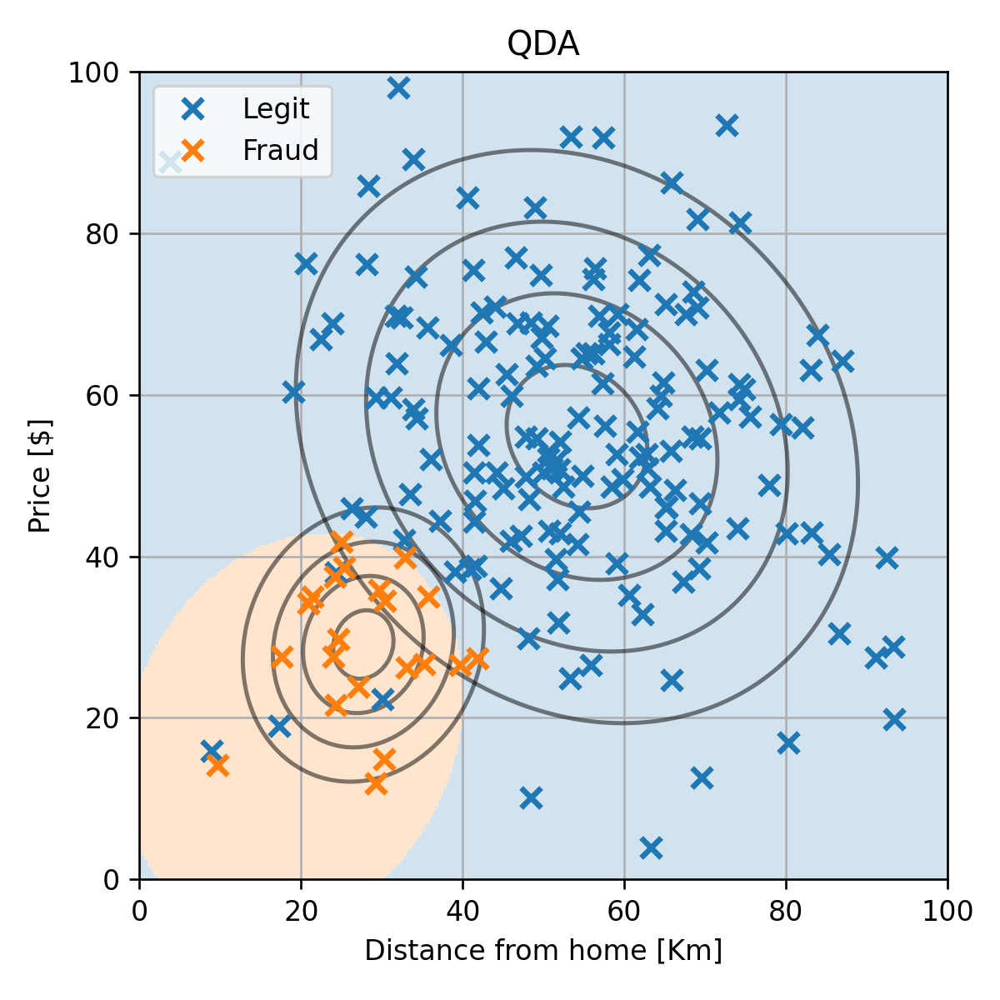
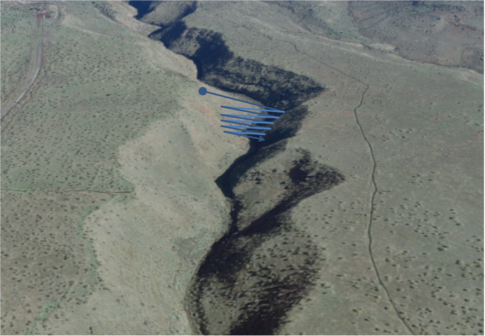
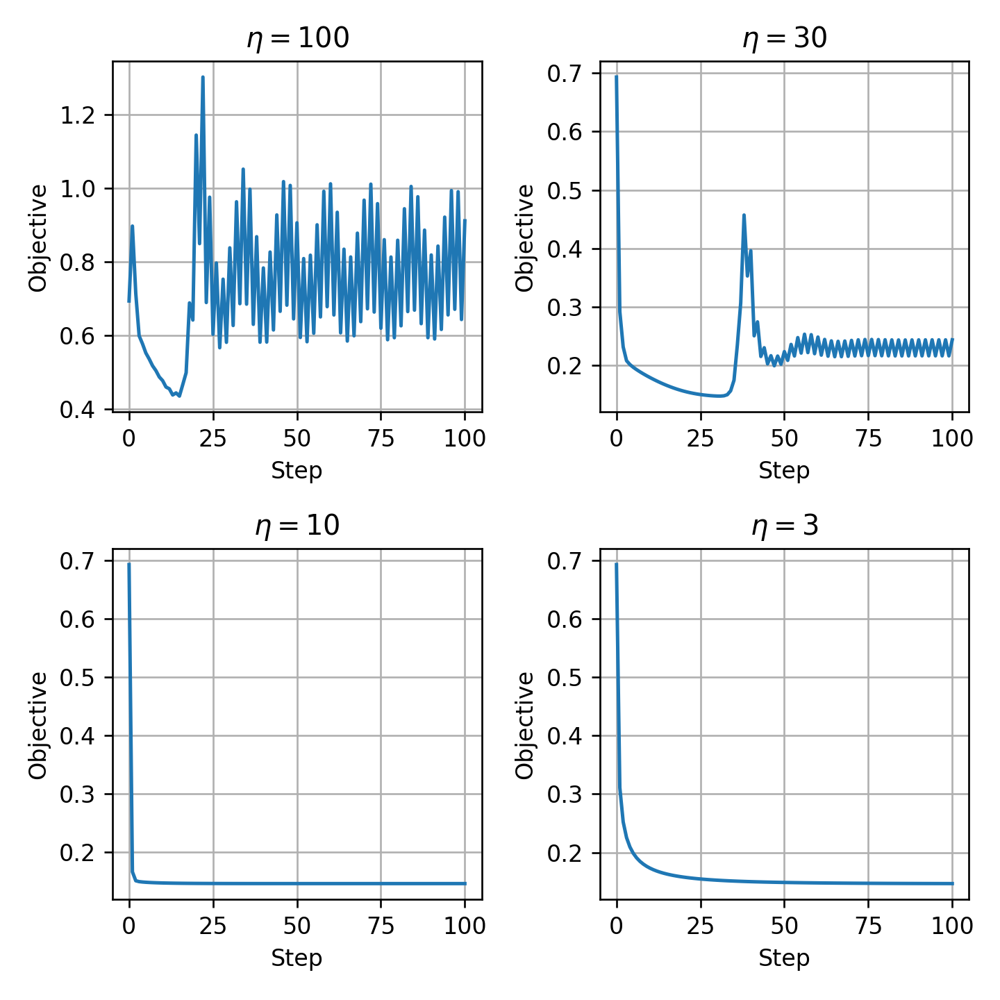
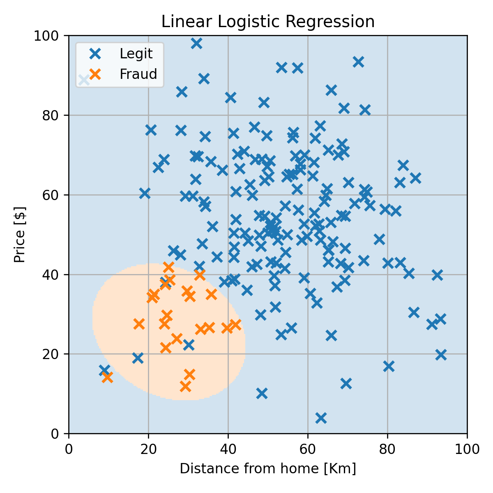

# הרצאה 7 - גישה דיסקרימינטיבית הסתברותית

<a href="./slides/" class="link-button" target="_blank">Slides</a>
<a href="/assets/lecture07.pdf" class="link-button" target="_blank">PDF</a>
<a href="./code/" class="link-button" target="_blank">Code</a>

## מה נלמד היום

## דוגמא להמחשת הבעיה בגישה הגנרטיבית פרמטרית

נסתכל שוב על הבעיה של חיזוי עסקאות שחשודות כהונאות אשראי:

ננסה להשתמש ב QDA על מנת להתאים מודל לדגימות במדגם. נשתמש בנוסחאות לפרמטרים של מודל ה QDA:

$$
p_{\text{y}}(0)=\frac{|\mathcal{I}_0|}{N}=0.81
$$

$$
p_{\text{y}}(1)=\frac{|\mathcal{I}_1|}{N}=0.19
$$

$$
\boldsymbol{\mu}_0 = \frac{1}{|\mathcal{I}_0|}\sum_{i\in \mathcal{I}_0}\boldsymbol{x}^{(i)}=[55.1,54.6]^{\top}
$$

$$
\boldsymbol{\mu}_1 = \frac{1}{|\mathcal{I}_1|}\sum_{i\in \mathcal{I}_1}\boldsymbol{x}^{(i)}=[54.4,55.2]^{\top}
$$

$$
\Sigma_0 = \frac{1}{|\mathcal{I}_0|}\sum_{i}\left(\boldsymbol{x}^{(i)}-\boldsymbol{\mu}_{y^{(i)}}\right)\left(\boldsymbol{x}^{(i)}-\boldsymbol{\mu}_{y^{(i)}}\right)^T
=\begin{bmatrix}
350.9 & -42.9 \\
-42.9 & 336
\end{bmatrix}
$$

$$
\Sigma_1 = \frac{1}{|\mathcal{I}_1|}\sum_{i}\left(\boldsymbol{x}^{(i)}-\boldsymbol{\mu}_{y^{(i)}}\right)\left(\boldsymbol{x}^{(i)}-\boldsymbol{\mu}_{y^{(i)}}\right)^T
=\begin{bmatrix}
817.9 & 730.5 \\
730.5 & 741.7
\end{bmatrix}
$$

פרמטרים אלו מתארים כאמור את שני הגאוסיאנים שמתאימים לכל אחת משתי המחלקות בבעיה. נשרטט את הגאוסיאנים על המדגם יחד עם החזאי המתקבל מהמודל:

שגיאת החיזוי (miscalssification rate) על ה test set הינה 0.08.

התוצאה שקיבלנו אומנם סבירה, אך ניתן לראות מתוך השרטוט שהניסיון לייצג את הדגימות של ההונאות (הכתומות) על ידי גאוסיאן לא מאד מתאימה לפילוג שלהם בפועל. הינו רוצים לבחור במודל אשר יכול לייצג בנפרד את שני האיזורים השונים של הדגימות של ההונאות. לצערינו המבחר של המודלים בהם אנו יכולים להשתמש בגישה הגנרטיבית הפרמטרית לא גדול. כפי שציינו בהרצאה הקודמת המגבלה הזו נובעת מהצורך שהמודל הפרמטרי ייצג תמיד פילוגים חוקיים.

**הערה**: נושאים אלו לא מכוסים בקרוס אך ישנו מודל פרמטרי נפוץ אשר מאד מתאים לתיאור פילוגים מסוג זה, המכילים מספר איזורים שונים בהם מרוכזים הדגימות. המודל נקרא Gaussian Mixture Model (GMM) והוא בנוי מקומבינציה של מספר גאוסיאנים. את ההתאמה של הפרמטרים של המודל הזה ניתן לעשות באמצעות שיטה אשר נקראת Expectation Maximiztion (EM).

## דוגמא למדגם שמתאים למודל של QDA

רק לצורך הדגמה נסתכל על גירסא מעט שונה של המדגם שבה יש רק איזור אחד שבו נמצאות הדגימות של הההונאות:

למדגם כזה המודל של QDA יתאים בצורה טובה:

שגיאת החיזוי (miscalssification rate) על ה test set במקרה הזה הינה 0. (זה לא שמודל זה לא יעשה טעויות, הם כנראה יהיו פשוט נדירות ויצא במקרה שעל ה test set הוא לא טועה).

רק לשם השוואה, נציג גם את התוצאה המתקבלת ממודל ה LDA:

בהרצאה זו נציג גישה אלטרנטיבית חדשה, אשר דומה לגישה הגנרטיבית אך מאפשרת חופש בבחירה גדול יותר של המודל הפרמטרי.

## הגישה הדיסקרימינטיבית הסתברותית

עד כה למדנו על הגישה הדיסקרימינטיבת והגישה הגנרטיבית לבניית חזאים. נציג כעת גישת ביניים אותה נכנה גישה דיסקרימינטיבית הסתברותית.

בגישה הגנרטיבית ניסינו ללמוד את הפילוג המלא של הדגימות במדגם. זאת אומרת, את הפילוג המשותף של $\text{y}$ ו $\mathbf{x}$. ראינו אבל שבעבור רוב פונקציות המחיר (ספצפית בעבור כל אלה שמוגדרים בפונקציית סיכון) החזאי האופטימאלי יהיה תלוי רק בפילוג המותנה של $\text{y}$ בהינתן $\mathbf{x}$. ב**גישה הדיסקרימנטיבית הסתברותית** ננסה ישירות ללמוד את הפילוג של $\text{y}$ בהינתן $\mathbf{x}$.

נציג את ההבדל הבין שלושת הגישות בעזרת השרטוט הבא:

##### הגישה הדיסקרימינטיבית

מדגם 
▼ 
חזאי בעל ביצועים טובים על המדגם

##### הגישה הגנרטיבית

מדגם 
▼ 
הפילוג **המשותף** של $\mathbf{x}$ ו $\text{y}$ על סמך המדגם 
▼ 
חזאי אופטימאלי בהינתן הפילוג המשותף

##### הגישה הדיסקרימינטיבית הסתברותית

מדגם 
▼ 
הפילוג **המותנה** של $\text{y}$ בהינתן $\mathbf{x}$ על סמך המדגם 
▼ 
חזאי אופטימאלי בהינתן הפילוג המותנה

### ההתייחסות לגישה זו במקרות אחרים

בדומה לגישה הדיסקרימינטבית הרגילה, גם גישה זו מוכוונת ישירות למציאת החזאי והיא לא מנסה ללמוד את התכונות המלאות של המדגם כפי שעושה הגישה הגנרטיבית. עקב כך גישה זו נחשבת לגישה דיסקרימינטיבית.

השם גישה דיסקרימינטיבית הסתברותית לא מופיעה במקומות אחרים ואנו בחרנו לעשות שימוש בשם זה בקרוס בכדי להבדיל את השיטה הזו מהגישה הדיסקרימינטיבית הרגילה. במרבית המקומות מציינים שלגישה הדיסקרימינטיבית אכן יש שתי תתי גישות, אך לא נותנים שם שונה לכל אחת משתי התתי הגישות האלה. בנוסף, ישנם מעט מקומות בהם לא מפרידים בכלל בין שתי הגישות הדיסקרימינטיביות, ופשוט מתייחסים לגישה הדיסקרימינטיבת ההסברותית כעוד שיטה לבנות חזאים בגישה הדיסקרימינטיבית הרגילה.

### שימוש במודלים פרמטריים

הלמידה של הפילוג המותנה יעשה בגישה זו על ידי שיערוך פרמטרי (בדומה לשיערוך הפרמטרי בגישה הגנרטיבית). זאת אומרת שאנו נבחר מודל פרמטרי אשר יתאר את הפילוג המותנה, לרוב את הפונקציה $p_{\text{y}|\mathbf{x}}(y|\boldsymbol{x})$, וננסה לשערך את פרמטרים של המודל בשיטות דומות לאלו של הגישה הגנרטיבית, כדוגמאת MLE ו MAP.

נראה כעת שעל מנת למצוא את הפרמטרים של הפילוג המותנה בעזרת MLE ניתן פשוט לרשום את בעיית ה MLE הרגילה ולהחליף את הפילוג המשותף בפילוג המותנה.

נניח שאנו רוצים לשערך את הפרמטרים של מודל פרמטרי מסויים $p_{\text{y}|\mathbf{x}}(y|\boldsymbol{x};\boldsymbol{\theta})$ על פי מדגם כל שהוא $\mathcal{D}=\{\boldsymbol{x}^{(i)},y^{(i)}\}$ בעזרת MLE. נשתמש בעובדה שבהינתן המודל הפרמטרי ניתן לרשום את הפילוג המשותף באופן הבא:

$$
p_{\mathbf{x},\text{y}}(\boldsymbol{x},y;\boldsymbol{\theta})
=p_{\text{y}|\mathbf{x}}(y|\boldsymbol{x};\boldsymbol{\theta})p_{\mathbf{x}}(\boldsymbol{x})
$$

עם פילוג שולי כל שהוא $p_{\mathbf{x}}(\boldsymbol{x})$ אשר אינו תלוי ב $\boldsymbol{\theta}$. בעיית האופטימיזציה שנרצה לפתור הינה:

$$
\begin{aligned}
\boldsymbol{\theta}^*
&=\underset{\boldsymbol{\theta}}{\arg\min}\ -\sum_{i=1}^{N}\log\left(p_{\mathbf{x},\text{y}}(\boldsymbol{x}^{(i)},y^{(i)};\boldsymbol{\theta})\right)\\
&=\underset{\boldsymbol{\theta}}{\arg\min}\ -\sum_{i=1}^{N}\log\left(p_{\text{y}|\mathbf{x}}(y^{(i)}|\boldsymbol{x}^{(i)};\boldsymbol{\theta})p_{\mathbf{x}}(\boldsymbol{x}^{(i)})\right)\\
&=\underset{\boldsymbol{\theta}}{\arg\min}\ 
-\sum_{i=1}^{N}\log\left(p_{\text{y}|\mathbf{x}}(y^{(i)}|\boldsymbol{x}^{(i)};\boldsymbol{\theta})\right)
-\sum_{i=1}^{N}\log\left(p_{\mathbf{x}}(\boldsymbol{x}^{(i)})\right)\\
&=\underset{\boldsymbol{\theta}}{\arg\min}\ -\sum_{i=1}^{N}\log\left(p_{\text{y}|\mathbf{x}}(y^{(i)}|\boldsymbol{x}^{(i)};\boldsymbol{\theta})\right)\\
\end{aligned}
$$

המעבר האחרון נובע מהעובדה שהסכום השני שבשורה הלפני אחרונה לא תלוי ב $\boldsymbol{\theta}$ ולכן ניתן להתעלם ממנו. המשמעות של תוצאה זו היא שאנו יכולים למצוא את הפרמטרים של המודל של הפילוג המותנה ללא צורך לדעת או לשערך את הפילוג של $\mathbf{x}$.

ניתן כמובן להגיע לאותה תוצאה גם בעבור משערך MAP, שם פשוט יופיע איבר ה prior על $\boldsymbol{\theta}$ בנוסף לסכום המופיע בבעיית ה MLE.

### היתרון של הגישה הדיסקרימינטיבית הסתברותית על הגישה הגנרטיבית

הבעיה בגישה בגנרטיבית הייתה הקושי למצוא מודלים שייצגו פילוגים משותפים חוקיים, ספציפית מודלים פרמטריים שמייצגים את $p_{\mathbf{x},\text{y}}(\boldsymbol{x},y)$ צריכים לקיים את התנאים הבאים:

1. $p_{\mathbf{x},\text{y}}(\boldsymbol{x},y;\boldsymbol{\theta})\geq 0\qquad \forall \boldsymbol{x},y,\boldsymbol{\theta}$
2. $\int\int p_{\mathbf{x},\text{y}}(\boldsymbol{x},y;\boldsymbol{\theta})d\boldsymbol{x}dy=1\qquad \forall \boldsymbol{\theta}$

את התנאי הראשון קל לקיים. אך התנאי השני הוא בעייתי.

בגישה הדיסקרימינטיבית הסתברותית הפונקציה שאותה נרצה למדל הינה $p_{\text{y}|\mathbf{x}}(y|\boldsymbol{x})$. מסתבר שלמצוא מודלים פרמטריים חוקיים לפונקציה זו היא משימה פשוטה בהרבה, במיוחד בעבור בעיות סיווג, בהם $\text{y}$ הוא דיסקרטי וסופי. בעבור בעיות סיווג התנאים על המודל יהיו:

1. $p_{\text{y}|\mathbf{x}}(y|\boldsymbol{x};\boldsymbol{\theta})\geq 0\qquad \forall \boldsymbol{x},y,\boldsymbol{\theta}$
2. $\sum_{y=1}^C p_{\text{y}|\mathbf{x}}(y|\boldsymbol{x};\boldsymbol{\theta})=1\qquad \forall \boldsymbol{x},\boldsymbol{\theta}$

התנאי הראשון לא השתנה הרבה, אך בתנאי השני האינטגרל על כל הערכים של $\mathbf{x}$ ו $\text{y}$ התחלף בסכום על מספר סופי של איברים. זהו שינוי משמעותי. נראה כעת כיצד ניתן לבנות מודלים המקיימים תנאים אלו.

### סיווג בינארי

נתחיל במקרה הפשוט של סיווג בינארי (בו $C=2$). נסמן את שתי המחלקות ב 0 ו 1. במקרה זה התנאי השני יהיה:

$$
p_{\text{y}|\mathbf{x}}(0|\boldsymbol{x};\boldsymbol{\theta})+p_{\text{y}|\mathbf{x}}(1|\boldsymbol{x};\boldsymbol{\theta})=1\qquad \forall \boldsymbol{x},\boldsymbol{\theta}
$$

דרך פשוטה לקיים תנאי זה הינה למצוא פונקציה פרמטרית כל שהיא $f(\boldsymbol{x};\boldsymbol{\theta})$ אשר מחיזרה ערכים בין 0 ל 1 ולהגדיר את המודל באופן הבא:

$$
\begin{aligned}
p_{\text{y}|\mathbf{x}}(1|\boldsymbol{x};\boldsymbol{\theta})&=f(\boldsymbol{x};\boldsymbol{\theta})\\
p_{\text{y}|\mathbf{x}}(0|\boldsymbol{x};\boldsymbol{\theta})&=1-f(\boldsymbol{x};\boldsymbol{\theta})
\end{aligned}
$$

#### הפונקציה הלוגיסטית

הדרך הנפוצה ביותר לייצר פונקציה אשר מחזירה ערכים בין 0 ל 1 היא על ידי שימוש בפונקציה הנקראת הפונקציה הלוגיסטית. פונקציה זו מסומנת לרוב באות $\sigma$ ומגדרת באופן הבא:

$$
\sigma(z)=\frac{1}{1+e^{-z}}
$$

הפונקציה נראית כך:

**הערה**: בתחום של מערכות לומדות מקובל לכנות את הפונקציה הזו **סיגמואיד (sigmoid)** למרות שמבחינה מתמטית השם הזה מתאר משפחה הרבה יותר רחבה של פונקציות בעלות צורה של S.

בעזרת הפונקציה הלוגיסטית נוכל להפוך כל פונקציה פרמטרית (ללא שום מגבלה על הפונקציה) $f(\boldsymbol{x};\boldsymbol{\theta})$ לפונקציה המחזירה ערכים בין 0 ל 1 על ידי הרכבה שלה עם הפונקציה הלוגיסטית: $\sigma(f(\boldsymbol{x};\boldsymbol{\theta}))$.

זאת אומרת, שכל מודל פרמטרי מהצורה:

$$
\begin{aligned}
p_{\text{y}|\mathbf{x}}(1|\boldsymbol{x};\boldsymbol{\theta})&=\sigma(f(\boldsymbol{x};\boldsymbol{\theta}))\\
p_{\text{y}|\mathbf{x}}(0|\boldsymbol{x};\boldsymbol{\theta})&=1-\sigma(f(\boldsymbol{x};\boldsymbol{\theta}))
\end{aligned}
$$

יהיה מודל פרמטרי חוקי.

##### תכונות

חלק מהתכונות אשר הופכות את הפונקציה הלוגיסטית לבחירה נוחה כפונקציה אשר ממפה את התחום של $[-\infty,\infty]$ לתחום של $[0,1]$ היא העובדה שהיא עושה זאת באופן רציף ומונוטוני עולה. בנוסף יש לה שתי תכונות מתמטיות נוספות שמקלות על העבודה איתה:

- היא מקיימת את הקשר הבא: $1-\sigma(z)=\sigma(-z)$ אשר מסייע במקרים רבים לפשט ביטויים.
- לנגזרת של הלוג של הפונקציה יש צורה פשוטה: $\frac{\partial}{\partial z}\log(\sigma(z))=1-\sigma(z)$. הדבר לרוונטי מאד כאשר מחשבים את הנגזרת של ה log-likelihood.

#### Binary Logistic Regression

ב Binary Logistic Regression נשתמש במודל שהצגנו קודם:

$$
\begin{aligned}
p_{\text{y}|\mathbf{x}}(1|\boldsymbol{x};\boldsymbol{\theta})&=\sigma(f(\boldsymbol{x};\boldsymbol{\theta}))\\
p_{\text{y}|\mathbf{x}}(0|\boldsymbol{x};\boldsymbol{\theta})&=1-\sigma(f(\boldsymbol{x};\boldsymbol{\theta}))
\end{aligned}
$$

(עם פנקציות פרמטריות כל שהם) ונמצא את הפרמטרים של המודל בעזרת MLE (או בעזרת MAP אשר מוסיף איבר רגולריזציה). בעיית האופטימיזציה שיש לפתור במקרה זה הינה:

$$
\begin{aligned}
\boldsymbol{\theta}^*
&=\underset{\boldsymbol{\theta}}{\arg\min}\ -\sum_{i=1}^{N}\log\left(p_{\text{y}|\mathbf{x}}(y^{(i)}|\boldsymbol{x}^{(i)};\boldsymbol{\theta})\right)\\
&=\underset{\boldsymbol{\theta}}{\arg\min}\ -\sum_{i=1}^{N}
    I\{y^{(i)}=1\}\log(\sigma(f(\boldsymbol{x}^{(i)};\boldsymbol{\theta})))
   +I\{y^{(i)}=0\}\log(1-\sigma(f(\boldsymbol{x}^{(i)};\boldsymbol{\theta})))
\end{aligned}
$$

דרך נפוצה נוספת לרשום את בעיית האופטימיזציה הזו עושה שימוש בעובדה שבמקרה של משתנה בינארי מתקיים:

- $I\{y=1\}=y$
- $I\{y=0\}=(1-y)$

 מכאן שניתן לרשום את בעיית האופטימיזציה באופן הבא:

$$
\boldsymbol{\theta}^*
=\underset{\boldsymbol{\theta}}{\arg\min}\ -\sum_{i=1}^{N}
    y^{(i)}\log(\sigma(f(\boldsymbol{x}^{(i)};\boldsymbol{\theta})))
   +(1-y^{(i)})\log(1-\sigma(f(\boldsymbol{x}^{(i)};\boldsymbol{\theta})))
$$

(בתרגול נראה דרך נוספת לרשום את בעיית האופטימיזציה הזו).

במרבית המקרים לא ניתן יהיה לפתור את בעיית האופטימיזציה הזו באופן אנליטי (על ידי גזירה והשוואה ל-0) ואנו נחפש את הפתרון בשיטות נומריות כגון אלגוריתם ה gradient descent עליו נרחיב בהמשך ההרצאה.

בעבור פונקציית מחיר של misclassification rate החזאי האופטימאלי יהיה:

$$
h(\boldsymbol{x})
=\underset{y}{\arg\max}\ p_{\text{y}|\mathbf{x}}(y|\boldsymbol{x};\boldsymbol{\theta})
=\begin{cases}
    1 & \sigma(f(\boldsymbol{x};\boldsymbol{\theta})) > 0.5 \\
    0 & \text{else}
\end{cases}
=\begin{cases}
    1 & f(\boldsymbol{x};\boldsymbol{\theta}) > 0 \\
    0 & \text{else}
\end{cases}
$$

### סיווג לא בינארי

ניתן להרחיב את השיטה לבניית מודלים בעזרת הפונקציה הלוגיסטית גם למקרה שבו $\text{y}$ אינו משתנה אקראי בינארי. הדרך לעשות זאת הינה באמצעות פונקציית ה **softmax**.

#### פונקציית ה Softmax

פונקציית ה softmax היא מעיין הרחבה של הפונקציה הלוגיסטית מהמקרה של משתנה אקראי בינארי למשתנה אקראי דיסקרטי סופי אשר מקבל אחד מ $C$ ערכים. נסמן את הערכים אלו ב $\{1,2,\dots,C\}$. פונקציית ה softmax לוקחת וקטור כלשהו $\boldsymbol{z}$ באורך $C$ ומייצרת ממנו וקטור חדש אשר יכול לייצג פילוג דיסקרטי חוקי. הפונקציה מוגדרת באופן הבא::

$$
\text{softmax}(\boldsymbol{z})=\frac{1}{\sum_{c=1}^C e^{z_c}}[e^{z_1},e^{z_2},\dots,e^{z_C}]^{\top}
$$

או לחילופין, הערך של האיבר ה $i$ של הפונקציה הינו:

$$
\text{softmax}(\boldsymbol{z})_i=\frac{e^{z_i}}{\sum_{c=1}^C e^{z_c}}
$$

ניתן להסתכל על הפונקציה הזו כעל פונקציה המבצעת את שתי השלבים הבאים:

1. על מנת להפוך את כל רכיבי הוקטור לחיוביים, כל איבר בוקטור $z_i$ מוחלף באקספוננט שלו $e^{z_i}$.
2. בכדי שסכום הערכים של הוקטור יהיה אחד מנרמלים את הוקטור על ידי חלוקת איברי הוקטור בסכום האיברים: $\sum_c e^{z_c}$.

##### תכונות

- אינווריאנטיות לתוספת של קבוע (לכל אברי הוקטור): $\text{softmax}(\boldsymbol{z} + a)_i=\text{softmax}(\boldsymbol{z})_i\ \forall i$.
- $\frac{\partial}{\partial z_j} \log(\text{softmax}(\boldsymbol{z}))_i=\delta_{i,j}-\text{softmax}(\boldsymbol{z})_j$

($\delta_{i,j}$ מייצגת פונקציית הדלתא של קרונקר $\delta_{i,j}=I\{i=j\}$)

##### הפונקציה הלוגיסטית כמקרה פרטי

בעבור וקטור באורך 2: $\boldsymbol{z}=[a,b]$, נקבל:

$$
\begin{aligned}
\text{softmax}(\boldsymbol{z})_1&=\frac{e^{a}}{e^{a}+e^{b}}=\frac{1}{1+e^{b-a}}=\sigma(a-b)\\
\text{softmax}(\boldsymbol{z})_2&=\frac{e^{b}}{e^{a}+e^{b}}=1-\sigma(a-b)
\end{aligned}
$$

#### (Non-Binary) Logistic Regression

בדומה לפונקציה הלוגיסטית נוכל להשתמש בפונקציית ה softmax על מנת לבנות פילוגים חוקיים של משתנים דיסקרטיים סופיים. בעבור $C$ פונקציות פרמטריות כל שהן, $f_c(\boldsymbol{x};\boldsymbol{\theta}_c)$, ניתן לבנות מודל פרמטרי חוקי לפילוג המותנה באופן הבא:

$$
p_{\text{y}|\mathbf{x}}(y|\boldsymbol{x};\boldsymbol{\theta})
=\frac{e^{f_y(\boldsymbol{x};\boldsymbol{\theta}_y)}}{\sum_{c=1}^C e^{f_c(\boldsymbol{x};\boldsymbol{\theta}_c)}}
$$

לשם נוחות נסמן:

- את הוקטור $\boldsymbol{\theta}$ כוקטור אשר כולל את כל $C$ וקטורי הפרמטרים: $\boldsymbol{\theta}=[\boldsymbol{\theta}_1^{\top},\boldsymbol{\theta}_2^{\top},\dots,\boldsymbol{\theta}_C^{\top}]^{\top}$.
- את הפונקציה $\boldsymbol{f}$ כפונקציה המאגדת את כל $C$ הפונקציות הפרמטריות: $\boldsymbol{f}(\boldsymbol{x};\boldsymbol{\theta})=[f_1(\boldsymbol{x};\boldsymbol{\theta}_1),f_2(\boldsymbol{x};\boldsymbol{\theta}_2),\dots,f_C(\boldsymbol{x};\boldsymbol{\theta}_C)]^{\top}$

בעזרת סימונים אלו נוכל לרשום את המודל הפרמטרי באופן הבא:

$$
p_{\text{y}|\mathbf{x}}(y|\boldsymbol{x};\boldsymbol{\theta})
=\text{softmax}(\boldsymbol{f}(\boldsymbol{x};\boldsymbol{\theta}))_{y}
$$

משערך ה MLE של מודל זה יהיה נתון על ידי:

$$
\begin{aligned}
\boldsymbol{\theta}^*
&=\underset{\boldsymbol{\theta}}{\arg\min}\ -\sum_{i=1}^{N}\log\left(p_{\text{y}|\mathbf{x}}(y^{(i)}|\boldsymbol{x}^{(i)};\boldsymbol{\theta})\right)\\
&=\underset{\boldsymbol{\theta}}{\arg\min}\ -\sum_{i=1}^{N}\log(\text{softmax}(\boldsymbol{f}(\boldsymbol{x};\boldsymbol{\theta}))_{y})
\end{aligned}
$$

#### היתירות בייצוג של מודל ה logistic regression

בדומה למקרה הבינארי שבו לא היינו צריכים להגדיר 2 פונקציות פרמטריות, אחת ל $\text{y}=0$ ואחת ל $\text{y}=1$, גם במקרה הכללי מספיק להגדיר $C-1$ פונקציות פרמטריות. הדבר נובע מהעובדה שאם מגדירים את ההסתברות של $C-1$ מחלקות, המחלקה הנותרת תקבע באופן מוחלט כך שהיא תשלים את ההסתברות ל-1.

באופן דומה, אם נוסיף את אותו הערך לכל הפונקציות $f_c$ לא נשנה את הפילוג המתקבל. במילים אחרות, כל שינוי מהצורה של $f_c(\boldsymbol{x};\boldsymbol{\theta}_c)\rightarrow f_c(\boldsymbol{x};\boldsymbol{\theta}_c)+g(\boldsymbol{x})$ לא ישנה את הפילוג $p_{\text{y}|\mathbf{x}}(y|\boldsymbol{x};\boldsymbol{\theta})$.

במקרים מסויימים נרצה לבטל יתירות זו. ניתן לעשות זאת על ידי קיבוע של אחת הפונקציות הפרמטריות, לרוב הראשונה $c=1$, כך שהיא תהיה שווה זהותית ל 0: $f_1(\boldsymbol{x};\boldsymbol{\theta}_1)=0$ . שינוי שכזה כאמור לא יפגע ביכולת הייצוג של המודל ויבטל את היתירות שיש בייצוג של כל פילוג. בחירה כזו גם תקטין את מספר הפרמטרים שיש ללמוד.

### Linear Logistic Regression

הגרסא הלינארית של הרגרסיה הלוגיסטית היא המקרה שבו בוחרים את הפונקציות הפרמטריות להיות פונקציות לינאריות:

$$
f_c(\boldsymbol{x};\boldsymbol{\theta}_c)=\boldsymbol{\theta}_c^{\top}\boldsymbol{x}
$$

במקרה זה פונקציית ה objective היא קמורה (convex) ולכן מובטח ש gradient descnet, במידה והוא מתכנס, יתכנס למינימום גלובלי.

## Gradient descent (שיטת הגרדיאנט)

בבעיות אופטימיזציה בהם לא ניתן להגיע לפתרון סגור על ידי גזירה של פונקציית המטרה והשוואה ל-0 נאלץ להשתמש בשיטות נומריות. אחת השיטות הנפוצות ביותר במערכות לומדות (בעיקר בעבודה עם רשתות נוירונים, אך לא רק) לפתרון בעיות אופטימיזציה הינו אלגוריתם ה gradient descent אותו הצגנו בקצרה בתרגול 1. נציג אותו כעת בצורה יותר מפורטת

הרעיון מאחרי Gradient descent הוא פשוט. האלגוריתם מנסה למצוא מינימום לוקאלי של פונקציית המטרה על ידי התקדמות בצעדים קטנים בכיוון שבו הפונקציה יורדת הכי מהר. אילוסטרציה:

לאלגוריתמים איטרטיביים מסוג זה, אשר מנסים בכל איטרציה לשפר את מצבם לעומת המצב הנוכחי (מבלי התייחס צורה הגלובאלית של הפונקציה) אנו קוראים אלגוריתמים חמדנים (greedy). כפי שציינו קודם אלגוריתמים כאלה לא מתיימרים להתכנס לאפטימום הגלובאלי, אלא רק ינסו להשתפר כל הזמן עד אשר יגיעו לאופטימום לוקאלי. הדרישה היחידה על הבעיה לשם השימוש באלגוריתם הינה היכולת לחשב את הנגזרת של ה objective (פונקציית המטרה).

בעבור בעיית המינמיזציה:

$$
\underset{\boldsymbol{\theta}}{\arg\min}\quad g(\boldsymbol{\theta})
$$

האלגוריתם פועל באופן הבא:

- מאתחלים את $\boldsymbol{\theta}^{(0)}$ לנקודה אקראית כל שהיא.
- חוזרים על צעד העדכון הבא עד שמתקיים תנאי עצירה כל שהוא:

    $$
    \boldsymbol{\theta}^{(t+1)}=\boldsymbol{\theta}^{(t)}-\eta \nabla_{\boldsymbol{\theta}}g(\boldsymbol{\theta}^{(t)})
    $$

את הפרמטר $\eta$ יש לקבוע מראש, והוא יקבע את גודל הצעדים שהאלגוריתם יעשה.

### תנאי עצירה

ישנם מספר דרכים להגדיר תנאי עצירה לאגוריתם:

- הגעה למספר צעדי עדכון שנקבע מראש: $t>\text{max-iter}$.
- כאשר הנורמה של הגרדיאנט קטנה מערך סף מסויים שנקבע מראש: $\lVert\nabla_{\boldsymbol{\theta}}g(\boldsymbol{\theta})\rVert_2<\epsilon$
- כאשר השיפור ב objective קטן מערך סף מסויים שנקבע מראש: $g(\boldsymbol{\theta}^{(t-1)})-g(\boldsymbol{\theta}^{(t)})<\epsilon$
- שימוש בעצירה מוקדמת על מנת להתמודד עם overfitting (נרחיב על כך בהרצאה הבאה)

### הבעיות של האלגוריתם

#### התכנסות למינימום לוקאלי ותלות באיתחול

כפי שציינו האלגוריתם הוא אלגוריתם חמדן אשר מתכנס למינימום לוקאלי אשר תלוי באיתחול של האלגוריתם.

#### לא ניתן לקבוע בוודאות האם האלגוריתם התכנס

בעיה נוספת של האלגוריתם הינה שלרוב לא נוכל לדעת האם האלגוריתם הגיע לנקודת מינימום כל שהיא או שהוא הגיע לאיזור שבו השיפוע קטן והוא עדיין מתקדם לאיטו לכיוון המינימום.

### בעיית הבחירה של גודל הצעד

שני הבעיות הקודמות אומנם מונעות מאיתנו להגיע לנקודה האופטימאלית, אך הם עדיין לא מפריעים לאלגוריתם להניב תוצאות טובות. הבעיה העיקרית של האלגוריתם הינה הבעיה של בחירת גודל צעד אשר עלולה למנוע מהאלגוריתם להניב תוצאות רלוונטיות תוך מספר סביר של צעדים.

על מנת להדגים את הבעיה נצא לטיול בנחל יהודיה. בדומה לאפיק של נחל יהודיה גם בבעיות אופטימיזציה לרוב יהיו במרחב כיוונים שבהם השיפועים / גרדיאנטים יהיו גדולים כמו הכיוונים הניצבים לכיוון זרימת הנחל (הדפנות של האפיק) וכיוונים שבהם השיפוע יהיה קטן, כמו הכיוון שבו הנחל זורם.

נניח ואנו מתחילים מאחת השפות של הנחל ואנו רוצים להתקדם במורד הנחל (ולהגיע לכינרת). נתחיל עם בחירה של גודל צעד קטן אשר יורד לאט ומגיע לאפיק הנחל:

בתחילת הדרך, כאשר אנו על הדפנות של הנחל, השיפוע / הגרדיאנט יהיה גדול ויצביע לכיוון האפיק (המקום שבו המים זורמים). בשלב זה לא נרצה שהפרמטר $\eta$ יהיה גדול מידי בכדי שלא נקח צעדים גדולים מידי יגרמו לנו לעבור לצידו השני של האפיק. במקרה זה הבעיה תתחיל כאשר נגיע לאפיק עצמו שם השיפוע / גרדיאנט יהיה קטן מה שיגרום לכך שנתקדם בצעדים מאד קטנים ותהליך ההתכנסות יהיה מאד איטי. תופעה זו תרגום לרוב לכך השאלגוריתם לא ידיע לתוצאה משמעותית במספר צעדים סביר.

נרצה אם כך להגדיל את גודל הצעד אך כם גודל צעד גדול הוא בעייתי. נראה מה קורה כאשר אנו מנסים לעשות זאת:

כאשר נגדיל את גודל הצעד אנחנו נהיה בבעיה דווקא בשלב הראשון של האלגוריתם שבו אנו נמצאים עדיין נמצאים על דפנות הנחל שם הגרדיאנטים גדולים. הגדלה של $\eta$ יגרום לכך שנתקשה להגיע לאפיק עצמו ואנו נעשה צעדים גדולים מידי בכיוון הניצב לכיוון שבו זורם הנחל. גם מצב זה יגרום לכך שהאלגוריתם לא יצליח להתכנס לתוצאה סבירה במספר צעדים סביר.

ננצל את הדוגמא הזו להראות עוד מקרה אחד שבו אנו מגדילים את $\eta$ אף יותר:

בחירה של $\eta$ גדול מאד לא רק שתמנע מאיתנו להגיע לאפיק עצמו, אלא עלולה אף להרחיק אותנו ממנו יותר בכל צעד  ולגרום לאלגוריתם להתבדר.

עקב בעיה זו אלגורתם ה gradient descent בצורתו הפשוטה כפי שהוצגה כאן אינו מאד שימושי שכן הוא לרוב לא יצליח להניב תוצאות טובות במספר סביר של צעדים. למזלנו ישנם מספר שיפורים קלים שניתן לעשות לאלגוריתם על מנת להתמודד בצורה טובה עם בעיה זו. לצערינו בקורס זה לא נספיק לכסות שיפורים אלו. אנו נציין השניים מהשיפורים הנפוצים ביותר בתחום::

1. הוספה של רכיב תנע לאלגוריתם
2. שימוש בגדול צעד אשר משתנה במהלך הריצה

שני מקורות מצויינים לקריאה על נושא זה הם שתי הכתבות הבאות:

1. [An overview of gradient descent optimization algorithms](http://ruder.io/optimizing-gradient-descent/)
2. [Why Momentum Really Works](https://distill.pub/2017/momentum/) (כתבה זו מכילה דוגמאות אינטרקטיביות מצויינות אשר עוזרות להבין את הבעיה והפתרון)

בתרגיל הבית הרטוב אתם תשתמשו במימוש קיים של גרסא משופרת נפוצה של אלגוריתם ה gradient descent בשם ADAM. שיטה זו עושה שימוש מתוחכם בתנע בשביל להתמודד עם הבעיה של גודל הצעד.

## דוגמא: Linear Logistic Regression

נחזור לבעיה של חיזוי עסקאות החשודות כהונאות אשראי.

נשתמש במודל של linear logistic regression על מנת למדל את הפילוג המתונה:

$$
p_{\text{y}|\mathbf{x}}(y|\boldsymbol{x};\boldsymbol{\theta})
=\begin{cases}
\sigma(\boldsymbol{x}^{\top}\boldsymbol{\theta}) & y=1\\
1-\sigma(\boldsymbol{x}^{\top}\boldsymbol{\theta}) & y=0\\
\end{cases}
$$

נמצא את הפרמטרים של המודל בעזרת MLE:

$$
\boldsymbol{\theta}^*
=\underset{\boldsymbol{\theta}}{\arg\min}\ -\sum_{i=1}^{N}
    y\log(\sigma(\boldsymbol{x}^{(i)\top}\boldsymbol{\theta}))
   +(1-y)\log(1-\sigma(\boldsymbol{x}^{(i)\top}\boldsymbol{\theta}))
$$

כלל העדכון של האלגוריתם יהיה:

$$
\boldsymbol{\theta}^{(t+1)}=\boldsymbol{\theta}^{(t)}+\eta\sum_{i=1}^{N}
    \left(
        y(1-\sigma(\boldsymbol{x}^{(i)\top}\boldsymbol{\theta}))
        -(1-y)\sigma(\boldsymbol{x}^{(i)\top}\boldsymbol{\theta})
    \right)\boldsymbol{x}^{(i)}
$$

בכדי לבחור את $\eta$ נריץ את האלגוריתם מספר קטן של צעדים ונסתכל על הערך של ה objective כפונקציה של מספר הצעדים בעבור ערכי $\eta$ שונים:

הערכים של $\eta=30$ ו $\eta=100$ מתאימים בדיוק למקרה של $\eta$ גדול מידי כפי שראינו קודם ולכן נבחר את $\eta=10$.

נריץ את האלגוריתם עם בחירה זו של $\eta$ ונקבל את החזאי הבא:

אשר מניב תוצאה של misclassification rate של 0.02 על ה test set.

### שימוש במודל מסדר גבוהה יותר

כפי שציינו קודם, היתרון של הגישה הדיסקרימינטיבת ההסתברותית היא שנוכל להשתמש בכל מודל שנרצה. לדוגמא נוכל להחליף את $f(\boldsymbol{x};\boldsymbol{\theta})$ להיות פולינום מסדר שני ונקבל את התוצאה הבאה:

עם misclassification rate של 0 על ה test set.

בהרצאה הבאה נראה כיצד ניתן להשתמש ברשתות נוירונים כפונקציה הפרמטרית $f(\boldsymbol{x};\boldsymbol{\theta})$.

