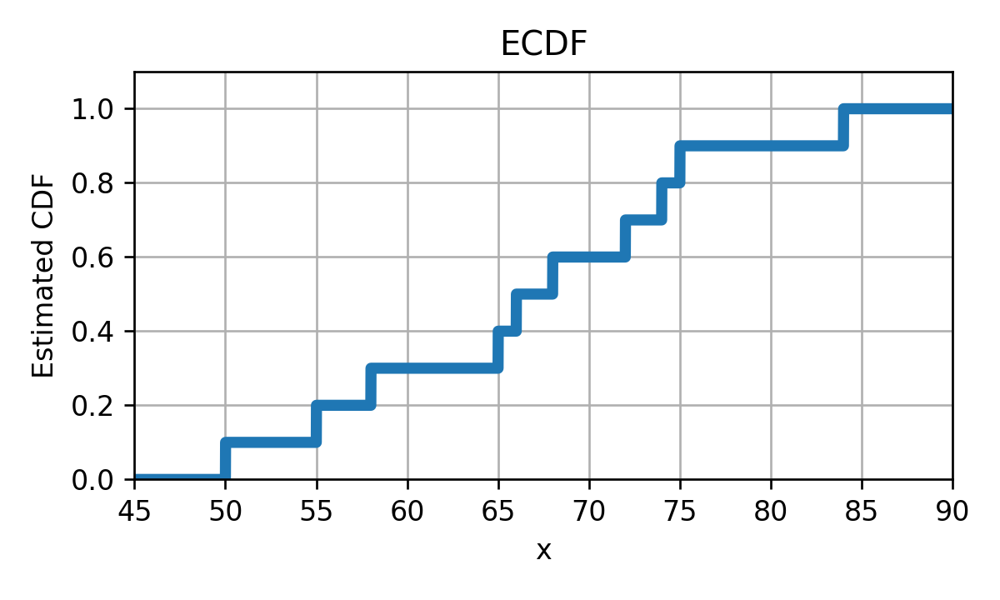
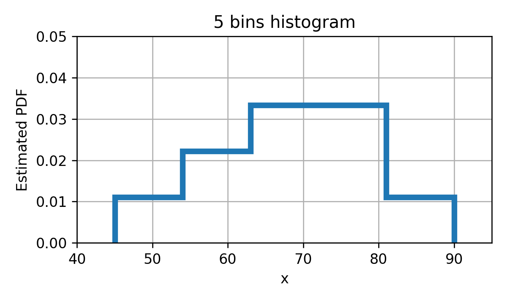
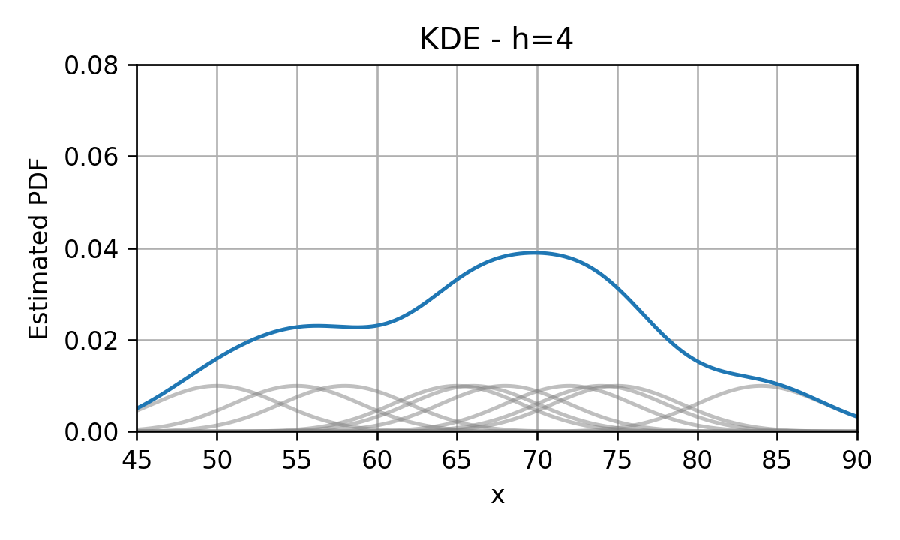
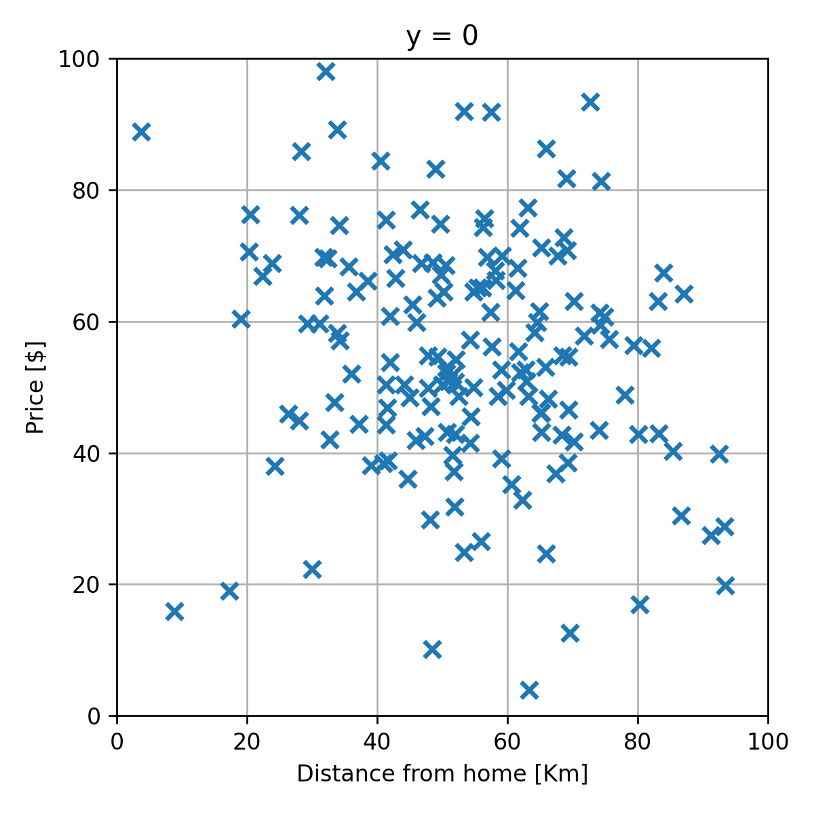

<section class="center">

# הרצאה 7 - שיערוך פילוג בשיטות לא פרמטריות

<a href="/assets/lecture07_slides.pdf" class="link-button" target="_blank">PDF</a>

</section><section>

## מה נלמד היום

</section><section>

## דיסקרימינטיבי vs. גנרטיבי

#### הגישה הדיסקרימינטיבית

מדגם 
️▼ 
חזאי בעל ביצועים טובים על המדגם

 

#### הגישה הגנרטיבית

מדגם 
▼ 
פילוג על סמך המדגם 
▼ 
חזאי אופטימאלי בהינתן הפילוג

</section><section>

## הקשר לבעיות unsupervised learning

- בקרוס זה לא נעסוק כמעט בבעיות unsupervised learning.
- בבעיות unsupervised learning המדגם מכיל סוג אחד של משתנים $\mathbf{x}$.
- ננסה ללמוד מהם התכונות שמאפיינות את הדגימות במדגם.
- אחת הדרכים הטובות ביותר לעשות זאת היא על ידי שיערוך הפילוג שלהם.

</section><section>

## שיערוך הפילוג

הבעיה של בניית מודל הסתברותי של משתנים אקראיים מתוך מדגם מכונה **בעיית שיערוך (estimation)**. את המודל ההסתברותי אנו נבטא בעזרת אחת מהפונקציות הבאות:

- פונקציית ההסתברות (probablity mass function - PMF)
- פונקציית צפיפות ההסתברות (probability density function - PDF)
- פונקציית הפילוג המצרפית (cumulative distribution function CDF).

</section><section>

## חיזוי (prediction) ושיערוך (estimation)

- **בבעיות חיזוי** אנו מועניינים לחזות את ערכו של **משתנה אקראי**, לרוב על סמך משתנה / וקטור אקראי בודד (**דגימה יחידה**).
- **בבעיות שיערוך** אנו מעוניינים לבנות **מודל הסתברותי** של משתנה / משתנים אקראיים לרוב על סמך **הרבה דגימות**.

</section><section>

## דוגמא

נסתכל לדוגמא על המדגם של הונאות אשראי מהרצאה הקודמת:

נרצה לשערך את הפילוג של המשתנים על פי מדגם זה

</section><section>

## דוגמא

לדוגמא היינו רוצים למצוא פונקציות אשר יתארו את הפילוג של הדגימות החוקיות ושל ההונאות:

</section><section>

## שיערוך א-פרמטריות

בהרצאה הקרובה נעסוק בשיטות שיערוך אשר מכונות שיטות לא פרמטריות או א-פרמטריות, מהות השם תהיה ברורה יותר אחרי שנציג בהרצאה הבאה את הנושא של שיטות פרמטריות.

</section><section>

## שיערוך ההסתברות של מאורע

### דוגמא

נניח שיש בידינו את המדגם הבא של מדידות של זמני נסיעה (בדקות) מחיפה לתל אביב על כביש החוף:

$$
\mathcal{D}=\{x^{(i)}\}=\{55, 68, 75, 50, 72, 84, 65, 58, 74, 66\}
$$

ברצונינו לשערך את ההסתברות של המאורע שנסיעה מסויימת תיקח פחות משעה, $A=\{x<60\}$.

</section><section>

## שיערוך ההסתברות של מאורע

### דוגמא

$$
\mathcal{D}=\{x^{(i)}\}=\{55, 68, 75, 50, 72, 84, 65, 58, 74, 66\}
$$

נשערך שהסתברות זו שווה למספר הפעמים היחסי שמאורע זה קרה במדגם הנתון:

$$
\text{Pr}(A)\approx\hat{p}_{A,\mathcal{D}}=0.3
$$

- נשתמש בסימון "כובע" לציון גודל שאותו אנו חוזים / משערכים באופן אמפירי.
- נציין את העובדה שמשערך תלוי במדגם שבו השתמשנו על ידי הוספת $\mathcal{D}$ מתחת למשערך.

</section><section>

## מדידה אמפירית (empirical measure)  / משערך הצבה

בהינתן מדגם מסויים $\mathcal{D}=\{\boldsymbol{x}^{(i)}\}_{i=0}^N$, המדידה האמפירית, $\hat{p}_{A,\mathcal{D}}$, הינה שיערוך של הההסתברות, $Pr\left(A\right)$, והיא מחושבת באופן הבא:

$$
\hat{p}_{A,\mathcal{D}}=\frac{1}{N}\sum_{i=1}^N I\{\boldsymbol{x}^{(i)}\in A\}
$$

נוכל כעת להשתמש בשיטה זו על מנת לנסות ולשערך את הפילוג של משתנים אקראיים.

</section><section>

## משתנה אקראי דיסקרטי

### דוגמא 1 - משתנה בינארי

- $\text{x}$ תוצאת הטלה של מטבע לא הוגן.
- הטלנו את המטבע 10 פעמים וקיבלנו:

$$
\mathcal{D}=\{x^{(i)}\}=\{0, 0, 0, 0, 1, 0, 0, 1, 0, 0\}
$$

מה ה PMF של $\text{x}$?

</section><section>

## משתנה אקראי דיסקרטי

### דוגמא 1 - משתנה בינארי

$$
\mathcal{D}=\{x^{(i)}\}=\{0, 0, 0, 0, 1, 0, 0, 1, 0, 0\}
$$

גם כאן נשערך את ההסתברויות של הערכים ש $\text{x}$ מקבל על פי השכיחות שלהם במדגם:

$$
p_{\text{x}}(x)\approx\hat{p}_{\text{x},\mathcal{D}}(x)=
\begin{cases}
  0.8 & 0 \\
  0.2 & 1
\end{cases}
$$

- זו למעשה מדידה אמפירית של המאורע ש $\{\text{x}=x\}$.

</section><section>

## משתנה אקראי דיסקרטי

### דוגמא 2 - משתנה לא בינארי

- $\text{x}$ תוצאת הטלה של קוביה לא הוגנת.
- הטלנו את הקוביה 10 פעמים וקיבלנו:

$$
\mathcal{D}=\{x^{(i)}\}=\{3, 2, 5, 1, 2, 6, 2, 5, 5, 3\}
$$

מה ה PMF של $\text{x}$?

</section><section>

## משתנה אקראי דיסקרטי

### דוגמא 2 - משתנה לא בינארי

$$
\mathcal{D}=\{x^{(i)}\}=\{3, 2, 5, 1, 2, 6, 2, 5, 5, 3\}
$$

בדיוק כמו קודם, נשערך את ההסתברות לקבל כל ערך לפי השכיחות שלו במדגם:

$$
p_{\text{x}}(x)\approx\hat{p}_{\text{x},\mathcal{D}}(x)=
\begin{cases}
  0.1 & 1 \\
  0.3 & 2 \\
  0.2 & 3 \\
  0 & 4 \\
  0.3 & 5 \\
  0.1 & 6 \\
\end{cases}
$$

</section><section>

## ניסוח פורמאלי

בהינתן מדגם מסויים $\mathcal{D}=\{\boldsymbol{x}^{(i)}\}_{i=0}^N$, נוכל לשערך את ה PMF של משתנה / וקטור אקראי דיסקרטי באופן הבא:

$$
\hat{p}_{\mathbf{x},\mathcal{D}}(\boldsymbol{x})=\frac{1}{N}\sum_{i=1}^N I\{\boldsymbol{x}^{(i)}=\boldsymbol{x}\}
$$

שימו לב שמובטח לנו שנקבל פונקציית הסתברות חוקית (חיובית שהסכום עליה שווה ל1).

</section><section>

## שיערוך הפילוג המצרפי

נזכור כי פונקציית הפילוג המצרפי (ה CDF) מוגדרת באופן הבא:

$$
F_{\mathbf{x}}(\boldsymbol{x})=\text{Pr}\left(\{\text{x}_j\leq {x}_j\ \forall j\}\right)
$$

נוכל אם כן לשערך גודל זה על ידי שימוש במדידה האמפירית בעבור המאורע של $A=\{\text{x}_j\leq {x}_j \, \forall j\}$ באופן הבא:

$$
\hat{F}_{\mathbf{x},\mathcal{D}}(\boldsymbol{x})=\hat{p}_{A,\mathcal{D}}=\frac{1}{N}\sum_{i=1}^N  I\{\text{x}_j\leq {x}_j \, \forall j\}
$$

משערך זה נקרא empirical cumulative distribtuion function (ECDF).

</section><section>

## ECDF - דוגמא

נשערך את הפילוג המצרפי של זמני הנסיעה בכביש החוף

$$
\mathcal{D}=\{x^{(i)}\}=\{55, 68, 75, 50, 72, 84, 65, 58, 74, 66\}
$$

$$
\hat{F}_{\mathbf{x},\mathcal{D}}(\boldsymbol{x})=
\begin{cases}
  0 & x<50 \\
  0.1 & 50\leq x<55 \\
  0.2 & 55\leq x<58 \\
  0.3 & 58\leq x<65 \\
  0.4 & 65\leq x<66 \\
  0.5 & 66\leq x<68 \\
  0.6 & 68\leq x<72 \\
  0.7 & 72\leq x<74 \\
  0.8 & 74\leq x<75 \\
  0.9 & 75\leq x<84 \\
  1 & 84\leq x  \\
\end{cases}
$$

</section><section>

## ECDF - דוגמא

זוהי למעשה פונקציה קבועה למקוטעין אשר נראית כך:

 

 

**בעיה**: איך נראה ה PDF?

</section><section>

## ECDF - דוגמא

ככה:

 

פונקציה כזו היא לא מאד שימושית.

</section><section>

## היסטוגרמה

נסיון לשערך PDF על ידי קוונטיזציה של משתנה רציף.

- נחלק את טווח הערכים למספר סופי של חלקים המכוונים bins (תאים).
- נשתמש במדידה אמפירת על מנת לשערך את ההסתברות להימצא בכל תא.

</section><section>

## היסטוגרמה - דוגמא

$$
\mathcal{D}=\{x^{(i)}\}=\{55, 68, 75, 50, 72, 84, 65, 58, 74, 66\}
$$

נחלק את התחום ל 5 קטעים:

$$
[45,54),[54,63),[63,72),[72,81),[81,90]
$$

ההסתברות להיות בכל bin הינה:

$$
\begin{aligned}
\hat{p}_{\{45\leq\text{x}<54\},\mathcal{D}}&=0.1\\
\hat{p}_{\{54\leq\text{x}<63\},\mathcal{D}}&=0.2\\
\hat{p}_{\{63\leq\text{x}<72\},\mathcal{D}}&=0.3\\
\hat{p}_{\{72\leq\text{x}<81\},\mathcal{D}}&=0.3\\
\hat{p}_{\{81\leq\text{x}\leq90\},\mathcal{D}}&=0.1\\
\end{aligned}
$$

יש לבחור את ה bins כך שיכסו את התחום ולא יחפפו.

</section><section>

## היסטוגרמה

בכדי להפוך את ההסתברויות לצפיפות הסתברות נרצה "למרוח" את ההסתברות שקיבלנו באופן אחיד על פני ה bin.

$$
\hat{p}_{\text{x},\mathcal{D}}(x)
=\begin{cases}
  \frac{1}{\text{size of bin }1}\hat{p}_{\{\text{x in bin }1\},\mathcal{D}}&\text{x in bin }1\\
  \vdots\\
  \frac{1}{\text{size of bin }B}\hat{p}_{\{\text{x in bin }B\},\mathcal{D}}&\text{x in bin }B
\end{cases}
$$

</section><section>

## היסטוגרמה - דוגמא

$$
\begin{aligned}
\hat{p}_{\{45\leq\text{x}<54\},\mathcal{D}}&=0.1\\
\hat{p}_{\{54\leq\text{x}<63\},\mathcal{D}}&=0.2\\
\hat{p}_{\{63\leq\text{x}<72\},\mathcal{D}}&=0.3\\
\hat{p}_{\{72\leq\text{x}<81\},\mathcal{D}}&=0.3\\
\hat{p}_{\{81\leq\text{x}\leq90\},\mathcal{D}}&=0.1\\
\end{aligned}
$$

</section><section>

## היסטוגרמה - ניסוח פורמאלי

בהינתן מדגם מסויים $\mathcal{D}=\{\boldsymbol{x}^{(i)}\}_{i=0}^N$, ההיסטוגרמה הינה שיערוך של ה PDF של משתנה / וקטור אקראי והיא מחושבת באופן הבא:

1. מחלקים את תחום הערכים ש $\mathbf{x}$ יכול לקבל ל bins (תאים) לא חופפים אשר מכסים את כל התחום.
2. לכל bin משערכים את ההסתברות של המאורע שבו $\mathbf{x}$ יהיה בתוך התא.
3. הערך של פונקציית הצפיפות בכל תא תהיה ההסתברות המשוערכת להיות בתא חלקי גודל התא.

לבחירת ה bins יש השפעה גדולה על איכות השיערוך שנקבל. ננסה להבין את השיקולים בבחירת ה bins.

</section><section>

## היסטוגרמה - המקרה הסקלרי

- $B$ מספר התאים.
- $l_b$ ו $r_b$ את הגבול השמאלי והימני התא ה $b$.

$$
\hat{p}_{\text{x},\mathcal{D}}(x)=
\begin{cases}
  \frac{1}{N(r_1-l_1)}\sum_{i=1}^N I\{l_1\leq x^{(i)}<r_1\}&l_1\leq x<r_1\\
  \vdots\\
  \frac{1}{N(r_B-l_B)}\sum_{i=1}^N I\{l_B\leq x^{(i)}<r_B\}&l_B\leq x<r_B\\
\end{cases}
$$

</section><section>

## Overfitting ו underfitting של היסטוגרמה

### דוגמא - שני מקרים קיצוניים

 

</section><section>

## Overfitting ו underfitting של היסטוגרמה

### מספר תאים קטן

Underfitting: יכולת מוגבלת לקרב את ה PDF האמיתי.

### מספר תאים גדול

Overfitting: ההיסטוגרמה תתאר בצורה טובה את הדגימות אך לא את הפילוג האמיתי.

</section><section>

## בחירת התאים

- מקובל לחלק ל $k$ תאים אחידים בגודלם.
- מכיוון שה $k$ האופטימאלי ישתנה מבעיה לבעיה, נאלץ לרוב לבחור אותו בעזרת ניסוי וטעיה.
- ישנם מספר כללי אצבע אשר במרבית המקרים יתנו תוצאה לא רעה.
- הכלל הנפוץ ביותר הינו לבחור את $k$ להיות שורש מספר הדגימות במדגם (מעוגל כלפי מעלה): $k=\left\lceil\sqrt{N}\right\rceil$

</section><section>

## Kernel Density Estimation (KDE)

נתחיל מ PDF שבו אנו ממקמים פונקציית דלתא בגובה $\frac{1}{N}$ בכל נקודה אשר מופיעה במדגם.

 

לדוגמא, בעבור זמני הנסיעה בכביש החוף נקבל:

</section><section>

## Kernel Density Estimation (KDE)

נחליף כל דלתא בפונקציית גרעין בעלת רוחב גדול מ-0.

 

לדוגמא גאוסיאנים:

</section><section>

## Kernel Density Estimation (KDE)

נסכום את כל פונקציות הגרעין לקבלת ה PDF המשוערך:

 

</section><section>

## Kernel Density Estimation (KDE)

- **פונקציות הגרעין (kernel)** מכונות גם **Parzen window**.
- ומקובל לסמנם ב $\phi(\boldsymbol{x})$.

אם כן, משערך ה KDE נתון על ידי:

$$
\hat{p}_{\mathbf{x},\phi,\mathcal{D}}(\boldsymbol{x})=\frac{1}{N}\sum_{i=1}^N \phi(\boldsymbol{x}-\boldsymbol{x}^{(i)})
$$

**הערה**: תנאי מספיק והכרחי בכדי שנקבל PDF חוקי, הינו שפונקציית הגרעיון תהיה בעצמה PDF חוקי.

 

**בהקשר של עיבוד אותות**: למעשה אנו מבצעים קונבולוציה בין פונקציית הדלתאות לבין פונקציית הגרעין. נרצה שהגרעין ישמש כמעיין low pass filter.

</section><section>

## הוספת פרמטר רוחב

מקובל להוסיף פרמטר $h$ אשר שולט ברוחב של הגרעין:

$$
\phi_h(\boldsymbol{x})=\frac{1}{h^D}\phi\left(\frac{\boldsymbol{x}}{h}\right)
$$

בתוספת פרמטר זה המשערך יהיה:

$$
\hat{p}_{\mathbf{x},\phi,h,\mathcal{D}}(\boldsymbol{x})=\frac{1}{Nh^D}\sum_{i=1}^N \phi\left(\frac{\boldsymbol{x}-\boldsymbol{x}^{(i)}}{h}\right)
$$

</section><section>

## פונקציות גרעין נפוצות

שתי הבחירות הנפוצות ביותר לפונקציית הגרעין הינן:

1. חלון מרובע:

    $
    \phi_h(\boldsymbol{x})=\frac{1}{h^D}I\{|x_j|\leq \tfrac{h}{2}\quad\forall j\}
    $

כלל אצבע עבור חלון ריבועי הוא לבחור בצורה אדפטיבית את גודל החלון כך שיכלול מספר נתון  ($k$) של דגימות מסביב לנקודה   הנחקרת. בחירה סבירה הינה  $k\propto\sqrt{N}$, בדומה למה שעשינו בהיסטוגרמות.

2. גאוסיאן:

    $
    \phi_{\sigma}\left(x\right)=\frac{1}{\sqrt{2\pi}\sigma^D}\exp\left(-\frac{\lVert x\rVert_2^2}{2\sigma^2}\right)
    $

כלל אצבע לבחירת רוחב הגרעין במקרה הגאוסי הסקלרי:

$
\sigma=\left(\frac{4\cdot\text{std}(\text{x})^5}{3N}\right)^\frac{1}{5}\approx1.06\ \text{std}(\text{x})N^{-\tfrac{1}{5}}
$

</section><section>

## שיערוך של פילוגים מעורבים

- נניח שאנו רוצים לשערך את הפילוג המשותף של $\text{x}$ ו $\text{y}$ כאשר $\text{x}$ הוא משתנה רציף ו $\text{y}$ הוא משתנה בדיד.
- במקרים כאלה נוח לפרק את פונקציית הפילוג המשותף באופן הבא:

$$
p_{\mathbf{x},\text{y}}(\boldsymbol{x},y)
=p_{\mathbf{x}|\text{y}}(\boldsymbol{x}|y)p_{\text{y}}(y)
$$

ולהפריד את בעיית השיערוך לשני חלקים:

1. השיערוך של $p_{\text{y}}(y)$
2. השיערוך של $p_{\mathbf{x}|\text{y}}(\boldsymbol{x}|y)$ - כאן נשערך את הפילוג בנפרד לכל ערך של $\text{y}$.

</section><section>

## שיערוך של פילוגים מעורבים - דוגמא

נחזור לדוגמא של הונאות האשראי:

</section><section>

## שיערוך של פילוגים מעורבים - דוגמא

נתחיל בשיערוך של $\text{y}$.

- $\text{y}$ בדיד ולכן נוכל לשערך את ה PMF שלו על פי השכיחות של הערכים במדגם.
- מתוך ה 200 עסקאות ישנם 160 עסקאות חוקיות ו 40 עסקאות שחשודות כהונאה. לכן:

$$
\hat{p}_{\text{y},\mathcal{D}}(y)
=\begin{cases}
  \frac{160}{200} & 0 \\
  \frac{40}{200} & 1
\end{cases}
=\begin{cases}
  0.8 & 0 \\
  0.2 & 1
\end{cases}
$$

</section><section>

## שיערוך של פילוגים מעורבים - דוגמא

נמשיך לשיערוך של $p_{\mathbf{x}|\text{y}}(\boldsymbol{x}|y)$.

- נשערך בנפרד את $p_{\mathbf{x}|\text{y}}(\boldsymbol{x}|0)$ ואת $p_{\mathbf{x}|\text{y}}(\boldsymbol{x}|1)$.

נתחיל מ $p_{\mathbf{x}|\text{y}}(\boldsymbol{x}|0)$. בשביל לשערך פילוג זה נסתכל רק על הדגימות השייכות של $\text{y}=0$:

</section><section>

## שיערוך של פילוגים מעורבים - דוגמא

נשתמש ב KDE על מנת לשערך את $p_{\mathbf{x}|\text{y}}(\boldsymbol{x}|0)$:

 

</section><section>

## שיערוך של פילוגים מעורבים - דוגמא

באופן דומה נשערך גם את $p_{\mathbf{x}|\text{y}}(\boldsymbol{x}|1)$:

</section><section>

## שיערוך של פילוגים מעורבים - דוגמא

$$
\hat{p}_{\text{y},\mathcal{D}}(y)
=\begin{cases}
  0.8 & 0 \\
  0.2 & 1
\end{cases}
$$

שלושת הפילוגים ששיערכנו מרכיבים את הפילוג המשותף על פי:

$$
p_{\mathbf{x},\text{y}}(\boldsymbol{x},y)
=p_{\mathbf{x}|\text{y}}(\boldsymbol{x}|y)p_{\text{y}}(y)
$$

</section><section>

## שימוש בפילוג המשוערך לפתרון בעיות supervised learning

#### הגישה הגנרטיבית

מדגם 
️▼ 
פילוג על סמך המדגם 
️▼ 
חזאי אופטימאלי בהינתן הפילוג

 
 

עשינו את השלב הראשון, נעשה כעת את השלב השני.

</section><section>

## חזאים אופטימאליים של פונקציות מחיר מוכרות - תזכורת

- **MSE**: התוחלת המותנית:

    $$
    h^*(\boldsymbol{x})=\mathbb{E}[y|x]
    $$

- **MAE**: החציון של הפילוג המותנה:

    $$
    h^*(\boldsymbol{x})=y_{\text{median}}\qquad
    \text{s.t.}\ F_{\text{y}|\mathbf{x}}(y_{\text{median}}|\boldsymbol{x})=0.5
    $$

    (כאשר $F_{\text{y}|\mathbf{x}}$ היא פונקציית הפילוג המצרפי של $\text{y}$ בהינתן $\mathbf{x}$).
- **Misclassification rate**: הערך הכי סביר (ה mode):

    $$
    h^*(\boldsymbol{x})=\underset{y}{\arg\max}\ p_{\text{y}|\mathbf{x}}(y|\boldsymbol{x})
    $$

</section><section>

## דוגמא

בעבור הפילוג שמצאנו נחפש את החזאי אשר ממזער את ה misclassification rate.

$$
h(\boldsymbol{x})=\underset{y}{\arg\max}\ p_{\text{y}|\mathbf{x}}(y|\boldsymbol{x})
$$

במקרה הבנארי חזאי זה שווה ל:

$$
h(\boldsymbol{x})=
\begin{cases}
  1 & p_{\text{y}|\mathbf{x}}(1|\boldsymbol{x}) > p_{\text{y}|\mathbf{x}}(0|\boldsymbol{x}) \\
  0 & \text{else}
\end{cases}
$$

את $p_{\text{y}|\mathbf{x}}(y|\boldsymbol{x})$ נוכל לחשב מתוך הפילוג המשותף באופן הבא:

$$
p_{\text{y}|\mathbf{x}}(y|\boldsymbol{x})
=\frac{p_{\mathbf{x},\text{y}}(\boldsymbol{x},y)}
      {p_{\mathbf{x}}(\boldsymbol{x})}
=\frac{p_{\mathbf{x}|\text{y}}(\boldsymbol{x}|y)p_{\text{y}}(y)}
      {p_{\mathbf{x}}(\boldsymbol{x})}
$$

</section><section>

## דוגמא

אם כן, בכדי לבדוק האם עסקה מסויימת הינה הונאה או לא, עלינו לבדוק האם:

$$
\begin{aligned}
p_{\text{y}|\mathbf{x}}(1|\boldsymbol{x}) &> p_{\text{y}|\mathbf{x}}(0|\boldsymbol{x}) \\
\Leftrightarrow \frac{p_{\mathbf{x}|\text{y}}(\boldsymbol{x}|1)p_{\text{y}}(1)}{p_{\mathbf{x}}(\boldsymbol{x})} &>
                \frac{p_{\mathbf{x}|\text{y}}(\boldsymbol{x}|0)p_{\text{y}}(0)}{p_{\mathbf{x}}(\boldsymbol{x})}\\
\Leftrightarrow p_{\mathbf{x}|\text{y}}(\boldsymbol{x}|1)p_{\text{y}}(1) &>
                p_{\mathbf{x}|\text{y}}(\boldsymbol{x}|0)p_{\text{y}}(0)\\
\end{aligned}
$$

</section><section>

## דוגמא

$$
p_{\mathbf{x}|\text{y}}(\boldsymbol{x}|1)p_{\text{y}}(1) >
p_{\mathbf{x}|\text{y}}(\boldsymbol{x}|0)p_{\text{y}}(0)
$$

נציב את פונקציות הפילוג ששיערכנו קודם לכן ונקבל את החזאי הבא:

ה misclassification rate של חזאי זה על ה test set הינו 0.12.

</section><section>

## ה bias וה variance של משערך

- המשערכים תלויים בצורה חזקה במדגם שאיתו אנו עובדים.
- נסתכל על האקראיות של השיערוך הנובעת מהאקראיות של המדגם.
- נשתמש בסימון $\mathbb{E}_{\mathcal{D}}$ בכדי לסמן תוחלת על פני הפילוג של המדגם.
- נגדיר bias ו variance של משערך

</section><section>

## ה bias וה variance של משערך

### Bias

בעבור שיערוך של גודל כל שהוא $z$ בעזרת משערך $\hat{z}_{\mathcal{D}}$, ה bias (היסט) של השיערוך מוגדר כ:

$$
\text{Bias}\left(\hat{z}\right)=\mathbb{E}_{\mathcal{D}}\left[\hat{z}_{\mathcal{D}}\right]-z
$$

כאשר ההטיה שווה ל-0, אנו אומרים שהמשערך **אינו מוטה** (**Unbiased**).

### Variance

ה variance (שונות) של המשערך יהיה:

$$
\text{Var}\left(\hat{z}\right)
=\mathbb{E}_{\mathcal{D}}\left[\left(\hat{z}_{\mathcal{D}}-\mathbb{E}_{\mathcal{D}}\left[\hat{z}_{\mathcal{D}}\right]\right)^2\right]
=\mathbb{E}_{\mathcal{D}}\left[\hat{z}_{\mathcal{D}}^2\right]-\mathbb{E}_{\mathcal{D}}\left[\hat{z}_{\mathcal{D}}\right]^2
$$

</section><section>

## מספר ה bins במונחים של bias ו variance

- ננסה לשערך את ה PDF של משתנה אקראי נורמאלי בעזרת היסטוגרמות בעלות 3, 7 ו 21 bins.

### ה bias

נשרטט את ההיסטוגרמה הממוצעת לצד ה PDF האמיתי.

ה bias הוא ההפרש בין ההיסטוגרמה הממוצעת ל PDF האמיתי. ה bias קטן ככל שמספר ה bins גדל.

</section><section>

## מספר ה bins במונחים של bias ו variance

</section><section>

## מספר ה bins במונחים של bias ו variance

### ה variance

- בכל שורה בגרף הקודם מגרילים שלושה מדגמים ומחשבים להם את ההיסטוגרמה.
- אנו מצפים שבעבור מקרים שבהם ה variance נמוך השינויים יהיו קטנים ובעבור variance גבוה השינויים יהיו גדולים.
- ה variance גדל ככל שאנו מגדילים את כמות ה bins.

בדומה לחזאים בגישה הדיסקרימינטיבית, גם בהיסטוגרמה ישנו bias-variance tradeoff.

</section>

