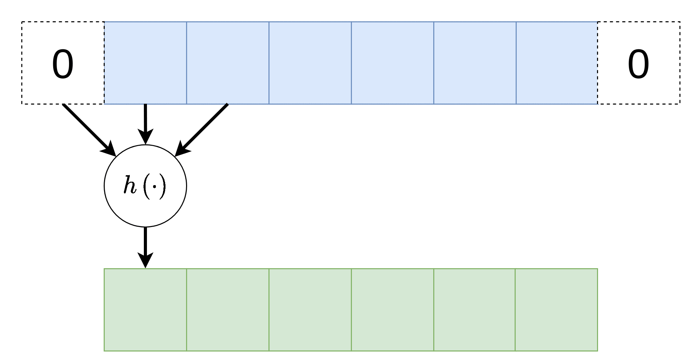
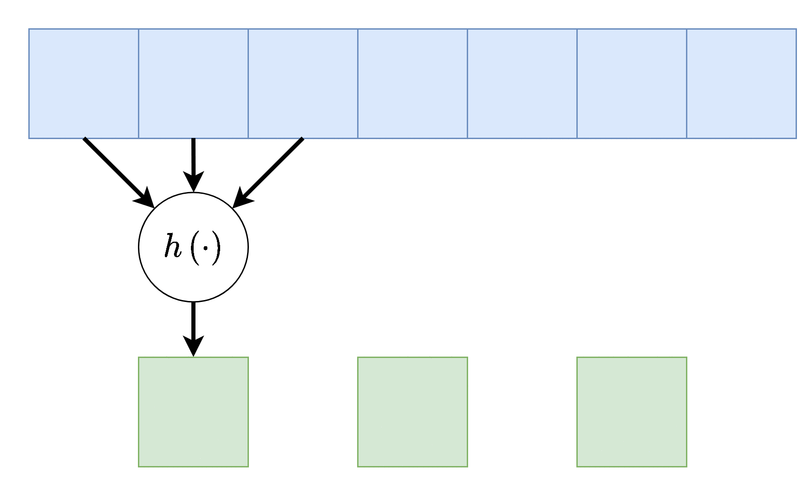

<section class="center">

# הרצאה 8 - CNN

<a href="/assets/lecture09_slides.pdf" class="link-button" target="_blank">PDF</a>

</section><section>

## (Classical) Gradient Descent

צעד העדכון ב gradient descent נתון על ידי:

$$
\boldsymbol{\theta}^{(t+1)}=\boldsymbol{\theta}^{(t)}-\eta\nabla_{\boldsymbol{\theta}}g(\boldsymbol{\theta})
$$

1. ב ERM:

    $$
    \underset{\boldsymbol{\theta}}{\arg\min} \underbrace{\frac{1}{N}\sum_{i=1}^N l(h(\boldsymbol{x^{(i)}};\boldsymbol{\theta}),y^{(i)})}_{g(\boldsymbol{\theta};\mathcal{D})}
    $$

2. MLE:

    $$
    \underset{\boldsymbol{\theta}}{\arg\min} \underbrace{\sum_{i=1}^N \log(p_{\text{y};\mathbf{x}}(y^{(i)}|\boldsymbol{x}^{(i)};\boldsymbol{\theta})}_{g(\boldsymbol{\theta};\mathcal{D})}
    $$

</section><section>

## (Classical) Gradient Descent

ב ERM:

$$
\underset{\boldsymbol{\theta}}{\arg\min} \underbrace{\frac{1}{N}\sum_{i=1}^N l(h(\boldsymbol{x^{(i)}};\boldsymbol{\theta}),y^{(i)})}_{g(\boldsymbol{\theta};\mathcal{D})}
$$

ב MLE:

$$
\underset{\boldsymbol{\theta}}{\arg\min} \underbrace{\sum_{i=1}^N \log(p_{\text{y};\mathbf{x}}(y^{(i)}|\boldsymbol{x}^{(i)};\boldsymbol{\theta})}_{g(\boldsymbol{\theta};\mathcal{D})}
$$

- הגרדיאנט מכיל סכום על כל המדגם אשר יכול להיות בעייתי כאשר המדגם גדול.
- נרצה להשתמש בחישוב אשר משתמש בכל צעד רק בחלק מן המדגם.

</section><section>

## Stochastic Gradient Descent

- מחשב בכל פעם את הנגזרת על פי **דגימה בודדת** מתוך המדגם, כאשר בכל צעד נשתמש בדגימה אחרת.
- שתי אופציות לבחירה של הדגימה בכל צעד הינן:

    1. להגריל דגימה אקראית אחרת בכל צעד.
    2. לעבור על הדגימות במדגם צורה סידרתית.

- אחת מהדגימות תצביע לכיוון שונה מהנגזרת של הסכום אבל בממוצע הכיוון הכללי יהיה זהה לכיוון של הסכום.
- החישוב הוא מאד מהיר אבל הגרדיאנט מאד "רועש".

</section><section>

## Mini-Batch Gradient Descent

- פתרון ביניים.
- בשיטה זו נשתמש בקבוצת דגימות מתוך המדגם המוכנה mini-batch. בכל צעד אנו נחליף את ה mini-batch.
- הנפוצה ביותר לאימון של רשתות נוירונים.
- גדלים אופיינים של ה mini-batch הינם 32-256 דגימות.

</section><section>

## שמות

- **Epoch**: מעבר שלם על המדגם.
- מתייחסים ל mini-batch בשם batch.
- בחבילות רבות האלגוריתם gradient descent מופיע תחת השם stochastic gradient descent.

</section><section>

## עצירה מוקדמת של gradient descent

- דרך מוצלחת נוספת למנוע overfitting הינה לעצור את אלגוריתם הגרדיאנט לפני שהוא מתכנס.
- זה נעשה על ידי חישוב ה objective על ה validataion set ובחירת הפרמטרים שממזערים את ה objective.

</section><section>

## Convolutional Neural Networks (CNN)

- ב MLPניתן להגדיל את היכולת הייצוג על ידי הגדלת הרשת (מספר השכבות והרוחב שלהם).
- כפי שקורה בכל מודל פרמטרי, הגדלה של יכולת הייצוג תגדיל גם את ה overfitting.
- רשת בעלת ארכיטקטורה טובה היא דווקא רשת בעלת יכולת ייצוג נמוכה אשר עדיין מוסגלת לקרב בצורה טובה את הפונקציה שאותה היא מנסה למדל.
- במקרים מסויימים ארכיטקטורה בשם convolutional nerual network (CNN) עונה בדיוק על דרישות אלו.

</section><section>

## שכבת קונבולוציה

1. כל נוירון בשכבה זו מוזן רק מכמות מוגבלת של ערכים הנמצאים בסביבתו הקרובה.
2. כל הנוירונים בשכבה מסויימת זהים (**weight sharing**).

</section><section>

## שכבת קונבולוציה

ניתן להסתכל על הפעולה של שכבת הקונבולוציה באופן הבא:

</section><section>

## שכבת קונבולוציה

מתמטית השיכבה מבצעת את שלושת הפעולות הבאות:

1. פעולת קרוס-קורלציה (ולא קונבולוציה) בין וקטור הכניסה $\boldsymbol{x}$ ווקטור משקולות $\boldsymbol{w}$ באורך $K$.
2. הוספת היסט $b$ (אופציונלי).
3. הפעלה של פונקציית הפעלה על וקטור המוצא איבר איבר.

</section><section>

## שכבת קונבולוציה

פעולת הקרוס-קורלציה מוגדרת באופן הבא:

$$
y_i=\sum_{m=1}^K x_{i+m-1}w_m
$$

וקטור המשקולות של שכבת הקונבולציה $\boldsymbol{w}$ נקרא **גרעין הקונבולוציה (convolution kernel)**.

</section><section>

## שכבת קונבולוציה

- הגדול המוצא של שכבת הקונבולוציה הוא קטן יותר מהכניסה והוא נתון על ידי $D_{\text{out}}=D_{\text{in}}-K+1$.
- בשכבת FC קיימות $D_{\text{in}}\times D_{\text{out}}$ משקולות ועוד $D_{\text{out}}$ איברי היסט.
- בשכבת קונבולציה יש $K$ משקולות ואיבר היסט בודד.

</section><section>

## קלט רב-ערוצי

במקרים רבים נרצה ששכבת הקונבולציה תקבל קלט רב ממדי, לדוגמא, תמונה בעלת שלושה ערוצי צבע או קלט שמע ממספר ערוצי הקלטה.

</section><section>

## פלט רב-ערוצי

נרצה לרוב להשתמש ביותר מגרעין קונבולוציה אחד, במקרים אלו נייצר מספר ערוצים ביציאה בעבור כל אחד מגרעיני הקונבולוציה.

אין שיתוף של משקולות בין ערוצי הפלט השונים.

</section><section>

## פלט רב-ערוצי

- $C_\text{in}$ - מספר ערוצי קלט.
- $C_\text{out}$ - מספר ערוצי פלט.
- $K$ - גודל הגרעין.

מספר הפרמטרים בשכבה:  $\underbrace{C_\text{in}\times C_\text{out}\times K}_\text{the weights}+\underbrace{C_\text{out}}_\text{the bias}$.

</section><section>

## Padding - ריפוד

במידה ונרצה לשמור על הגודל הוקטור במוצא של שכבת הקונבולוציה, ניתן לרפד את וקטור הכניסה באפסים. לדוגמא:

 

</section><section>

## Stride - גודל צעד

לעיתים נרצה דווקא להקטין את גודל הוקטור במוצא בפקטור מסויים. דרך אחת לעשות זאת היא על ידי דילול המוצא. בפועל אין צורך לחשב את הערכים במוצא שנזרקים ולכן למעשה ניתן לחשב את הקונבולוציה בקפיצות מסויימות המכונות stride.

 

</section><section>

## Dilation - התרחבות

במקרים אחרים נרצה לגדיל את האיזור שממנו אוסף נוירון מסויים את הקלט שלו מבלי להגדיל את מספר הפרמטרים ואת הסיבוכיות החישובית. לשם כך ניתן לדלל את הדרך בה נדגם הקלט על מנת להרחיב את איזור הקלט. אלא אם רשום אחרת, ה dilation של שכבה (הצפיפות בה הכניסה נדגמת) הוא 1.

 

</section><section>

## Max / Average Pooling

שיכבות נוספת אשר מופיעה במקרים רבים ברשתות CNN הם שכבות מסוג pooling. שני שכבות pooling נפוצות הם max pooling ו average pooling, שכבה זו לוקחת את הממוצע או המקסימום של ערכי הכניסה.

דוגמא זו מציגה max pooling בגודל 2 עם גודל צעד (stride) גם כן של 2:

בשכבה זאת אין פרמטרים נלמדים.

</section><section>

## 2D Convolutional Layer

<table style="width:100%; table-layout:fixed;">
  <tr>
    <td>
kernel size=3 padding=0 stride=1 dilation=1
</td>
    <td>
kernel size=4 padding=2 stride=1 dilation=1
</td>
    <td>
kernel size=3 padding=1 stride=1 dilation=1 (Half padding)
</td>
    <td>
kernel size=3 padding=2 stride=1 dilation=1 (Full padding)
</td>
  </tr>
  <tr>
    <td></td>
    <td></td>
    <td></td>
    <td></td>
  </tr>
  <tr>
    <td>
kernel size=3 padding=0 stride=2 dilation=1
</td>
    <td>
kernel size=3 padding=1 stride=2 dilation=1
</td>
    <td>
kernel size=3 padding=1 stride=2 dilation=1
</td>
    <td>
kernel size=3 padding=0 stride=1 dilation=2
</td>
  </tr>
  <tr>
    <td></td>
    <td></td>
    <td></td>
    <td></td>
  </tr>
</table>

- \[1\] Vincent Dumoulin, Francesco Visin - [A guide to convolution arithmetic for deep learning](https://arxiv.org/abs/1603.07285)([BibTeX](https://gist.github.com/fvisin/165ca9935392fa9600a6c94664a01214))
  
</section><section>

## מבנה רשת CNN

<!--
</section><section>

### למה זה עובד?

הסיבה שרשתות קונבולוציה מתאימות למשימות של סיווג תמונות בגלל שתי התכונות של הבעיה המתאימות לתכונות של שכבות הקנובולוציה.

#### תלות של כל נוירון רק בסביבה המיידית שלו

התכונה הראשונה של שכבות קונבולוציה הינה שכל נוירון מוזן מהערכים בסביבה המיידית שלו. תכונה זו מתאימה לסיווג של תמונות משום שניתן באופן יעיל לנסות להבין מה האובייקט שמופיע בתמונה היא באופן היררכי, נדגים את המשמעות של זה על ידי רשת שמנסה לזהות האם בתמונה מסויימת מופיע פרצוף.

גרעיני הקנובולוציה של השכבות הראשונות יעברו על התמונה ויחפשו, בעזרת קורלציה עם הגרעינים, תופעות בסיסיות כמו פסים אנכיים, פסים אופקיים, פינות, נקודות קטנות וכו'. כל גרעין ייצר ערוץ אשר מתאים לתופעה שאותה הוא מחפש. זאת אומרת שיהיה לנו ערוץ בעבור כל תופעה. לדוגמא הייצור של פסים אופקיים יעשה כך:

שכבת קונבולוציה עם 4 ערוצים במוצא תראה כך:

לאחר שנעשה pooling ונקטין את התמונה פי 2, נוכל להשתמש בשכבות הבאות בכדי לחפש אובייקטים אשר מורכבים מהתועפות שמצאו השכבות הראשונות. לדוגמא נוכל לחפש איזורים שמכילים הרבה פסים אנכיים בכדי לזהות איזורים שעשויים להכיל שיער, או לדוגמא לחפש שני פסים אופקיים סמוכים שעשויים להכיל שפתיים וכו'. לאחר כל pooling שמקטין את התמונה (או קונבולוציה עם stride) נוכל לחפש אובייקטים הולכים וגדלים המורכבים מאובייקטים קטנים יותר.

שיטה זו שאנו מנסים להבין את תכולת התמונה על ידי שימוש בסדרה של שכבות כאשר בכל שיכבה מנסים להבין מה קורה באותו איזור רק על פי הסביבה המידית של אותו איזור בדיוק מתאימה לעובדה שבשכבת הקונבולוציה כל נוירון מוזן רק מהסביבה המיידית שלו.

#### Weight sharing

התכונה הנוספת של שכבת הקונבולוציה הינה שהמשקולות של כל הנוירונים משותפים בין כל הנוירונים באותו השכבה באותו ערוץ. ישנם מספר סיבות ללמה אילוץ זה לא מגביל מאד את היכולת לזהות אובייקטים:

1. הסיווג של התמונה לא אמור להיות מושפע אם מזיזים את האובייקט בתמונה מעט לצדדים. מהסיבה הזו אנו בעצם צריכים פונקציה שהיא בגדול איווריאנטית להזזות. בפועל זה אומר שאנו רוצים להפעיל את אותם הפעולות הלוקליות בשכבות הראשונות בצורה דומה בכל איזור בתמונה.

2. הפעולות שהשכבות הראשונות מבצעות, כגון חיפוש קווים אופקיים ואנכיים משותף לכל האובייקטים שנרצה לחפש בכל האיזורים בתמונה.

## Batch Normalization (לא למבחן)

אחת הבעיות בעבודה עם רשתות עמוקות הינה שיכול להיווצר מצב שבו הערכים במוצא של כל שכבה הם מסדר גודל שונה. הדבר מאד משפיע על הגרדיאנטים של כל שיכבה ויכול ליצור גרדיאנטים בטווח ערכים מאד גדול שמאד מקשה על הבחירה של גודל הצעד. אנו נרחיב על כך בתרגול בהקשר של האיתחול של הפרמטרים של הרשת באלגוריתם ה gradient descent.

דרך אחרת לנסות ולהבטיח כי המוצאים של כל שכבה יהיו בערך מאותו סדר גודל הינה על ידי הוספה של שכבה בשם batch normalization אשר מנסה לנרמל את הערכים אשר עוברים דרכה (מביאה את התוחלת של הערכים ל 0 ואת הסטיית תקן ל 1). הדרך שהיא עושה זאת הינה על ידי חישוב התוחלת וסטיית התקן האמפירית של הערכים על פני ה batch הספציפי באותו צעד גרדיאנט.

נסתכל על שכבת batch norm המקבלת וקטור $\boldsymbol{z}_{\text{in}}$ ומוציאה וקטור $\boldsymbol{z}_{\text{out}}$:

נניח כי בצעד עדכון מסויים אנו רוצים לחשב את הגרדיאנט של הרשת בעבור mini-batch מסויים $\{\boldsymbol{x}^{(i)}\}_{i=1}^M$. נניח כי הוקטורים המתקבלים בכניסה לשכבת ה batch norm הם $\{\boldsymbol{z}_{\text{in}}^{(i)}\}_{i=1}^M$. שיכבת ה batch norm תחשב את התוחלת וסטיית התקן האמפירית של הכניסה באופן הבא:

$$
\boldsymbol{\mu}=\frac{1}{M}\sum_{i=1}^M \boldsymbol{z}_{\text{in}}^{(i)}
$$

$$
\sigma^2=\frac{1}{M}\sum_{i=1}^M (\boldsymbol{z}_{\text{in}}^{(i)}-\boldsymbol{\mu})^2
$$

המוצא של השכבה יהיה:

$$
\boldsymbol{z}_{\text{out}}=\frac{
\boldsymbol{z}_{\text{in}}-\boldsymbol{\mu}
}{\sigma+\epsilon}
$$

כאשר $\epsilon$ הוא מספר קטן כל שהוא אשר אמור למנוע חלוקה ב 0.

לרוב השכבה תכיל גם טרנספורמציה לינרארית נלמדת עם פרמטרים $\gamma$ ו $\beta$:

$$
\boldsymbol{z}_{\text{out}}=\frac{
\boldsymbol{z}_{\text{in}}-\boldsymbol{\mu}
}{\sigma+\epsilon}\cdot\gamma+\beta
$$

כאשר $\gamma$ ו $\beta$ הוא וקטורים באורך של $\boldsymbol{z}$ והמכפלה עם $\gamma$ היא איבר איבר.

### אחרי שלב האימון

במהלך הלימוד מחזיקים ממוצע נע ([exponantial moving average](https://en.wikipedia.org/wiki/Moving_average#Exponential_moving_average)) של הערכים $\mu$ ו $\sigma$ ובסוף שלב הלימוד מקבעים את הערכים שלהם ואלו הערכים שבהם הרשת תשתמש לאחר שלב האימון.

-->

