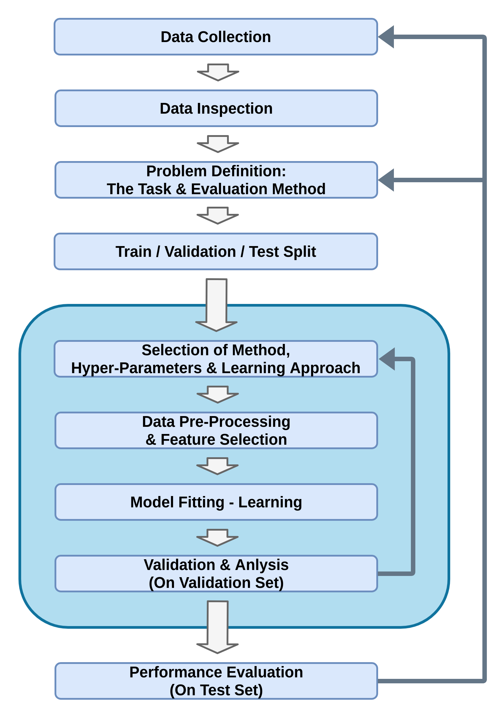
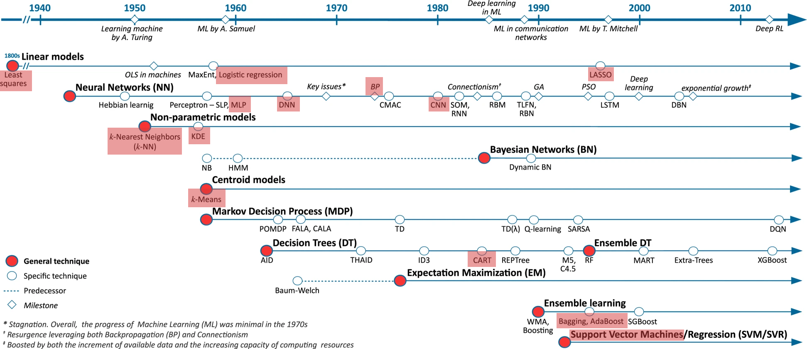

<section class="center">

# הרצאה 13 - סיכום

<a href="/assets/lecture13_slides.pdf" class="link-button" target="_blank">PDF</a>

</section><section>

## תהליך פתרון בעיית supervised learning

</section><section>

## הגדרת הבעיה

ב supervised learning תמיד ננסה למצוא חזאי $\hat{y}=h(\boldsymbol{x})$.

הפרדנו בין שתי מקרים:

- **בעיות סיווג (classification)**: $\text{y}$ דיסקרטי וסופי.
- **בעיות רגרסיה (regression)**: $\text{y}$ רציף.

</section><section>

## הערכת ביצועים

נגדיר את **פונקציית המחיר (cost)** שבה נרצה להשתמש בכדי להעריך את החזאי. לרוב נבחר פונקציית מחיר מהצורה:

$$
C(h)=\mathbb{E}\left[l(h(\mathbf{x}),\text{y})\right]
$$

פונקציות מסוג זה מכונות **פונקציות סיכון (risk)**.

הפונקציה $l$ מוכנה **פונקציית ההפסד (loss)**

- מכיוון שהפילוג של $\text{y}$ ו $\mathbf{x}$ לא באמת ידוע לנו אנו נשתמש ב **test set** ובתוחלת בכדי להאריך את הביצועים.

</section><section>

## פונקציות הפסד (פונקציות סיכון) נפוצות

| Common For | Loss Name | Risk Name | Loss Function | Optimal Predictor |
|------------|-----------|-----------|---------------|-------------------|
| Classification | Zero-One Loss | Misclassification Rate | $l\left(y_1,y_2\right)=I\left\lbrace  y_1\neq y_2\right\rbrace$ | $h^*\left(x\right)=\underset{y}{\arg\max}\ p_{\text{y}\mid\mathbf{x}}\left(y\mid x\right)$ |
| Regression | $L_1$ | Mean Absolute Error| $l\left(y_1,y_2\right)=\left\vert y_1-y_2\right\vert$ | Median: $h^*\left(x\right)=\hat{y}$ $s.t.\ F_{\text{y}\mid\mathbf{x}}\left(\hat{y}\mid x\right)=0.5$ |
| Regression | $L_2$ | Mean Squared Error (MSE) |$l\left(y_1,y_2\right)=\left(y_1-y_2\right)^2$ | $h^*\left(x\right)=\mathbf{E}\left[\text{y}\mid\mathbf{x}\right]$ |

</section><section>

## Discriminative vs. Generative

אנו מבחינים בין 3 גישות אשר משמשות לפתרון בעיות supervised learning:

- **גישה דיסקרימינטיבית**: $\mathcal{D}$ -> $h(\boldsymbol{x})$.
- **גישה גנרטיבית**: $\mathcal{D}$ -> $p_{\mathbf{x},\text{y}}(\boldsymbol{x},y)$ -> $p_{\text{y}|\mathbf{x}}(y|\boldsymbol{x})$ -> $h(\boldsymbol{x})$.
- **גישה דיסקרימינטיבית הסתברותית**: $\mathcal{D}$ -> $p_{\text{y}|\mathbf{x}}(y|\boldsymbol{x})$ -> $h(\boldsymbol{x})$.

</section><section>

## פירמול הבעיה

במרבית השיטות נשתמש במודל פרמטרי (לחזאי או לפילוג) ונרשום את בעיה כבעיית אופטימיזציה על הפרמטרים $\boldsymbol{\theta}$ של המודל:

$$
\boldsymbol{\theta}^*=\underset{\boldsymbol{\theta}}{\arg\min}\quad f\left(\boldsymbol{\theta};\mathcal{D}\right) \\
$$

- לרוב לא נדע לפתור את הבעיה באופן אנליטי ונשתמש בשיטות אלטרנטיביות למציאת פתרון "סביר".

</section><section>

## Cross-Validation

למרבית השיטות יש מספר **hyper-parameters** שאינם חלק מבעיית האופטימיזציה שאותם יש לקבוע מראש.

 

הדרך לבחור **hyper-parameters** הינה על ידי שימוש ב validation set על מנת לבדוק מספר ערכים שונים ולבחור את אלו אשר נותים את הביצועים הטובים ביותר.

</section><section>

## עיבוד מקדים (preprocessing)

במרבית המקרים אנו נרצה לבצע פעולות שונות על המדגם לפני הזנתו לאלגוריתם על מנת להקל על עבודת האלגוריתם.

 

דוגמאות:

- חילוץ מאפיינים שנבחרו באופן ידני: $\boldsymbol{x}_{\text{new}}=\Phi(\boldsymbol{x})$.
- הורדת מימד (על ידי שימוש באלגוריתם כגון PCA).
- נרמול: $\boldsymbol{x}_{\text{new}}=\frac{1}{\sigma_{\mathbf{x}}}(\boldsymbol{x}-\mu_{\mathbf{x}})$
- אוגמנטציה (לא נלמד בקורס)

</section><section>

## מעבר על האלגוריתמים שנלמדו בקרוס

נעברו במהירות על האלגוריתמים שאותם ראינו בקורס ונבחן את המאפיינים שלהם.

</section><section>

## Timeline

</section><section style="direction:ltr">

## Empirical Risk Minimization

- Problem type:
  
  Regression
  
- Approach:
  
  Discriminative
  
- Optimization problem:
  
  $\boldsymbol{\theta}^*=\underset{\boldsymbol{\theta}}{\arg\min}\ \frac{1}{N}\sum_i l(h(\boldsymbol{x}^{(i)};\boldsymbol{\theta}),y^{(i)})$
  
  
</section><section style="direction:ltr">

## Linear Least Squares (LLS) (also known as ordinary least squares-OLS)

- Problem type:
  
  Regression with MSE risk
  
- Approach:
  
  Discriminative
  
- Model:
  
  $h(\boldsymbol{x};\boldsymbol{\theta})=\boldsymbol{\theta}^{\top}\boldsymbol{x}$
  
- Optimization problem:
  
  $\boldsymbol{\theta}^*=\underset{\boldsymbol{\theta}}{\arg\min}\ \frac{1}{N}\sum_i (\boldsymbol{\theta}^{\top}\boldsymbol{x}^{(i)}-y^{(i)})^2$
  
- How to solve:
  
  Closed solution: $\boldsymbol{\theta}=(X^{\top}X)^{-1}X^{\top}\boldsymbol{y}$.
  

</section><section style="direction:ltr">

## Ridge Regression (LLS with Tikhonov Regularization ($l_2$))

- Problem type:
  
  Regression with MSE risk
  
- Approach:
  
  Discriminative
  
- Model:
  
  $h(\boldsymbol{x};\boldsymbol{\theta})=\boldsymbol{\theta}^{\top}\boldsymbol{x}$
  
- Hyper-parameter:
  
  Regularization coefficient $\lambda$
  
- Optimization:
  
  $\boldsymbol{\theta}^*=\underset{\boldsymbol{\theta}}{\arg\min}\ \frac{1}{N}\sum_i (\boldsymbol{\theta}^{\top}\boldsymbol{x}^{(i)}-y^{(i)})^2+\lambda\lVert\boldsymbol{\theta}\rVert_2^2$
  
- How to solve:
  
  $\boldsymbol{\theta}=(X^{\top}X+\lambda I)^{-1}X^{\top}\boldsymbol{y}$.
  

</section><section style="direction:ltr">

## Least Absolute Shrinkage and Selection Operator (LASSO) (LLS with $l_1$ Regularization)

- Problem type:
  
  Regression with MSE risk
  
- Approach:
  
  Discriminative
  
- Model:
  
  $h(\boldsymbol{x};\boldsymbol{\theta})=\boldsymbol{\theta}^{\top}\boldsymbol{x}$
  
- Hyper-parameter:
  
  Regularization coefficient $\lambda$
  
- Optimization:
  
  $\boldsymbol{\theta}^*=\underset{\boldsymbol{\theta}}{\arg\min}\ \frac{1}{N}\sum_i (\boldsymbol{\theta}^{\top}\boldsymbol{x}^{(i)}-y^{(i)})^2+\lambda\sum_j\lvert\theta_j\rvert$
  
- How to solve:
  
  Variants of gradient descent (were not presented in the course).
  

</section><section style="direction:ltr">

## K-Nearest Neighbors (K-NN)

- Problem type:
  
  Classification (and also regression)
  
- Approach:
  
  Discriminative
  
- Hyper-parameter:
  
  Number of neighbors $K$.
  
- Properties:
  

  - Required amount of data that is exponential in the dimension. Good for low dimensions with a lot of data.
  - Slow runtime.

  

</section><section style="direction:ltr">

## Decision Trees

- Problem type:
  
  Classification or regression
  
- Approach:
  
  Discriminative
  
- Model:
  
  A tree with nodes that threshold a single feature.
  
- Hyper-parameter:
  
  Number of nodes.
  
- Optimization:
  

  - Classification: Minimize entropy or the Gini index.
  - Regression: Minimize RMSE.

  

- How to solve:
  
  Add nodes in a greedy manner + pruning.
  

</section><section style="direction:ltr">

## Decision Trees - Cont.

- Properties:
  

  - Very efficient runtime.
  - Usually overfits but can efficiently be combined with bagging or boosting.
  - Can work with categorical features.

  

</section><section style="direction:ltr">

## Hard SVM

- Problem type:
  
  Binary classification
  
- Approach:
  
  Discriminative
  
- Model:
  
  $h(\boldsymbol{x})=\text{sign}(\boldsymbol{w}^T\boldsymbol{x}+b)$
  
- Optimization:
  

  $$
  \begin{aligned}
  \boldsymbol{w}^*,b^*
  =\underset{\boldsymbol{w},b}{\arg\min}\quad&\frac{1}{2}\lVert\boldsymbol{w}\rVert^2\\
  \text{s.t.}\quad&(\boldsymbol{w}^{\top}\boldsymbol{x}^{(i)}+b)y^{(i)}\geq1\quad\forall i
  \end{aligned}
  $$

  

- How to solve:
  
  Numerical convex optimization solvers.
  
- Property:
  
  Requiers the data to be linear sperable.
  

</section><section style="direction:ltr">

## Soft SVM

- Problem type:
  
  Binary classification
  
- Approach:
  
  Discriminative
  
- Model:
  
  $h(\boldsymbol{x})=\text{sign}(\boldsymbol{w}^T\boldsymbol{x}+b)$
  
- Hyper-parameter:
  
  The slack penalty term $C$.
  
- Optimization:
  

  $$
  \begin{aligned}
  \boldsymbol{w}^*,b^*,\{\xi_i\}^*=
  \underset{\boldsymbol{w},b,\{\xi_i\}}{\arg\min}\quad&\frac{1}{2}\left\lVert\boldsymbol{w}\right\rVert^2+C\sum_{i=1}^N\xi_i \\
  \text{s.t.}\quad
      &y^{(i)}\left(\boldsymbol{w}^{\top}\boldsymbol{x}^{(i)}+b\right)\geq1-\xi_i\quad\forall i\\
      &\xi_i\geq0\quad\forall i
  \end{aligned}
  $$

  

</section><section style="direction:ltr">

## Soft SVM - Cont.

- How to solve:
  
  Numerical convex optimization solvers.
  
- Property:
  
  Can be very efficient when combined with the right kernal using the kernal-trick.
  

</section><section style="direction:ltr">

## Histogram

- Approach:
  
  Generative
  
- Model:
  
  Piecewise constant probability function.
  
- Hyper-parameter:
  
  Bin edges.
  
- How to solve:
  
  Count relative number of samples in each bin.
  
- Properties:
  

  - Not very useful for supervised learning.
  - Required amount of data is exponential in the dimension.
  - Great for quick visualization.

  

</section><section style="direction:ltr">

## KDE

- Approach:
  
  Generative
  
- Model:
  
  Linear combination of $N$ shifted kernel functions.
  
- Hyper-parameter:
  
  The kernel function
  
- Properties:
  

  - Required amount of data is exponential in the dimension. Good for low dimensions with a lot of data.

  

</section><section style="direction:ltr">

## Linear Discriminant Analysis (LDA)

- Problem type:
  
  Classification
  
- Approach:
  
  Generative
  
- Model:
  
  $p_{\mathbf{x}|\text{y}}(\boldsymbol{x}|y)=\frac{1}{\sqrt{(2\pi)^d|\Sigma|}}e^{-\frac{1}{2}\left(\boldsymbol{x}-\boldsymbol{\mu}_y\right)^T\Sigma^{-1}\left(\boldsymbol{x}-\boldsymbol{\mu}_y\right)}$
  
- Optimization:
  
  MLE (or MAP)
  
- How to solve:
  
  Has a close form solution.
  
- Properties:
  

  - Linear separation lines.
  - Good when each class is concentrated in a different area of the feature space.
  - Can deal with classes with very few examples (even 1).

  

</section><section style="direction:ltr">

## Quadric Discriminant Analysis (QDA)

- Problem type:
  
  Classification
  
- Approach:
  
  Generative
  
- Model:
  
  $p_{\mathbf{x}|\text{y}}(\boldsymbol{x}|y)=\frac{1}{\sqrt{(2\pi)^d|\Sigma_y|}}e^{-\frac{1}{2}\left(\boldsymbol{x}-\boldsymbol{\mu}_y\right)^T\Sigma_y^{-1}\left(\boldsymbol{x}-\boldsymbol{\mu}_y\right)}$
  
- Optimization:
  
  MLE (or MAP)
  
- How to solve:
  
  Has a close form solution.
  
- Properties:
  

  - Quadric separetion lines.
  - Good when each class is concentrated in a different area of the feature space.

  

</section><section style="direction:ltr">

## Logistic Regression

- Problem type:
  
  Classification
  
- Approach:
  
  Probabilistic Discriminative
  
- Model:
  
  $p_{\text{y}|\mathbf{x}}(y|\boldsymbol{x})=\text{softmax}(F(\boldsymbol{x};\boldsymbol{\theta}))_y=\frac{e^{f_y(\boldsymbol{x};\boldsymbol{\theta}_y)}}{\sum_c e^{f_c(\boldsymbol{x};\boldsymbol{\theta}_c)}}$
  
- Hyper-parameter:
  
  The functions $f_y(\boldsymbol{x};\boldsymbol{\theta}_y)$.
  
- Optimization:
  
  MLE (or MAP)
  
- How to solve:
  
  Gradient descent.
  

</section><section style="direction:ltr">

## Linear Logistic Regression

- Problem type:
  
  Classification
  
- Approach:
  
  Probabilistic Discriminative
  
- Model:
  
  $p_{\text{y}|\mathbf{x}}(y|\boldsymbol{x})=\text{softmax}(\Theta\boldsymbol{x})_y=\frac{e^{\boldsymbol{\theta}_y^{\top}\boldsymbol{x}}}{\sum_c e^{\boldsymbol{\theta}_c^{\top}\boldsymbol{x}}}$
  
- Hyper-parameter:
  
  The matrix $\Theta$.
  
- Optimization:
  
  MLE (or MAP)
  
- How to solve:
  
  Gradient descent.
  

</section><section style="direction:ltr">

## Multi-Layer Perceptron (MLP)

- Problem type:
  
  Either
  
- Approach:
  
  Probabilistic Discriminative / Discriminative
  
- Model:
  
  A neural network of fully connected layers.
  
- Hyper-parameter:
  
  The number of layers and their width + activation functions.
  
- Optimization:
  

  - Classification: MLE (or MAP)
  - Regression: ERM

  

- How to solve:
  
  Gradient descent + backpropogation.
  
- Property:
  
  Requiers large amount of data in order to avoid overfiting.
  

</section><section style="direction:ltr">

## Convolutional Neural Network (CNN)

- Problem type:
  
  Either
  
- Approach:
  
  Probabilistic Discriminative / Discriminative
  
- Model:
  
  A NN of convolutional + fully connected layers.
  
- Hyper-parameter:
  
  The architecture.
  
- Optimization:
  

  - Classification: MLE (or MAP)
  - Regression: ERM

  

- How to solve:
  
  Gradient descent + backpropogation.
  
- Property:
  
  Very efficient when $\boldsymbol{x}$ has some spatial structure.
  

</section><section>

## Bagging and Boosting

בנוסף לכל השיטות הנ"ל ראינו גם כיצד ניתן לשלב מספר חזאים באופן הבא:

- בעזרת **bagging** בכדי להקטין את ה variance (overfitting) של החזאים.
- בעזרת **AdaBoost** בכדי להקטין את ה bias (underfitting) של החזאים.

</section><section>

## Bagging and Boosting

בנוסף לכל השיטות הנ"ל ראינו גם כיצד ניתן לשלב מספר חזאים באופן הבא:

- בעזרת **bagging** בכדי להקטין את ה variance (overfitting) של החזאים.
- בעזרת **AdaBoost** בכדי להקטין את ה bias (underfitting) של החזאים.

</section><section>

## מה הלאה - קורסים?

קרוסים נוספים בפקולטה בתחום:

- 046202 - עיבוד וניתוח מידע (unsupervised).
- 046211 - למידה עמוקה.
- 046203 - תכנון ולמידה מחיזוקים (reinfocment).
- 046746 - אלגוריתמים ויישומים בראיה ממוחשבת.

</section><section>

## מה הלאה - deep learning?

הכרת טכניקות ספציפיות ברשתות נוירונים (ארכיטקטורות, אופטימיזציות, רגולריזציה וכו'):

- מאד דינמי ומשתנה בקצב גבוה.
- משתנה מבעיה לבעיה.
- הכי טוב זה לקחת בעיה ולראות מה השיטות בהם משתמשים כיום בכדי לפתור אותה.
- Google is your friend ...

</section><section>

## מה הלאה - צבירת נסיון?

התחום של מערכות לומדות דורש המון נסיון ואינטואיציה שנרכשים עם הזמן.

- פרוייקט בתחום.
- [Kaggle](https://www.kaggle.com/competitions).

</section><section>

## חברי סגל בתחום

- אביב תמרי
- איילת טל
- גיא גלבוע
- דניאל סודרי
- יואב שכנר
- יניב רומנו
- כפיר לוי

- ליהי צלניק-מנור
- נחום שימקין
- ענת לוין
- קובי קרמר
- רון מאיר
- שי מנור
- תומר מכאלי

</section><section class="center">

# מקווה שנהנתם ...

</section>

