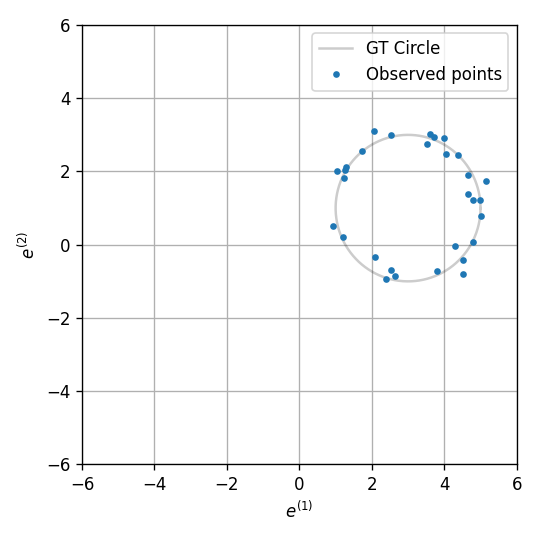
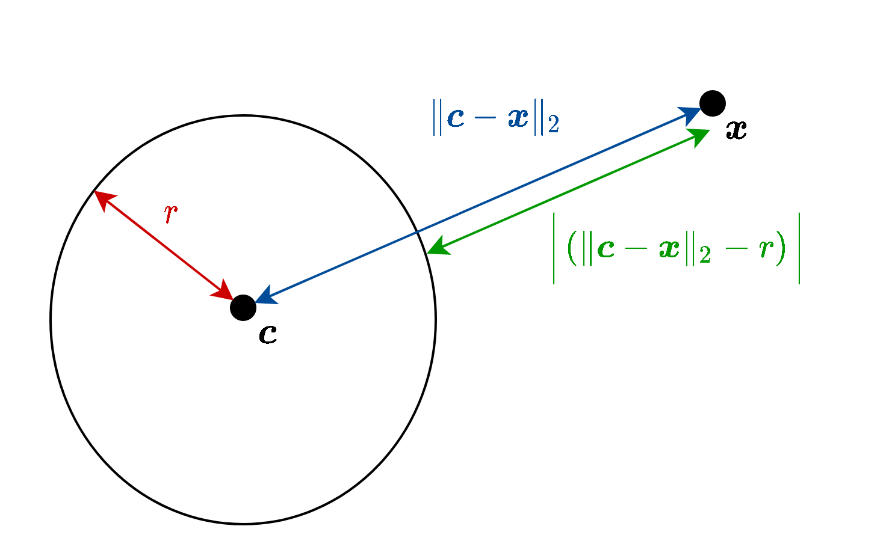
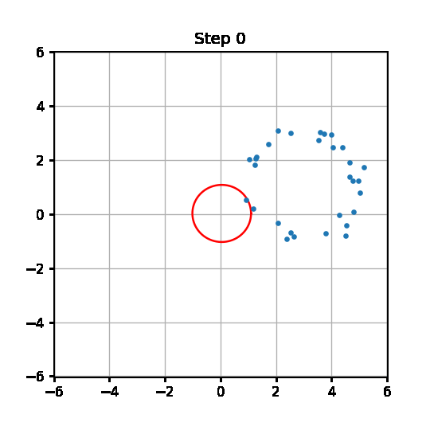

# תרגול 1 - בעיות אופטימיזציה וגזירה וקטורית

<a href="../tutorial01_optimization_code.html" class="link-button">Code</a>

## הקדמה

מרבית הבעיות והשיטות בתחום של מערכות לומדות עוסקות בבעיה של התאמת מודל מתמטי כך שיתאר בצורה מיטבית תופעה או תהליך מסויים על סמך אוסף נתון של תצפיות / מדידות. בהרצא הראשונה נציג את התחום באופן מפורט יותר, אך לעת אתה הגדרה זו תספק אותנו.

לצורך המחשה נסתכל על הדוגמא הבאה. נניח ונתונים לנו מספר מדידות של נקודות שיושבות על מעגל בעל מרכז ורדיוס לא ידועים. בנוסף נניח ותהליך המדידה עצמו רועש ואנו מקבלים גירסאות מורעשות של הנקודות כפי שמודגם בשרטוט הבא:

מקובל להשתמש בשם בשם **ground truth**, או בקיצור **GT**, כדי להתייחס למודל המקורי (הלא ידוע).

כעת נניח ואנו מעוניינים לשחזר את הפרמטרים של המעגל המקורי על פי הדגימות שבידינו.  הבעיה של התאמת בעיה כדוגמאת זו, של מעגל לאוסף נקודות, מופיעה באלגוריתמי eye-tracking אשר מנסים לעקוב אחרי המיקום של האישון על מנת להבין מהו הכיוון שאליו אדם מביט.

נציין שהבעיה הזו לא מאד מייצגת ונחשבת ליחסית פשוטה בהשוואה לבעיות הטיפוסיות שאותם מנסים לפתור בתחום של מערכות לומדות , אך עם זאת היא תשמש כדוגמא טובה לעקרונות שבהם נעסוק בתרגול הנוכחי.

### פערים מתמטיים

לפני שנוכל לצלול לחומר העיקרי של הקורס עלינו להתחיל בהשלמה ורענון של הבסיס המתימטי אשר ישמש אותנו לתורך ניסוח הפתרון של הבעיות בהם נעסוק בקורס. ספציפית אנו נעשה שימוש ב:

- *אלגברה לינארית*: על מנת לתאר את המידע שהמודלים שאיתם נעבוד.
- *הסתברות*: על מנת לתאר את האופן שבו נוצרים המדידות ובכדי לתאר את מידת הסבירות שבה מודל מסווים מתאים לתצפיות.
- *תורת האופטימיזציה*: על מנת למצוא את המודלים אשר מתאימים באופן מיטבי לדגימות שבידינו.

בתרגול הנוכחי נתעסק בבעיות אופטימיזציה סקלריות ווקטוריות ובתרגול הבא נוסיף את לכך את ההיבט ההיסתברותי.

### נוטציות

בקרוס זה נצמד לנוטציות המתמטיות המופיעות בספר [Deep Learning (מאת I. Goodfellow, Y. Bengio & A. Courville)](https://www.deeplearningbook.org/). ניתן למצוא את הפירוט המלא ב[קישור הבא](https://www.deeplearningbook.org/contents/notation.html). (למתקדמים: ניתן למצוא את פקודות ה$LaTeX$ הרלוונטיות [כאן](https://github.com/goodfeli/dlbook_notation))

### אלגברה לינארית

בהתאם להגדרות אלו אנו נשתמש בסימונים הבאים בהקשר של אלגברה לינארית:

- $x$ - אותיות סטנדרטיות (italic lower case) לועזיות או יווניות - סקלרים.

<!-- -->

- $\boldsymbol{x}$ - אותיות מודגשות - וקטורי **עמודה**
- $\boldsymbol{x}^\top$ - וקטורי **שורה**
- $x_i$ - האיבר ה$i$ בוקטור $\boldsymbol{x}$.
- (בכתב יד נשתמש בחץ (במקום באותיות מדגשות) בכדי לסמן וקטורים: $\vec{x}$).

<!-- -->

- $\langle\boldsymbol{x},\boldsymbol{y}\rangle(=\boldsymbol{x}^\top\boldsymbol{y}=\sum_i x_iy_i)$ - המכפלה הפנימית הסטנדרטית בין $\boldsymbol{x}$ ל $\boldsymbol{y}$.
- $\|\boldsymbol{x}\|_2(=\sqrt{\langle\boldsymbol{x},\boldsymbol{x}\rangle})$- הנורמה הסטנדרטית (נורמת $l2$) של הוקטור $\boldsymbol{x}$.
- $\|\boldsymbol{x}\|_l(=\sqrt[l]{\sum_i x_i^l})$ - נורמת $l$ של $\boldsymbol{x}$

<!-- -->

- $\boldsymbol{A}$ - אותיות לועזיות גדולות מודגשות (bold capittal) - מטריצה
- $\boldsymbol{A}^\top$ - המטריצה Transposed $\boldsymbol{A}$ (המטריצה המשוחלפת).
- $A_{i,j}$ - האיבר ה$j$ שורה ה$i$ של $\boldsymbol{A}$.
- $A_{i,:}$ - השורה ה$i$ של $\boldsymbol{A}$.
- $A_{:,i}$ - העמודה ה$i$ של $\boldsymbol{A}$.

### Sets (קבוצות)

את סדרת התצפיות אנו נסמן כקבוצה (או סדרה) בעזרת הנוטציות הבאות:

- $\{\boldsymbol{x}^{(1)},\boldsymbol{x}^{(2)},\ldots,\boldsymbol{x}^{(n)}\}$ - סדרה של $n$ וקטורים.

## בעיית האופטימיזציה

נחזור לדוגמא של התאמת המעגל. דרך אחת לגשת לבעיה מסוג זה הינה לחפש מבין כל המעגלים האפשריים את המעגל אשר המרחק הריבועי הממוצע (MSE - mean squered error) של הדגימות ממנו היא המינימאלית (בהמשך הקורס אנו ניתן הצדקה מתימטית לשימוש במדד שגיאה זה). נרשום זאת באופן מתמטי.

נרשום תחילה את המרחק של נקודה בודדת $\boldsymbol{x}$ ממעגל בעל מרכז ב $\boldsymbol{c}$ ורדיוס $r$. מרחק זה שווה להפרש בין המרחק בין $\boldsymbol{x}$ ל $\boldsymbol{c}$ והרדיוס, כפי שמופיע בשרטוט הבא:

נסמן את הריבוע של מרחק זה ב $e$:

$$
e=(\|\boldsymbol{x}-\boldsymbol{c}\|_2-r)^2
$$

אם כן בעבור $n$ נקודות, $\{\boldsymbol{x}^{(1)},\boldsymbol{x}^{(2)},\ldots,\boldsymbol{x}^{(n)}\}$, המרחק הריבועי הממוצע (MSE) של הנקודות מהמעגל הינו:

$$
\frac{1}{n}\sum_{i=1}^n e_i=\frac{1}{n}\sum_{i=1}^n (\|\boldsymbol{x}^{(i)}-\boldsymbol{c}\|_2-r)^2
$$

מצאנו אם כן למעשה מדד טיב אשר מאפשר לנו לתת "ציון" לכל מעגל כתלות ב $\boldsymbol{c}$ ו $r$. נסמן את הפונקציה הזו כ:

$$
f(\boldsymbol{c},r)=\frac{1}{n}\sum_{i=1}^n (\|\boldsymbol{x}^{(i)}-\boldsymbol{c}\|_2-r)^2
$$

כעת, אם ברצונינו למצוא עלינו למצוא את המעגל ה**אופטימאלי**, עלינו למצוא את הפרמטרים $\boldsymbol{c}$ ו $r$ אשר מניבים את הערך הנמוך ביותר של $f$. מקובל לסמן את הפרמטרים האופטימאליים בעזרת $*$ באופן הבא: $\boldsymbol{c}^*$ ו$r^*$.

בעיות מסוג זה הם בדיוק סוגי הבעיות שתורת האופטימיזציה באה לפתור. לבנתיים נשים בצד את הפונקציה הזו ונחזור אליה לקראת סוף התרגול.

### המקרה הפשוט

בעיות אופטימיזציה עוסקות במציאת הארגומנט $\theta$ שבעבורו פונקציה נתונה $f(\theta)$ מחזירה את הערך המינימאלי או המקסימאלי שלה. לרוב מקובל לנסח בעיות אופטימיזציה כבעיות **minimization** (מזעור), כאשר ניתן כמובן לרשום כל בעיית **maximization** כבעיית minimization של $\tilde{f}(\theta)=-f(\theta)$. כמו כן, את פונקציה  $f(\theta)$ שאותה מנסים למזער (למקסם) נהוג לכנות ה**objective** או פונקציית המטרה. באופן פורמלי, בעיות אופטימיזציה נרשמות באופן הבא:

$$
\theta^*=\underset{\theta}{\arg\min}\quad f(\theta)
$$

### פונקציות מרובות משתנים

 בעיות אופטימיזציה כמובן לא מוגבלות רק לפונקציות של משתנה יחיד וכמו בדוגמא של המעגל, ניתן להסתכל גם על הבעיה של מציאת סט הערכים האופטימאליים $\theta_1^*,\theta_2^*,\ldots,\theta_d^*$ שממזערים פונקציה של מספר משתנים $f(\theta_1,\theta_2,\ldots,\theta_d)$:

$$
\theta_1^*,\theta_2^*,\ldots,\theta_d^*=\underset{\theta_1,\theta_2,\ldots,\theta_d}{\arg\min}\quad f(\theta_1,\theta_2,\ldots,\theta_d)
$$

במקרים רבים נוח יותר לאגד את כל הארגומנטים של $f$ לוקטור אחד $\boldsymbol{\theta}=[\theta_1,\theta_2,\ldots,\theta_d]^\top$ ולרשום את בעיית האופטימזציה כ:

$$
\boldsymbol{\theta}^*=\underset{\boldsymbol{\theta}}{\arg\min}\quad f(\boldsymbol{\theta})
$$

### שיטות לפתרון בעיות אופטימיזציה

 בעיות אופטימיזציה הם למעשה חלק מהתהליך של חקירת פונקציה אשר נלמד בחדו"א 1 ובתיכון, שם מצאנו נקודות הקיצון על ידי גזירה והשוואה ל-0. שיטה זו טובה למקרים פשוטים בהם המשוואה $\nabla f(\boldsymbol{\theta})=0$ ניתנת לפתרון באופן אנליטי, אך במקרים רבים זהו אינו המצב ויש צורך להשתמש בשיטות נומריות על מנת לפתור את הבעיה.

 התחום של תורת האופטימיזציה הוא רחב והוא מציע מגוון רחב של שיטות כאלה המתאימות לפונקציות מטרה שונות. בפועל בקורס זה לא נצלול לעומקו של תחום זה, ולמעשה נפתור בעיות מסוג זה בעזרת אחת משלושת השיטות הבאות::

- **גזירה והשוואה ל0**: מתאים למקרים בהם ניתן לפתור את $\nabla f(\boldsymbol{\theta})=0$ באופן אנליטי.
- **Brute force** (מעבר על כל האופציות): מתאים למקרים בהם הארגומנט של $f$ לקבל רק אחד מסט ערכים סופי וקטן, לדוגמא $\theta\in\{0,1,\ldots,10\}$.
- **Gradient descent** (שיטת הגרדיאנט): זוהי אחת משיטות האופטימיזציה הבסיסיות ביותר. בשיטה זו מחפשים מינימום לוקאלי על ידי התקדמות בכיוון ההפוך מהגרדיאנט. בתרגול זה אנחנו נדגים כיצד להשתמש בה.

### בעיית אופטימזציה עם אילוצים

נשים לב שבדוגמא של התאמת המעגל, ישנו אילוץ מסויים על הפרמטרים של המעגל, רדיוס המעגל חייב להיות מספר חיובי. מגבלות מסוג זה מכונות אילוצים והם מופיעים בבעיות אופטימיזציה רבות. באופן כללי, בעיות אופטימיזציה יכולות להכיל איצלוצים משני סוגים:

- אילוצי אי-שוויון מהצורה $g(\boldsymbol{\theta})\geq0$. 
  לדוגמא, האילוץ שכל הערכים של $\boldsymbol{\theta}$ יהיו קטנים מ$1$, יופיע בתור:

  $$
  g_i(\boldsymbol{\theta})=1-\theta_i\geq0\qquad i=1,\ldots,d
  $$

- אילוצי שוויון מהצורה $h(\boldsymbol{\theta})=0$. 
  לדוגמא האילוץ שהנורמה של $\boldsymbol{\theta}$ תהיה שווה ל1, יופיע בתור:

  $$
  h(\boldsymbol{\theta})=\|\boldsymbol{\theta}\|_2-1=0
  $$

אם כן הצורה הכללית ביותר של בעיית אופטימיזציה הינה:

$$
\begin{aligned}
\boldsymbol{\theta}^*=&\underset{\boldsymbol{\theta}}{\arg\min}\quad f(\boldsymbol{\theta}) \\
&\begin{aligned}
\text{subject to}\quad
& g_i(\boldsymbol{\theta})\leq 0,\qquad i=1,\ldots,m \\
& h_j(\boldsymbol{\theta})=0,\qquad j=1,\ldots,p
\end{aligned}
\end{aligned}
$$

בתרגיל הבא נראה כיצד ניתן להתמודד עם אילוצים פשוטים ובהמשך הקורס נתייחס גם למקרים בהם האילוצים נעשים מסובכים יותר.

## תרגיל 1.1 - בעיית אופטימיזציה עם אילוצים

נרצה למצוא את הערך המקסימאלי של הפונקציה

$$
f(\theta_1, \theta_2)=f(\boldsymbol{\theta})=e^{-(3\theta_1^2+3\theta_2^2-18\theta_1-24\theta_2+34)}
$$

תחת האילוץ ש $\boldsymbol{\theta}$ נמצא בתוך או על השפה של מעגל היחידה (במישור של $\theta_1-\theta_2$).

רשמו את בעיית האופטימיזציה ומצאו את פתרונה.

### פתרון 1.1

##### רישום בעיית האופטימיזציה

הבעיה הנתונה הינה בעיית אופטימיזציה עם אילוץ אי-שיוון אחד. נרשום אותה באופן פורמלי:

$$
\begin{aligned}
&\underset{\boldsymbol{\theta}=[\theta_1,\theta_2]^\top}{\arg\min}\quad -e^{-(3\theta_1^2+3\theta_2^2-18\theta_1-24\theta_2+34)} \\
&\text{subject to}\quad
1-(\theta_1^2+\theta_2^2)\geq 0
\end{aligned}
$$

##### החלפת פונקציית המטרה

ראשית נשים לב כי ניתן לפשט את הבעיה על ידי השימוש בעובדה ש$e^x$ היא פונקציה מונוטונית עולה ולכן נוכל לבצע את ההחלפה הבאה מבלי לשנות את תוצאת בעיית האופטימיזציה:

$$
\begin{aligned}
&\underset{\theta_1,\theta_2}{\arg\min}\quad -e^{-(3\theta_1^2+3\theta_2^2-18\theta_1-24\theta_2+34)} \\
=&\underset{\theta_1,\theta_2}{\arg\min}\quad 3\theta_1^2+3\theta_2^2-18\theta_1-24\theta_2+34
\end{aligned}
$$

באופן דומה נוכל גם להיפתר מהתוספת של הקבוע ($+34$) וגם לחלק את פונקציית המטרה 3, ולקבל את בעיית האופטימיזציה הבאה:

$$
=\underset{\theta_1,\theta_2}{\arg\min}\quad \theta_1^2+\theta_2^2-6\theta_1-8\theta_2
$$

##### טיפול באילוץ אי-השוויון

במקרים כגון זה, בהם מספר אילוצי אי-השוויון קטן (במקרה זה יש אילוץ בודד) נוכל לפרק כל אילוץ שוויון לשני מקרים פשוטים יותר.

1. המקרה בו המינימום נמצא על השפה של האילוץ (בתרגיל זה, זאת אומרת שהמינימום נמצאת ממש על מעגל היחידה). במקרה זה האילוץ הופך לאילוץ שוויון.
2. המקרה זו המינימום לא נמצא על השפה של האילוץ. במקרה זה נחפש נקודות מינימום לוקאליות תוך התעלמות מהאילוץ ואחר כך נבדוק מי מהם מקיימת את האילוץ (אם בכלל יש נקודה כזו).

הפתרון יהיה הפתרון הנמוך יותר מבין השתיים. (כאשר יש יותר מאילוץ אי-שוויון יחיד צריך לפרק את כל אילוצי אי השוויון לשני מקרים. זאת אומרת, שכמות המקרים שיש לבדוק הינה 2 בחזקת מספר אילוצי אי-השוויון).

##### החיפוש בתוך מעגל היחידה

נתחיל במציאת המינימום בחלקו הפנימי של העיגול. תחילה נתעלםמהאילוץ נחפש את כל נקודות המינימום (לוקאליות או גלובליות) של הבעיה. אחר כך נפסול את אלו שלא מקיימות את האילוץ. בעיית האופטימיזציה ללא האילוץ הינה:

$$
\underset{\theta_1,\theta_2}{\arg\min}\quad \theta_1^2+\theta_2^2-6\theta_1-8\theta_2
$$

בעיה זו ניתנת לפתרון בקלות על ידי גזירה והשוואה ול0:

$$
\begin{aligned}
&\left\{\begin{aligned}
\frac{d}{d\theta_1}\theta_1^2+\theta_2^2-6\theta_1-8\theta_2=0 \\
\frac{d}{d\theta_2}\theta_1^2+\theta_2^2-6\theta_1-8\theta_2=0 \\
\end{aligned}\right.\\
\Leftrightarrow&(\theta_1,\theta_2)=(3,4)
\end{aligned}
$$

נקודה זו אומנם חשודה כנקודת קיצון אך היא לא מקיימת את האילוץ ולכן היא אינה יכול להיות פתרון לבעיה. נוכל להסיק אם כן שאין נקודות מינימום בתוך המעגל ולכן נקודת המינימום תהיה חייבת להימצא על השפה.

##### החיפוש על מעגל היחידה

על השפה אילוץ האי-השוויון הופך לשוויון:

$$
\begin{aligned}
&\underset{{\theta}=[\theta_1,\theta_2]^\top}{\arg\min}\quad \theta_1^2+\theta_2^2-6\theta_1-8\theta_2 \\
&\text{subject to}\quad
1-(\theta_1^2+\theta_2^2)=0
\end{aligned}
$$

בהמשך הקורס נלמד שיטה מסודרת לפתרון בעיות אופטימיזציה עם אילוצי שוויון כגון זו, אך לבנתיים נתאר כאן פתרון חליפי אשר משתמש בניסוח מחד של הבעיה (השיטה שמוצגת כאן לא רלוונטית להבנת החומר מופיעה פה רק לשם השלמות).

הדרך בה נימצא את המינימום על המעגל הינה על ידי החלפת הבעיה הנתונה בבעיית אופטימיזציה של משתנה יחיד ללא אילוצים. אנו נשתמש באילוץ (התנאי שהנקודה תמצא על מעגל היחידה) על מנת לבטא את $\theta_2$ בעזרת $\theta_1$ ורישום מחדש של פונקציית המטרה כפונקציה של $\theta_1$ בלבד.

מתוך האילוץ נקבל ש:

$$
\begin{aligned}
&1-(\theta_1^2+\theta_2^2)=0 \\
\Leftrightarrow&\theta_2=\pm\sqrt{1-\theta_1^2}
\end{aligned}
$$

כאשר עלינו לבדוק את שני המקרים כאשר $\theta_2$ חיובי (החלק העליון של מעגל היחידה) וכשאר הוא שלילי (החלק התחתון). לאחר ההחלפה נקבל את שני בעיות האופטימיזציה הבאות (המקרה החיובי והשלילי):

$$
\begin{aligned}
&\underset{\theta_1}{\arg\min}\quad \theta_1^2+(1-\theta_1^2)-6\theta_1\pm8\sqrt{1-\theta_1^2}\\
=&\underset{\theta_1}{\arg\min}\quad 1-6\theta_1\pm8\sqrt{1-\theta_1^2}\\
=&\underset{\theta_1}{\arg\min}\quad -3\theta_1\pm4\sqrt{1-\theta_1^2}
\end{aligned}
$$

נפתור את את הבעיות האלה על יד גזירה והשוואה ל0:

$$
\begin{aligned}
&\frac{d}{d\theta_1} -3\theta_1\pm4\sqrt{1-\theta_1^2}=0 \\
\Leftrightarrow&-3\pm4\frac{\theta_1}{\sqrt{1-\theta_1^2}}=0 \\
\Leftrightarrow&\pm\tfrac{4}{3}\theta_1=\sqrt{1-\theta_1^2} \\
\Rightarrow&\tfrac{16}{9}\theta_1^2=1-\theta_1^2 \\
\Leftrightarrow&\theta_1^2=\tfrac{9}{25} \\
\Leftrightarrow&\theta_1=\pm\tfrac{3}{5} \\
\Leftrightarrow&(\theta_1,\theta_2)=(\pm\tfrac{3}{5},\pm\tfrac{4}{5})
\end{aligned}
$$

על ידי בדיקה של הערכים שמניבים ארבעת הנקודות האלה מוצאים כי המינימום הגלובלי של פונקציית המטרה מתקבל במקרה של $(\theta_1,\theta_2)=(\tfrac{3}{5},\tfrac{4}{5})$. 

## סקלרים, וקטורים מטריצות ונגזרות

במהלך הקורס אנו נתקל פעמים רבות בצורך לחשב נגזרות המערבות וקטורים ומטריצות. נזכיר / נסביר בקצרה של כיצד נזגרת אלו מחושבות. נתחיל במקרה המוכר של הגרדיאנט, בו אנו מבצעים גזירה של פונקציה סקלרית לפי וקטור. לאחר מכאן נראה כיצד הגדרה זו מורחבת גם למקרים נוספים בהם הפונקציה לא בהכרח סקלרית והגזירה היא לא בהכרח לפי וקטור.

בעבור פונקציה $f(\boldsymbol{x})$ אשר מקבלת וקטור $\boldsymbol{x}$ באורך $d$ ומחזירה סקלר, פעולת הגרדיאנט מוגדרת באופן הבא:

$$
\nabla_{\boldsymbol{x}} f(\boldsymbol{x})
=\frac{d}{d\boldsymbol{x}} f(\boldsymbol{x})
=\begin{bmatrix}
\frac{d}{dx_1}f(\boldsymbol{x}) \\ \frac{d}{dx_2}f(\boldsymbol{x}) \\ \vdots \\ \frac{d}{dx_d}f(\boldsymbol{x})
\end{bmatrix}
$$

לדוגמא:

$$
\frac{d}{d\boldsymbol{x}}(\boldsymbol{a}^\top\boldsymbol{x})
=\frac{d}{d\boldsymbol{x}}(\sum_{i=1}^d a_ix_i)
=\begin{bmatrix}
\frac{d}{dx_1}(\sum a_ix_i) \\ \frac{d}{dx_2}(\sum a_ix_i) \\ \vdots \\ \frac{d}{dx_d}(\sum a_ix_i)
\end{bmatrix}
=\begin{bmatrix}
a_1 \\ a_2 \\ \vdots \\ a_d
\end{bmatrix}
=\boldsymbol{a}
$$

נסתכל כעת על מקרה מעט יותר מורכב בו אנו רוצים לגזור פונקציה וקטורית $\boldsymbol{f}(\boldsymbol{x})$ אשר מקבלת וקטור $\boldsymbol{x}$ באורך $d$ ומחזירה וקטור באורך $n$:

$$
\frac{d}{d\boldsymbol{x}} \boldsymbol{f}(\boldsymbol{x})=
\begin{bmatrix}
| && | && && | \\
\frac{d}{dx_1}\boldsymbol{f}(\boldsymbol{x}) && \frac{d}{dx_2}\boldsymbol{f}(\boldsymbol{x}) && \cdots && \frac{d}{dx_d}\boldsymbol{f}(\boldsymbol{x}) \\
| && | && && |
\end{bmatrix}
$$

שימו לב שהתוצאה של הגזירה הינה מטריצה בגודל $n\times d$. באופן כללי, הגדול תוצאת פעולת הגזירה יהיה תמיד הגודל של האובייקט שאותו גוזרים בתוספת הגודל של האיבר שלפיו אנו מבצעים את הגזירה. דוגמאות:

- תוצאת הגזירה של מטריצה בגודל $n\times m$ לפי וקטור באורך $d$ תהיה טנזור בגודל $n\times m\times d$.
- תוצאת הגזירה של סקלאר לפי מטריצה בגודל $n\times m$ תהיה מטריצה בגודל $n \times m$.
- תוצאת הגזירה של מטריצה בגודל $n\times m$ לפי מטריצה בגודל $o\times p$ תהיה טנזור בגודל $n\times m\times o\times p$.

למורת חשוב להבין כיצד נגזרות אלו מודרות ומחושבות, בפועל אנחנו כמעט ולא ניתקל בצורך לחשב אותם על פי ההגדרה. במרבית המקרים, הנגזרות בהם ניתקל יבואו מתוך קבוצה מצומצמת של נגזרות מוכרות (או הרכבה שלהם עם פונקציות אחרות) ונוכל להשתמש בתוצאות מוכרות ולחסוך עבודה מיותרת. ניתן למצוא רשימה של נגזרות בדף הנוסחאות של הקורס.

## תרגיל 1.2 - תרגיל בנגזרות

חשבו את הנגזרות הבאות:

**1)** $\frac{d}{d\boldsymbol{x}}\|\boldsymbol{x}\|_2^2$.

**2)** $\frac{d}{d\boldsymbol{x}}\|\boldsymbol{x}\|_2$. הנחיה: השתמש בכלל השרשרת

**3)** $\frac{d}{d\boldsymbol{x}}(\boldsymbol{x}^\top\boldsymbol{A}\boldsymbol{x})$.

**4)** $\frac{d}{d\boldsymbol{A}}(\boldsymbol{x}^\top\boldsymbol{A}\boldsymbol{x})$.

### פתרון 1.2

#### 1)

$$
\frac{d}{d\boldsymbol{x}}\|\boldsymbol{x}\|_2^2
=\frac{d}{d\boldsymbol{x}}(\boldsymbol{x}^\top\boldsymbol{x})
=\frac{d}{d\boldsymbol{x}}(\sum_{i=1}^d x_i^2)
=\begin{bmatrix}
\frac{d}{dx_1}(\sum x_i^2) \\ \frac{d}{dx_2}(\sum x_i^2) \\ \vdots \\ \frac{d}{dx_d}(\sum x_i^2)
\end{bmatrix}
=\begin{bmatrix}
2x_1 \\ 2x_2 \\ \vdots \\ 2x_d
\end{bmatrix}
=2\boldsymbol{x}
$$

#### 2)

נסמן $h(\boldsymbol{x})=\|\boldsymbol{x}\|_2^2$ ונשים לב ש $\|\boldsymbol{x}\|_2=\sqrt{h(\boldsymbol{x})}$. כמו כן נשתמש בעובדה שאת הנגזרת של $h(\boldsymbol{x})$ כבר חישבנו בסעיף הקודם:

$$
\frac{d}{d\boldsymbol{x}}\|\boldsymbol{x}\|_2
=\frac{d}{d\boldsymbol{x}}\sqrt{h(\boldsymbol{x})}
=\frac{1}{2\sqrt{h(\boldsymbol{x})}}\cdot\frac{d}{d\boldsymbol{x}}h(\boldsymbol{x})
=\frac{\boldsymbol{x}}{\sqrt{h(\boldsymbol{x})}}
$$

#### 3)

נגזור על פי הגדרה:

$$
\begin{aligned}
\frac{d}{d\boldsymbol{x}}(\boldsymbol{x}^\top\boldsymbol{A}\boldsymbol{x})
&=\frac{d}{d\boldsymbol{x}}(\sum_{i,j} a_{i,j}x_ix_j)
=\begin{bmatrix}
\frac{d}{dx_1}(\sum_{i,j} a_{i,j}x_ix_j) \\ \frac{d}{dx_2}(\sum_{i,j} a_{i,j}x_ix_j) \\ \vdots \\ \frac{d}{dx_d}()\sum_{i,j} a_{i,j}x_ix_j
\end{bmatrix}
=\begin{bmatrix}
\sum_i a_{i,1}x_i+\sum_j a_{1,j}x_j \\ \sum_i a_{i,2}x_i+\sum_j a_{2,j}x_j \\ \vdots \\ \sum_i a_{i,d}x_i+\sum_j a_{d,j}x_j
\end{bmatrix} \\
&=\begin{bmatrix}
\boldsymbol{A}_{:,1}^\top\boldsymbol{x}+\boldsymbol{A}_{1,:}\boldsymbol{x} \\ \boldsymbol{A}_{:,2}^\top\boldsymbol{x}+\boldsymbol{A}_{2,:}\boldsymbol{x} \\ \vdots \\ \boldsymbol{A}_{:,d}^\top\boldsymbol{x}+\boldsymbol{A}_{d,:}\boldsymbol{x}
\end{bmatrix}
=\boldsymbol{A}^\top\boldsymbol{x}+\boldsymbol{A}\boldsymbol{x}
=(\boldsymbol{A}^\top+\boldsymbol{A})\boldsymbol{x}
\end{aligned}
$$

#### 4)

נגזור על פי הגדרה:

$$
\begin{aligned}
\frac{d}{d\boldsymbol{A}}(\boldsymbol{x}^\top\boldsymbol{A}\boldsymbol{x})
&=\frac{d}{d\boldsymbol{A}}(\sum_{i,j} a_{i,j}x_ix_j)\\
&=\begin{bmatrix}
\frac{d}{da_{1,1}}(\sum_{i,j} a_{i,j}x_ix_j) && \frac{d}{da_{1,2}}(\sum_{i,j} a_{i,j}x_ix_j) && \cdots && \frac{d}{da_{1,d}}(\sum_{i,j} a_{i,j}x_ix_j) \\
\frac{d}{da_{2,1}}(\sum_{i,j} a_{i,j}x_ix_j) && \frac{d}{da_{2,2}}(\sum_{i,j} a_{i,j}x_ix_j) && \cdots && \frac{d}{da_{2,d}}(\sum_{i,j} a_{i,j}x_ix_j) \\
\vdots && \vdots && \ddots && \vdots \\
\frac{d}{da_{d,1}}(\sum_{i,j} a_{i,j}x_ix_j) && \frac{d}{da_{d,2}}(\sum_{i,j} a_{i,j}x_ix_j) && \cdots && \frac{d}{da_{d,d}}(\sum_{i,j} a_{i,j}x_ix_j)
\end{bmatrix} \\
&=\begin{bmatrix}
x_1x_1 && x_1x_2 && \cdots && x_1x_d \\
x_2x_1 && x_2x_2 && \cdots && x_2x_d \\
\vdots && \vdots && \ddots && \vdots \\
x_dx_1 && x_dx_2 && \cdots && x_dx_d
\end{bmatrix}
=\boldsymbol{x}\boldsymbol{x}^\top
\end{aligned}
$$

## תרגיל 1.3 - בחזרה לבעיית המעגל

נחזור לפונקציית ה"ציון" של מידת ההתאמה של מעגל לנקודות מהדוגמא בתחילת התרגול.

$$
f(\boldsymbol{c},r)=\frac{1}{n}\sum_{i=1}^n (\|\boldsymbol{x}^{(i)}-\boldsymbol{c}\|_2-r)^2
$$

חשבו את הנגזרות של פונקציה זו: $\nabla_{\boldsymbol{c}}f$ ו $\frac{d}{dr}f$.
(לצורך החישוב של $\nabla_{\boldsymbol{c}}f$ השתמשו בשיטה דומה לזו שהופיע בסעיף 2 של השאלה הקודמת)

### פתרון 1.3

נתחיל בגזירה לפי $r$:

$$
\frac{d}{dr}f(\boldsymbol{c},r)
=\frac{2}{n}\sum_{i=1}^n (r-\|\boldsymbol{x}^{(i)}-\boldsymbol{c}\|_2)
$$

על פי ההנחיה, לצורך הגזירה לפי $\boldsymbol{c}$ נסמן את פונקציית העזר $h(\boldsymbol{x},\boldsymbol{c})=\|\boldsymbol{x}-\boldsymbol{c}\|_2^2$ בעזרתה נוכל לרשום את $f$ כ:

$$
f(\boldsymbol{c},r)=\frac{1}{n}\sum_{i=1}^n (\sqrt{h(\boldsymbol{x^{(i)}},\boldsymbol{c})}-r)^2
$$

נחשב תחילה את הנגזרת של  $h(\boldsymbol{x},\boldsymbol{c})$:

$$
\begin{aligned}
\frac{d}{d\boldsymbol{c}}h(\boldsymbol{x},\boldsymbol{c})
&=\frac{d}{d\boldsymbol{c}}\|\boldsymbol{x}-\boldsymbol{c}\|_2^2 \\
&=\frac{d}{d\boldsymbol{c}}(\boldsymbol{x}-\boldsymbol{c})^\top(\boldsymbol{x}-\boldsymbol{c}) \\
&=\frac{d}{d\boldsymbol{c}}(\|\boldsymbol{x}\|_2^2-2\boldsymbol{c}^\top\boldsymbol{x}+\|\boldsymbol{c}\|_2^2) \\
&=2(\boldsymbol{c}-\boldsymbol{x})
\end{aligned}
$$

נשתמש כעת בתוצאה זו על מנת לחשב את הנגזרת הכוללת:

$$
\begin{aligned}
\frac{d}{d\boldsymbol{c}}f(\boldsymbol{c},r)
&=\frac{2}{n}\sum_{i=1}^n (\sqrt{h(\boldsymbol{x}^{(i)},\boldsymbol{c}})-r))
\cdot\left(\frac{d}{dh(\boldsymbol{x}^{(i)})}\sqrt{h(\boldsymbol{x}^{(i)},\boldsymbol{c}})\right)
\cdot\frac{d}{d\boldsymbol{x}}h(\boldsymbol{x}^{(i)})\\
&=\frac{2}{n}\sum_{i=1}^n (\sqrt{h(\boldsymbol{x}^{(i)},\boldsymbol{c}})-r))
\frac{1}{\sqrt{h(\boldsymbol{x}^{(i)},\boldsymbol{c}})}
(\boldsymbol{c}-\boldsymbol{x}^{(i)})\\
&=\frac{2}{n}\sum_{i=1}^n (r-\|\boldsymbol{x}^{(i)}-\boldsymbol{c}\|_2)\frac{\boldsymbol{x}^{(i)}-\boldsymbol{c}}{\|\boldsymbol{x}^{(i)}-\boldsymbol{c}\|_2}
\end{aligned}
$$

## Gradient descent (שיטת הגרדיאנט)

כפי שציינו קודם, במקרים רבים לא נוכל פתור את בעיות האופטימיזציה על ידי גזירה והשוואה ל0 ונאלץ לעשות שימוש בשיטות נומריות. נתאר כאן בקצרה את שיטת ה**gradient descent** (שיטת הגרדיאנט) שהיא אחת השיטות הבסיסיות ביותר אשר מנסה לפתור את בעיות מסוג זה. אנו עוד נדון בהמשך הקורס בהרחבה בתכונות ובבעיות הקיימות בשיטה זו, אך בשלב זה נסתפק בלתאר את אופן פעולתה.

הרעיון מאחורי שיטה זו הינו להתחיל בנקודה אקראית כל שהיא במרחב ולהתחיל לזוז בצעדים קטנים לכיוון שבו פונקציית המטרה קטנה באופן המהיר ביותר. הכיוון הזה הוא כמובן הכיוון ההפוך לגרדיאנט של הפונקציה. זהו אלגוריתם חמדן (greedy) אשר מנסה בכל צעד לשפר במעט את מצבו ביחס לשלב הקודם. אלגוריתמים מסוג זה מתכנסים לרוב למינימום לוקאלי ולא למינימום הגלובלי של הפונקציה. האלגוריתם זה רחוק מלתת מענה מושלם לבעיה, אך במקרים רבים הוא מצליח לספק פתרון סביר.

### האלגוריתם

- מאתחלים את $\boldsymbol{\theta}^{(0)}$ בנקודה אקראית כל שהיא
- חוזרים על צעד העדכון הבא עד להתכנסות:

  $$
  \boldsymbol{\theta}^{(t+1)}=\boldsymbol{\theta}^{(t)}-\eta \nabla_{\boldsymbol{\theta}}f(\boldsymbol{\theta}^{(t)})
  $$

הפרמטר $\eta$ אשר קובע את גודל הצעדים אשר נעשה בתהליך ההתכנסות. (את הדיון על קריטריון ההתכנסות ועל הבחירת של  $\eta$ נשאיר לשלב מאוחר יותר)

## תרגיל 1.4 - Gradient descent for circle fitting

רשומו את צעד העדכון של אלגורתם הgradient descent בעבור המקרה של התאמת העיגול.

### פתרון 1.4

על פי הנגזרת שחיבנו בתרגיל 1.3 נסיק כי צעד העדכון הוא:

$$
\begin{aligned}
r^{(t+1)}&=r^{(t)}-\frac{2\eta}{n}\sum_{i=1}^n (r^{(t)}-\|\boldsymbol{x}^{(i)}-\boldsymbol{c}^{(t)}\|_2)\\
\boldsymbol{c}^{(t+1)}&=\boldsymbol{c}^{(t)}-\frac{2\eta}{n}\sum_{i=1}^n (r^{(t)}-\|\boldsymbol{x}^{(i)}-\boldsymbol{c}^{(t)}\|_2)\frac{\boldsymbol{x}^{(i)}-\boldsymbol{c}^{(t)}}{\|\boldsymbol{x}^{(i)}-\boldsymbol{c}^{(t)}\|_2}
\end{aligned}
$$

### הרצה של האלגוריתם

למטה מוצג תהליך ההתכנסות של אלגוריתם הגרדיאנט בעבור $\eta=0.01$ ו 500 צעדים כאשר מתחילים את התהליך ממעגל היחידה:

