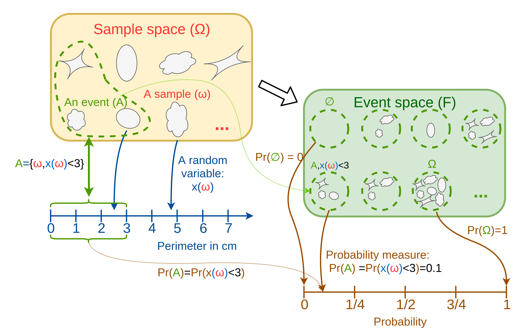
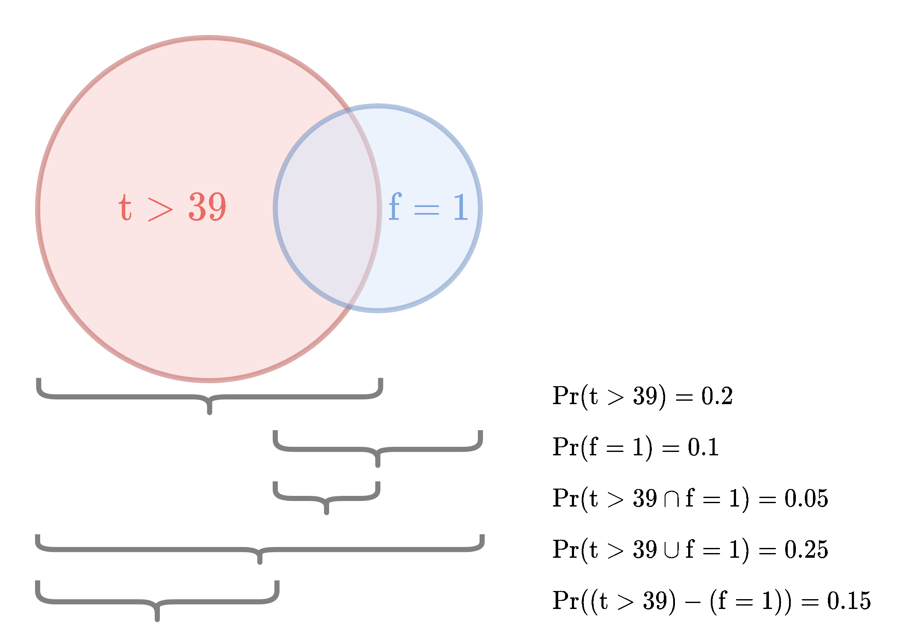
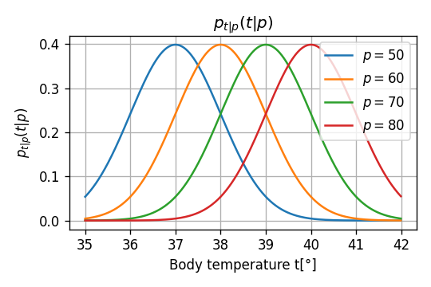
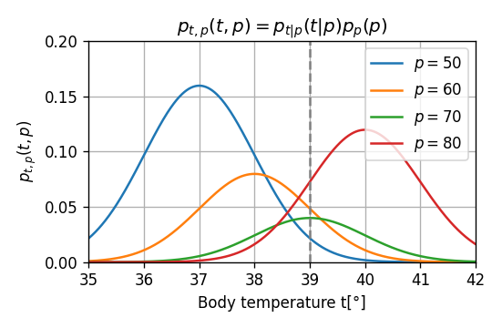
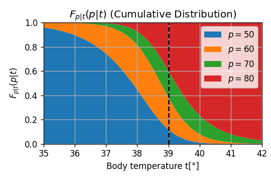
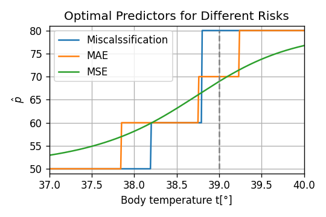

# תרגול 2 - חזרה על הסתברות וחיזוי

## הקדמה

בתרגול הזה נעבור על המושגים הרלוונטיים בתורת ההסתברות ונדבר על חזאיים.

השימוש במודלים הסתבורתיים נפוץ בתחומים רבים ככלי לתיאור תהליכים ותופעות מסויימות. השימוש העיקרי במודלים אלו הוא לצורך חקירת התכונות של אותה תופעה ולצורך ביצוע חיזוי של משתנים מסויימים על סמך משתנים אחרים.

בתרגול זה, בתור דוגמא, נשתמש במודל הסתברותי אשר מתאר את התכונות של אנשים אשר מגיעים לקבל טיפול בבית חולים. בתור המשתנים האקראיים נגדיר דברים כגון הסימפוטים שאדם מסויים מדווח עליהם, הדופק שלו, לחץ הדם והמחלה/מחלות שמהם אותו אדם סובל. אנו נראה כיצד ניתן להשתמש במודל הסתברותי על מנת לתאר את הקשר בין אותם משתנים אקראיים. באופן כללי, בעזרת מודלים כאלה ניתן לנסות לחזות מהי ההסתברות שאדם חולה במחלה מסויימת בהינתן הסימפטומים והמדדים שלו.

בתרגול הקרוב אנו נעסוק במקרה שבו המודל ההסתברותי ידוע במלואו. זאת בשונה משאר כל שאר הקורס, שבו נעסוק במקרים שבהם המודל לא ידוע ונלמד כיצד ניתן להשתמש בשיטות חלופיות אשר מתבסות על אוסף של דגימות מתוך המודל כתחליף למודל עצמו.

## מושגים בסיסיים בהסתברות

נתחיל בתזכורת קצרה למושגים הבסיסיים בתורת ההסתברות. נסתכל לשם כך על התופעה האקראית הבאה:

> נניח ואנו לוקחים כוס מיץ, שופכים את תוכלתה על הרצפה ומסתכלים על הצורה של השלולית שנוצרה.

(חשוב לציין שזהו ניסוי מחשבתי ואין צורך לנסות את זה בבית). 

התופעה המתוארת אשר יוצרת בסופו של דבר את השלולית היא תופעה אקראית, שכן ישנו מגוון רחב של תוצאות שיכולות להתקבל מהתהליך הזה. נגדיר בטבלה הבאה את המושגים ההסתברותיים הרלוונטיים הקשורים לתופעה הזו ואת הסימונים המוקובלים (בהם נעשה שימוש בקורס). מתחת לטבלה תמצאו שרטוט אשר ממחיש את הקשר בין המושגים האלו.

| המושג | סימון מקובל | הגדרה | בדוגמא שלנו |
| :--- | --- | --- | --- |
| **Random phenomenon** (תופעה אקראית) | -- | תופעה בעלת תוצר אקראי. | יצירת שלולית על הריצפה על ידי שפיכה של כוס מיץ |
| **Sample** (דגימה) | $\omega$ | תוצר אפשרי של התופעה האקראית. | צורת שלולית מסויימת (לדוגמא שלושית בצורת ריבוע עם צלע באורך 10 ס"מ") |
| **Sample space**  (מרחב המדגם) | $\Omega$ | המרחב המכיל את כל התוצרים האפשריים של התופעה. $\Omega=\lbrace\forall\omega\rbrace$ | המרחב של כל צורות השלוליות הקיימות |
| **Random Variables (RV)**  (משתנה אקראי) | $\text{x}(\omega)$,$\text{y}(\omega)$,... | פונקציה $\text{x}:\Omega\rightarrow\mathbb{R}$ אשר משייכת לכל דגימה מספר. | פונקציה אשר מחזירה את ההיקף של כל שלולית: $\text{x}_1(\omega)$ פונקציה אשר מחזירה את השטח של כל שלולית:  $\text{x}_2(\omega)$ |
| **Event** (מאורע) | $A$,$B$,... | אוסף של דגימות. זאת אומרת, תת קבוצה של מרחב המדגם $A\subseteq\Omega$. הדרך הנוחה ביותר להגדיר מאורעות היא על ידי תנאי על משתנה אקראי כל שהוא. | אוסף כל השלוליות שהרדיוס שלהם קטן מ 2 $A=\lbrace\omega: \text{x}_1(\omega)<2 \rbrace$ אוסף כל השלושיות שהשטח שלהם גדול מ 1 $B=\lbrace\omega: \text{x}_2(\omega)>1 \rbrace$ |
| **Event space** (מרחב המאורעות) | $\mathcal{F}$ | המרחב של כל המאורעות האפשריים שניתן להגדיר $A\in\mathcal{F}$. | -- |
| **Probability measure** (הסתברות) | $\text{Pr}(A)$ | פונקציה $\text{Pr}:\mathcal{F}\rightarrow[0,1]$ אשר ממפה כל מאורע למספר בין 0 ו1 אשר מציין את הסיכוי שאותו מאורע יתרחש (זאת אומרת, הסיכוי שדגימה תהיה שייכת למאורע). | $\text{Pr}(A)=\text{Pr}(\text{x}_1<2)=0.1$ $\text{Pr}(\text{x}_1<0)=\text{Pr}(\emptyset)=0$ $\text{Pr}(0\leq \text{x}_1)=\text{Pr}(\Omega)=1$ $\text{Pr}(A\cup B)=\text{Pr}(\text{x}_1<2\ \text{or}\ \text{x}_2>1)=0.6$ $\text{Pr}(A\cap B)=\text{Pr}(\text{x}_1<2\ \text{and}\ \text{x}_2>1)=0.01$ |
| **Conditional probability measure** (הסתברות מותנית) | $\text{Pr}(A\lvert B)$ | פונקציה $\text{Pr}:\mathcal{F}_1\times\mathcal{F}_2\rightarrow[0,1]$ אשר מחזירה את ההסתברות שמאורע מסויים יקרה, תחת הידיעה שמאורע אחר קרה. | ההסתברות ששלולית תהיה בעלת היקף קטן מ 2 תחת הידיעה שהשטח שלה גדול מ 1:   $\text{Pr}(A\lvert B)=\text{Pr}(\text{x}_1<2\lvert \text{x}_2>1)=0.02$ |

**שתי הערות לגבי הסימונים**:

1. בחרנו לסמן את המשתנים הקראיים באותיות לטיניות קטנות לא מוטות (non-italic) בכדי להישאר צמודים לנוטציות של הספר [Deep Learning](https://www.deeplearningbook.org/) (ראה תרגול או הרצאה קודמים). סימון מעט יותר נפוץ למשתנים אקראיים הוא אותיות לטיניות דגולות כגון $X$ ו $Y$. (אשר מתנגש הסימון של מטריצות).
2. בכתב יד, נשתמש בקו עילי על מנת לסמן את המשתנים האקראיים (לדוגמא: $\bar{x}$, $\bar{\boldsymbol{x}}$ או $\bar{X}$)
3. בשתי השורות האחרונות השתמשנו בסימונים מהצורה $\text{x}<2$ כקיצור ל $\lbrace\omega:\text{x}(\omega)<2\rbrace$. זוהי צורת כתיבה נפוצה ואנו נשתמש בה מכאן והלאה. (מבחינה מתמטית הסימון המקוצר חסר משמעות שכן הוא משווה בין פונקציה לבין מספר).

פונקציות של משתנים אקראיים:

כאשר אנו מפעילים פונקציה נוספת על המוצא של משתנה אקראי (לדוגמא, להעלות את רדיוס השלולית בריבוע) אנו למעשה מרכיבים שני פונקציות ויוצאים משתנה אקראי חדש.

### Realizations (ראליזציות) ושיבוש נפוץ

מבחינת המינוח המדוייק, התוצאות שמתקבלות מהפעלה של המשתנים האקראיים, זאת אומרת המספרים שאנו מודדים בפועל, נקראים ריאלוזציות. בפועל, השימוש במושג זה לא מאד נפוץ ולרוב משתמשים בשם דגימות בכדי לתאר את הריאליזציות. לדוגמא: נתונות 20 **דגימות** של היקפים של שלוליות. בקורס זה, גם אנחנו נכנה את המדידות עצמם בשם דגימות.

### סימונים

### וקטורים אקראיים

לרוב יעניין אותנו לעבוד עם יותר ממשנתה אקראי יחיד. במקרה כזה נוח לאחד את כל המשתנים האקראיים לוקטור המכונה וקטור אקראי:

$$
\boldsymbol{x}=\mathbf{x}(\omega)=[\text{x}_1(\omega),\text{x}_1(\omega),\ldots,\text{x}_1(\omega)]^\top
$$

(ניתן באופן דומה להגדיר גם מטריצות וטנזורים אקראיים)

## דוגמא - מיון מקדים של חולים

נניח ואנו מועניינים לעזור בפיתוח של מערכת למיון מקדים של חולים לצורך המשך טיפול, לשם כך אנו רוצים להסתמך על מודל הסתברותי אשר מתאר את המאפיינים של האנשים אשר משתמשים במערכת. אנו נגדיר בתור דגימה בודדת $\omega$  משתמש יחיד (בעל מאפיינים מסויימים) אשר מגיע להשתמש במערכת.

 רובוט של חברת [temi](https://www.robotemi.com/) הישראלית אשר יכול לסייע להכוונת חולים להמשך טיפול.

## תרגיל 2.1: תרגיל חימום בהסתברות

**1)** בעבור המודל הנ"ל, תנו דוגמא/ות לגדלים הבאים:

- 2 משתנים אקראיים דיסקרטים (בדידים)

- 2 משתנים אקראיים רציפים.

- 2 מאורעות.

**2)** המציאו הסתברויות למאורעות שבחרתם.

**3)** המציאו הסתברות לחיתוך (intersaction) של שני המאורעות שבחרתם.

**4)** מה תהיה הסתברות של האיחוד (union) של המאורעות (על סמך סעיפים 2 ו 3)?

**5)** מה תהיה ההסתברות של החיסור של המאורע השני מהמאורע הראשון?

**6)** מה תהיה ההסתברות המותנית של המאורע הראשון בהינתן השני?

### פתרון 2.1

**1)** דוגמאות:

- משתנים אקראיים דיסקרטיים:
  - הדופק של המשתמש: $\text{p}(\omega)$
  - כמות הפעמים שהמשתמש השתעל בשעה האחרונה: $\text{c}(\omega)$.
  - משתנה בולינאני (boolian) (בינארי) אשר מציין האם המשתמש חולה בשפעת (1 - חולה, 0 - לא):   $\text{f}(\omega)$.
- משתנים אקראיים רציפים:
  - החום של המשתמש במעלות: $\text{t}(\omega)$.
  - לחץ הדם (הסיטולי) של המשתמש: $\text{p}(\omega)$
- מאורעות:
  - החום של המשתמש גבוהה מ39°: $\text{t}>39$
  - המשתמש חולה בשפעת: $\text{f}=1$.

**2)** נניח שאלו הם ההסברויות המתאימים למאורעות שבחרנו:

   $\text{Pr}(\text{t}>39)=0.2$

   $\text{Pr}(\text{f}=1)=0.1$

**3)** נניח כי ההסתברות של החיתוך של שני המאורעות הינו: $\text{Pr}(\text{t}>39\cap\text{f}=1)=0.05$

בכדי לענות על הסעיפים הבאים נשתמש בדיאגרמה הבאה (המכונה [דיאגרמת Venn](https://en.wikipedia.org/wiki/Venn_diagram))

**4)** $\text{Pr}(\text{t}>39\cup\text{f}=1)=\text{Pr}(\text{t}>39)+\text{Pr}(\text{f}=1)-\text{Pr}(\text{t}>39\cap\text{f}=1)=0.2+0.1-0.05=0.25$

**5)** $\text{Pr}((\text{t}>39)-(\text{f}=1))=\text{Pr}(\text{t}>39)-\text{Pr}(\text{t}>39\cap\text{f}=1)=0.2-0.05=0.15$

**6)** **על פי הגדרה**, ההסתברות המותנית של המאורע הראשון בהינתן המאורע השני שווה ל:

$$
   \text{Pr}(\text{t}>39\lvert \text{f}=1)=\frac{\text{Pr}(\text{t}>39\cap\text{f}=1)}{\text{Pr}(\text{t}>39)}=\frac{0.05}{0.2}=0.25
$$

## פונקציות פילוג (Distributions)

את הסתברויות נוח לתאר בעזרת פונקציות פילוג. נרשום את ההגדרה של פונקציות הפילוג בעבור וקטורים אקראיים (פונקציות הפילוג של סקלרים הם כמובן מקרה פרטי של פונקציות אלו)

### Cumulative Distribtuion Function  - CDF (פונקציית הפילוג המצרפית)

סימון מקובל לפונקציית הCDF של וקטור אקראי $\mathbf{x}$ הוא $F_{\mathbf{x}}(\boldsymbol{x})$ והוא מוגדר באופן הבא:

$$
F_{\mathbf{x}}(\boldsymbol{x})=\text{Pr}(\text{x}_1\leq x_1 \cap \text{x}_2\leq x_2 \ldots \cap \text{x}_n\leq x_n)
$$

### Pobability Mass Function - PMF (פונקציית ההסתברות)

פונקציה המתארת את הפילוג של משתנים \ וקטורים אקראיים דיסקרטיים. סימון מקובל לPMF הוא  $f_{\mathbf{x}}(\boldsymbol{x})$ או $p_{\mathbf{x}}(\boldsymbol{x})$ והוא מוגדר באופן הבא:

$$
p_{\mathbf{x}}(\boldsymbol{x})=\text{Pr}(\text{x}=x_1 \cap \text{x}_2=x_2 \ldots \cap \text{x}_n=x_n)
$$

### Pobability Density Function - PDF (פונקציית צפיפות ההסתברות)

זו המקבילה של הPMF למקרה הרציף. גם היא מסומנת לרוב על ידי  $f_{\mathbf{x}}(\boldsymbol{x})$ או $p_{\mathbf{x}}(\boldsymbol{x})$.

במקרים בהם הCDF הוא גזיר, הPDF מוגדרת כ:

$$
p_{\mathbf{x}}(\boldsymbol{x})=\frac{\partial}{\partial x_1}\frac{\partial}{\partial x_3}\ldots\frac{\partial}{\partial x_n}F_{\mathbf{x}}(\boldsymbol{x})
$$

בשאר המקרים היא מוגדרת על ידי האינטגרל הבא:

$$
F_{\mathbf{x}}(\boldsymbol{x})=\int_{-\infty}^{x_1}\int_{-\infty}^{x_2}\ldots\int_{-\infty}^{x_n}p_{\mathbf{x}}(\boldsymbol{x})dx_n\ldots dx_2 dx_1
$$

### פונקציות פילוג מותנות

באופן דומה, ניתן להגדיר גם את הגירסא המותנית של פונקציות הפילוג:

#### CDF

$$
F_{\mathbf{x}\lvert \mathbf{y}}(\boldsymbol{x}\lvert \boldsymbol{y})=\text{Pr}(\text{x}_1\leq x_1\cap\text{x}_2\leq x_2 \ldots\cap\text{x}_n\leq x_n\lvert \mathbf{y}=\boldsymbol{y})
$$

#### PMF

$$
p_{\mathbf{x}\lvert \mathbf{y}}(\boldsymbol{x}\lvert \boldsymbol{y})=\text{Pr}(\text{x}_1=x_1 \cap \text{x}_2=x_2 \ldots \cap \text{x}_n=x_n\lvert \mathbf{y}=\boldsymbol{y})
$$

#### PDF

$$
p_{\mathbf{x}\lvert \mathbf{y}}(\boldsymbol{x}\lvert \boldsymbol{y})=\frac{\partial}{\partial x_1}\frac{\partial}{\partial x_3}\ldots\frac{\partial}{\partial x_n}F_{X}(\boldsymbol{x}\lvert \boldsymbol{y})
$$

### נוסחאות חשובות

#### The law of total probability (נוסחאת ההסתברות השלמה)

$$
p_{\mathbf{x}}(\boldsymbol{x})=\underbrace{\sum_{\boldsymbol{y}\in\lbrace \mathbf{y}(\omega),\omega\in\Omega\rbrace}p_{\mathbf{x},\mathbf{y}}(\boldsymbol{x},\boldsymbol{y})}_{\text{For discrete RV}}=\underbrace{\int_{-\infty}^{\infty}p_{\mathbf{x},\mathbf{y}}(\boldsymbol{x},\boldsymbol{y})d\boldsymbol{y}}_{\text{For cont. RV}}
$$

(הסכום על $\boldsymbol{y}\in\lbrace \mathbf{y}(\omega),\omega\in\Omega\rbrace$ הוא פשוט סכום על כל הערכים האפשריים ש$\mathbf{y}$ יכול לקבל).

במקרים בהם עוסקים בכמה משתנים אקראיים, אך מעוניינים להתייחס רק לפלוג של חלק מהם, מכנים את הפילוג החלקי **פילוג שולי (marginal distribution)**.

#### פילוג מותנה (Conditional Distribtuion)

הקשר הבא נובע ישירות מתוך ההגדרה של ההסברות המותנית:

$$
p_{\mathbf{x}\lvert \mathbf{y}}(\boldsymbol{x}\lvert \boldsymbol{y})=\frac{p_{\mathbf{x},\mathbf{y}}(\boldsymbol{x},\boldsymbol{y})}{p_{\mathbf{y}}(\boldsymbol{y})}
$$

#### חוק בייס (Bayes' Theorem)

מתוך שני החוקים הנ"ל אפשר להסיק את חוק בייס:

$$
\begin{aligned}
p_{\mathbf{y}\lvert \mathbf{x}}(\boldsymbol{y}\lvert \boldsymbol{x})
&=\frac{p_{\mathbf{x}\lvert \mathbf{y}}(\boldsymbol{x}\lvert \boldsymbol{y})p_{\mathbf{y}}(\boldsymbol{y})}{p_{\mathbf{x}}(\boldsymbol{x})}\\
&=\underbrace{\frac{p_{\mathbf{x}\lvert \mathbf{y}}(\boldsymbol{x}\lvert \boldsymbol{y})p_{\mathbf{y}}(\boldsymbol{y})}{\sum_{\tilde{\boldsymbol{y}}} p_{\mathbf{x}\lvert \mathbf{y}}(\boldsymbol{x}\lvert \tilde{\boldsymbol{y}})p_{\mathbf{y}}(\tilde{\boldsymbol{y}})}}_{\text{For discrete RV}}\\
&=\underbrace{\frac{p_{\mathbf{x}\lvert \mathbf{y}}(\boldsymbol{x}\lvert \boldsymbol{y})p_{\mathbf{y}}(\boldsymbol{y})}{\int_{-\infty}^{\infty}p_{\mathbf{x}\lvert \mathbf{y}}(\boldsymbol{x}\lvert \tilde{\boldsymbol{y}})p_{\mathbf{y}}(\tilde{\boldsymbol{y}})d\tilde{\boldsymbol{y}}}}_{\text{For cont. RV}}
\end{aligned}
$$

## תרגיל 2.2 - פילוגים בדידים

נתון לנו הפילוג המשותף הבא של הדופק $\text{p}$ ומספר השיעולים $\text{c}$ של המשתמשים במערכת.

לשם הפשטות נניח כי כמות השיעולים והדופק יכולים לקבל רק את הערכים המופעים בטבלה.

| .             | $\text{c}=0$ | $\text{c}=1$ | $\text{c}=2$ | $\text{c}=3$ |
| ------------- | :----------: | :----------: | :----------: | :----------: |
| $\text{p}=50$ | 0            | 0.15         | 0.2          | 0.05         |
| $\text{p}=60$ | 0.08         | 0.03         | ???          | 0.04         |
| $\text{p}=70$ | 0.02         | 0.03         | 0.04         | 0.01         |
| $\text{p}=80$ | 0.1          | 0.05         | 0.05         | 0.1          |

**1)** מהו המספר החסר בטבלה?

**2)** מהי ההסתברות שדופק המנוחה של משתמש הוא 60 בהינתן שהוא לא השתעל בשעה האחרונה?

**3)** מהי ההסתברות ש10 חולים רצופים יהיה בעלי דופק גבוה או שווה ל 70?

### פתרון 2.2

#### 1)

נשתמש בעובדה שסכום כל הערכים בטבלה חייב להיות שווה ל 1, לכן המספר החסר חייב להיות:

$$
p_{\text{p},\text{c}}(60,2) = 1 - \sum_{(p,c)\neq(60,2)} p_{\text{p},\text{c}}(p, c) = 0.05
$$

#### 2)

על פי ההגדרה של הפילוג המותנה:

$$
p_{\text{p}\lvert \text{c}}(60\lvert 0)
=\frac{p_{\text{p},\text{c}}(60,0)}{p_{\text{c}}(0)}
=\frac{p_{\text{p},\text{c}}(60,0)}{\sum_{p=50}^{80} p_{\text{p},\text{c}}(p,0)}= \frac{0.08}{0+0.08+0.02+0.1} = 0.4
$$

#### 3)

מכיוון שהמאפיינים של המשתמשים הינם בלתי תלויים הסיכוי לקבל קומבינציה כל שהיא של מאורעות שווה למכפלת ההסתברויות של כל מאורע בנפרד. נתחיל בלחשב את ההסתברות שלמשתמש יחיד יהיה דופק גבוה או שווה ל70. לשם כך נחשב את הפילוג השולי של הדופק של משתמש, נעשה זאת בעזת נוחסאת ההסתברות השלמה:

$$
p_{\text{p}}(p)=\sum_c p_{\text{p},\text{c}}(p,c)=\begin{cases}
0.4 & p=50 \\
0.2 & p=60 \\
0.1 & p=70 \\
0.3 & p=80
\end{cases}
$$

מכאן שההסתברות של משתמש יחיד יהיה דופק גבוה או שווה ל70 הינו $\text{Pr}(\text{p}\geq70)=0.1+0.3=0.4$.

ההסתברות ש10 חולים רצופים יהיה בעלי דופק גבוה או שווה ל 70 שווה ל:

$$
\begin{aligned}
\text{Pr}(\text{p}_1\geq70\cup\text{p}_2\geq70\cup\ldots\cup\text{p}_{10}\geq70)
&=\text{Pr}(\text{p}_1\geq70)\text{Pr}(\text{p}_2\geq70)\cdot\ldots\cdot\text{Pr}(\text{p}_{10}\geq70)\\
&=\prod_{i=1}^{10}\text{Pr}(\text{p}_i\geq70)
=0.4^{10}
=10^{-4}
\end{aligned}
$$

## תרגיל 2.3 - פילוגים מעורבים

נסתכל כעת על הפילוג המשותף של הדופק $\text{p}$ וחום הגוף $\text{t}$ של המשתמש. נתון לנו כי הפילוג המותנה של חום הגוף בהינתן הדופק הינו:

$$
\text{t}\lvert \text{p}=p\quad\sim N(32+0.1\cdot p,1)
$$

בהנתן שחום הגוף שמשתמש מסויים הינו 39°, מהו הפילוג השולי הצפוי של הדופק של אותו משתמש, $p_{\text{p}\lvert \text{t}}(p\lvert 39)$?

### פתרון 2.3

נשתמש בחוק בייס:

$$
p_{\text{p}\lvert \text{t}}(p\lvert 39)
=\frac{p_{\text{t}\lvert \text{p}}(39\lvert p)p_{\text{p}}(p)}{p_{\text{t}}(39)}
=\frac{p_{\text{t}\lvert \text{p}}(39\lvert p)p_{\text{p}}(p)}{p_{\text{t}}(39)}
$$

נתחיל בחישוב של המונה $p_{\text{t}\lvert \text{p}}(39\lvert p)p_{\text{p}}(p)$:

$$
\begin{aligned}
p_{\text{t}\lvert \text{p}}(39\lvert p)p_{\text{p}}(p)
& = \begin{cases}
\frac{1}{\sqrt{2\pi}}\exp(-\tfrac{1}{2}(39-32-0.1\cdot 50)^2)\cdot0.4 & p=50 \\
\frac{1}{\sqrt{2\pi}}\exp(-\tfrac{1}{2}(39-32-0.1\cdot 60)^2)\cdot0.2 & p=60 \\
\frac{1}{\sqrt{2\pi}}\exp(-\tfrac{1}{2}(39-32-0.1\cdot 70)^2)\cdot0.1 & p=70 \\
\frac{1}{\sqrt{2\pi}}\exp(-\tfrac{1}{2}(39-32-0.1\cdot 80)^2)\cdot0.3 & p=80
\end{cases}\\
& = \begin{cases}
0.022 & p=50 \\
0.048 & p=60 \\
0.04 & p=70 \\
0.072 & p=80
\end{cases}\\
\end{aligned}
$$

את המכנה נוכל לחשב בקלות על ידי שימוש בעובדה ש $p_{\text{t}}(t)=\sum_{\tilde{p}} p_{\text{t}\lvert \text{p}}(t\lvert \tilde{p})p_{\text{p}}(\tilde{p})$ (נוסחאת ההסתברות השלמה), זאת אומרת שעלינו פשוט לסכום את התוצאות הנ"ל. התפקיד של המכנה הוא למעשה להיות קבוע נרמול (שאינו תלוי ב $\text{p}$) אשר דואג לכך שסכום ההסתברויות השלויות על פני $\text{p}$ תהיה 1.

$$
p_{\text{t}}(39)=\sum_{\tilde{p}} p_{\text{t}\lvert \text{p}}(39\lvert \tilde{p})p_{\text{p}}(\tilde{p})=0.182
$$

מכאן ש:

$$
p_{\text{p}\lvert \text{t}}(p\lvert 39)
=\frac{1}{0.182}\begin{cases}
0.022 & p=50 \\
0.048 & p=60 \\
0.04 & p=70 \\
0.072 & p=80
\end{cases}
=\begin{cases}
0.12 & p=50 \\
0.27 & p=60 \\
0.22 & p=70 \\
0.4 & p=80
\end{cases}
$$

## תוחלות

נזכיר כעת את ההגדרות של התוחלת והשונות

### תוחלת (Expectation Value / Mean)

התוחלת של וקטור אקראי $\mathbf{x}$ מוגדרת באופן הבא:

$$
\boldsymbol{\mu}_{\mathbf{x}}=\mathbb{E}[\mathbf{x}]
=\underbrace{\sum_{\boldsymbol{x}\in\lbrace \mathbf{x}\omega),\omega\in\Omega\rbrace} \boldsymbol{x}\cdot p_{\mathbf{x}}(\boldsymbol{x})}_{\text{For discrete RV}}
=\underbrace{\int_{-\infty}^\infty \boldsymbol{x}\cdot p_{\mathbf{x}}(\boldsymbol{x})d\boldsymbol{x}}_{\text{For cont. RV}}
$$

כאשר אינטרגל או סכימה על וקטור מתבצעים איבר איבר (זאת אומרת לכל איבר בנפרד).

הגדרה זו תופסת גם לכל פונקציה של המשתנים / וקטורים האקראיים:

$$
\mathbb{E}\left[f(\mathbf{x})\right]
=\int_{-\infty}^\infty f(\boldsymbol{x})\cdot p_{\mathbf{x}}(\boldsymbol{x})d\boldsymbol{x}
$$

### השונות (Variance)

השונות של משתנה אקראי (סקלרי) $\text{x}$ מוגדרת באופן הבא:

$$
\sigma_{\text{x}}^2=\text{var}(\text{x})=\mathbb{E}\left[(\text{x}-\mu_{\text{x}})^2\right]=\mathbb{E}\left[\text{x}^2\right]-\mu_{\text{x}}^2
$$

כאשר השורש של השונות, $\sigma_{\text{x}}$, מכונה סטיית התקן (standard deviation - STD) של $\text{x}$.

### Covariance

הconariance של זוג משתנים אקראיים (סקלריים) $\text{x}_1$ ו $\text{x}_2$ מגדר באופן הבא:

$$
\text{cov}(\text{x}_1,\text{x}_2)=\mathbb{E}\left[(\text{x}_1-\mu_{\text{x}_1})(\text{x}_2-\mu_{\text{x}_2})\right]=\mathbb{E}\left[\text{x}_1\text{x}_2\right]-\mu_{\text{x}_1}\mu_{\text{x}_2}
$$

### מטריצת הCovariance

בעבור וקטור אקראי $\mathbf{x}$ מגדירים את מטריצת הconvariance כאשר האיבר ה$i,j$ של המטריצה הוא הcovariance בין $\text{x}_i$ ל $\text{x}_j$. מקובל לסמן מטריצה זו באות $\Sigma$:

$$
\Sigma_{\mathbf{x},i,j}=\text{cov}\left(\text{x}_i,\text{x}_j\right)
$$

ניתן להראות כי את מטריצת הcovariance ניתן לכתוב גם כ:

$$
\Sigma_{\mathbf{x}}=\mathbb{E}\left[\mathbf{x}\mathbf{x}^\top\right]-\boldsymbol{\mu}_{\mathbf{x}}\boldsymbol{\mu}_{\mathbf{x}}^\top
$$

## וקטורים גאוסיים (Gaussian Vectors) -   Multivariate Normal Distribution

בדומה למקרה החד מימדי, הפילוג הגאוסי ממשיך לשחק תפקיד מרכזי גם כאשר מגדילים את מספר המימדים. ההרחבה של הפילוג הגאוסי למספר מימדים נקרא פילוג multivariate normal distribution. וקטורים שמפולגים על פי פילוג זה מכונים וקטורים גאוסיים. בדומה לקרה החד מימדי, הפילוג הזה מוגדר על ידי וקטור התוחלות שלו $\boldsymbol{\mu}_{\mathbf{x}}$ ומטריצת הcovariance שלו $\Sigma_{\mathbf{x}}$:

$$
p_{\mathbf{x}}(\boldsymbol{x})=\frac{1}{(\sqrt{2\pi)^n\lvert \Sigma_{\mathbf{x}}\lvert }}\exp\left(-\tfrac{1}{2}\left(\boldsymbol{x}-\boldsymbol{\mu}_{\mathbf{x}}\right)^T\Sigma_{\mathbf{x}}^{-1}\left(\boldsymbol{x}-\boldsymbol{\mu}_{\mathbf{x}}\right)\right)
$$

כאשר $n$ הוא מספר המימדים (האורך של הוקטור הגאוסי).

תנאי הכרחי ומספיק בשביל שוקטור אקראי יהיה גאוסי, הינו שכל כקומבינציה לינארית של איברי הוקטור יהיו בעלי פילוג גאוסי (סקלארי).

## חזאיים (Predictions)

בפעולת החיזוי אנו מנסים לחזות את ערכו של משתנה אקראי כל שהוא, לרוב על סמך משתנים אקראיים אחרים. מקובל לסמן חזאים בעזרת ^, למשל, את החזאי של המתנה האקראי $\text{x}$ נסמן ב $\hat{x}$.

נקח בתור דוגמא את הנסיון לחזות מהו הדופק של משתמש מסויים על סמך חום הגוף שלו. ראינו קודם כיצד ניתן לחשב את הפילוג של הדופק בהינתן הטמפרטורה, קבינלו את הפילוג המותנה הבא:

$$
p_{\text{p}\lvert \text{t}}(p\lvert 39)
=\begin{cases}
0.12 & p=50 \\
0.27 & p=60 \\
0.22 & p=70 \\
0.4 & p=80
\end{cases}
$$

נשאלת השאלה אם כן מהו החזאי האופטימאלי של הדופק של המשתמש בהינתן שחום הגוף שלו היא 39°? לשם כך עלינו הגדיר קודם למה אנו מתכוונים ב"חזאי אופטימאלי". מסתבר שאין תשובה אחת לשאלה הזו. נסתכל על כמה אופציות להגדיר חזאי שכזה:

**אופציה ראשונה**: נניח שמטרה שלנו היא להגדיל את ההסתברות שהחזאי שלנו יחזה את הדופק במדוייק. במקרה כזה כדאי לנו לבחור את החזאי $\hat{p}=80$, שכן הוא זו היא האופציה בעלת ההסתברות הכי גבוהה להתקבל.

**אופציה שניה** נניח שהמטרה שלנו היא לדאוג שהשגיאה הממוצעת (הערך המוחלט של ההפרש בין החיזוי לדופק האמיתי) תהיה כמה שיותר קטנה. במקרה כזה כדאי לנו לבחור את החזאי $\hat{p}=70$, אשר יניב שגיאה ממוצעת של 9.

**אופציה שלישית** נניח והמטרה שלנו היא דווקא למזער את הטעות המקסימאלית. במקרה כזה כדאי לנו לבחור את מרכז התחום שהוא $\hat{p}=65$ (אשר יבטיח לנו שגיאה מירבית של 15).

כפי שניתן לראות, הבחירה של החזאי האופטימאלי תלויה במטרה אותה אנו רוצים להשיג. נראה כעת כיצד ניתן להגדיר את המטרה כבעיית אופטימיזציה שהחזאי האופטימאלי הוא הפתרון שלה.

### פונקציית המחיר (Cost Function)

ראשית נגדיר פונקציה המכונה **פונקציית המחיר (cost function)**. פונקציה זו מקבל חזאי ומחזירה את הציון של החזאי. לרוב הציון מוגדר כך שציון נמוך יותר הוא טוב יותר. לדוגמא, פונקציית המחיר הבאה מחזירה את השגיאת החיזוי הממוצעת של הדופק:

$$
C(\hat{p})=\mathbb{E}\left[\lvert \text{p}-\hat{p}\lvert \ \lvert\ t=39\right]
$$

בהינתן פונקציית מחיר שכזו, ניתן לרשום את החזאי האופטימאלי כחזאי אשר ממזער את פונקציית המחיר:

$$
\hat{p}^*=\underset{\hat{p}}{\arg\min}\quad C(\hat{p})
$$

#### פונקציית הסיכון (Risk Function)  וההספד (Loss)

דרך נפוצה להגדיר פונקציות מחיר הינה כתוחלת על מרחק כל שהוא בין תוצאת החיזוי לערך האמיתי של המשתנה האקראי (כמו בדוגמא למעלה). במקרים כאלה מקובל לקרוא לפונקציית המחיר **פונקציית סיכון (risk function)** ולפונקציית המרחק (שעליה מבצעים את התוחלת) **פונקציית ההספד (loss function)**. סימונים מקובלים לפונקציות ההספד ופונקציית הסיכון הינם  $\ell$ ו $R$ בהתאמה, כאשר:

$$
R(\hat{p})=\mathbb{E}\left[\ell(\hat{p},\text{p})\right]
$$

הטבלה הבאה מציגה את שלושת פונקציות הסיכון וההפסד הנפוצות ביותר:

| המשמעות | פונקציית ההפסד | השם של פונקציית ההפסד | השם של פונקציית הסיכון |
| --- | --- | --- | --- |
| ההסתברות לעשות טעות | $$\ell\left(x,\hat{x}\right)=I\left\lbrace\hat{x}\neq x\right\rbrace$$ | Zero-one loss | Misclassification rate |
| השגיאה הממוצעת | $$\ell\left(x,\hat{x}\right)=\left\lvert\hat{x}-x\right\rvert$$ | $$l_1$$ | MAE (mean absolute error) |
| השיגאה הריבועית הממוצעת | $$\ell\left(x,\hat{x}\right)=\left(\hat{x}-x\right)^2$$ | $$l_2$$ | MSE (mean squared error) |

- הסימון $I\{\cdot\}$ מציין פונקציית אינדיקטור (אשר שווה ל1 כאשר התנאי שבסוגריים מתקיים ו0 אחרת).
- במקרים רבים משתשמים גם בשורש השגיאה הריבועית הממוצעת RMSE כפונקציית סיכון. מבחינת מעשית, אין הבדל בין השתיים שכן בעיית האופטימיזציה המתקבל היא שקולה (בגלל המונוטוניות של פונקציית השורש). זאת אומרת שלMSE וRMSE יש את אותו החזאי האופטימאלי.
- פונקציית הסיכון הראשונה הינה הנפוצה ביותר למקרים בהם מנסים לחזות משתנה אקראי דיסקרטי.
- פונקציית הסיכון האחרונה הינה הנפוצה ביותר למקרים בהם מנסים לחזות משתנה אקראי רציף.

## תרגיל 2.4 - החזאים האופטימאלים של פונקציות הסיכון הנפוצות

**1)** בעבור משתנה אקראי דיסקרטי $\text{x}$, עם misclassifiaction rate כפונקציית סיכון, הראו כי החזאי האופטימאלי הינו הערך הסביר ביותר:
$$
\hat{x}^*
=\underset{\hat{x}}{\arg\min}\quad \mathbb{E}\left[I\{\hat{x}=\text{x}\}\right]
=\underset{\hat{x}}{\arg\max}\quad p_{\text{x}}\left(\hat{x}\right)
$$

**2)** בעבור משתנה אקראי רציף $\text{x}$ עם MAE כפונקציית סיכון, הראו כי החזאי האופטימאלי הינו הmedian:
$$
\begin{aligned}
&\hat{x}^*
=\underset{\hat{x}}{\arg\min}\quad \mathbb{E}\left[\lvert \text{x}-\hat{x}\lvert \right]\\
&\Rightarrow F_{\text{x}}\left(\hat{x}^*\right)=\tfrac{1}{2}
\end{aligned}
$$

(בעבור המקרה הבדיד, ראו דוגמא בתרגיל 2.5)

**3)** בעבור MSE (או RMSE) כפונקציית סיכון, הראו כי החזאי האופטימאלי הינו התוחלת:

$$
\hat{x}^*
=\underset{\hat{x}}{\arg\min}\quad \mathbb{E}\left[(\text{x}-\hat{x})^2\right]
=\mathbb{E}\left[\text{x}\right]
$$

### פתרון 2.4

#### 1)

$$
\hat{x}^*=\underset{\hat{x}}{\arg\min}\quad \mathbb{E}\left[I\{\hat{x}\neq \text{x}\}\right]
$$

נרשום את התוחלת באופן מפורש:

$$
=\underset{\hat{x}}{\arg\min}\quad \sum_xI\{\hat{x}\neq x\}p_{\text{x}}(x)
$$

הסכימה פה היא למעשה על כל הערכים של $\text{x}$ מלבד $\hat{x}$. נוכל לרשום את הסכום הזה כסכום על כל הערכים פחות הערך ב$\hat{x}$:

$$
\begin{aligned}
&=\underset{\hat{x}}{\arg\min}\quad \underbrace{\left(\sum_x p_{\text{x}}(x)\right)}_{=1} - p_{\text{x}}(\hat{x}) \\
& = \underset{\hat{x}}{\arg\max}\quad p_X\left(\hat{x}\right)
\end{aligned}
$$

**2)**

$$
\begin{aligned}
\hat{x}^*
&=\underset{\hat{x}}{\arg\min}\quad \mathbb{E}\left[\lvert \text{x}-\hat{x}\lvert \right] \\
&=\underset{\hat{x}}{\arg\min}\int_{-\infty}^{\infty}\lvert x-\hat{x}\lvert  p_{\text{x}}(x)dx \\
\end{aligned}
$$

את בעיית האופטימיזציה הזו ניתן לפתור על ידי גזירה (לפי $\hat{x}$) והשוואה ל-0:

$$
\begin{aligned}
&\frac{d}{d\hat{x}}\int_{-\infty}^{\infty}\lvert \hat{x}-x\lvert p_{\text{x}}(x)dx = 0 \\
\Leftrightarrow&\int_{-\infty}^{\infty}\frac{d}{d\hat{x}}\lvert \hat{x}-x\lvert p_{\text{x}}(x)dx = 0 \\
\Leftrightarrow&\int_{-\infty}^{\infty}\text{sign}(\hat{x}-x)p_{\text{x}}(x)dx = 0 \\
\Leftrightarrow&
\underbrace{\left(\int_{-\infty}^{\hat{x}}p_{\text{x}}(x)dx\right)}
_{=F_{\text{x}}(\hat{x})}-
\underbrace{\left(\int_{\hat{x}}^{\infty}p_{\text{x}}(x)dx\right)}
_{=1 - F_{\text{x}}(\hat{x})}
=0 \\
\Leftrightarrow& 2F_{\text{x}}(\hat{x}) = 1 \\
\Leftrightarrow& F_{\text{x}}(\hat{x}) = \tfrac{1}{2} \\
\end{aligned}
$$

**3)**

$$
\hat{x}^*
=\underset{\hat{x}}{\arg\min}\quad \mathbb{E}\left[(\text{x}-\hat{x})^2\right]
$$

גם כאן ניתן לפתור את בעיית האופטימיזציה על ידי גזירה (לפי $\hat{x}$) והשוואה ל-0:

$$
\begin{aligned}
&\frac{d}{d\hat{x}}\mathbb{E}\left[(\text{x}-\hat{x})^2\right]=0 \\
\Leftrightarrow&\mathbb{E}\left[\frac{d}{d\hat{x}}(\text{x}-\hat{x})^2\right]=0 \\
\Leftrightarrow&\mathbb{E}\left[2(\hat{x}-\text{x})\right]=0 \\
\Leftrightarrow&
2\hat{x}\underbrace{\mathbb{E}\left[1\right]}_{=1}-
2\mathbb{E}\left[\text{x}\right]=0 \\
\Leftrightarrow&\hat{x} = \mathbb{E}\left[x\right]
\end{aligned}
$$

## תרגיל 2.5 - חיזוי הדופק על פי חום הגוף

השתמשו בתוצאות הסעיף הקודם על מנת לקבוע בעבור כל אחד מ3 פונקצות הסיכון הנפוצות מהטבלה מהו החזאי האופטימאלי של הדופק של המשתמש בהינתן שחום הגוף שלו הינו 39°.

### פתרון 2.5

$$
p_{\text{p}\lvert \text{t}}(p\lvert 39)
=\begin{cases}
0.12 & p=50 \\
0.27 & p=60 \\
0.22 & p=70 \\
0.4 & p=80
\end{cases}
$$

- בעבור misclasification rate החזאי האופטימאלי הוא הערך הסביר ביותר:

$$
\hat{p}^*=\underset{\hat{p}}{\arg\max}\quad p_{\text{p}\lvert \text{t}}
(\hat{p}\lvert 39)=80
$$

- בעבור MAE:

  מכיוון שמדובר במשתנה אקראי דיסקרטי לא קיים לו median. במקרה החזאי האופטימאלי הוא המספר אשר ההסתברות לקבל ערך גדול ממנו וההסתברות לקבל ערך קטן ממנו, שניהם קטנים מ-0.5.

  בדוגמא שלנו המספר הזה הוא $\hat{p}=70$. (עם הסתברות של $0.39$ לקבל ערך קטן ממנו והסתברות של $0.4$ לקבל ערך קטן ממנו)

- בעבור MSE (או RMSE) החזאי האופטימאלי הינו התוחלת:

  $$
  \hat{p}^*=\mathbb{E}\left[\text{p}\lvert \text{t}=39\right]=50\cdot0.12 + 60\cdot0.27 + 70\cdot0.22 + 80\cdot0.4=68.96
  $$

