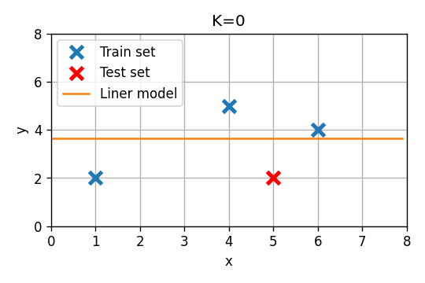
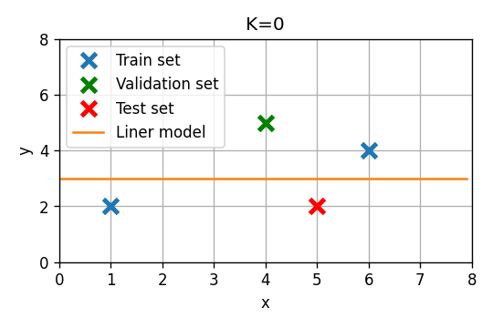
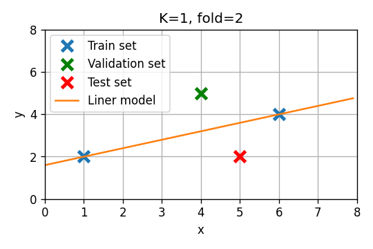

# תרגול 4 - Generalization & overfitting

<!-- <a href="/assets/tutorial03.pdf" class="link-button" target="_blank">PDF</a>
<a href="./code/" class="link-button" target="_blank">Code</a> -->

## תקציר התיאוריה

### מושגים

- **הכללה (generalization)**: היכולת להסיק מן הפרט אל הכלל. היכולת של המודל להפיק תוצאות טובות גם על דגימות אשר לא הופיעו במדגם.
- **Overfitting (התאמת יתר)**: התופעה שבה המודל לומד מאפיינים אשר מופיעים רק במדגם ואינם הם אינם מייצגים את התכונות של הפילוג האמיתי.
- **הערכת הביצועים של חזאי (יכולת הכללה)**: הערכת המחיר (המתקבל מפונקציית המחיר) המתקבל בעבור חזאי נתון על הפילוג האמיתי.
- **Hyper parameters** - הפרמטריים אשר משפיעים על המודל הפרמטרי או האלגוריתם, אך אינם חלק מהפרמטרים שעליהם אנו מבצעים את האופטימיזציה. דוגמאות:
  - סדר הפולינום שבו אנו משתמשים
  - הפרמטר $\eta$ אשר קובע את גודל הצעד באלגוריתם ה gradient descent.
  - פרמטרים אשר קובעים את המבנה של רשת נוירונים.
- כאשר ישנו hyper-parameter אשר שולט ביכול הייצוג של המודל הפרמטרי לייצג מגוון של מודלים (כגון המקרה של סדר של פולינום) אנו נכנה פרמטר זה לרוב סדר המודל, כך ש:
  - **מודל פרמטרי מסדר גבוה** יהיה מודל פרמטרי אשר יכול לייצג **מגוון רחב** של מודלים
  - **מודל פרמטרי מסדר נמוך** יהיה מודל פרמטרי אשר יכול לייצג **מגוון מצומצם** של מודלים

### הערכת ביצועים בעזרת סט בחן

במקרים בהם פונקציית המחיר מוגדרת בעזרת תוחלת (כמו במקרה הנפוץ של שימוש בפונקציות סיכון / הפסד) ניתן לשערך אך את ביצועיו של חזאי מסויים על ידי קירוב התוחלת בעזרת תוחלת אמפירית. לשם כך נפצל את המודל שני תתי מדגמים:

- **Train set (סט אימון)**: בו נשתמש לבנות את החזאי.
- **Test set (סט בחן)**: בו נשתמש בכדי להעריך את ביצועי המערכת.

**כלל אבצע**: במקרים בהם המדגם לא ממש גדול, מקובל לחלק את המדגם ל80% train ו20% test. כאשר המדגם מאד גדול דואגים לקחת test set מספיק גדול כך שהערכה תהיה מדוייקת מספיק.

### פירוק שגיאת החיזוי

נתייחס בקורס זה נציג שני פירוקים נפוצים של שגיאת החיזוי בבעיות supervised learning.

#### Aprroxiamtion-estimation decomposition

בפירוק זה נתייחס לשלושת הגורמים הבאים בשגיאת החיזוי:

1. **Noise - ה"רעש" של התויות**: השגיאה החזאי האופטימאלי יעשה. היא נובעת מהאקראיות של התויות $y$.
2. **Approximation error - שגיאת קירוב**: השגיאה עקב ההגבלה של המודל למשפחה מצומצמת של מודלים (לרוב למודל פרמטרי). שגיאה זו נובעת מההבדל בין המודל האופטימאלי $h^*$ לבין המודל **הפרמטרי** האופטימאלי $h^*(\cdot,\boldsymbol{\theta})$.
3. **Estimation error - שגיאת השיערוך**: השגיאה עקבהצורך שלנו להסתמך על המדגם כתחליף לפילוג האמיתי. שגיאה זו נובעת מההבדל בין המודל הפרמטרי האופטימאלי $h^*(\cdot,\boldsymbol{\theta})$ למודל הפרמטרי המשוערך על סמך המדגם $h_{\mathcal{D}}^*(\cdot,\boldsymbol{\theta})$.

**!!!להוסיף שרטוט!!!**

#### Bias-variance decomposition

פירוק זה מתייחס למקרה שבו פונקציית המחיר היא MSE.

בפירוק זה נתייחס לחזאי ה"ממוצע" המתקבל כאשר לוקחים תוחלת על כל חזאים אשר יכוללים להתקבל בעבור כל המדגמים האפשריים. בעבור אלכוריתם אשר בהינתן מדגם $\mathcal{D}$ מייצר חזאי $h_{\mathcal{d}}$ נגדיר את החזאי ה"ממוצע" כ:

$$
\bar{h}(x)=\mathbb{E}_{\mathcal{D}}\left[h_{\mathcal{D}}(x)|x\right]
$$

(הסימון של $\mathcal{D}$ מתחת ל $\mathbb{E}$ אינו נחוץ מתמטית והסופנו אותו רק בכדי להזכיר את העובדה שאנו שהמדגם $\mathcal{D}$) הינו גם משתנה אקראי ושהתוחלת מתבצעת גם עליו).

בנוסף בעבור המקרה של MSE אנו יודעים כי החזאי האופטימאלי הינו: $h^*(x)=\mathbb{E}\left[\text{y}|x\right]$. על בסיס שני חזאים אלו ניתן לפרק התוחלת הצפויה של שגיאת ה MSE של אלגוריתם נתון באופן הבא:

$$
\mathbb{E}_{\mathcal{D}}\left[(h_{\mathcal{D}}(\text{x})-y)^2\right]
=\underbrace{\mathbb{E}\left[(\bar{h}(\text{x})-h^*(\text{x}))^2\right]}_{\text{Bias}^2}
+\underbrace{\mathbb{E}_{\mathcal{D}}\left[(h_{\mathcal{D}}(\text{x})-\bar{h}(\text{x}))^2\right]}_{\text{Variance}}
+\underbrace{\mathbb{E}\left[(h^*(\text{x})-y)^2\right]}_{\text{Noise}}
$$

בפירוק הזה:

- ה variance מודד את השונות של התוצאות החיזוי המתקבלות סביב החזאי הממוצע. תוחלת זו היא גם על פני המדגמים השונים אותם ניתן לקבל (שאר האיברים לא תלויים במדגם).
- ה bias מודד את ההפרש הריבועי בין החיזוי של החזאי הממוצע של השיטה לבין החזאי האופטימאלי.
- ה noise מודד את השגיאה הריבועית המתקבלת מהחזאי האופטימאלי (הנובעת מהאקראיות של $y$).

בתרגיל 4.1 נפתח את הפירוק הזה.

##### Tradeoffs

המודל הפרמטרי שאיתו נבחר לעבוד ישפיע על גודלם של השגיאות אותם נקבל. לרוב התלות של השגיאות במודל הפרמטרי תקיים את הקשר הבא:

- **מודל פרמרטי עשיר**, אשר יכול לייצג מגוון מאד עשיר של מודלים יהיה בעל **שגיאת קירוב / bias נמוך** אך **שגיאת שיערוך / variance גבוה**.
- **מודל פרמרטי דל**, אשר יכול לייצג מגוון מאד עשיר של מודלים יהיה בעל **שגיאת שיערוך / variance נמוך** אך **שגיאת קירוב / bias גבוה**.

המודל בעל יכולת ההכללה הטובה ביותר ימצא באיזו שהיא נקודת ביניים בין שני הקצוות הנל, כפי שמתואר בשירטוט הסכימתי הבא:

**!!!להוסיף שרטוט!!!**

### שימוש ב validataion set לקביעת hyper-parameters

לרוב לא תהיה לנו דרך לקבוע מראש מה צריך להיות ערכם של ה hyper-parameters על מנת לקבל תוצאות אופטימאליות. במקרים אלו אנו נאלץ לבדוק ערכים שונים ולבחור מתוכם.לשם הערכת הביצועים המתקבלים בעבור בחירה מסויימת של ערכים אנו נאלץ להשתמש סט דגימות שלישי שונה מה train set וה test set אשר מוכנה validation set. לרוב ה validataion set יהיה מופרש מתוך ה train set.

קביעת ה hyper-parameters תעשה לרוב על ידי הרצת האלגוריתם מספר פעמים עם ערכים שונים בעבור ה hyper-parametrs, הערכת הביצועים על ה validation set, ובחירת הערכים אשר נתנו את התוצאה הטובה ביותר. במקרים רבים תהליך קביעת הפרמטרים יהיה תהליך איטרטיבי של ניסוי וטעיה.

במקרים רבים לאחר קביעת ה hyper-parmaeters אנו נאחד חזרה את ה validation set וה train set ונאמן מחדש את המודל על המדגם המאוחד (כל הדגימות מלבד ה test set).

### רגולריזציה

דרך נוספת לנסות ולהקטין את ה overfitting של המודל על ידי הוספת איבר רגולריזציה לבעיית האופטימיזציה. מטרת איבר הרגולריזציה הינה לבטא ידע מוקדם שיש לנו על אופי הבעיה אל יעי כך שהוא נותן ציון גבוהה למודלים שלדעתינו פחות סבירים וציון נמוך למודים אשר יותר סבירים לדעתינו. לרוב אנו נוסיף את איבר הרגולריציה יחד עם קבוע כפלי נוסף $\lambda$ אשר קובע את המשקל שאנו מעוניינים לתת לרגולריזציה.

בעיות אופטימיזציה עם רגולריזציה יהיו מהצורה הבא:

$$
\boldsymbol{\theta}=\underset{\boldsymbol{\theta}}{\arg\min}\underbrace{f(\boldsymbol{\theta})}_{\text{The regular objective function}}+\lambda\underbrace{g(\boldsymbol{\theta})}_{\text{The regularization term}}
$$

שני הרגולריזציות הנופות ביותר הם:

- $l_1$ - אשר מוסיפה איבר רגולריזציה של $g(\boldsymbol{\theta})=\lVert\boldsymbol{\theta}\rVert_1$.
- $l_2$ - (Tikhonov regularizaion) אשר מוסיפה איבר רגולריזציה של $g(\boldsymbol{\theta})=\lVert\boldsymbol{\theta}\rVert_2^2$.

רגולריזציית אלו מנסות לשמור את הפרמטריים כמה שיותר קטנים. המוטיבציה מאחורי הרצון לשמור את הפרמטרים קטנים הינה העובדה שבמרבית המודלים ככל שהפרמטרים קטנים יותר המודל הנלמד בעל נגזרות קטונות יותר ולכן הוא משתנה לאט יותר ופחות "משתולל".

המשקל אותו אנו נותנים לרגולריזציה $\lambda$ הוא hyper-parameter של האלגוריתם .

#### דוגמא: בעיות LLS עם רגולריזציה

##### Ridge regression: LLS + $l2$ regularization

$$
\boldsymbol{\theta}=\underset{\boldsymbol{\theta}}{\arg\min}\frac{1}{N}\sum_i(\boldsymbol{x}^{(i)\top}\boldsymbol{\theta}-y^{(i)})+\lambda\lVert\boldsymbol{\theta}\rVert_2^2
$$

גם לבעיה זו יש פתרון סגור והוא נתון על ידי:

$$
\boldsymbol{\theta}^*=(X^{\top}X+\lambda)^{-1}X^{\top}\boldsymbol{y}
$$

אנו נראה את הפתוח של פתרון זה בתרגיל 4.2.

##### LASSO: LLS + $l1$ regularization

(LASSO = Linear Absolute Shrinkage and Selection Opperator)

$$
\boldsymbol{\theta}=\underset{\boldsymbol{\theta}}{\arg\min}\frac{1}{N}\sum_i(\boldsymbol{x}^{(i)\top}\boldsymbol{\theta}-y^{(i)})+\lambda\lVert\boldsymbol{\theta}\rVert_1
$$

לבעיה זו אין פתרון סגור ויש צורך להשתמש באלגוריתמים איטרטיביים כגון gradient descent.

## תרגיל 4.1 - Bias-variance decomposition

**1)** בעבור אלגוריתם אשר בהינתן מדגם $\mathcal{D}$ מייצר חזאי $h_{\mathcal{D}}$ הראו כי נתן לפרק את התוחלת הצפויה של שגיאת ה MSE באופן הבא:

$$
\mathbb{E}_{\mathcal{D}}\left[(h_{\mathcal{D}}(\text{x})-y)^2\right]
=\underbrace{\mathbb{E}_{\mathcal{D}}\left[(h_{\mathcal{D}}(\text{x})-\bar{h}(\text{x}))^2\right]}_{\text{Variance}}
+\underbrace{\mathbb{E}\left[(\bar{h}(\text{x})-h^*(\text{x}))^2\right]}_{\text{Bias}^2}
+\underbrace{\mathbb{E}\left[(h^*(\text{x})-y)^2\right]}_{\text{Noise}}
$$

כאשר:

$$
\bar{h}(x)=\mathbb{E}_{\mathcal{D}}\left[h_{\mathcal{D}}(x)|x\right]
$$

ו

$$
h^*(x)=\mathbb{E}\left[\text{y}|x\right]
$$

הדרכה:

1. הראו כי תמיד ניתן לפרק את המרחק הריבועי של משתנה אקראי כל שהוא מקבוע מסויים לאיבר bias ול variance של המשתנה האקראי:

   $$
   \mathbb{E}\left[(\text{y}-a)^2\right]
   =(\underbrace{a-\mathbb{E}\left[\text{y}\right]}_{\text{bias}})^2
   +\underbrace{\mathbb{E}\left[(\mathbb{E}\left[\text{y}\right]-\text{y})^2\right]}_{=\text{Var}(\text{y})}
   $$

2. השתמשו בהחלקה על $\text{x}$ ו $\mathcal{D}$ ובזהות מהסעיף הקודם על מנת להראות ש:

   $$
   \mathbb{E}_{\mathcal{D}}\left[(h^*_{\mathcal{D}}(\text{x})-y)^2\right]=
       \mathbb{E}_{\mathcal{D}}\left[(h^*_{\mathcal{D}}(\text{x})-h^*(\text{x}))^2\right]
       +\mathbb{E}\left[(h^*(\text{x})-\text{y})^2\right]
   $$

3. השתמשו בהחלקה כל $\text{x}$ ובזהות על מנת להראות שניתן לפרק את האיבר הראשון ביטוי הקודם באופן הבא:

   $$
   \mathbb{E}_{\mathcal{D}}\left[(h_{\mathcal{D}}(\text{x})-h^*(\text{x}))^2\right]
   =\mathbb{E}_{\mathcal{D}}\left[(h_{\mathcal{D}}(\text{x})-\bar{h}(\text{x}))^2\right]
   +\mathbb{E}\left[(\bar{h}(\text{x})-h^*(\text{x}))^2 \right]
   $$

**2)** הניחו כי כאשר גודל המדגם הולך וגדל החזאי המתקבלים מהמודל מתכנסים (במובן הסתברותי) לחזאי ה"ממוצע": $h_{\mathcal{D}}\rightarrow\bar{h}$. מה תוכלו לומר על התלות של איברי השגיאה בגודל המדגם?

(ניתן להניח שכפי שקורה במרית האלגורימתמים $\bar{h}$ אינו תלוי בגודל המגדם)

**3)** על פי תוצאת הסעיף הקודם, כיצד לדעתכם ישפיע גודל המדגם על סדר המודל שאותו נרצה לבחור?

### פתרון 4.1

#### 1)

נוכיח תחילה את הזהות:

$$
\begin{aligned}
\mathbb{E}\left[(a-\text{y})^2\right]
=&\mathbb{E}\left[(
    (a-\mathbb{E}\left[\text{y}\right])
    +(\mathbb{E}\left[\text{y}\right]-\text{y})
    )^2\right]\\
=&\mathbb{E}\left[(a-\mathbb{E}\left[\text{y}\right])^2\right]
-2\mathbb{E}\left[
    (a-\mathbb{E}\left[\text{y}\right])
    (\mathbb{E}\left[\text{y}\right]-\text{y})
    \right]
+\mathbb{E}\left[(\mathbb{E}\left[\text{y}\right]-\text{y})^2\right]\\
=&\mathbb{E}\left[(a-\mathbb{E}\left[\text{y}\right])^2\right]
-2(a-\mathbb{E}\left[\text{y}\right])
  \underbrace{(\mathbb{E}\left[\text{y}\right]-\mathbb{E}\left[\text{y}\right])}_{=0}
+\mathbb{E}\left[(\mathbb{E}\left[\text{y}\right]-\text{y})^2\right]\\
=&(a-\mathbb{E}\left[\text{y}\right])^2
+\mathbb{E}\left[(\mathbb{E}\left[\text{y}\right]-\text{y})^2\right]
\end{aligned}
$$

נתחיל בפירוק של השגיאה לשגיאה של המודל והרעש:

$$
\begin{aligned}
\mathbb{E}_{\mathcal{D}}\left[(h_{\mathcal{D}}(\text{x})-y)^2\right]
&=\mathbb{E}_{\mathcal{D}}\left[\mathbb{E}\left[(\underbrace{h_{\mathcal{D}}(\text{x})}_{:=a}-y)^2\middle|\text{x},\mathcal{D}\right]\right]\\
&=\mathbb{E}_{\mathcal{D}}\left[
    (h_{\mathcal{D}}(\text{x})-\mathbb{E}\left[y\middle|\text{x},\mathcal{D}\right])^2
    +\mathbb{E}\left[(\mathbb{E}\left[\text{y}|x,\mathcal{D}\right]-\text{y})^2\middle|\text{x},\mathcal{D}\right]
    \right]\\
&=\mathbb{E}_{\mathcal{D}}\left[(h_{\mathcal{D}}(\text{x})-\mathbb{E}\left[y\middle|\text{x}\right])^2\right]
+\mathbb{E}\left[\mathbb{E}\left[(\mathbb{E}\left[\text{y}|x\right]-\text{y})^2\middle|\text{x}\right]\right]\\
&=\mathbb{E}_{\mathcal{D}}\left[(h_{\mathcal{D}}(\text{x})-\mathbb{E}\left[y\middle|\text{x}\right])^2\right]
+\mathbb{E}\left[(\mathbb{E}\left[\text{y}|x\right]-\text{y})^2\right]\\
&\underbrace{=}_{\mathbb{E}\left[\text{y}|x\right]=h^*(\text{x})}
    \mathbb{E}_{\mathcal{D}}\left[(h_{\mathcal{D}}(\text{x})-h^*(\text{x}))^2\right]
    +\mathbb{E}\left[(h^*(\text{x})-\text{y})^2\right]
\end{aligned}
$$

נפרק כעת את השגיאה של המודל לשגיאת bias ול variance של החזאי:

$$
\begin{aligned}
\mathbb{E}_{\mathcal{D}}\left[(h_{\mathcal{D}}(\text{x})-h^*(\text{x}))^2\right]
&=\mathbb{E}\left[\mathbb{E}_{\mathcal{D}}\left[(h_{\mathcal{D}}(\text{x})-h^*(\text{x}))^2\middle|\text{x}\right]\right]\\
&=\mathbb{E}\left[
    \mathbb{E}_{\mathcal{D}}\left[(h_{\mathcal{D}}(\text{x})-\mathbb{E}_{\mathcal{D}}\left[h_{\mathcal{D}}(\text{x})\middle|\text{x}\right])^2\middle|\text{x}\right]
    +(\mathbb{E}_{\mathcal{D}}\left[h_{\mathcal{D}}(\text{x})\middle|\text{x}\right]-h^*(\text{x}))^2
    \right]\\
&=\mathbb{E}_{\mathcal{D}}\left[(h_{\mathcal{D}}(\text{x})-\mathbb{E}_{\mathcal{D}}\left[h_{\mathcal{D}}(\text{x})\middle|\text{x}\right])^2\right]
+\mathbb{E}\left[(\mathbb{E}_{\mathcal{D}}\left[h_{\mathcal{D}}(\text{x})\middle|\text{x}\right]-h^*(\text{x}))^2 \right]\\
&\underbrace{=}_{\mathbb{E}_{\mathcal{D}}\left[h_{\mathcal{D}}(\text{x})\middle|\text{x}\right]=\bar{h}(\text{x})}
\mathbb{E}_{\mathcal{D}}\left[(h_{\mathcal{D}}(\text{x})-\bar{h}(\text{x}))^2\right]
+\mathbb{E}\left[(\bar{h}(\text{x})-h^*(\text{x}))^2 \right]\\
\end{aligned}
$$

נציב את הזיהות הזו לביטוי הקודם ונקבל:

$$
\begin{aligned}
\mathbb{E}_{\mathcal{D}}\left[(h_{\mathcal{D}}(\text{x})-y)^2\right]
&=\mathbb{E}_{\mathcal{D}}\left[(h_{\mathcal{D}}(\text{x})-h^*(\text{x}))^2\right]
+\mathbb{E}\left[(h^*(\text{x})-\text{y})^2\right]\\
&=\mathbb{E}_{\mathcal{D}}\left[(h_{\mathcal{D}}(\text{x})-\bar{h}(\text{x}))^2\right]
+\mathbb{E}\left[(\bar{h}(\text{x})-h^*(\text{x}))^2 \right]
+\mathbb{E}\left[(h^*(\text{x})-\text{y})^2\right]
\end{aligned}
$$

#### 2)

#### 3)

## תרגיל 4.2 - רגולריזציה

**1)** בעבור Rigde regression (LLS + $l2$ regularization) רשמו את בעיית האופטימיזציה ופרתו אותה על ידי גזירה והשאווה ל-0.

**2)** נסתכל כעת על וריאציה של Ridge regression שבה אנו נותנים משקל שונה $w_i$ לרגולריזציה של כל פרמטר. זאת אומרת, אנו נרצה להשתמש באיבר רגולריזציה מהצורה:

$$
\sum_{i=1}^D w_i\theta_i^2
$$

(כאן $D$ הוא מספר הפרמטרים, זאת אומרת האורך של $\boldsymbol{\theta}$ אשר במודל לינארי שווה גם לאורך של $\boldsymbol{x}$).

הדרכה: הגדירו את מטריצת המשקלים $W=\text{diag}(\{w_i\})$, רשמו את הבעיה בכתיב מטריצי ופתרו אותה בדומה לסעיף הקודם.

**3)** נסתכל כעת על אלגוריתם כללי שבו הפרמטרים של המודל נקבעים על פי בעיית האופטימיזציה הבאה

$$
\boldsymbol{\theta}^*=\underset{\boldsymbol{\theta}}{\arg\min}f(\boldsymbol{\theta})
$$

רשמו את הבעיות האופטימיזציה המקבלות לאחר הוספת של איבר רגולריזציה מסוג $l_1$ ו $l_2$.

**4)** רשמו את כלל העדכון של אלגוריתם הגרדיאנט בעבור כל אחד משני הרגולריזציות.

**5)** על סמך ההבדל בין שני הכללי העדכון הסבירו מה הבדל בין האופן שבו שני הרגולריזציות מנסות להקטין את הפרמטרים.

**6)** על סמך שני כללי העדכון הסבירו מדוע רגולריזציית $l_1$ נוטה יותר לאפס פרמטרים מאשר רגולריזציית $l_2$. (הניחו שצעדי העדכון קטנים מאד)

### פתרון 4.2

## K-fold cross validation

**!!! להוסיף הסבר !!!**

## תרגיל 4.3 - בחירת סדר המודל

נתון המדגם הבא:

$$
\mathcal{D}=\{\{6,4\},\{1,2\},\{4,5\},\{5,2\}\}
$$

נרצה להתאים למדגם או מודל לינארי מסדר 0 (פונקציה קבועה) או מסדר ראשון (פונקציה לינארית עם היסט). בתרגיל זה נבחן דרכים לקביעת סדר המודל.

נפצל את המדגם כך ששלושת הדגימות הראשונות יהיו הtrain set והאחרונה תהיה ה test set.

**1)** השתמשו ב LLS על מנת להתאים כל אחד משני המודלים המוצעים ל train set. העריכו את ביצעי החזאי, על פי מדד RMSE על גבי ה train set. מי מהמודלים נותן ביצועים טובים יותר?

**2)** האם זה יהיה נכון לבחור את המודל על סמך בצועיו על הtest set? במידה והתשובה שלישית הסברו מדוע?

**3)** הפרישו מתוך ה train set את הדגימה השלישית על מנת שתשמש כ validation set. התאימו כעת את שני המודלים ל train set החדש והעריכו את ביצועיהם על ה validation set.

**4)** במקום להשתמש ב validation set קבוע, השתמשו ב leave one out על מנת לבחור מבין שני המודלים.

### פתרון 4.3

#### 1)

#### 2)

#### 3)

#### 4)

