

# תרגול 6 - שיערוך פילוג בשיטות לא פרמטריות

<!-- <a href="./slides/" class="link-button" target="_blank">Slides</a> -->
<a href="/assets/tutorial06.pdf" class="link-button" target="_blank">PDF</a>
<a href="./code/" class="link-button" target="_blank">Code</a>

## תקציר התיאוריה

### הגישה הגנרטיבית

בגישה הגנרטיבית אנו נשתמש במדגם על מנת לשערך את הפילוג של $\mathbf{x}$ ו $\text{y}$ מתוך המדגם. על סמך פילוג זה נוכל לבנות חזאי ל $\text{y}$ בהיתנן $\mathbf{x}$.

### חזאים אידאליים לפונקציות מחיר נפוצות - תזכורת

לרוב אנו נעבוד עם פונקציות מחיר שבהינתן פונקציית הפילוג יש ביטוי סגור לחזאי האידאלי. נזכיר את החזאים האידאליים של פונקציות המחיר הנפוצות:

- **MSE**: התוחלת המותנית:

    $$
    h^*(\boldsymbol{x})=\mathbb{E}[y|x]
    $$

- **MAE**: החציון של הפילוג המותנה:

    $$
    h^*(\boldsymbol{x})=y_{\text{median}}\qquad
    \text{s.t.}\ F_{\text{y}|\mathbf{x}}(y_{\text{median}}|\boldsymbol{x})=0.5
    $$

    (כאשר $F_{\text{y}|\mathbf{x}}$ היא פונקציית הפילוג המצרפי של $\text{y}$ בהינתן $\mathbf{x}$).
- **Misclassification rate**: הערך הכי סביר (ה mode):

    $$
    h^*(\boldsymbol{x})=\underset{y}{\arg\max}\ p_{\text{y}|\mathbf{x}}(y|\boldsymbol{x})
    $$

#### שימוש בהסתברות המותנית

בעיות סיווג (שבהם $\text{y}$ מקבל סט ערכים בדיד) נוח לשערך את הפילוג המשותף של $\mathbf{x}$ ו $\text{y}$ בעזת הפירוק הבא:

$$
p_{\mathbf{x},\text{y}}(\boldsymbol{x},y)
=p_{\mathbf{x}|\text{y}}(\boldsymbol{x}|y)p_{\text{y}}(y)
$$

על פי פירוק זה ניתן למעשה לחשב את הפילוג המשותף על ידי כך שנשערך בנפרד את כל אחת מהפילוגים הבאים:

- $p_{\text{y}}(y)$ - הפילוג של $\text{y}$ ללא תלות בערכו של $\mathbf{x}$. שיערוך זה יהיה לרוב פשוט מכיוון ש $\text{y}$ הוא משתנה דיסקרטי (בדיד).
- $p_{\mathbf{x}|\text{y}}(\boldsymbol{x}|y)$ כאשר גם כאן יהיה לרוב נוח לפצל את השיערוך למספר שיערוכים שונים בעבור כל ערך אפשרי של $\text{y}$. זאת אומרת $p_{\mathbf{x}|\text{y}}(\boldsymbol{x}|1)$, $p_{\mathbf{x}|\text{y}}(\boldsymbol{x}|2)$, וכו'. הדרך לעשות זאת היא על ידי פיצול המדגם על פי הערכים של $\text{y}$ ושיערוך הפילוג של $\mathbf{x}$ בנפרד על כל חלק של המדגם.

### שיעורך של פונקציות פילוג שיטות א-פרמטריות

נציג מספר שיטות לשיערוך של הסתברויות ופונקציות פילוג של משתנה / וקטור אקראי כל שהוא $\mathbf{x}$ על סמך מדגם כל שהוא $\mathcal{D}=\{\boldsymbol{x}^{(i)}\}$. בתרגול זה נעסוק בשיטות אשר לא עושות שימוש במודל פרמטרי ולכן הם מכונות א-פרמטריות, בשבוע הבא נעסוק בשיטות פרמטריות.

#### מדידה אמפירית / משערך הצבה (Empirical Measure)

המדידה האמפירית, $\hat{p}_A$, הינה שיערוך של הההסתברות, $Pr\left(A\right)$, להתרחשות המאורע $A$:

$$
\hat{p}_{A,\mathcal{D}}=\tfrac{1}{N}\sum_{i=1}^N I\{\boldsymbol{x}^{(i)}\in A\}
$$

לדגומא, השיערוך של ההסתברות שהנורמה של $\mathbf{x}$ קטנה מ $3$, זאת אומרת $A=\{\lVert\mathbf{x}\rVert_2<3\}$, תהיה:

$$
\hat{p}_{\{\lVert\mathbf{x}\rVert_2<3\},\mathcal{D}}=\tfrac{1}{N}\sum_{i=1}^N I\{\lVert\boldsymbol{x}^{(i)}\rVert_2<3\}
$$

למעשה אנו משערכים כי ההסתברות להתרחשות של מאורע שווה למספר הפעמים היחסי שהמאורע מופיע בסט המדידיות.

#### שיערוך פונקציית ההסתברות PMF (המקרה של משתנה דיסקרטי)

נוכל לשערך את פונקציית ההסתברות (PMF) של משתנה / וקטור אקראי דיסקרטי על ידי שימוש במדידה האמפירית:

$$
\hat{p}_{\mathbf{x},\mathcal{D}}(\boldsymbol{x})=\hat{p}_{\{\mathbf{x}=\boldsymbol{x}\},\mathcal{D}}=\frac{1}{N}\sum_{i=1}^N I\{\boldsymbol{x}^{(i)}=\boldsymbol{x}\}
$$

#### ECDF (Empirical Cumulative Distribution Function)

ECDF הינה שיטה לשערך את פונקציית הפילוג המצרפי (ה CDF):

$$
\hat{F}_{\mathbf{x},\mathcal{D}}(\boldsymbol{x})=\hat{p}_{\{\mathbf{x}_j\leq\boldsymbol{x}_j\ \forall j\},\mathcal{D}}=\frac{1}{N}\sum_{i=1}^N  I\{\boldsymbol{x}^{(i)}_j\leq\boldsymbol{x}_j\ \forall j\}
$$

#### היסטוגרמה

היסטוגרמה היא שיטה לשערוך פונקציית צפיפות ההסתברות (PDF). שיטה זו נפוצה בעיקר לשם ויזואליזציה של הפילוג של משתנים אקראיים סקלריים. השיערוך מתבצע באופן הבא:

1. מחלקים את תחום הערכים ש $\mathbf{x}$ יכול לקבל לתאים (**bins**).
2. לכל תא משערכים את ההסתברות של המאורע ש $\mathbf{x}$ יהיה בתוך התא.
3. הערך של פונקציית הצפיפות בכל תא תהיה ההסתברות המשוערכת להיות בתא חלקי גודל התא.

נרשום זאת בעבור המקרה של משתנה אקראי סקלרי. נסמן ב $B$ את מספר התאים וב $l_b$ ו $r_b$ את הגבול השמאלי והימני בהתאמה של התא התא ה $b$. ההסטוגרמה תהיה נתונה על ידי:

$$
\begin{aligned}
\hat{p}_{\text{x},\mathcal{D}}(x)
&=\begin{cases}
  \frac{1}{\text{size of bin }1}\hat{p}_{\{\text{x in bin }1\},\mathcal{D}}&\text{x in bin }1\\
  \vdots\\
  \frac{1}{\text{size of bin }B}\hat{p}_{\{\text{x in bin }B\},\mathcal{D}}&\text{x in bin }B
\end{cases}\\
&=\begin{cases}
  \frac{1}{N(r_1-l_1)}\sum_{i=1}^N I\{l_1\leq x^{(i)}<r_1\}&l_1\leq x<r_1\\
  \vdots\\
  \frac{1}{N(r_B-l_B)}\sum_{i=1}^N I\{l_B\leq x^{(i)}<r_B\}&l_B\leq x<r_B\\
\end{cases}
\end{aligned}
$$

הערות:

- בחירת התאים משפיעה באופן משמעותי על תוצאת השערוך של ה PDF.
- כלל אצבע: לחלק את טווח הערכים ל-$$\sqrt{N}$$ תאים בגודל אחיד.

#### Kernel Density Estimation (KDE)

KDE הינה שיטה נוספת לשערוך ה PDF. בשיטה זו אנו נבחר פונקציה המכונה **פונקציית גרעין** (**kernel**) או **Parzan window** מהם נבנה $N$ פונקציות גרעין מוזזות בעבור כל נקודה מהמדגם. נסמן ב $\phi(\boldsymbol{x})$ את פונקציות הגרעין. פונקציית הגרעין המוזזת לנקודה ה $\boldsymbol{x}^{(i)}$ תהיה $\phi(\boldsymbol{x}-\boldsymbol{x}^{(i)})$. פונקציית הצפיפות המשוערכת תהיה הממוצע של כל הפונקציות המוזזות:

$$
\hat{p}_{\mathbf{x},\phi,\mathcal{D}}(\boldsymbol{x})=\frac{1}{N}\sum_{i=1}^N \phi(\boldsymbol{x}-\boldsymbol{x}^{(i)})
$$

**הערה**: פונקציות הגרעיון יהיו תמיד פונקציות פילוג חוקיות. זאת אומרת חיוביות שהאינטרגל עליהם שווה של 1.

##### הוספת פרמטר רוחב

מקובל להוסיף לפונקציות הגרעין פרמטר $h$ אשר שולט ברוחב שלהן באופן הבא:

$$
\phi_h(\boldsymbol{x})=\frac{1}{h^D}\phi\left(\frac{\boldsymbol{x}}{h}\right)
$$

כאשר $D$ הוא המימד של $\mathbf{x}$. החלוקה ב$h^D$ היא על מנת לשמור על הנרמול של הפונקציה.

בתוספת פרמטר זה המשערך יהיה:

$$
\hat{p}_{\mathbf{x},\phi,h,\mathcal{D}}(\boldsymbol{x})=\frac{1}{Nh^D}\sum_{i=1}^N \phi\left(\frac{\boldsymbol{x}-\boldsymbol{x}^{(i)}}{h}\right)
$$

##### פונקציות גרעין נפוצות

שתי הבחירות הנפוצות ביותר לפונקציית הגרעין הינן:

1. חלון מרובע:

    $$
    \phi_h(\boldsymbol{x})=\frac{1}{h^D}I\{|x_j|\leq \tfrac{h}{2}\quad\forall j\}
    $$

2. גאוסיאן:

    $$
    \phi_{\sigma}\left(x\right)=\frac{1}{\sqrt{2\pi}\sigma^D}\exp\left(-\frac{\lVert x\rVert_2^2}{2\sigma^2}\right)
    $$

כלל אצבע לבחירת רוחב הגרעין במקרה הגאוסי הסקלרי הינו $$\sigma=\left(\frac{4\cdot\text{std}(\text{x})^5}{3N}\right)^\frac{1}{5}\approx1.06\ \text{std}(\text{x})N^{-\tfrac{1}{5}}$$, כאשר $\text{std}(\text{x})$ הינה הסטיית תקן של $\text{x}$ (אשר לרוב תהיה משוערכת גם היא מתוך המדגם)

#### תוחלת אמפירית (Empirical mean)

התוחלת האמפירית משערכת את התוחלת של פונקציה מסויימת של המשתנה האקראי $f(\mathbf{x})$, על ידי החלפת התוחלת במיצוע של הפונקציה על הדגימות במדגם:

$$
\hat{\mu}_{f(\mathbf{x}),\mathcal{D}}=\frac{1}{N}\sum_{i=1}^N f(\boldsymbol{x}^{(i)})
$$

### ה bias וה variance של משערך

כפי שציינו כאשר עסקנו ב bias-variance tradeoff, בכדי לשערך את ביצועים של שיטה מסויימת נרצה להסתכל על הפילוג של תוצאות השערוך הנובע מהאקראיות של המדגם. נשתמש שוב בסימון $\mathbb{E}_{\mathcal{D}}$ בכדי לסמן תוחלת על פני הפילוג של המדגם.

#### Bias

בעבור שיערוך של גודל כל שהוא $z$ בעזרת משערך $\hat{z}_{\mathcal{D}}$, ה bias (היסט) של השיערוך מוגדר כ:

$$
\text{Bias}\left(\hat{z}\right)=\mathbb{E}_{\mathcal{D}}\left[\hat{z}_{\mathcal{D}}\right]-z
$$

כאשר ההטיה שווה ל-0, אנו אומרים שהמשערך **אינו מוטה** (**Unbiased**).

#### Variance

ה variance (שונות) של המשערך יהיה:

$$
\text{Var}\left(\hat{z}\right)
=\mathbb{E}_{\mathcal{D}}\left[\left(\hat{z}_{\mathcal{D}}-\mathbb{E}_{\mathcal{D}}\left[\hat{z}_{\mathcal{D}}\right]\right)^2\right]
=\mathbb{E}_{\mathcal{D}}\left[\hat{z}_{\mathcal{D}}^2\right]-\mathbb{E}_{\mathcal{D}}\left[\hat{z}_{\mathcal{D}}\right]^2
$$

אנו נהיה מעוניינים כמובן במשערך שגם ה bias וגם ה variance שלו קטנים.

## תרגיל 6.1 - משתנה בינארי (ברנולי)

**1)** המשתנה האקראי $\text{x}$ הוא משתנה בינארי (משתנה אשר יכול לקבל את הערכים 0 או 1). נתון לנו מדגם המכיל $N$ דגימות של $\text{x}$. חשבו את השיערוך של פונקציית ההסתברות של $\text{x}$. בטאו את התשובה בעזרת $N_0$ ו $N_1$, כאשר $N_0$ הוא מספר הדגימות ששוות ל 0 ו $N_1$ הוא מספר הדגימות ששוות ל 1.

נתון כי הפילוג האמיתי של $\text{x}$ הינה:

$$
p_{\text{x}}(x)=\begin{cases}
1&&p\\
0&&(1-p)
\end{cases}
$$

שני סעיפים הבאים לא קשורים למדגם הנתון.

**2)** חשבו את ה bias של המשערך ב $\text{x}=1$.

**3)** חשבו את ה vairiance של המשערך $\text{x}=1$.

### פתרון 6.1

#### 1)

השיערוך של פונקציית ההסתברות בעבור $\text{x}=0$ הינו:

$$
\hat{p}_{\mathbf{x},\mathcal{D}}(0)=\frac{1}{N}\sum_{i=1}^N I\{x^{(i)}=0\}=\frac{N_0}{N}
$$

ובאופן דומה

$$
\hat{p}_{\mathbf{x},\mathcal{D}}(1)=\frac{1}{N}\sum_{i=1}^N I\{x^{(i)}=1\}=\frac{N_1}{N}
$$

סה"כ

$$
p_{\text{x}}(x)=\begin{cases}
\frac{N_1}{N}&x=1\\
\frac{N_0}{N}&x=0
\end{cases}
$$

#### 2)

נחשב את התחולת של המשערך $\hat{p}_{\text{x},\mathcal{D}}(1)$:

$$
\mathbb{E}_{\mathcal{D}}\left[\hat{p}_{\text{x},\mathcal{D}}(1)\right]
=\mathbb{E}_{\mathcal{D}}\left[\frac{1}{N}\sum_{i=1}^N I\{\text{x}^{(i)}=1\}\right]
$$

שימו לב שבחישוב זה אנו לא מתייחסים ל $\text{x}^{(i)}$ כאל מספר ידוע אלא כאל משתנה אקראי. נוציא את החלוקה ב $N$ ואת הסכימה אל מחוץ לתוחלת:

$$
=\frac{1}{N}\sum_{i=1}^N \mathbb{E}_{\mathcal{D}}\left[I\{\text{x}^{(i)}=1\}\right]
$$

משום שכל ה $\text{x}^{(i)}$ הם משתנים אקראיים זהים ומפולגים לפי הפילוג של $\text{x}$, ניתן להסיר את האינדקס של $(i)$:

$$
\begin{aligned}
&=\frac{1}{N}\sum_{i=1}^N \mathbb{E}_{\mathcal{D}}\left[I\{\text{x}=1\}\right]\\
&=\mathbb{E}_{\mathcal{D}}\left[I\{\text{x}=1\}\right]=p
\end{aligned}
$$

ה bias יהיה:

$$
\text{Bias}\left(\hat{p}_{\text{x}}(1)\right)=\mathbb{E}_{\mathcal{D}}\left[\hat{p}_{\text{x},\mathcal{D}}(1)\right]-p=p-p=0
$$

מכאן שהמשערך של ההסתברות של משתנים בדידים הוא **משערך לא מוטה**.

#### 3)

נחשב את התחולת של $\hat{p}_{\text{x},\mathcal{D}}(1)^2$:

$$
\begin{aligned}
\mathbb{E}_{\mathcal{D}}\left[\hat{p}_{\text{x},\mathcal{D}}(1)^2\right]
&=\mathbb{E}_{\mathcal{D}}\left[\left(\frac{1}{N}\sum_{i=1}^N I\{\text{x}^{(i)}=1\}\right)^2\right]\\
&=\frac{1}{N^2}\mathbb{E}_{\mathcal{D}}\left[\left(\sum_{i=1}^N I\{\text{x}^{(i)}=1\}\right)\left(\sum_{i=j}^N I\{\text{x}^{(j)}=1\}\right)\right]\\
&=\frac{1}{N^2}\sum_{i,j}\mathbb{E}_{\mathcal{D}}\left[I\{\text{x}^{(i)}=1\}I\{\text{x}^{(j)}=1\}\right]\\
\end{aligned}
$$

מכיוון שבעבור $i\neq j$ המתשנים $\text{x}^{(i)}$ ו $\text{x}^{(j)}$ הם משתנים בלתי תלויים, נוכל במקרים אלו לפרק את התוחלת של המכפלה למכפלת התוחלות. נפריד אם כן את הסכום למקרים בהם $i=j$ (יש $N$ מקרים כאלה) ולהמקרים שבהם $i\neq j$ (יש $N^2-N$ מקרים כאלה):

$$
\begin{aligned}
&=\frac{1}{N^2}\sum_{i}\mathbb{E}_{\mathcal{D}}\left[I\{\text{x}^{(i)}=1\}I\{\text{x}^{(i)}=1\}\right]
+\frac{1}{N^2}\sum_{i\neq j}\mathbb{E}_{\mathcal{D}}\left[I\{\text{x}^{(i)}=1\}I\{\text{x}^{(j)}=1\}\right]\\
&=\frac{1}{N^2}\sum_{i}\mathbb{E}_{\mathcal{D}}\left[I\{\text{x}^{(i)}=1\}\right]
+\frac{1}{N^2}\sum_{i\neq j}\mathbb{E}_{\mathcal{D}}\left[I\{\text{x}^{(i)}=1\}\right]\mathbb{E}_{\mathcal{D}}\left[I\{\text{x}^{(j)}=1\}\right]\\
\end{aligned}
$$

בדומה לסעיף הקודם נוכל להסיר את האינדקסים:

$$
\begin{aligned}
&=\frac{1}{N}\mathbb{E}_{\mathcal{D}}\left[I\{\text{x}=1\}\right]
+\frac{N^2-N}{N^2}\mathbb{E}_{\mathcal{D}}\left[I\{\text{x}=1\}\right]^2\\
&=\frac{1}{N}p+\frac{N^2-N}{N^2}p^2\\
&=\frac{1}{N}(p-p^2)+p^2\\
&=\frac{1}{N}p(1-p)+p^2\\
\end{aligned}
$$

ה variance יהיה:

$$
\text{Var}\left(\hat{p}_{\text{x}}(1)\right)=
\mathbb{E}_{\mathcal{D}}\left[\hat{p}_{\text{x},\mathcal{D}}(1)^2\right]
-\mathbb{E}_{\mathcal{D}}\left[\hat{p}_{\text{x},\mathcal{D}}(1)\right]^2
=\frac{1}{N}p(1-p)+p^2-p^2
=\frac{1}{N}p(1-p)
$$

כפי שהיינו מצפים ניתן לראות כי השונות הולכת וקטנה עם מספר הדגימות, שכן ככל שיש לנו יותר דגימות כך השיערוך יהיה מדוייק יותר. בנוסף, בתור עימות, ניתן להבחין כי בעבור $N=1$ נקבל שהשיערוך הוא הערך של הדגימה היחידה ובמקרה זה השונות בדיוק שווה לשונות של משתנה בינארי $p(1-p)$.

## תרגיל 6.2 - EDCF

בעבור משתנה אקראי רציף כל שהוא $\text{x}$, מהו ה bias וה variance של משערך ה ECDF בנקודה מסויימת $x_0$? בטאו את התשובה בעזרת הפילוג המצרפי האמיתי

### פתרון 6.3

למעשה לפתרון תרגיל זה נוכל להשתמש בתוצאת הסעיף הקודם. שיערוך ה ECDF בנקודה $x_0$ נתון על ידי:

$$
\hat{F}_{\text{x},\mathcal{D}}(x_0)=\hat{p}_{\{\text{x}\leq x_0\},\mathcal{D}}
$$

נוכל אם כן אז להגדיר משתנה אקראי בינארי חדש $\text{z}$ אשר שווה ל-1 אם $\text{x}\leq x_0$ ו-0 אחרת. בעזרת משתנה זה נוכל לכתוב את שיערוך ה ECDF כשיערוך של ההסתברות ש $\text{z}=1$:

$$
\hat{F}_{\text{x},\mathcal{D}}(x_0)=\hat{p}_{\{\text{z}=1\},\mathcal{D}}=\hat{p}_{\text{z},\mathcal{D}}(1)
$$

את ה bias וה variance של המשערך הזה חישבנו בסעיף הקודם וקיבלנו ש:

$$
\text{Bias}\left(\hat{p}_{\text{z}}(1)\right)=0
$$

$$
\text{Var}\left(\hat{p}_{\text{z}}(1)\right)=\frac{1}{N}p(1-p)
$$

כאשר $p$ הוא ההסתברות האמתית ש $\text{z}=1$. במקרה שלנו $p=F_{\text{x}}(x_0)$, ולכן נקבל ש:

$$
\text{Bias}\left(\hat{F}_{\text{x}}(x_0)\right)=0
$$

$$
\text{Var}\left(\hat{F}_{\text{x}}(x_0)\right)=\frac{1}{N}F_{\text{x}}(x_0)(1-F_{\text{x}}(x_0))
$$

## תרגיל 6.3 - פילוג משותף

נתון כי $\text{y}$ הינו משתנה אקראי בינארי ו $\text{x}$ משתנה אקראי רציף אשר יכול לקבל ערכים בתחום $[0,15]$. כמו כן נתון לנו המדגם הבא של זוגות של $\text{x}$ ו $\text{y}$:

|            | 1 | 2 | 3 | 4  | 5 | 6 | 7 |
| ---------- | - | - | - | -- | - | - | - |
| $\text{x}$ | 1 | 7 | 9 | 12 | 4 | 4 | 7 |
| $\text{y}$ | 0 | 0 | 0 | 0  | 1 | 1 | 1 |

**1)** חשבו את הפילוג המשותף של $\text{x}$ ו $\text{y}$ על ידי שימוש בהסטוגרמה לשיערוך של $\text{x}$ בהינתן $\text{y}$. חלקו את התחום $[0,15]$ לשלושה חלקים שווים.

**2)** בעבור $x=6$ מהו החיזוי האופטימאלי של $\text{y}$ תחת פנקציית המחיר של missclassification rate.

**3)** חזרו על שני הסעיפים עם הסטוגרמה שמחלקת את התחום ל15 תאים.

**4)** חזרו על שני הסעיפים הראשונים עם KDE עם פונקציית גרעין של מסוג חלון מרובע ופרמטר רוחב $h=5$

### פתרון 6.3

#### 1)

נחשב עת הפילוג המשותף על ידי שימוש בתוחלת המותנית:

$$
p_{\text{x},\text{y}}(x,y)=p_{\text{x}|\text{y}}(x|y)p_{\text{y}}(y)
$$

##### $p_{\text{y}}$

נתחיל בלשערך את $p_{\text{y}}$. מכיוון ש $\text{y}$ הוא משתנה בינארי, השיערוך של הפילוג שלו יהיה:

$$
p_{\text{y}}(y)=\begin{cases}
\frac{N_1}{N}=\frac{3}{7}&y=1\\
\frac{N_0}{N}=\frac{4}{7}&y=0
\end{cases}
$$

השיערוך של $p_{\text{x}|\text{y}}(x|y)$ הוא למעשה שני שיערוכים של שתי פונקציות פילוג, $p_{\text{x}|\text{y}}(x|0)$ ו  $p_{\text{x}|\text{y}}(x|1)$. נתחיל מהמקרה של $\text{y}=0$

##### $p_{\text{x}|\text{y}}(x|0)$

נסתכל רק על הדגימות שבהן $y^{(i)}=0$. ישנם ארבע דגימות כאלה. על פי ההנחיה נחלק את התחום ל3 תאים שווים, $[0,5]$, $[5,10]$ ו $[10,15]$. נחשב את צפיפות ההסתברות בכל תא בעזרת היסטוגרמה. על פי הגדרת ההיסטוגרמה הצפיפות הסתברות בכל תא שווה לכמות הדגימות מהמדגם ששיכות לתא זה חלקי מספר הדגימות הכולל, חלקי גודל התא.

מתוך הדגימות שבהם $y^{(i)}=0$ ישנה דגימה בודד שהגיעה לתא של $[0,5]$ ולכן צפיפות ההסתברות בתא זה תהיה:

$$
\frac{1}{4(5-0)}=0.05
$$

באפן דומה נחשב את הצפיפות ההסתברות בשאר התאים:

$$
\hat{p}_{\text{x}|\text{y},\mathcal{D}}(x|0)=\begin{cases}
\frac{1}{4(5-0)}=\frac{1}{20}&0\leq x<5\\
\frac{2}{4(10-5)}=\frac{1}{10}&5\leq x<10\\
\frac{1}{4(15-10)}=\frac{1}{20}&10\leq x<15
\end{cases}
$$

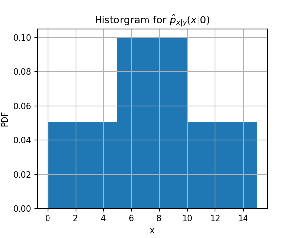

##### $p_{\text{x}|\text{y}}(x|1)$

בעבור הדגימות שבהם $\text{y}^{(i)}=1$ נקבל:

$$
\hat{p}_{\text{x}|\text{y},\mathcal{D}}(x|1)=\begin{cases}
\frac{2}{3(5-0)}=\frac{2}{15}&0\leq x<5\\
\frac{1}{3(10-5)}=\frac{1}{15}&5\leq x<10\\
\frac{0}{3(15-10)}=0&10\leq x<15
\end{cases}
$$

הפילוג המשותף יהיה אם כן:

|       | $0\leq x<5$                             | $5\leq x<10$                             | $10\leq x\leq 15$                      |
| ----- | --------------------------------------- | ---------------------------------------- | -------------------------------------- |
| $y=0$ | $\frac{1}{20}\frac{4}{7}=\frac{1}{35}$  | $\frac{1}{10}\frac{4}{7}=\frac{2}{35}$   | $\frac{1}{20}\frac{4}{7}=\frac{1}{35}$ |
| $y=1$ | $\frac{2}{15}\frac{3}{7}=\frac{2}{35}$  | $\frac{1}{15}\frac{3}{7}=\frac{1}{35}$   | $0\frac{3}{7}=0$                       |

#### 2)

אנו יודעים כי החזאי האופטימאלי תחת פונקציית המחיר של misclassification rate הינו הערך הכי סביר של $\text{y}$ בהינתן $\text{x}$. אם כן עלינו להשוות בין $p_{\text{y}|\text{x}}(1|6)$ לבין  $p_{\text{y}|\text{x}}(0|6)$.

באופן עקרוני עלינו לחשב את:

$$
p_{\text{y}|\text{x}}(y|x)=\frac{p_{\text{x},\text{y}}(x,y)}{p_{\text{x}}(x)}=\frac{p_{\text{x}|\text{y}}(x|y)p_{\text{y}}(y)}{p_{\text{x}}(x)}
$$

אך נשיב לב שהמכנה אינו משנה כלל לתוצאה מפני שהוא משותף לשני ההסתברויות המותנות שברצונינו להשוות ולכן מספיק להסתכל על:

$$
p_{\text{y}|\text{x}}(0|6)\propto p_{\text{x}|\text{y}}(6|0)p_{\text{y}}(0)=\frac{1}{10}\frac{4}{7}=\frac{2}{35}
$$

$$
p_{\text{y}|\text{x}}(1|6)\propto p_{\text{x}|\text{y}}(6|1)p_{\text{y}}(1)=\frac{1}{15}\frac{3}{7}=\frac{1}{35}
$$

ולכן הערך היותר סביר הוא 0 וזה יהיה החיזוי שלנו.

#### 3)

נחשב את הפילוג המשותף באופן דומה ונקבל:

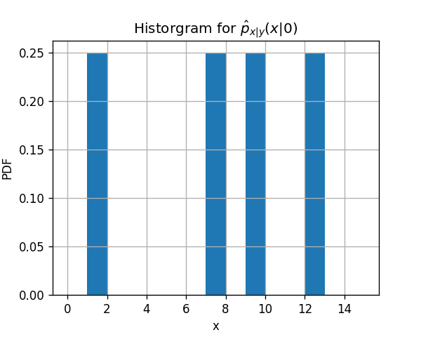

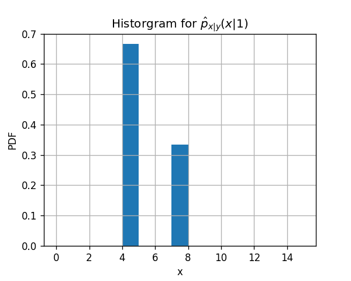

|       | $0\leq x<1$ | $1\leq x<2$   | $2\leq x<3$ | $3\leq x<4$ | $4\leq x<5$   | $5\leq x<6$ | $6\leq x<7$   | $7\leq x<8$   | $8\leq x<9$ | $9\leq x<10$  | $10\leq x<11$ | $11\leq x<12$ | $12\leq x<13$ | $13\leq x<14$ | $14\leq x\leq 15$ |
| ----- | ----------- | ------------- | ----------- | ----------- | ------------- | ----------- | ------------- | ------------- | ----------- | ------------- | ------------- | ------------- | ------------- | ------------- | ----------------- |
| $y=0$ | $0$         | $\frac{1}{7}$ | $0$         | $0$         | $0$           | $0$         | $0$           | $\frac{1}{7}$ | $0$         | $\frac{1}{7}$ | $0$           | $0$           | $\frac{1}{7}$ | $0$           | $0$           | $0$               |
| $y=1$ | $0$         | $0$           | $0$         | $0$         | $\frac{2}{7}$ | $0$         | $0$           | $\frac{1}{7}$ | $0$         | $0$           | $0$           | $0$           | $0$           | $0$           | $0$               |

בפילוג זה גם $p_{\text{y}|\text{x}}(1|6)$ וגם $p_{\text{y}|\text{x}}(0|6)$ שיווים ל0 ולכן שני הערכים של $\text{y}$ סבירים באותה המידה.

הבעיה עם הפילוג הזה הינה שנראה שלקחנו כמות תאים גדולה מידי ולכן ברוב התאים אין לנו דגימות בכלל ובנראה שהשיערוך שם לא מייצג כלל את הפילוג האמיתי.

#### 4)

בכדי לבנות כעת את הפונקציות הפילוג של $p_{\text{x}|\text{y}}(x|y)$ עלינו לקחת כל נקודה מהמדגם (עם ה $\text{y}$ המתאים) ולמקם סביבה חלון ריבועי ברוחב 5 ובגובה $\tfrac{1}{5}$. החלונות של הדגימות המתאימות ל $\text{y}=0$ הם:

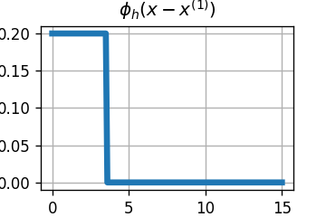

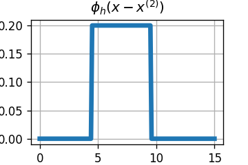

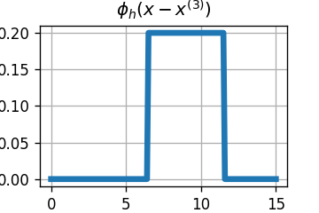

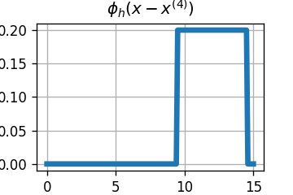

 פונקציית הפילוג תהיה הממוצע של כל החלונות הריבועיים:

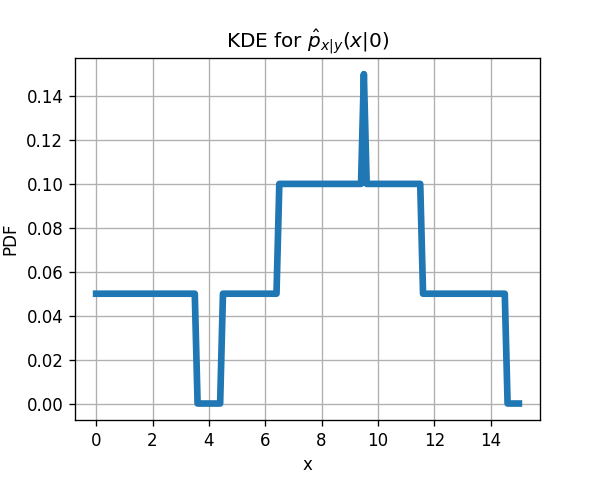

ובאופן דומה בעבור $\text{y}=1$:

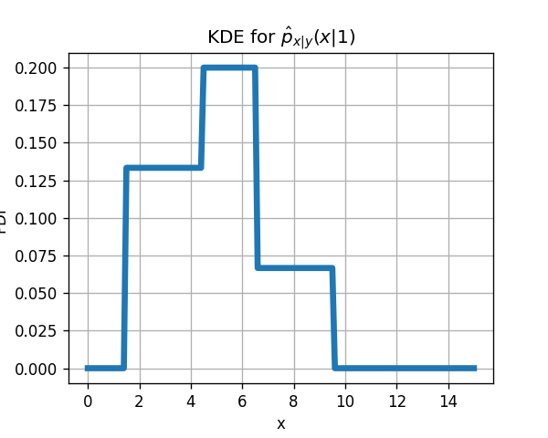

מכאן ש:

$$
p_{\text{x}|\text{y}}(6|0)=\frac{1}{20}
$$

$$
p_{\text{x}|\text{y}}(6|1)=\frac{1}{5}
$$

וההסתברות המותנית של $\text{y}$ ב $\text{x}$ היא

$$
p_{\text{y}|\text{x}}(0|6)\propto p_{\text{x}|\text{y}}(6|0)p_{\text{y}}(0)=\frac{1}{20}\frac{4}{7}=\frac{1}{35}
$$

$$
p_{\text{y}|\text{x}}(1|6)\propto p_{\text{x}|\text{y}}(6|1)p_{\text{y}}(1)=\frac{1}{5}\frac{3}{7}=\frac{3}{35}
$$

לכן הערך הסביר יותר הינו $\text{y}=1$.

למעשה בעבור כל שיטת שיערוך קיבלנו תוצאה שונה. עובדה זו מחזקת את הנקודה שלשיערוכים שנקבל ישנה תלות גבוהה בשיטה שנבחר להשתמש בה.

## תרגיל מעשי - שיערוך הפילוג של זמני נסיעה בניו יורק

<a href="./example/" class="link-button" target="_blank">Code</a>

נחזור למדגם של נסיעות המונית בניו יורק:

|    |   passenger count |   trip distance |   payment type |   fare amount |   tip amount |   pickup easting |   pickup northing |   dropoff easting |   dropoff northing |   duration |   day of week |   day of month |   time of day |
|---:|------------------:|----------------:|---------------:|--------------:|-------------:|-----------------:|------------------:|------------------:|-------------------:|-----------:|--------------:|---------------:|--------------:|
|  0 |                 2 |        2.76806  |              2 |           9.5 |         0    |          586.997 |           4512.98 |           588.155 |            4515.18 |   11.5167  |             3 |             13 |      12.8019  |
|  1 |                 1 |        3.21868  |              2 |          10   |         0    |          587.152 |           4512.92 |           584.85  |            4512.63 |   12.6667  |             6 |             16 |      20.9614  |
|  2 |                 1 |        2.57494  |              1 |           7   |         2.49 |          587.005 |           4513.36 |           585.434 |            4513.17 |    5.51667 |             0 |             31 |      20.4128  |
|  3 |                 1 |        0.965604 |              1 |           7.5 |         1.65 |          586.649 |           4511.73 |           586.672 |            4512.55 |    9.88333 |             1 |             25 |      13.0314  |
|  4 |                 1 |        2.46229  |              1 |           7.5 |         1.66 |          586.967 |           4511.89 |           585.262 |            4511.76 |    8.68333 |             2 |              5 |       7.70333 |
|  5 |                 5 |        1.56106  |              1 |           7.5 |         2.2  |          585.926 |           4512.88 |           585.169 |            4511.54 |    9.43333 |             3 |             20 |      20.6672  |
|  6 |                 1 |        2.57494  |              1 |           8   |         1    |          586.731 |           4515.08 |           588.71  |            4514.21 |    7.95    |             5 |              8 |      23.8419  |
|  7 |                 1 |        0.80467  |              2 |           5   |         0    |          585.345 |           4509.71 |           585.844 |            4509.55 |    4.95    |             5 |             29 |      15.8314  |
|  8 |                 1 |        3.6532   |              1 |          10   |         1.1  |          585.422 |           4509.48 |           583.671 |            4507.74 |   11.0667  |             5 |              8 |       2.09833 |
|  9 |                 6 |        1.62543  |              1 |           5.5 |         1.36 |          587.875 |           4514.93 |           587.701 |            4513.71 |    4.21667 |             3 |             13 |      21.7831  |

בתרגול זה אנו נשתמש רק בשני השדות הבאים:

- **duration**: משך הנסיעה הכולל בדקות.
- **time_of_day**: שעת תחילת הנסיעה כמספר (לא שלם)

(תיאור מלא של כל השדות בטבלה ניתן למצוא [פה](https://www1.nyc.gov/assets/tlc/downloads/pdf/data_dictionary_trip_records_yellow.pdf))

### המשימה: שיערוך הפילוג של זמן הנסיעה של מוניות

נהג מונית מעוניין לשערך את הפילוג של משך הנסיעות שלו. הוא לקח את הקורס מבוא למערכות לומדות והוא יודע שהוא יוכל לעשות זאת מתוך המידע ההיסטורי אותו אספה עיריית New York. בחלק זה של התרגול אנו נעזור לאותו נהג מונית לבצע שיערוך זה.

באופן פורמלי, אנו מעוניינים לשערך את הפילוג של משך ניסעות המונית בעיר כפונקציית פילוג מצרפי (CDF) או כפונקציית צפיפות הסתברות (PDF).

המדגם שלנו לבעיה זו יהיה אוסף משכי הנסיעה מהמדגם הכולל של פרטי הנסיעה. נסמן את המדגם של משך ב $\{x^{(i)}\}$.

### שיטה 1: ECDF

נחשב ונשרטט את ה ECDF על פני grid של ערכים בין 0 ל $\max(\{x^{(i)}\})$ בקפיצות של 0.001:

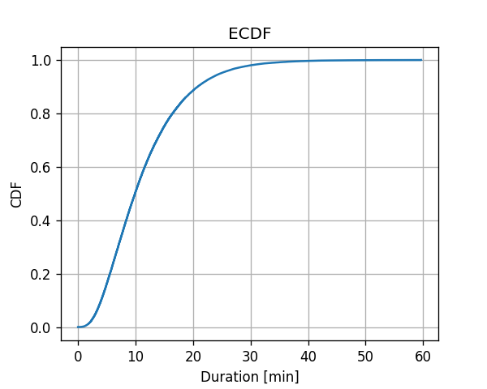

נסתכל מקרוב על איך נראית פונקציית ה ECDF:

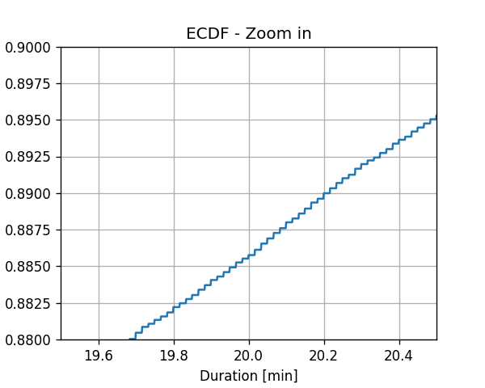

נשים לב שמערך ה ECDF יהיה תמיד מורכב מאוסף של פונקיות מדרגה.

#### שאלה

על פי פונקציית הפילוג המצרפי המושערכת, מהו הסיכוי שנסיעת מונית תערך יותר מ20 דקות?

##### תשובה

על פי הגדרת הפילוג המצרפי:

$$
\text{Pr}(\text{x}>20)=1-\text{Pr}(\text{x}\leq 20)=1-F_{\text{x}}(20)\approx1-0.89=0.11
$$

#### התלות בגודל המדגם

על מנת לראות את התלות של ה ECDF בגודל המדגם נחזור על החישוב עם כמויות קטנות יותר של דגימות במדגם. אנו נבחר בארקאי $N=10,10,1000$ דגימות מהמדגם ונחזור על החישוב. התוצאה:

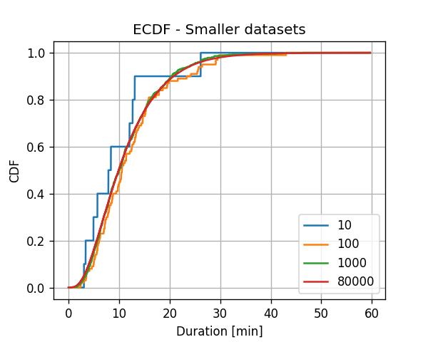

באופן לא מפתיע ניתן לראות כי ככל שאנו מגדילים את מספר הדגימות במדרגם המשערך מתקרב ליותר ויותר לפונצקציה חלקה וניתן גם להראות כי השערוך מתקרב (במובן סטיסטי) לפונקציית הפילוג המצרפי האמיתית.

### שיטה 2: היסטוגרמה

נחשב את ההסטוגרמה של משך הנסיעה בעבור חלוקה של התחום ל30, 300 ו 3000 תאים.

*תזכורת*: כלל האצבע לבחירה של מספר התאים הינו $\sqrt{B}=\sqrt{80000}\approx 280$$.

תוצאה:

לפני שנבחן את התוצאות, נריץ מבחן נוסף. ננסה לשערך באופן איכותי את ה variance של כל אחת מההיסטוגרמות. לשם כך נפצל את המגדם ל8 תתי מדגמים שווים ונחשב ההיסטוגרמה בעבור כל אחד משמונת תתי המדגם.

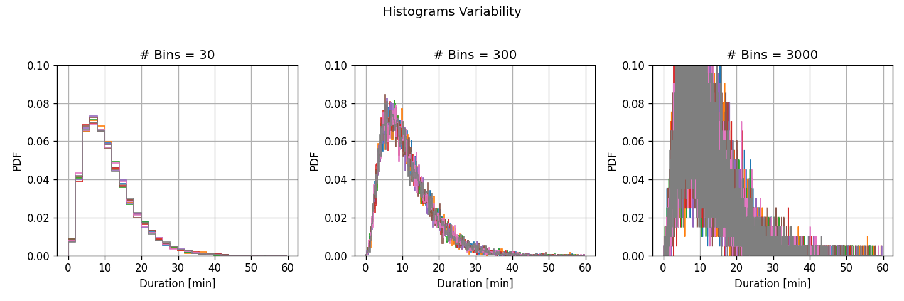

בכדי להגיד את השונות של ההשיערוך בצורה טובה יותר נחסר משמונת השיערוכים את הממוצע שלהם:

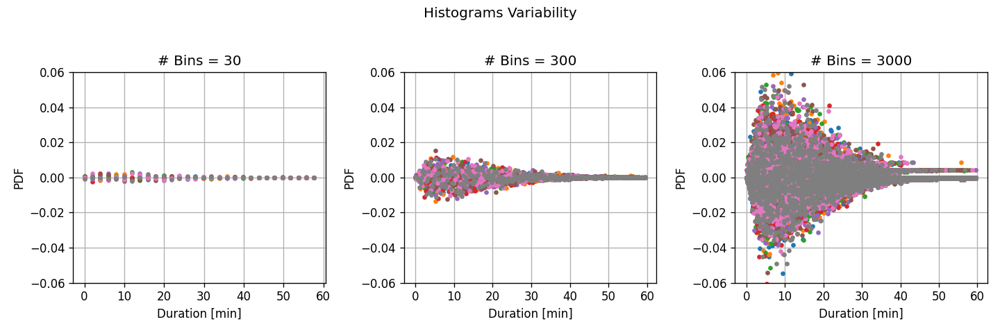

ניתן לראות כי:

- בעבור **מספר גדול של תאים**, ההבדלים בין תתי המדגם השונים (**שונות גדולה**) גדול והתאים צרים ולכן ההיסטוגרמה יכולה לקרב בצורה יותר טובה את פונקציית הצפיפות האמיתית (**הטיה קטנה**)
- בעבור **מספר קטן של תאים**, ההבדלים בין תתי מדגמים שונים קטן (**שונות קטנה**) אך התאים מאד רחבים ולכן לא יכולים לקרב את הפונקציה האמיתי בצורה טובה (**הטיה גדולה**)

זהו למעשה אותו bias-variance tradeoff:

- כאשר **מספר התאים גדול**, כל תא יהיה צר ומקור השגיאה העיקרי ינבע מה**אקראיות** של המדגם הגורמת לשינויים גדולים במספר היחסי של נקודות אשר נופלות בכל תא. שגיאה זו נובעת מה variance של המשערך. שגיאה זו תלך ותקטן ככל שנגדיל את כמות הדגימות במדגם.
- כאשר **מספר התאים קטן**, מקור השגיאה העקרי ינבע מ**יכולת הייצוג המוגבלת** של המודל שלנו. שגיאה זו נובעת מה bias של המשערך.

אנו כמובן נשאף לבחור ערך ביניים אשר לא סובל מ variance גדול מידי וגם לא מ bias גדולה מידי. כלל ההאבצע מנסה לתת לעזור לנו לבחור ערך שכזה.

### שיטה 3: KDE

נשערך כעת את פונקציית צפיפות ההסתברות בעזרת KDE עם חלון גאוסי. נבחן ערכים שונים לרוחב החלון $$\sigma=0.08,0.8,8$$.

תזכורת, כלל האצבע מציע לבחור רוחב של: $\sigma=1.06\ \text{std}(\text{x}) N^{-\tfrac{1}{5}}\approx0.775$

לשם השוואה, נשרטט גם את ההסטוגרמה עם ה 300 תאים:

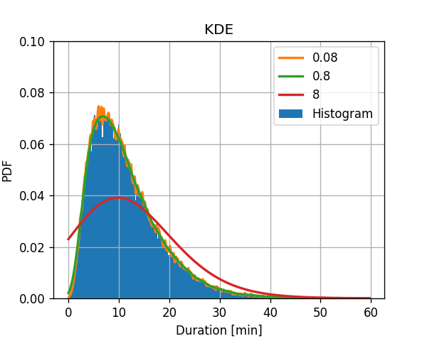

שוב אנו רואים את ה bias-variance tradeoff:

- עבור בחירה של **רוחב צר** המשערך יכולה לקרב פרטים "עדינים" יותר, אבל השיערוך רועש יותר.זוהי שגיאת ה variance.
- עבור בחירה של **רוחב רחב** המשערך מחליק את הפרטים הקטנים, אבל השיערוך פחות רועש יותר. זוהי שגיאת bias.

### בעיית חיזוי: האם נסיעה התרחשה בזמן שעות העבודה

נניח ושועת העבודה ב NYC מוגדרות כשעות שבין 7:00 ו18:00. נגדיר משתנה אקראי בינארי $\text{y}$ אשר שווה ל 1 עם נסיעה התרחשב בזמן שעות העבודה ו-0 אחרת.

נרצה לבנות חזאי ל $\text{y}$ על סמך $\text{x}$ אשר ימזער את ה**missclassification rate**. נעשה זאת תחת הגישה הגנרטיבית.

נפעל בדומה לתרגיל 6.3. השלבים לפתרון הבעיה:

1. שיערוך הפולוג השולי של $\text{y}$, זאת אומרת $\hat{p}_{\text{y},\mathcal{D}}(y)$.
2. שיערוך הפולוג המותנה של $\text{x}$ בהינתן $\text{y}$, זאת אומרת $\hat{p}_{\text{x}|\text{y},\mathcal{D}}(x|y)$, בעבור כל אחד משני הערכים של $\text{y}$.
3. בניית החזאי האופטימאלי בהינתן הפילוג המשוערך על פי: $h(x)=\underset{y}{\arg\max}\ \hat{p}_{\text{y}|\text{x},\mathcal{D}}(y|x)$.

#### שלב 1: שיערוך של $\hat{p}_{\text{y},\mathcal{D}}(y)$

$\text{y}$ הוא משתנה דיסקרטי ולכן השיערוך של של הפילוג שלו פשוט:

$$
\hat{p}_{\text{y},\mathcal{D}}(y)=\frac{1}{N}\sum_{i=1}^N I\{y^{(i)}=y\}
$$

נקבל כי:

$$
\hat{p}_{\text{y},\mathcal{D}}(y)=
\begin{cases}
0.51&y=0\\
0.49&y=1\\
\end{cases}
$$

##### חיזוי עיוור

אם היה ברצונינו לתת חיזוי עיוור (ללא ידיעת $\text{x}$) להאם נסיעה התרחשה במהלך שעות העבודה הינו מעוניינים לתת את החיזוי הבא:

$$
\hat{y}=\underset{y}{\arg\max}\ \hat{p}_{\text{y},\mathcal{D}}(y)=0
$$

הסיבה שזהו החיזוי האידאלי נובעת ישירות מן העובדה שיש במדגם יותר נסיעות שהתרחשו מחוץ לשעות העבודה, לכן שיערכנו שיש סיכוי מעט יותר גדול שנסיעה אקראית תתרחש בשעות אלה ולכן יש לנו סיכוי קטן יותר לטעות בעבור חיזוי זה.

##### הערכת ביצועים לחיזוי עיוור

נחשב את ה missclassification rate של החיזוי העיוור (חיזוי קבוע של 1) על ה test set. נקבל את הציון של: $0.49$.

#### שלב 2: שיערוך $\hat{p}_{\text{x}|\text{y},\mathcal{D}}(x|y)$

נשתמש פעמים ב KDE על מנת לשערך את הפילוג המותנה פעם אחת בעבור הדגימות שבהם $\text{y}=0$ ופעם נוספת בעבור הדגימות שבהם $\text{y}=1$:

ניתן לראות כי ישנו שוני קטן בין הפילוגים. לנסיעות מחוץ לשעות העבודה ישנה נטיה קלה יותר לטובת זמני נסיעה קצרים יותר. הבדל קטן זה יעזור לנו לשפר את במעט את יכולת החיזוי שלנו.

#### שלב 3: בניית החזאי

עלינו לחשב את:

$$
h(x)=\underset{y}{\arg\max}\ \hat{p}_{\text{y}|\text{x},\mathcal{D}}(y|x)
$$

נתחיל בלהפוך את הפילוג המותנה בביטוי בעזרת חוק בייס על מנת לקבל ביטוי אשר תלוי בפילוגים שחישבנו:

$$
=\underset{y}{\arg\max}\quad
\frac{
  \hat{p}_{\text{x}|\text{y},\mathcal{D}}(x|y)
  \hat{p}_{\text{y},\mathcal{D}}(y)
}{
  \hat{p}_{\text{x},\mathcal{D}}(x)
}
$$

כפי שציינו בתרגיל 6.3, ניתן להיפתר מהאיבר במכנה משום שהוא אינו תלוי ב $y$:

$$
=\underset{y}{\arg\max}\quad
\hat{p}_{\text{x}|\text{y},\mathcal{D}}(x|y)
\hat{p}_{\text{y},\mathcal{D}}(y)
=\begin{cases}
1&\hat{p}_{\text{x}|\text{y},\mathcal{D}}(x|1)\hat{p}_{\text{y},\mathcal{D}}(1)>
  \hat{p}_{\text{x}|\text{y},\mathcal{D}}(x|0)\hat{p}_{\text{y},\mathcal{D}}(0)\\
0&\text{else}
\end{cases}
$$

מכאן שהחיזוי יהיה 1 שבאיזורים שבהם $\hat{p}_{\text{x}|\text{y},\mathcal{D}}(x|1)\hat{p}_{\text{y},\mathcal{D}}(1)>\hat{p}_{\text{x}|\text{y},\mathcal{D}}(x|0)\hat{p}_{\text{y},\mathcal{D}}(0)$ ו-0 בכל השאר.

חישוב תנאי זה על פני כל התחום נותן את פונקציית החיזוי הבאה:

מכאן שהחיזוי שלנו יהיה:

$$
\hat{y}\left(x\right)=
\begin{cases}
1 & x\geq11.4 \\
0 & \text{otherwise}
\end{cases}
$$

#### הערכת ביצועים

נחשב את ה missclassification rate על ה test set. נקבל את הציון של: $0.46$. ציון זה הוא רק מעט יותר טוב מהחיזוי העיוור אשר היה נותן ציון של $0.49$. כפי שציינו קודם השיפור הקטן מגיע מההבדלים הקלים שבין שתי הפילוגים של הנסיעות בשעות העבודה ומחוצה להם. במקרה זה קיבלנו אומנם שיפור קטן אך ככל שנסתמך בחיזוי שלנו על יותר משתנים השיפורים הקטנים האלו יצברו ונוכל בסוף להגיע לחיזויים מאד מדוייקים.