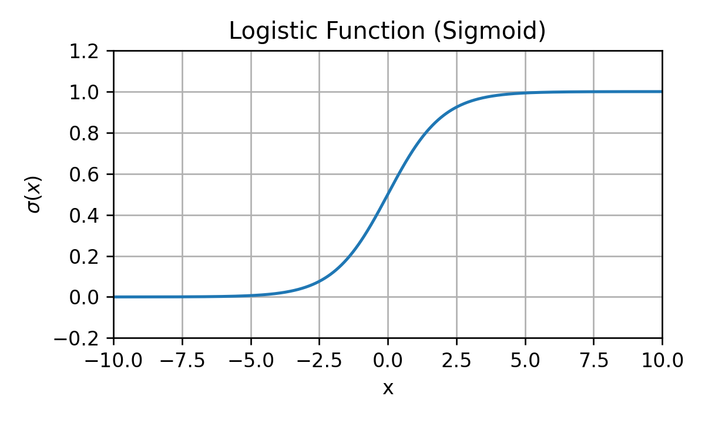
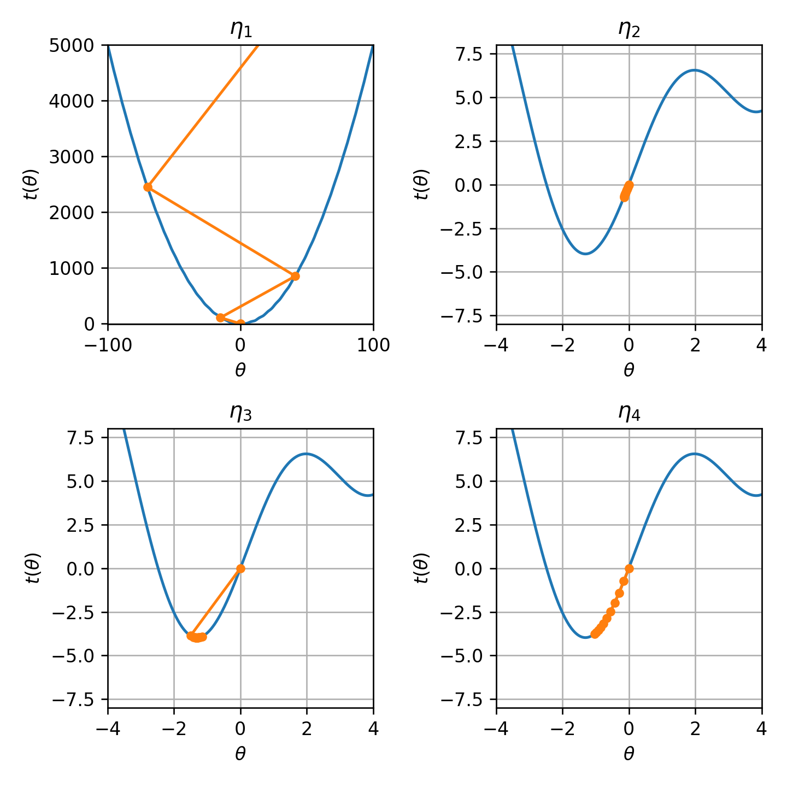
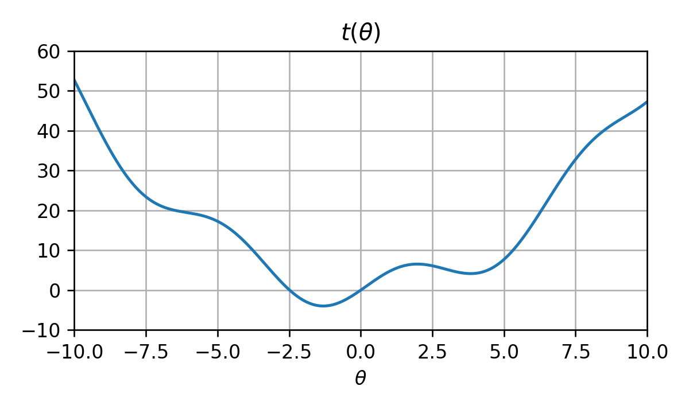
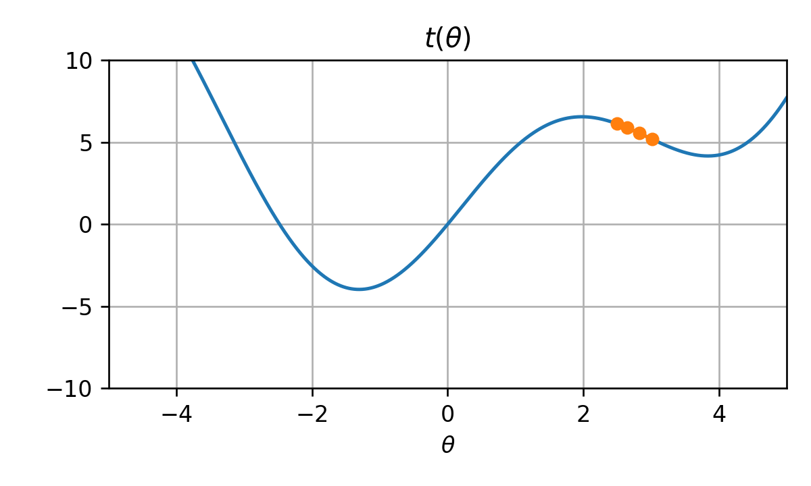
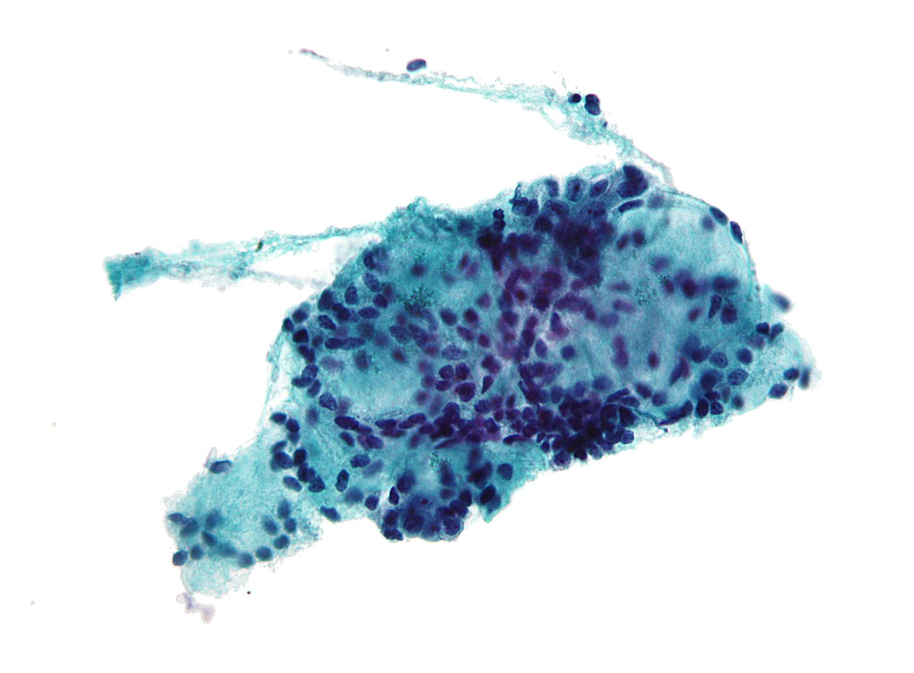
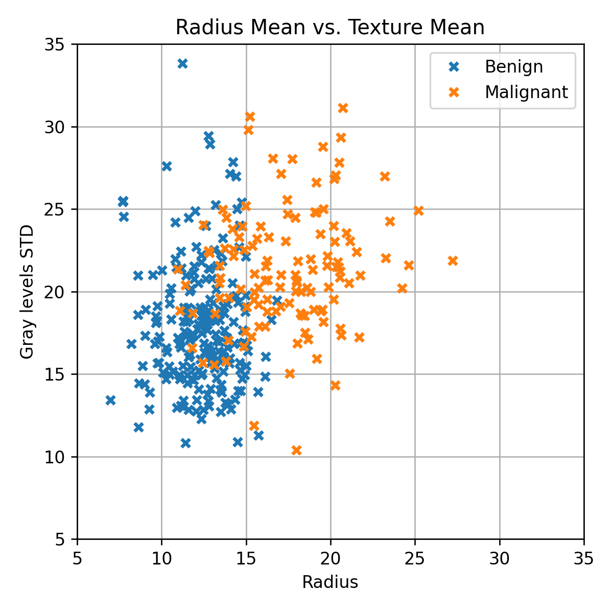
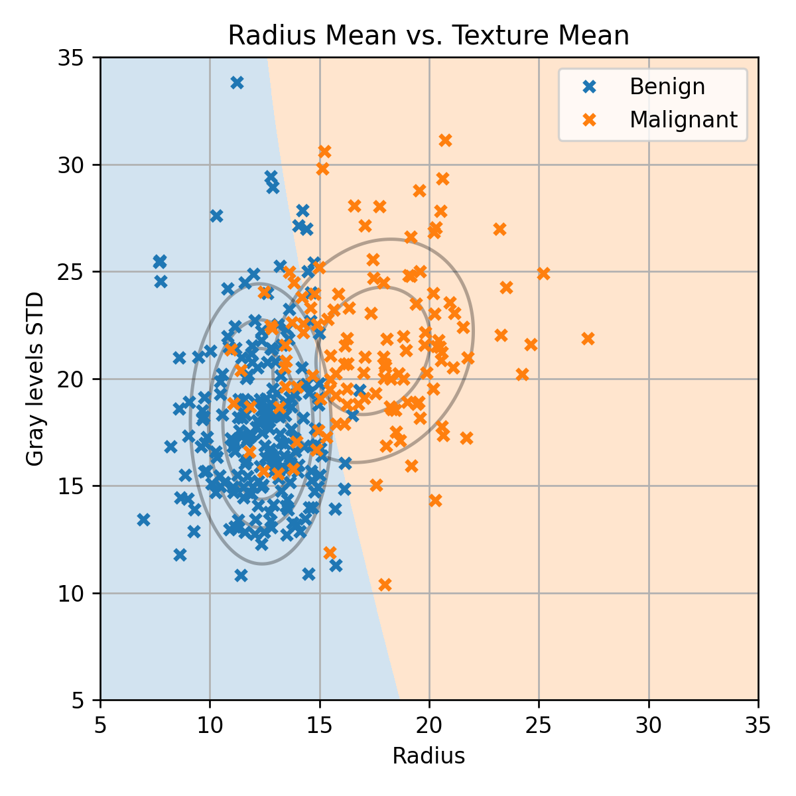
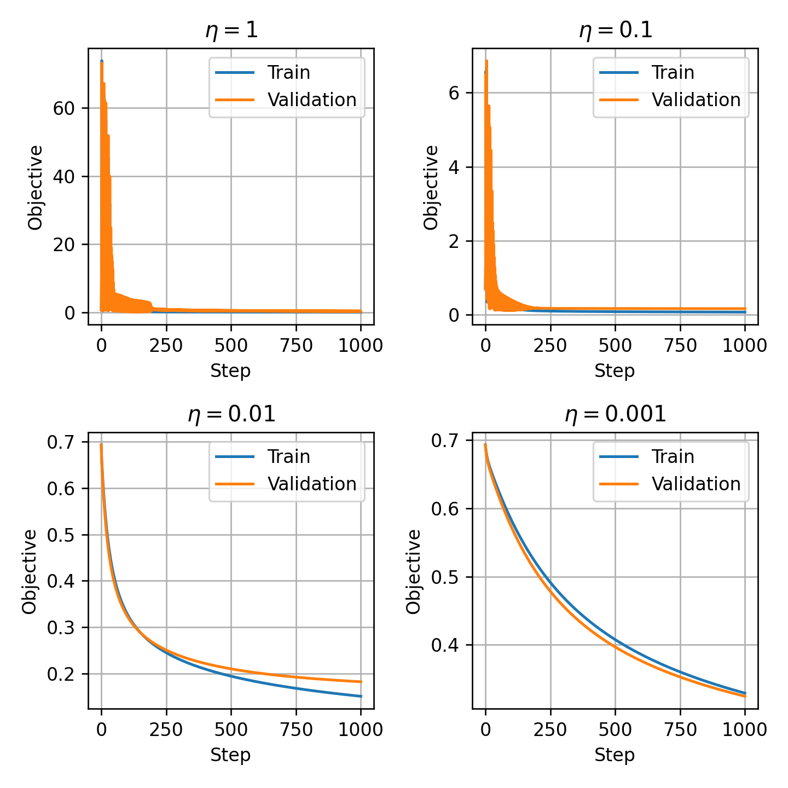

# תרגול 8 - Logistic Regression and Gradient Descent

<!-- <a href="./slides/" class="link-button" target="_blank">Slides</a> -->
<a href="/assets/tutorial08.pdf" class="link-button" target="_blank">PDF</a>
<a href="./code/" class="link-button" target="_blank">Code</a>

## תקציר התיאוריה

### הגישה הדיסקרימינטיבית הסתברותית

בגישה זו ננסה ללמוד את מודל פרמטרי אשר ימדל ישירות את $p_{\text{y}|\mathbf{x}}(y|\boldsymbol{x})$ (מבלי ללמוד את הפילוג של $\mathbf{x}$). גישה זו יעילה מאד לבעיות סיווג, בהם קל לבנות מודלים פרמטריים $p_{\text{y}|\mathbf{x}}(y|\boldsymbol{x};\boldsymbol{\theta})$ שהם פונקציות הסתברות חוקיות (חיובית שהסכום עליה הוא 1). את הפרמטריים של המודל הפרמטרי נלמד לרוב בעזרת MLE או MAP.

### הפונקציה הלוגיסטית (סיגמואיד)

הפונקציה הלוגיסטית מקבלת מספר בתחום $[-\infty,\infty]$ ומחזירה מספר בין 0 ל 1. היא לרוב מסומנת ב $\sigma$:

$$
\sigma(z)=\frac{1}{1+e^{-z}}
$$

והיא נראית כך:

פונקציה זו שימושית לצורך הגדרת מודלים הסתברותיים של משתנים בינארים.

**הערה**: בתחום של מערכות לומדות מקובל לכנות את הפונקציה הזו **סיגמואיד (sigmoid)** למרות שמבחינה מתמטית השם הזה מתאר משפחה הרבה יותר רחבה של פונקציות בעלות צורה של S.

#### תכונות

- $\sigma(-z)=1-\sigma(z)$.
- $\frac{\partial}{\partial z}\log(\sigma(z))=1-\sigma(z)$

### פונקציית ה Softmax

פונקציית ה softmax היא הרחבה של הפונקציה הלוגיסטית, והיא יכולה לשמש למידול פונקציית ההסתברות של משתנים דיסקרטיים לא בינאריים (אך סופיים). הפונקציית לוקחת וקטור כלשהו $\boldsymbol{z}$ באורך $C$ ומייצרת ממנו וקטור חדש חיובי שסכום האיברים שלו הוא 1. הפונקציה מוגדרת באופן הבא:

$$
\text{softmax}(\boldsymbol{z})=\frac{1}{\sum_{c=1}^C e^{z_c}}[e^{z_1},e^{z_2},\dots,e^{z_C}]^{\top}
$$

או לחילופין, הערך של האיבר ה $i$ של הפונקציה הינו:

$$
\text{softmax}(\boldsymbol{z})_i=\frac{e^{z_i}}{\sum_{c=1}^C e^{z_c}}
$$

#### תכונות

- אינווריאנטיות לתוספת של קבוע (לכל אברי הוקטור): $\text{softmax}(\boldsymbol{z} + a)_i=\text{softmax}(\boldsymbol{z})_i\ \forall i$.
- $\frac{\partial}{\partial z_j} \log(\text{softmax}(\boldsymbol{z}))_i=\underbrace{\delta_{i,j}}_{=I\{i=j\}}-\text{softmax}(\boldsymbol{z})_j$

### Logistic Regression

בניגוד לשם, logistic regression היא שיטה לפתרון בעיות סיווג בגישה הדיסקרימינטיבית הסתברותית. בשיטה זו אנו נבחר $C$ פונקציות פרמטריות כל שהם $f_c(\boldsymbol{x};\boldsymbol{\theta}_c)$ ונשתמש בהם על מנת לבנות מודל פרמטרי. נסמן:

- את הוקטור $\boldsymbol{\theta}$ כוקטור אשר כולל את כל $C$ וקטורי הפרמטרים: $\boldsymbol{\theta}=[\boldsymbol{\theta}_1^{\top},\boldsymbol{\theta}_2^{\top},\dots,\boldsymbol{\theta}_C^{\top}]^{\top}$.
- את הפונקציה $\boldsymbol{f}$ כפונקציה המאגדת את כל $C$ הפונקציות הפרמטריות: $\boldsymbol{f}=[f_1(\boldsymbol{x};\boldsymbol{\theta}_1),f_2(\boldsymbol{x};\boldsymbol{\theta}_2),\dots,f_C(\boldsymbol{x};\boldsymbol{\theta}_C)]^{\top}$

את הפילוג המותנה נמדל באופן הבא:

$$
p_{\text{y}|\mathbf{x}}(y|\boldsymbol{x};\boldsymbol{\theta})
=\text{softmax}(\boldsymbol{f}(\boldsymbol{x};\boldsymbol{\theta}))_{y}
=\frac{e^{f_y(\boldsymbol{x};\boldsymbol{\theta}_y)}}{\sum_{c=1}^C e^{f_c(\boldsymbol{x};\boldsymbol{\theta}_c)}}
$$

לבעיות ה MLE וה MAP של מודל זה אין פתרון סגור ואנו נחפש את הפתרון לבעיית האופטימיזציה בעזרת gradient descent.

#### ביטול היתירות של המודל

בגלל האינווריאנטיות של פונקציית ה softmax המודל הפרמטרי המוגדר על ידי הפונקציות $f_c$ יהיה אינווריאנטי לשינויים מהצורה של: $f_c(\boldsymbol{x};\boldsymbol{\theta}_c)\rightarrow f_c(\boldsymbol{x};\boldsymbol{\theta}_c)+g(\boldsymbol{x})$.
 דרך נפוצה לבטל יתירות זו הינה על ידי קיבוע של אחת הפונקציות הפרמטריות, לרוב הראשונה $c=1$, להיות שווה זהותית ל 0: $f_1(\boldsymbol{x};\boldsymbol{\theta}_1)=0$.

#### המקרה הבינארי

במקרה הבינארי ישנם רק שתי מחלקות ($C=2$), אותם נסמן ב 0 ו 1. נקבע את הפונקציה הפרמטרית של המחלקה של $\text{y}=0$ להיות זהותית 0. נקבל את המודל הפרמטרי הבא:

$$
p_{\text{y}|\mathbf{x}}(0|\boldsymbol{x};\boldsymbol{\theta})
=\frac{1}{1+e^{f(\boldsymbol{x};\boldsymbol{\theta})}}
=1-\sigma(f(\boldsymbol{x};\boldsymbol{\theta}))
$$

$$
p_{\text{y}|\mathbf{x}}(1|\boldsymbol{x};\boldsymbol{\theta})
=\frac{e^{f(\boldsymbol{x};\boldsymbol{\theta})}}{e^{f(\boldsymbol{x};\boldsymbol{\theta})}+1}
=\frac{1}{1+e^{-f(\boldsymbol{x};\boldsymbol{\theta})}}
=\sigma(f(\boldsymbol{x};\boldsymbol{\theta}))
$$

#### רגרסיה לוגיסטית לינארית

הגרסא הלינארית של הרגרסיה הלוגיסטית היא המקרה שבו בוחרים את הפונקציות הפרמטריות להיות פונקציות לינאריות:

$$
f_c(\boldsymbol{x};\boldsymbol{\theta}_c)=\boldsymbol{\theta}_c^{\top}\boldsymbol{x}
$$

במקרה זה פונקציית ה objective שיש למזער היא קמורה (convex) ולכן מובטח ש gradient descnet, במידה והוא מתכנס, יתכנס למינימום גלובלי.

### Gradient descent (שיטת הגרדיאנט)

בעבור בעיית המינמיזציה:

$$
\underset{\boldsymbol{\theta}}{\arg\min}\quad g(\boldsymbol{\theta})
$$

Gradient descent מנסה למצוא מינימום לוקאלי של $g(\boldsymbol{\theta})$ על ידי כך שהוא מתחיל בנקודה אקראית כל שהיא במרחב ואז מתקדם בצעדים קטנים בכיוון ההפוך מהגרדיאנט, שהוא הכיוון שבו ה objective קטן בקצב המהיר ביותר. זהו אלגוריתם חמדן (greedy) אשר מנסה בכל צעד לשפר במעט את מצבו ביחס לשלב הקודם.

#### האלגוריתם

- מאתחלים את $\boldsymbol{\theta}^{(0)}$ בנקודה אקראית כל שהיא.
- חוזרים על צעד העדכון הבא עד שמתקיים תנאי עצירה כל שהוא:

    $$
    \boldsymbol{\theta}^{(t+1)}=\boldsymbol{\theta}^{(t)}-\eta \nabla_{\boldsymbol{\theta}}g(\boldsymbol{\theta}^{(t)})
    $$

הפרמטר $\eta$ קובע את גודל הצעדים שהאלגוריתם יעשה.

#### תנאי עצירה

ישנם מספר דרכים להגדיר תנאי עצירה לאגוריתם:

- הגעה למספר צעדי עדכון שנקבע מראש: $t>\text{max-iter}$.
- כאשר הנורמה של הגרדיאנט קטנה מתחת לערך סף מסויים שנקבע מראש: $\lVert\nabla_{\boldsymbol{\theta}}g(\boldsymbol{\theta})\rVert_2<\epsilon$
- כאשר השיפור ב objective קטן מערך סף מסויים שנקבע מראש: $g(\boldsymbol{\theta}^{(t-1)})-g(\boldsymbol{\theta}^{(t)})<\epsilon$
- שימוש בעצירה מוקדמת על מנת להתמודד עם overfitting (נרחיב על כך בהרצאה הבאה)

#### בעיית הבחירה של גודל הצעד

בכדי לגרום לאלגוריתם להתכנס (ולא להתבדר) אנו נאלץ לבחור גודל צעד שהוא לא גדול מידי. בפועל, בצורתו הפשוטה אלגוריתם ה gradient descent הוא מאד בעייתי משום שבכדי למנוע התבדרות גודל הצעד צריך להיות מאד קטן שידרוש מספר לא פרקטי של צעדים לצורך התכנסות.

## תרגיל 8.1 - אלגוריתם הגרדיאנט

נתונה בעיית האופטימיזציה הבאה:

$$
\underset{\theta}{\arg\min}\ \tfrac{1}{2}\theta^2+5\sin(\theta)
$$

**1)** נסו לפתור את הבעיה על ידי גזירה והשוואה ל-0. הגיעו למשוואה (סתומה) אשר מגדירה את נקודות המינימום האפשריות.

**2)** רשמו את צעד העידכון של אלגוריתם הגרדיאנט.

**3)** חשבו את שלושת צעדי העדכון הראשונים עבור אתחול של $\theta^{(0)}=0$, וצעד לימוד של $\eta=0.1$.

**4)** חשבו את שלושת צעדי העדכון הראשונים עבור אתחול של $\theta^{(0)}=2.5$, וצעד לימוד של $\eta=0.1$. מודע האלגוריתם יתכנס כעת לפתרון אחר מבסעיף הקודם? 

**5)** הגרפים הבאים מציגים עשר איטרציות של gradient descent בעבור ארבעה ערכים שונים של גודל צעד: $\eta=\{0.003, 0.03,0.3,3\}$. התאם בין גודל הצעד לגרפים.

### פתרון 8.1

#### 1)

נסמן את ה objective (פונקציית המטרה) של בעיית האופטימיזציה ב:

$$
t(\theta)=\tfrac{1}{2}\theta^2+5\sin(\theta)
$$

נגזור אותו ונשווה אותו ל-0:

$$
\begin{aligned}
\frac{\partial}{\partial\theta}t(\theta)&=0 \\
\Leftrightarrow \theta+5\cos(\theta)&=0 \\
\Leftrightarrow \theta&=-5\cos(\theta)
\end{aligned}
$$

בפועל זה אומר שעלינו למצוא את נקודות החיתוך של הפונקציות הבאות:

למשוואה זו אין פתרון אנליטי.

#### 2)

צעד העדכון של הגרדיאנט יהיה:

$$
\theta^{(t+1)}=\theta^{(t)}-\eta\frac{\partial}{\partial\theta}t(\theta)=\theta^{(t)}-\eta\left(\theta^{(t)}+5\cos(\theta^{(t)})\right)
$$

#### 3)

נאתחל את האלגוריתם עם $\theta^{(0)}=0$ ונבצע שלושה צעדים (עם $\eta=0.1$):

$$
\theta^{(1)}
=\theta^{(0)}-\eta\left(\theta^{(0)}+5\cos(\theta^{(0)})\right)
=0-0.1\left(0+5\cos(0)\right)=-0.5
$$

$$
\theta^{(2)}
=\theta^{(1)}-\eta\left(\theta^{(1)}+5\cos(\theta^{(1)})\right)
=-0.5-0.1\left(-0.5+5\cos(-0.5)\right)=-0.889
$$

$$
\theta^{(3)}
=\theta^{(2)}-\eta\left(\theta^{(2)}+5\cos(\theta^{(2)})\right)
=-0.889-0.1\left(-0.889+5\cos(-0.889)\right)=-1.115
$$

(נקודת האופטימום האמיתי הינה $\theta=-1.30644$)

#### 4)

נחזור על הפתרון עם אתחול של $\theta^{(0)}=2.5$ ונבצע שלושה צעדים:

$$
\theta^{(1)}=2.65
$$

$$
\theta^{(2)}=2.83
$$

$$
\theta^{(2)}=3.02
$$

בעבור האתחול הזה אלגוריתם יתכנס לפתרון אחר מאשר הפתרון בסעיף הקודם. זאת כמובן משום ש gradient descent מתכנס למינימום לוקאלי, לכן בעבור איתחולים שונים האלגוריתם עלול להתכנס לפתרונות שונים.

#### 5)

הפרמטר $\eta$ קובע כאמור את גדול הצעד.

- גודל צעד גדול מידי עשוי להרחיק בכל צעד את האלגוריתם מנקודת המינימום, כפי שקורה במקרה של $\eta_1$. גודל הצעד שמתאים למקרה זה הינו הערך הגדול ביותר, זאת אומרת 3.

- גודל הצעד השני הכי גדול הינו 0.3 והוא מתאים ל $\eta_3$. במקרה זה הצעדים עושים "over shoot" ועוברים במרבית הפעמים את המינימום אך עדיין מתקרבים אליו בכל צעד.

- גודל הצעד השלישי הכי גדול הינו 0.03 הוא מתאים ל $\eta_4$. כאן האופטימיזציה מתקדמת לאט לאט באופן עקבי לכיוון המינימים.

- גודל הצעד הקטן ביות הינו $0.003$ והוא מתאים ל $\eta_2$ במקרה זה ההתקדמות היא מאד איטית ויקח לאלגוריתם מספר רב של צעדים על מנת להתקרב למינימום.

## תרגיל 8.2 - צעד העדכון של logistic regression

**1)** בעבור המקרה של רגרסיה לוגיסטית בינארית, הראו כי ניתן לרשום את המודל של פונקציית ההסתברות המותנית באופן הבא:

$$
p_{\text{y}|\mathbf{x}}(y|\boldsymbol{x};\boldsymbol{\theta})=\sigma\left((-1)^{y+1} f(\boldsymbol{x};\boldsymbol{\theta})\right)
$$

**2)** נסתכל על אלגוריתם gradient descent אשר מנסה למצוא פיתרון לבעיית ה MLE בעבור רגרסיה לוגיסטית בינארית. הראו שניתן לרשום את צעד העדכון של האלגוריתם באופן הבא:

$$
\boldsymbol{\theta}^{(t+1)}=\boldsymbol{\theta}^{(t)}-\eta\sum_{i=1}^{N}(1-p_{\text{y}|\mathbf{x}}(y^{(i)}|\boldsymbol{x}^{(i)};\boldsymbol{\theta}^{(t)}))(-1)^{y^{(i)}} \nabla_{\boldsymbol{\theta}}f(\boldsymbol{x}^{(i)};\boldsymbol{\theta}^{(t)})
$$

**3)** ננסה לתת פרשנות אינטואיטיבית לתפקיד של האיברים השונים בצעד העדכון מהסעיף הקודם.

נתחיל בכך שנתעלם מהביטוי $(1-p_{\text{y}|\mathbf{x}}(y^{(i)}|\boldsymbol{x}^{(i)};\boldsymbol{\theta}))$. ונקבל את צעד העדכון הבא:

$$
\boldsymbol{\theta}^{(t+1)}=\boldsymbol{\theta}^{(t)}-\eta\sum_{i=1}^{N}(-1)^{y^{(i)}} \nabla_{\boldsymbol{\theta}}f(\boldsymbol{x}^{(i)};\boldsymbol{\theta}^{(t)})
$$

הסבירו כיצד ישפיע כל צעד עידכון על הפונקציה $f(\boldsymbol{x};\boldsymbol{\theta})$. ספציפית הסבירו מה יקרה לערך של הפונקציה בנקודות $\boldsymbol{x}^{(i)}$? התייחסו להשפעה השונה יש לדגימות עם $y=1$ ולדגימות עם $y=0$ מהמדגם.

**4)** נחזיר כעת את האיבר $(1-p_{\text{y}|\mathbf{x}}(y^{(i)}|\boldsymbol{x}^{(i)};\boldsymbol{\theta}))$. למה שווה איבר זה במקרים בהם המודל הפרמטרי נותן הסתברות גבוהה לדגימה כל שהיא $\{\boldsymbol{x}^{(i)},y^{(i)}\}$? ולמה הוא שווה במקרים בהם המודל נותן הסתברות נמוכה לדגימה כל שהיא?

התייחסו לאיבר זה כאל איבר מישקול, אשר נותן משקל שונה לכל דגימה מהמדגם. הסבירו מה תהיה ההשפעה של משקול זה על צעד העדכון.

**5)** (לקריאה עצמית) נרחיב את הדוגמא למקרה הלא בינארי. הראו שניתן לכתוב את צעד העדכון של אלגוריתם ה gradient discent במקרה הלא בינארי באופן הבא:

$$
\boldsymbol{\theta}^{(t+1)}_c=\boldsymbol{\theta}^{(t)}_c-\eta\sum_{i=1}^{N}
\left(\delta_{y^{(i)},c}-p_{\text{y}|\mathbf{x}}(c|\boldsymbol{x}^{(i)};\boldsymbol{\theta}^{(t)})\right)
\nabla_{\boldsymbol{\theta}_c} f_c(\boldsymbol{x}^{(i)};\boldsymbol{\theta}^{(t)}_c)\quad\forall c
$$

הסבירו את התפקיד של $\nabla_{\boldsymbol{\theta}_c} f_c(\boldsymbol{x};\boldsymbol{\theta}^{(t)})$ ושל $\left(\delta_{y,c}-p_{\text{y}|\mathbf{x}}(c|\boldsymbol{x}^{(i)};\boldsymbol{\theta}^{(t)})\right)$ בצעד העדכון.

### פתרון 8.2

#### 1)

נשחק מעט עם הצורה של המודל הפרמטרי בכדי להגיע לצורה אותה בקשו בשאלה:

$$
\begin{aligned}
p_{\text{y}|\mathbf{x}}(y|\boldsymbol{x};\boldsymbol{\theta})
&=\begin{cases}
    \sigma(f(\boldsymbol{x};\boldsymbol{\theta})) & y=1 \\
    1-\sigma(f(\boldsymbol{x};\boldsymbol{\theta})) & y=0 \\
\end{cases}\\
&=\begin{cases}
    \sigma(f(\boldsymbol{x};\boldsymbol{\theta})) & y=1 \\
    \sigma(-f(\boldsymbol{x};\boldsymbol{\theta})) & y=0 \\
\end{cases}\\
&=\sigma\left((-1)^{y+1} f(\boldsymbol{x};\boldsymbol{\theta})\right)
\end{aligned}
$$

#### 2)

נציב את המודל הפרמטרי כפי שרשמנו אותו בסעיף הקודם:

$$
\begin{aligned}
\boldsymbol{\theta}^*
&=\underset{\boldsymbol{\theta}}{\arg\min}\ -\sum_{i=1}^{N}\log\left(p_{\text{y}|\mathbf{x}}(y^{(i)}|\boldsymbol{x}^{(i)};\boldsymbol{\theta})\right)\\
&=\underset{\boldsymbol{\theta}}{\arg\min}\ 
\underbrace{
    -\sum_{i=1}^{N}\log\left(\sigma\left((-1)^{y^{(i)}+1} f(\boldsymbol{x}^{(i)};\boldsymbol{\theta})\right)\right)
}_{\overset{\Delta}{=}t(\boldsymbol{\theta})}
\end{aligned}
$$

לשם הנוחות, סימנו את ה objective של בעיית האופטימיזציה ב $t(\boldsymbol{\theta})$. נחשב את הגרדיאנט של ה objective וננסה להביא אותו לצורה דומה לזו שבקשו בשאלה:

$$
\begin{aligned}
\nabla_{\boldsymbol{\theta}}t(\boldsymbol{\theta})
&=-\sum_{i=1}^{N}\nabla_{\boldsymbol{\theta}}\log\left(\sigma\left((-1)^{y^{(i)}+1} f(\boldsymbol{x}^{(i)};\boldsymbol{\theta})\right)\right)\\
&=-\sum_{i=1}^{N}\left(1-\sigma\left((-1)^{y^{(i)}+1}f(\boldsymbol{x}^{(i)};\boldsymbol{\theta})\right)\right)\nabla_{\boldsymbol{\theta}}\left((-1)^{y^{(i)}+1} f(\boldsymbol{x}^{(i)};\boldsymbol{\theta})\right)\\
&=\sum_{i=1}^{N}(1-p_{\text{y}|\mathbf{x}}(y^{(i)}|\boldsymbol{x}^{(i)};\boldsymbol{\theta}))(-1)^{y^{(i)}} \nabla_{\boldsymbol{\theta}}f(\boldsymbol{x}^{(i)};\boldsymbol{\theta})\\
\end{aligned}
$$

צעד העדכון של אלגוריתם ה gradient descent יהיה אם כן:

$$
\boldsymbol{\theta}^{(t+1)}=\boldsymbol{\theta}^{(t)}-\eta\sum_{i=1}^{N}(1-p_{\text{y}|\mathbf{x}}(y^{(i)}|\boldsymbol{x}^{(i)};\boldsymbol{\theta}^{(t)}))(-1)^{y^{(i)}} \nabla_{\boldsymbol{\theta}}f(\boldsymbol{x}^{(i)};\boldsymbol{\theta}^{(t)})
$$

#### 3)

נתייחס לצעד עדכון מהצורה של:

$$
\boldsymbol{\theta}^{(t+1)}=\boldsymbol{\theta}^{(t)}-\eta\sum_{i=1}^{N}(-1)^{y^{(i)}} \nabla_{\boldsymbol{\theta}}f(\boldsymbol{x}^{(i)};\boldsymbol{\theta}^{(t)})
$$

נסתכל על התרומה של הדגימות מהמדגם ששייכים למחלקה $y=1$ (אשר גורר: $(-1)^y=-1$). איברים אלו ינסו לשנות את $\boldsymbol{\theta}$ בכיוון הגרדיאנט בנקודות $\boldsymbol{x}^{(i)}$ ששיכות למחלקה. זאת אומרת, שהם ינסו לגרום לשינוי של הפרמטריים כך שהערך של הפונקציה הפרמטרית $f(\boldsymbol{x};\boldsymbol{\theta})$ בנקודות $\boldsymbol{x}^{(i)}$ יהיה גדול יותר.

באופן הפוך, התרומה של הדגימות מהמחלקה $y=0$ (ו $(-1)^y=1$) תהיה לנסות ולעדכן את $\boldsymbol{\theta}$ בכיוון ההפוך מהגרדיאנט. זאת אומרת, שהם ינסו להקטין את הערך של $f(\boldsymbol{x};\boldsymbol{\theta})$ בנקודות $\boldsymbol{x}^{(i)}$ מהמחלקה $y=0$.

בסה"כ הכל נקבל שהאלגוריתם ינסה בכל צעד לשנות את  $f(\boldsymbol{x};\boldsymbol{\theta})$ כך שיניב ערכים גבוהים על הנקודות $\boldsymbol{x}$ שמתאימות ל $y=1$ וערכים נמוכים על הנקודות שמתאימות ל $y=0$. התנהגות זו הגיונית משום שזה בדיוק מה שאנחנו רוצים מהמודל שלנו, שאמור לחזות את ההסתברות ש $\text{y}=1$ בהינתן $\mathbf{x}$. משום שהסתברות זו שווה ל $\sigma(f(\boldsymbol{x};\boldsymbol{\theta}))$ אנו רוצים רוצים ש $f$ יניב ערכים גבוהים באיזורים שבהם $\text{y}=1$ בסבירות גבוהה בהינתן $\mathbf{x}$ וערכים נמוכים בשאר המקומות.

#### 4)

נסתכל על הביטוי $(1-p_{\text{y}|\mathbf{x}}(y^{(i)}|\boldsymbol{x}^{(i)};\boldsymbol{\theta}))$. נזכור שההסתברות $p_{\text{y}|\mathbf{x}}$ היא מספר בין 0 ל 1.האיבר כולו יהיה לכן קרוב ל-0 כאשר הסתברות של $y$ מסויים בהינתן $\boldsymbol{x}$ היא גבוהה והוא יהיה קרוב ל-1 כאשר ההסתברות נמוכה.

נזכור גם כי $p_{\text{y}|\mathbf{x}}(y^{(i)}|\boldsymbol{x}^{(i)};\boldsymbol{\theta})$ היא אינה ההסתברות האמיתית של $\mathbf{x}$ ו $\text{y}$ אלא ההסתברות שהמודל שלנו נותן לדגימה כל שהיא מהמדגם. (אנו רוצים שבסופו של דבר שמודל זה יהיה קרוב להסתברות האמיתית). היינו מעניינים שככל שנעשה יותר צעדי עדכון המודל יגדיל לאט לאט את ההסתברות שהוא נותן לדגימות במדגם (זו בעצם המטרה של MLE ו MAP).

נסתכל על איבר זה כעל משקל בין 0 ל 1 שמשוייך לכל דגימה במדגם. לדגימות שהמודל חושב הם סבירות הוא נותן משקל קרוב ל 0 ולדגימות שהמודל נותן להם סבירות נמוכה הוא נותן משקל 1. מה שאיבר זה עושה לצעד העידכון הוא לגרום לו יחסית להתעלם מדגימות שכבר מקבלות סבירות גבוהה ולהתמקד בדגימות שהוא עדיין "טועה" עליהם, זאת אומרת, שהוא נותן להם הסתברות נמוכה.

#### 5)

בעיית ה MLE הינה:

$$
\begin{aligned}
\boldsymbol{\theta}^*
&=\underset{\boldsymbol{\theta}}{\arg\min}\ -\sum_{i=1}^{N}\log\left(p_{\text{y}|\mathbf{x}}(y^{(i)}|\boldsymbol{x}^{(i)};\boldsymbol{\theta})\right)\\
&=\underset{\boldsymbol{\theta}}{\arg\min}\ 
\underbrace{
    -\sum_{i=1}^N \log\left(\text{softmax}(\boldsymbol{f}(\boldsymbol{x}^{(i)};\boldsymbol{\theta}))_{y^{(i)}}\right)
}_{\overset{\Delta}{=}t(\boldsymbol{\theta})}
\end{aligned}
$$

נחשב את הגרדיאנט של ה objective:

$$
\begin{aligned}
\nabla_{\boldsymbol{\theta}_c}t(\boldsymbol{\theta})
&=-\sum_{i=1}^{N}\nabla_{\boldsymbol{\theta}_c}
\log\left(\text{softmax}(\boldsymbol{f}(\boldsymbol{x}^{(i)};\boldsymbol{\theta}))_{y^{(i)}}\right)\\
&=-\sum_{i=1}^{N}
\left(\delta_{y^{(i)},c}-\text{softmax}(\boldsymbol{f}(\boldsymbol{x}^{(i)};\boldsymbol{\theta}))_c\right)
\nabla_{\boldsymbol{\theta}_c} f_c(\boldsymbol{x}^{(i)};\boldsymbol{\theta})\\
&=-\sum_{i=1}^{N}
\left(\delta_{y^{(i)},c}-p_{\text{y}|\mathbf{x}}(c|\boldsymbol{x}^{(i)};\boldsymbol{\theta})\right)
\nabla_{\boldsymbol{\theta}_c} f_c(\boldsymbol{x}^{(i)};\boldsymbol{\theta})
\end{aligned}
$$

צעד העדכון יהיה:

$$
\boldsymbol{\theta}^{(t+1)}_c=\boldsymbol{\theta}^{(t)}_c-\eta\sum_{i=1}^{N}
\left(\delta_{y^{(i)},c}-p_{\text{y}|\mathbf{x}}(c|\boldsymbol{x}^{(i)};\boldsymbol{\theta}^{(t)})\right)
\nabla_{\boldsymbol{\theta}_c} f_c(\boldsymbol{x}^{(i)};\boldsymbol{\theta}^{(t)}_c)\quad\forall c
$$

האיבר $\left(\delta_{y^{(i)},c}-p_{\text{y}|\mathbf{x}}(c|\boldsymbol{x}^{(i)};\boldsymbol{\theta}^{(t)})\right)$ הוא חיובי כאשר $c=y^{(i)}$ ושלילי אחרת. איבר זה גורם לכך שבעבור כל דגימה מהמדגם צעד העדכון ינסה לגדיל את הפונקציה הפרמטרית $f_c(\boldsymbol{x}^{(i)};\boldsymbol{\theta}^{(t)}_c)$ שבה $c=y^{(i)}$ ויקטין את הפונקציות הפרמטריות שבהם $c\neq y^{(i)}$.

בדומה למקרה הבינארי ככל שהסבירות של הדגימה במדגם $p_{\text{y}|\mathbf{x}}(y^{(i)}|\boldsymbol{x}^{(i)};\boldsymbol{\theta})$ כך ההשפעה של הדגימה על העדכון יהיה קטן יותר.

## תרגיל 8.3 - MLE and KL divergence

בתרגיל זה נציג דרך ארחת לפתח את בעיית האופטימיזציה של משערך ה MLE.

נתון לנו מדגם של $N$ דגימות i.i.d. של משתנה אקראי כל שהוא $\text{x}$:

$$
\mathcal{D}=\{x^{(i)}\}_{i=1}^N
$$

ומודל פרמטרי כל שהוא $p_{\text{x}}(x;\boldsymbol{\theta})$. נרצה לבחור את הפרמטרים של המודל $\boldsymbol{\theta}$ כך שהמודל יתאר בצורה טובה את הדגימות במדגם.

לשם כך נשתמש במדד הבא אשר מודד עד כמה פונקציית צפיפות הסתברות כל שהיא $q_{\text{x}}(x)$ תהיה טובה בכדי לתאר דגימות המגיעות מצפיפות הסתברות אחרת $p_{\text{x}}(x)$. המדד נקרא Kullback-Leibler divergence והוא מוגד באופן הבא:

$$
D_{\text{KL}}(p_{\text{x}}(x)||q_{\text{x}}(x))
=\int p_{\text{x}}(x)\log\left(\frac{p_{\text{x}}(x)}{q_{\text{x}}(x)}\right)
=\mathbb{E}_{(p)}\left[\log\left(\frac{p_{\text{x}}(x)}{q_{\text{x}}(x)}\right)\right]
$$

הסימון $\mathbb{E}_{(p)}$ הוא תוחלת לפי הפילוג $p_{\text{x}}$. מדד זה מגיע מתורת האינפורמציה ואנו לא ניכנס למשמעות ולמקור של מדד זה. ככל שהמדד נמוך יותר כך הפילוגים קרובים יותר.

השתמשו במדד זה על מנת להגדיר בעיית אופטימיזציה שבוחרת את הפרמטרים של המודל כפרמטרים כך שהם ממזערים את ה Kullback-Leibler divergence בין המודל הפרמטרי לפילוג האמיתי. בכדי להיפתר מהתוחלת על הפילוג הלא ידוע החליפו אותו בתוחלת אמפירית על המדגם. הראו כי בעיית האופטימיזציה המתקבלת זהה לזו של משערך ה MLE.

### פתרון 8.3

נסמן את הפילוג האמיתי (הלא ידוע) של $\text{x}$ ב $p_{\text{x}}(x)$ (בלי $\boldsymbol{\theta}$). בעיית האופטימיזציה שהיינו רוצים לפתור הינה:

$$
\begin{aligned}
\boldsymbol{\theta}^*
&=\underset{\boldsymbol{\theta}}{\arg\min}\ D_{\text{KL}}(p_{\text{x}}(x)||p_{\text{x}}(x;\boldsymbol{\theta})) \\
&=\underset{\boldsymbol{\theta}}{\arg\min}\ \mathbb{E}_{(p)}\left[\log\left(\frac{p_{\text{x}}(x)}{p_{\text{x}}(x;\boldsymbol{\theta})}\right)\right] \\
&=\underset{\boldsymbol{\theta}}{\arg\min}\ \mathbb{E}_{(p)}\left[\log(p_{\text{x}}(x))\right]
                                          - \mathbb{E}_{(p)}\left[\log(p_{\text{x}}(x;\boldsymbol{\theta}))\right] \\
&=\underset{\boldsymbol{\theta}}{\arg\min}\ -\mathbb{E}_{(p)}\left[\log(p_{\text{x}}(x;\boldsymbol{\theta}))\right] \\
\end{aligned}
$$

נחליף את התוחלת בתוחלת אמפירית על המדגם:

$$
\begin{aligned}
\boldsymbol{\theta}^*
&=\underset{\boldsymbol{\theta}}{\arg\min}\ -\frac{1}{N}\sum_{i=1}^N \log(p_{\text{x}}(x^{(i)};\boldsymbol{\theta})) \\
\end{aligned}
$$

שזה בדיוק המינימיזציה של ה log-likelihood עד כדי החלוקה ב $N$ שלא משנה את בעיית האופטימיזציה.

## תרגיל מעשי - איבחון סרטן שד

<a href="./example/" class="link-button" target="_blank">Code</a>

שיטה נפוצה כיום לאבחון של סרטן הינה בשיטת Fine-needle aspiration. בשיטה זו נלקחת דגימה של רקמה בעזרת מחט ומבוצעת אנליזה בעזרת מיקרוסקופ על מנת לאבחן שני מקרים:

- Malignant - רקמה סרטנית
- or Benign - רקמה בריאה

להלן דוגמא לתמונת מיקרוסקופ של דגימה שכזו:

בתרגול זה נעבוד עם מדגם בשם **Breast Cancer Wisconsin Diagnostic** אשר נאסף על ידי חוקרים מאוניברסיטת ויסקונסין. הוא כולל 30 ערכים מספריים, כגון שטח התא הממוצע והרדיוס ההמוצע, אשר חושבו בעבור 569 דגימות שונות. בנוסף יש לכל דגימה במדגם תווית של האם הדגימה הינה סרטנית או לא.

את המדגם המקורי ניתן למצוא פה: [Breast Cancer Wisconsin (Diagnostic) Data Set](https://archive.ics.uci.edu/ml/datasets/Breast+Cancer+Wisconsin+%28Diagnostic%29), אנחנו נשתמש בגרסא מעט מעובדת שלו הנמצאת [פה](https://technion046195.netlify.app/datasets/wdbc.csv).

נציג כמה עמודות ושורות מייצגות מהמדגם:

|    | diagnosis   |   radius_mean |   texture_mean |   perimeter_mean |   area_mean |   smoothness_mean |   compactness_mean |   concavity_mean |
|---:|:------------|--------------:|---------------:|-----------------:|------------:|------------------:|-------------------:|-----------------:|
|  0 | M           |         17.99 |          10.38 |           122.8  |      1001   |           0.1184  |            0.2776  |          0.3001  |
|  1 | M           |         20.57 |          17.77 |           132.9  |      1326   |           0.08474 |            0.07864 |          0.0869  |
|  2 | M           |         19.69 |          21.25 |           130    |      1203   |           0.1096  |            0.1599  |          0.1974  |
|  3 | M           |         11.42 |          20.38 |            77.58 |       386.1 |           0.1425  |            0.2839  |          0.2414  |
|  4 | M           |         20.29 |          14.34 |           135.1  |      1297   |           0.1003  |            0.1328  |          0.198   |
|  5 | M           |         12.45 |          15.7  |            82.57 |       477.1 |           0.1278  |            0.17    |          0.1578  |
|  6 | M           |         18.25 |          19.98 |           119.6  |      1040   |           0.09463 |            0.109   |          0.1127  |
|  7 | M           |         13.71 |          20.83 |            90.2  |       577.9 |           0.1189  |            0.1645  |          0.09366 |
|  8 | M           |         13    |          21.82 |            87.5  |       519.8 |           0.1273  |            0.1932  |          0.1859  |
|  9 | M           |         12.46 |          24.04 |            83.97 |       475.9 |           0.1186  |            0.2396  |          0.2273  |

רק לשם המחשה נתחיל בניסיון לחזות האם הרקמה סרטנית או לא רק על פי שתי השדות הראשונים:

- **radius_mean** - רדיוס התא הממוצא בדגימה.
- **texture_mean** - סטיית התקן הממוצעת של רמת האפור בצבע של כל תא בדגימה.

השל התוויות $\text{y}$ הינו:

- **diagnosis** - התווית של הדגימה: M = malignant (סרטני), B = benign (בריא)

(בחרנו להתחיל עם 2 שדות משום שמעבר לכך כבר לא נוכל לשרטט את הפילוג של הדגימות ואת החיזוי).

נרצה למצוא חזאי אשר יפריד בין הנקודות הכתומות לנקודות הכחולות. לשם כך נפצל את המדגם ל 60% train / 20% validation / 20% test. להתאים שלושה מודלים: LDA, QDA, linear logistic regression.

### LDA

נחשב את פרמטרים של המודל:

$$
p_{\text{y}}(0)=\frac{|\mathcal{I}_0|}{N}=0.37
$$

$$
p_{\text{y}}(1)=\frac{|\mathcal{I}_1|}{N}=0.63
$$

$$
\boldsymbol{\mu}_0 = \frac{1}{|\mathcal{I}_0|}\sum_{i\in \mathcal{I}_0}\boldsymbol{x}^{(i)}=[12.3,17.9]^{\top}
$$

$$
\boldsymbol{\mu}_1 = \frac{1}{|\mathcal{I}_1|}\sum_{i\in \mathcal{I}_1}\boldsymbol{x}^{(i)}=[17.5,21.3]^{\top}
$$

$$
\Sigma = \frac{1}{N}\sum_{i}\left(\boldsymbol{x}^{(i)}-\boldsymbol{\mu}_{y^{(i)}}\right)\left(\boldsymbol{x}^{(i)}-\boldsymbol{\mu}_{y^{(i)}}\right)^T
=\begin{bmatrix}
5.8 & 0.67 \\
0.67 & 13.5
\end{bmatrix}
$$

פרמטרים אלו יתנו את החיזוי הבא:

נזכיר כי החזאי המתקבל ממודל ה LDA הינו חזאי אשר מחלק את המרחב לשני חלקים על ידי משטח לינארי (במקרה זה קו ישר).

ביצועי חזאי זה על ה valudation set (במובן של misclassification rate) הינם: 0.09. זאת אומרת שאנו צפויים לצדוק באבחון ב 91% מהמקרים.

### QDA

נחשב את פרמטרים של המודל. הפרמטרים של $p_{\text{y}}(y)$ ו $\boldsymbol{\mu}_c$ לא ישתנו. נחשב לכן רק את מטריצות הקווריאנס:

$$
\Sigma_0 = \frac{1}{|\mathcal{I}_0|}\sum_{i\in \mathcal{I}_0}\left(\boldsymbol{x}^{(i)}-\boldsymbol{\mu}_0\right)\left(\boldsymbol{x}^{(i)}-\boldsymbol{\mu}_0\right)^T
=\begin{bmatrix}
3.3 & -0.13 \\
-0.13 & 13.8
\end{bmatrix}
$$

$$
\Sigma_1 = \frac{1}{|\mathcal{I}_1|}\sum_{i\in \mathcal{I}_1}\left(\boldsymbol{x}^{(i)}-\boldsymbol{\mu}_1\right)\left(\boldsymbol{x}^{(i)}-\boldsymbol{\mu}_1\right)^T
=\begin{bmatrix}
10.2 & 2 \\
2 & 13.2
\end{bmatrix}
$$

פרמטרים אלו יתנו את החיזוי הבא:

החזאי המתקבל ממודל ה QDA מחלק את המרב על ידי משטח ריבועי. בשרטוט זה המשטח אומנם נראה כמעט ישר אך אם נגדיל טיפה את השרטוט נראה שהוא אכן ריבועי:

ביצועי חזאי זה על ה valudation set הינם: 0.08. זהו שיפור של 1% מביצועיו של מודל ה LDA.

### שימוש בכל 30 העמודות במדגם

אם נחזור על החישוב של מודל ה QDA רק עם כל 30 העמודות שבמדגם נקבל miscalssification rate של 0.02.

### Linear Logistic Regression

ננסה כעת להתאים מודל של linear logistic regression מהצורה:

$$
p_{\text{y}|\mathbf{x}}(1|\boldsymbol{x};\boldsymbol{\theta})
=\sigma(\boldsymbol{x}^{\top}\boldsymbol{\theta}))
$$

בעיית האופטימיזציה של MLE תהיה:

$$
\boldsymbol{\theta}^*
=\underset{\boldsymbol{\theta}}{\arg\min}\ -\sum_{i=1}^{N}
I\{y^{(i)}=0\}\log(\sigma(\boldsymbol{x}^{(i)\top}\boldsymbol{\theta}))
+I\{y^{(i)}=1\}\log(1-\sigma(\boldsymbol{x}^{(i)\top}\boldsymbol{\theta}))
$$

נשתמש ב gradient descent על מנת למצוא את הפרמטרים של המודל. בכדי לבחור את גודל הצעד ננסה כמה ערכים שונים ונריץ את האלגוריתם למספר קטן של צעדים (1000) ונבחר את גודל הצעד הגדול אשר גודם למודל להתכנס. בדוגמא זו נציג את התוצאות בעבור 4 ערכים של גודל הצעד:

בגרפים האלה רואים את החישוב של ה objective על ה train set ועל ה validation set כפונקציה של מספר הצעדים. נשים לב שבעבור בחירה של $\eta=0.1$ או $\eta=1$ המודל מתבדר לערכים מאד גדולים וזה ימנע ממנו להתכנס למינימום של הפונקציית המטרה. נבחר אם כן את גודל הצעד להיות $\eta=0.01$ ונריץ את האלגוריתם מספר רב של צעדים (1000000):

נראה אם כן שגם אחרי מליון צעדים הארלגוריתם עדיין לא התכנס. כפי שציינו זוהי אחת הבעיות העיקריות של אלגוריתם הגרדיאנט בצורתו הפשוטה. למזלנו, ישנם מספר שיטות פשוטות לשפר את האלגוריתם בכדי לפתור בעיה זו אך אנו לא נפרט עליהם בקורס זה.

הביצועים של המודל עם הפרמטרים המתקבלים אחרי מיליון צעדים נותנים miscalssification rate של 0.02 שזה דומה לתוצאה שקיבלנו על ידי שימוש ב QDA.

ביצועי המודל על ה test set הינם: 0.04.

