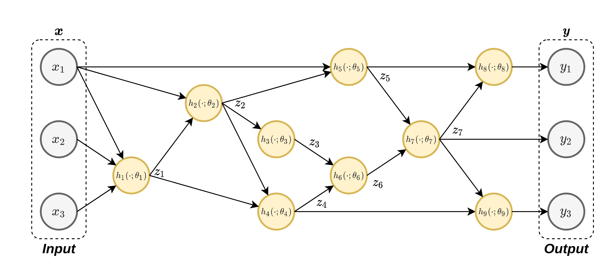
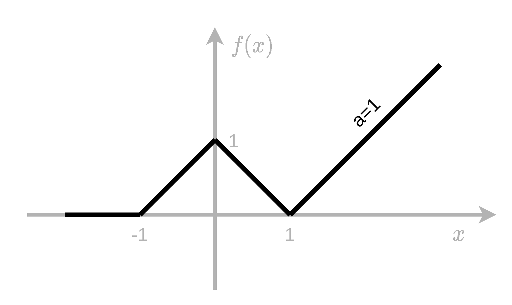
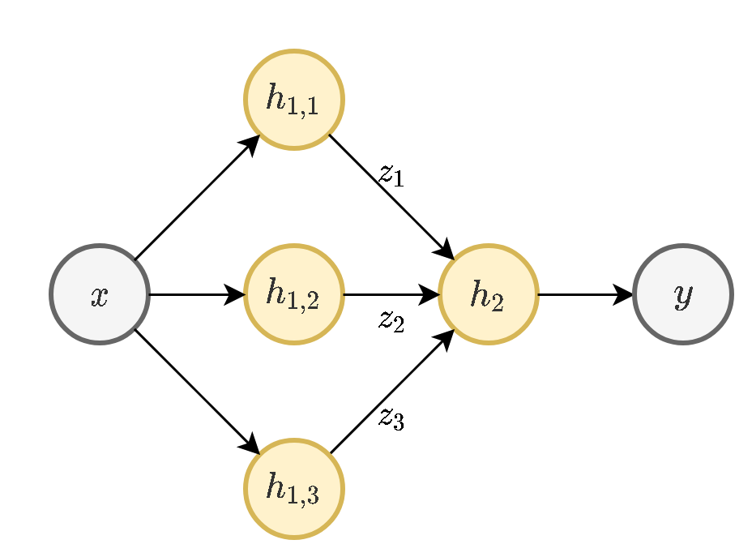
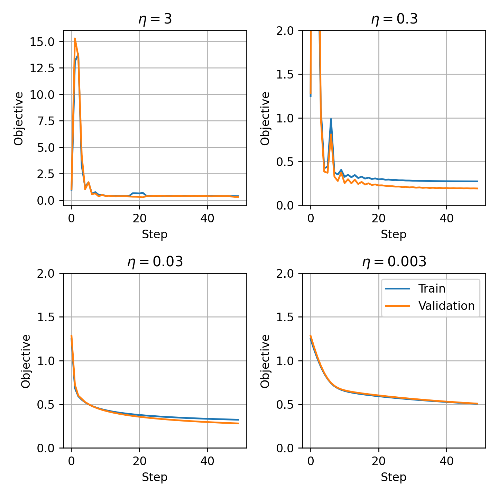
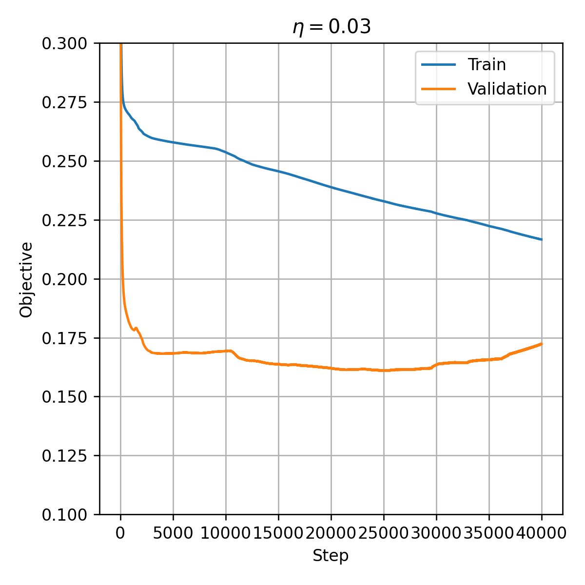
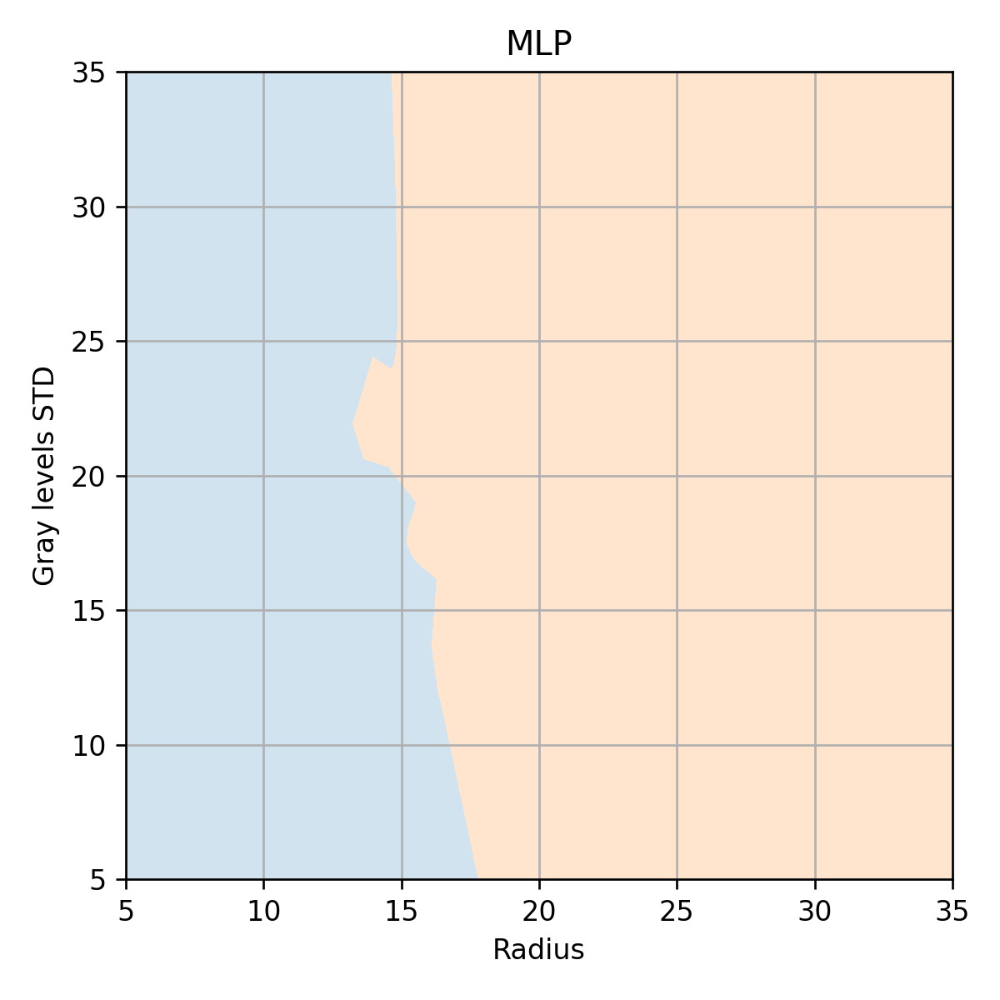
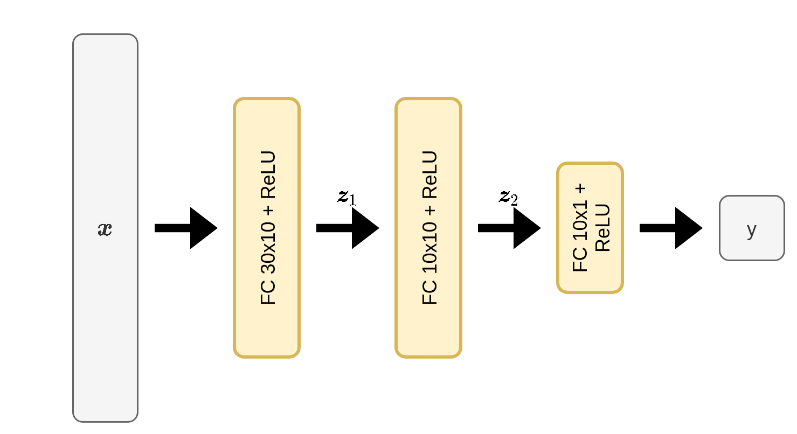
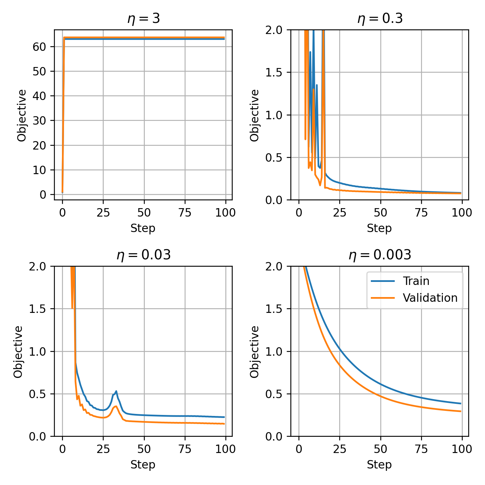
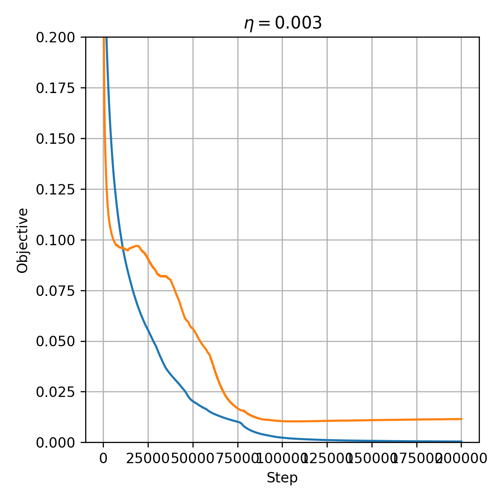

<section class="center">
<section>

# תרגול 9 - MLP and Back-propagetion

<a href="/assets/tutorial09_slides.pdf" class="link-button" target="_blank">PDF</a>

</section><section>

## תקציר התיאוריה

</section><section>

### Artificial Neural Networks (ANN)

* רשתות ניורונים מלאכותיות הינן שיטה לבניה של פונקציות פרמטריות.
* במקור, השיטה הינה בהשראת רשתות נוירונים ביולוגיות.
* ברשתות נוירונים מלאכותיות נשלב הרבה פונקציות פרמטריות פשוטות על מנת לקבל מודל אשר יכול לייצג פונקציות מורכבות.
* לרוב, הפונקציות הפשוטות יקבלו מספר משתנים ויחזירו סקלר.

</section><section>

</section><section>

 לרוב נבחר את הפונקציות הפשוטות להיות מהצורה של:
$$
h(\boldsymbol{x};\boldsymbol{w},b)=\varphi(\boldsymbol{w}^{\top}\boldsymbol{x}+b)
$$

*  $\varphi$ סקאלרית לא לינארית ומכונה פונקציית ההפעלה.
* בחירות נפוצות של הפונקציית ההפעלה הינן:
  * הפונקציה הלוגיסטית (סיגמואיד): $\varphi(x)=\sigma(x)=\frac{1}{1+e^{-x}}$
  * טנגנס היפרבולי: $\varphi(x)=\tanh\left(x/2\right)$
  * ReLU (Rectified Linear Unit):  $\varphi(x)=\max(x,0)$

</section><section>

### מושגים:

- **יחידות נסתרות** (**hidden units**): הנוירונים אשר אינם מחוברים למוצא הרשת (אינם נמצאים בסוף הרשת).
- **רשת עמוקה** (**deep network**): רשת אשר מכילה מסלולים מהכניסה למוצא, אשר עוברים דרך יותר מיחידה נסתרת אחת.
- **ארכיטקטורה**: הצורה שבה הנוירונים מחוברים בתוך הרשת.

</section><section>

### 

### מוטיבציה

* רשתות נוירונים  יכולות לשמש כפונקציה פרמטרית לכל דבר.
* נשתמש בהן בקורס למטרות הבאות:
  * פתרון בעיות סיווג בגישה הדיסקרימינטיבית הסתברותית.
  * פתרון בעיות רגרסיה בשיטת ה ERM.
* לרוב, נפתור את בעיות האופטימיזציה של מציאת הפרמטרים בעזרת gradient descent.
  * ניעזר ב- back-propagation על מנת לחשב את הנגזרות של הרשת על פי הפרמטריים.

הערה: נשתמש בוקטור $\boldsymbol{\theta}$ אשר יאגד את כל הפרמטרים של הרשת (הפרמטרים של כל הנוירונים).

</section><section>

#### הערה לגבי השם loss

* עד כה השתמשנו בשם loss בהקשר של פונקציות risk (הקנס שמקבלים על שגיאת חיזוי בודדת מסויימת).
* בהקשר של רשתות נוירונים משתמשים לרוב במושג זה על מנת לתאר את הפונקציית המטרה (ה objective) שאותו רוצים למזער בבעיית האופטימיזציה.

* בכדי למנוע בלבול, בקורס זה נשתדל להיצמד להגדרה המקורית של פונקציית ה loss (שמגדירה את פונקציית ה risk) ונמשיך להשתמש בשם פונקציית מטרה או objective בכדי לתאר את הביטוי שאותו אנו רוצים למזער.

</section><section>

### Back-Propagation

* Back-propagation שימוש בכלל השרשת על מנת לחשב את הנגזרות של רשת נוירונים.

* תזכורת לכלל השרשרת:

$$
\begin{aligned}
\frac{d}{dx} f(z_1(x),z_2(x),z_3(x))
=& &\left(\frac{d}{dz_1} f(z_1(x),z_2(x),z_3(x))\right)\frac{d}{dx}z_1(x)\\
 &+&\left(\frac{d}{dz_2} f(z_1(x),z_2(x),z_3(x))\right)\frac{d}{dx}z_2(x)\\
 &+&\left(\frac{d}{dz_3} f(z_1(x),z_2(x),z_3(x))\right)\frac{d}{dx}z_3(x)\\
\end{aligned}
$$

</section><section>

#### דוגמא (מההרצאה)

נסתכל על הרשת הבאה:

* עבור $\boldsymbol{x}$ ו $\boldsymbol{\theta}$ נתונים:
* נרצה לחשב את הנזרות של מוצא הרשת $\boldsymbol{y}$ לפי הפרמטרים $\boldsymbol{\theta}$.

</section><section>

נסתכל לדוגמא על הנזגרת של $y_1$ לפי $\theta_3$. לשם הנוחות נסמן ב $z_i$ את המוצא של הניורון $h_i$.

נוכל לפרק את $\frac{dy}{d\theta_3}$ על פי כלל השרשת:

$$
\frac{dy_1}{d\theta_3}
=\frac{dy_1}{dz_3}\frac{dz_3}{d\theta_3}
=\frac{dy_1}{dz_3}\frac{dh_3}{d\theta_3}
$$

נוכל לפרק גם את $\frac{dy_1}{dz_3}$ על פי כלל השרשרת:

$$
\frac{dy_1}{dz_3}
=\frac{dy_1}{dz_6}\frac{dz_6}{dz_3}
=\frac{dy_1}{dz_6}\frac{dh_6}{dz_3}
$$

ונוכל להמשיך ולפרק את $\frac{dy_1}{dz_6}$:

$$
\frac{dy_1}{dz_6}
=\frac{dy_1}{dz_7}\frac{dz_7}{dz_6}
=\frac{dh_8}{dz_7}\frac{dh_7}{dz_6}
$$

</section><section>

* זאת אומרת שאם נדע לחשב את הנגזרות של $\frac{dh_i}{dz_i}$ ו $\frac{dh_i}{d\theta_i}$ נוכל לחשב את הגזרות לפי כל הפרמטרים.
* נסתכל לדוגמא על הנגזרת:

$$
\frac{d}{d\theta_6}h_6(z_3,z_4;\theta_6)
$$

* ראשית, נגזור את הפונקציה $h_6$ ונציב את הערכים של $z_3$, $z_4$ ו $\theta_6$.
* בכדי לחשב את הערכים של $z_i$ עלינו להעביר את $\boldsymbol{x}$ דרך הרשת ולשמור את כל ערכי הביניים $z_i$. חישוב זה של ערכי הביניים נקרא ה **forward pass**.

</section><section>

לאחר שחישבנו את ערכי הביניים $z_i$, נוכל להתחיל לחשב את כל הנגזרות של הרשת מהמוצא לכיוון הכניסה. זאת אומרת:

1. נחשב את: $\frac{dy_1}{d\theta_8}$, $\frac{dy_1}{dz_7}$.
2. נשתמש ב $\frac{dy_1}{dz_7}$ בכדי לחשב את $\frac{dy_1}{d\theta_7}$, $\frac{dy}{dz_5}$, $\frac{dy}{dz_6}$.
3. נשתמש ב $\frac{dy_1}{dz_6}$ בכדי לחשב את $\frac{dy_1}{d\theta_6}$, $\frac{dy}{dz_3}$, $\frac{dy}{dz_4}$.

וכן הלאה. מכיוון שבשלב זה אנו מחשבים את הנזגרות מהמוצא לכיוון הכניסה שלב זה נקרא ה **backward pass** ומכאן גם מקבלת השיטה את שמה.

</section><section>

### MultiLayer Perceptron (MLP)

* ארכיטקטורה נפוצה לרשת נוירונים  ה- **MLP**. 
* במודל זה הנוירונים מסודרים בשתייים או יותר שכבות (layers) של נוירונים.
* השכבות ב MLP הם שכבות שמכונות **Fully Connected (FC)**:
  * כל נוירון מוזן מ**כל** הנוריונים שבשכבה שלפניו.

</section><section>

הניורונים הם מהצורה:
$$
h_{i,j}(\boldsymbol{z}_{i-1};\boldsymbol{w}_{i,j},b_{i,j})=\varphi(\boldsymbol{w}_{i,j}^T\boldsymbol{z}_{i-1}+b_{i,j})
$$

* הפרמטרים הנלמדים הינם המשקולות $\boldsymbol{w}_{i,j}$ ואברי היסט $b_{i,j}$ בקומבינציה הלניארית שמכיל כל נוירון $h_{i,j}$.

ה Hyperparameters של MLP הינם:

- מספר השכבות
- מספר הנוירונים בכל שכבה
- פונקציית האקטיבציה

</section><section>

## תרגיל 9.1 - Back propagation in MLP

נפתור בעיית רגרסיה בעזרת ERM ורשת ה MLP הבאה:

* כניסה באורך 2
* שכבה נסתרת אחת ברוחב 2
* יציאה באורך 1 (מוצא סקלרי) 

</section><section>

* ב- $h_{1,1}$ ו $h_{1,2}$ יש פונקציית אקטיבציה מסוג ReLU
* ב- $h_2$ אין פונקציה אקטיבציה.

$$
\begin{aligned}
h_{1,1}(\boldsymbol{x};\boldsymbol{w}_{1,1},b_1)&=\max(\boldsymbol{x}^{\top}\boldsymbol{w}_{1,1}+b_1,0)\\
h_{1,2}(\boldsymbol{x};\boldsymbol{w}_{1,2},b_1)&=\max(\boldsymbol{x}^{\top}\boldsymbol{w}_{1,2}+b_1,0)\\
h_2(\boldsymbol{z};\boldsymbol{w}_2,b_2)&=\boldsymbol{z}^{\top}\boldsymbol{w}_2+b_2
\end{aligned}
$$

**שימו לב:** איבר ההיסט בשכבה הראשונה $b_1$ משותף לשתי הנוירונים בשכבה זו.

</section><section>

נרכז את כל הפרמטרים של הרשת לוקטור פרמטרים אחד:
$$
\boldsymbol{\theta}=[\boldsymbol{w}_{1,1}^{\top},\boldsymbol{w}_{1,2}^{\top},b_1,\boldsymbol{w}_2^{\top},b_2]^{\top}
$$

ונסמן את הפונקציה שאותה הרשת מממשת ב $\hat{\boldsymbol{y}}=f(\boldsymbol{x};\boldsymbol{\theta})$.

</section><section>

**1)** בעבור מדגם נתון $\mathcal{D}=\{\boldsymbol{x}^{(i)},y^{(i)}\}_{i=1}^N$ ופונקציית מחיר מסוג RMSE רשמו את בעיית האופטימיזציה שיש לפתור. בטאו את תשובתכם בעזרת הפונקציה $f$.

</section><section>

#### פתרון:

פונקציית המחיר (סיכון) של RMSE נתונה על ידי:

$$
\sqrt{\mathbb{E}\left[(\hat{\text{y}}-\text{y})^2\right]}
=\sqrt{\mathbb{E}\left[(f(\mathbf{x};\boldsymbol{\theta})-\text{y})^2\right]}
$$

הסיכון האמפירי מתקבל על ידי החלפה של התחולת בממוצע על המדגם:
$$
\sqrt{\frac{1}{N}\sum_i(f(\boldsymbol{x}^{(i)};\boldsymbol{\theta})-y^{(i)})^2}
$$

בעיית האופטימיזציה שנרצה לפתור הינה למצוא את הפרמטרים שימזערו את הסיכון האמפירי:
$$
\underset{\boldsymbol{\theta}}{\arg\min}\sqrt{\frac{1}{N}\sum_i(f(\boldsymbol{x}^{(i)};\boldsymbol{\theta})-y^{(i)})^2}
=\underset{\boldsymbol{\theta}}{\arg\min}\frac{1}{N}\sum_i(f(\boldsymbol{x}^{(i)};\boldsymbol{\theta})-y^{(i)})^2
$$

</section><section>

**2)** נפתור את בעיית האופטימיזציה בעזרת gradient descent עם גדול קצב לימוד $\eta$.

* רשמו את כלל העדכון של הפרמטרים של המודל $\boldsymbol{\theta}$ על ידי שימוש בגרדיאנט של הרשת לפי הפרמטרים, $\nabla_{\boldsymbol{\theta}}f(\boldsymbol{x};\boldsymbol{\theta})$.

</section><section>

נסמן את ה objective שאותו נרצה למזער ב:

$$
g(\boldsymbol{\theta})=\frac{1}{N}\sum_i(f(\boldsymbol{x}^{(i)};\boldsymbol{\theta})-y^{(i)})^2
$$

כלל העדכון של הפרמטרים הינו:
$$
\begin{aligned}
\boldsymbol{\theta}^{(t+1)}
&=\boldsymbol{\theta}^{(t)}-\eta\nabla_{\boldsymbol{\theta}}g(\boldsymbol{x};\boldsymbol{\theta}^{(t)})\\
&=\boldsymbol{\theta}^{(t)}-\eta\nabla_{\boldsymbol{\theta}}\frac{1}{N}\sum_i(f(\boldsymbol{x}^{(i)};\boldsymbol{\theta}^{(t)})-y^{(i)})^2\\
&=\boldsymbol{\theta}^{(t)}-\frac{2\eta}{N}\sum_i(f(\boldsymbol{x}^{(i)};\boldsymbol{\theta}^{(t)})-y^{(i)})\nabla_{\boldsymbol{\theta}}f(\boldsymbol{x}^{(i)};\boldsymbol{\theta}^{(t)})\\
\end{aligned}
$$

</section><section>

#### 

**3)** נתון המדגם הבא באורך 2:
$$
\begin{aligned}
\boldsymbol{x}^{(1)}&=[1,2]^{\top}\qquad &y^{(1)}=70\\
\boldsymbol{x}^{(2)}&=[0,-1]^{\top}\qquad &y^{(2)}=50\\
\end{aligned}
$$

כמו כן, נתון כי בצעד מסויים $t$ הערכים של הפרמטרים הינם:

$$
\begin{aligned}
b_1^{(t)}&=1\\
\boldsymbol{w}_{1,1}^{(t)}&=[2,3]^{\top}\\
\boldsymbol{w}_{1,2}^{(t)}&=[4,-5]^{\top}\\
b_2^{(t)}&=6\\
\boldsymbol{w}_{2}^{(t)}&=[7,8]^{\top}\\
\end{aligned}
$$

חשבו את הערך של $b_1^{(t+1)}$ בעבור $\eta=0.01$.

</section><section>

נרצה לחשב את:

$$
\boldsymbol{b}_1^{(t+1)}
=\boldsymbol{b}_1^{(t)}-\frac{2\eta}{N}\sum_i(f(\boldsymbol{x}^{(i)};\boldsymbol{\theta}^{(t)})-y^{(i)})\frac{d}{db_1}f(\boldsymbol{x}^{(i)};\boldsymbol{\theta}^{(t)})
$$

נחשב את $\frac{d}{db_1}f(\boldsymbol{x}^{(i)};\boldsymbol{\theta}^{(t)})$ בעזרת back-propagation.

</section><section>

##### $i=1$

נחשב את ה forward-pass בשביל למצוא את משתני הביניים ואת המוצא:

$$
\begin{aligned}
z_1&=\max(\boldsymbol{x}^{(1)\top}\boldsymbol{w}_{1,1}+b_1,0)=\max([1,2][2,3]^{\top}+1,0)=\max(9,0)=9\\
z_2&=\max(\boldsymbol{x}^{(1)\top}\boldsymbol{w}_{1,2}+b_1,0)=\max([1,2][4,-5]^{\top}+1,0)=\max(-5,0)=0\\
y&=\boldsymbol{z}^{\top}\boldsymbol{w}_2+b_2=[9,0][7,8]^{\top}+6=69
\end{aligned}
$$

</section><section>

* נחשב את הנגזרות ב backward-pass.
* נתחיל בחישוב של $\frac{d\hat{y}}{dz_1}$ ו $\frac{d\hat{y}}{dz_1}$:

$$
\begin{aligned}
\frac{d\hat{y}}{dz_1}&=\frac{d}{dz_1}(\boldsymbol{z}^{\top}\boldsymbol{w}_2+b_2)=w_{2,1}=7\\
\frac{d\hat{y}}{dz_2}&=\frac{d}{dz_2}(\boldsymbol{z}^{\top}\boldsymbol{w}_2+b_2)=w_{2,2}=8\\
\end{aligned}
$$

נשתמש בחישוב זה בכדי לחשב את $\frac{d}{db_1}f(\boldsymbol{x};\boldsymbol{\theta})=\frac{d\hat{y}}{db_1}$, נשים לב ש $b_1$ מופיע פעמים ברשת, ב $h_{1,1}$ וב $h_{1,2}$:

(נשתמש בעובדה ש $\frac{d}{dx}\max(x,0)=I\{x>0\}$)

$$
\begin{aligned}
\frac{d\hat{y}}{db_1}
  &= \frac{d\hat{y}}{dz_1}\frac{dz_1}{db_1}
    +\frac{d\hat{y}}{dz_2}\frac{dz_2}{db_1}\\
  &= 7\cdot I\{\boldsymbol{x}^{\top}\boldsymbol{w}_{1,1}+b_1>0\}
    +8\cdot I\{\boldsymbol{x}^{\top}\boldsymbol{w}_{1,2}+b_1>0\}
   =7
\end{aligned}
$$

</section><section>

##### $i=2$

נחשב באופן דומה את ה- Foreward Pass:

$$
\begin{aligned}
z_1&=\max(\boldsymbol{x}^{(2)\top}\boldsymbol{w}_{1,1}+b_1,0)=\max([0,-1][2,3]^{\top}+1,0)=\max(-2,0)=0\\
z_2&=\max(\boldsymbol{x}^{(2)\top}\boldsymbol{w}_{1,2}+b_1,0)=\max([0,-1][4,-5]^{\top}+1,0)=\max(6,0)=6\\
y&=\boldsymbol{z}^{\top}\boldsymbol{w}_2+b_2=[0,6][7,8]^{\top}+6=54
\end{aligned}
$$

</section><section>

Backward-pass:
$$
\begin{aligned}
\frac{d\hat{y}}{dz_1}&=\frac{d}{dz_1}(\boldsymbol{z}^{\top}\boldsymbol{w}_2+b_2)=w_{2,1}=7\\
\frac{d\hat{y}}{dz_2}&=\frac{d}{dz_2}(\boldsymbol{z}^{\top}\boldsymbol{w}_2+b_2)=w_{2,2}=8\\
\end{aligned}
$$

$$
\begin{aligned}
\frac{d\hat{y}}{db_1}
  &= \frac{d\hat{y}}{dz_1}\frac{dz_1}{db_1}
    +\frac{d\hat{y}}{dz_2}\frac{dz_2}{db_1}\\
  &= 7\cdot I\{\boldsymbol{x}^{\top}\boldsymbol{w}_{1,1}+b_1>0\}
    +8\cdot I\{\boldsymbol{x}^{\top}\boldsymbol{w}_{1,2}+b_1>0\}
   =8
\end{aligned}
$$

</section><section>

חישוב צעד העדכון

נציב את התוצאות שקיבלנו ואת $\eta=0.01$:

$$
\begin{aligned}
\boldsymbol{b}_1^{(t+1)}
  &=\boldsymbol{b}_1^{(t)}-\frac{2\eta}{N}\sum_i(f(\boldsymbol{x}^{(i)};\boldsymbol{\theta}^{(t)})-y^{(i)})\frac{d}{db_1}f(\boldsymbol{x}^{(i)};\boldsymbol{\theta}^{(t)})\\
  &=1-0.01\left(
      (f(\boldsymbol{x}^{(1)};\boldsymbol{\theta}^{(t)})-y^{(1)})\frac{d}{db_1}f(\boldsymbol{x}^{(1)};\boldsymbol{\theta}^{(t)})
      +(f(\boldsymbol{x}^{(2)};\boldsymbol{\theta}^{(t)})-y^{(2)})\frac{d}{db_1}f(\boldsymbol{x}^{(2)};\boldsymbol{\theta}^{(t)})
    \right)\\
  &=1-0.01\left((69-70)\cdot7+(54-50)\cdot8\right)
   =1-0.01\cdot25=-0.75
\end{aligned}
$$

</section><section>

## תרגיל 9.2

**1)** הראו כיצד ניתן לייצג את הפונקציה הבאה בעזרת רשת MLP עם פונקציית אקטיבציה מסוג ReLU.

שרטטו את הרשת ורשמו את הערכים של פרמטרי הרשת.

</section><section>

### פתרון:

* נבנה פונקציות רציפות ולינאריות למקוטעין, בעלות מספר סופי של קטעים, כמו זו בשבשאלה זו.
* נשתמש בנויירונים בעלי פונקציית אקטיבציה מסוג ReLU הפועלים על קומבינציה לינארית של הכניסות.

* נבנה פונקציה זו בעזרת MLP בעל שיכבה נסתרת אחת אשר דואגת לייצג את המקטעים השונים ושיכבת מוצא אשר דואגת לשיפוע בכל מקטע.
* נקבע את קבוע הbias בכל נוירון כך שהשינוי בשיפוע של ה ReLU (ב $x=0$) יהיה ממוקם על נקודה בה משתנה השיפוע של הפונקציה המקורית.

</section><section>

$$
\begin{aligned}
h_{1,1}(x)=\max(x+1,0) \\
h_{1,2}(x)=\max(x,0) \\
h_{1,3}(x)=\max(x-1,0) \\
\end{aligned}
$$

</section><section>

### 

כעת נדאג לשיפועים. נסתכל על מקטעים משמאל לימין.

- המקטע השמאלי ביותר הינו בעל שיפוע 0 ולכן הוא כבר מסודר, שכן כל הפונקציות אקטיבציה מתאפסות באיזור זה.
- המקטע $[-1,0]$ מושפע רק מן הנוירון הראשון. השיפוע במקטע זה הינו 1 ולכן ניתן משקל של 1 לנירון זה.
- המקטע $[0,1]$ מושפע משני הנוירונים הראשונים. הנוירון הראשון כבר תורם שיפוע של 1 במקטע זה ולכן עלינו להוסיף לו עוד שיפוע של $-2$ על מנת לקבל את השיפוע של $-1$ הנדרש. ולכן ניתן משקל של $-2$ לנירון השני.
- באופן דומה ניתן לנוירון השלישי משקל של $2$.

סה"כ קיבלנו כי $h_2(z_1,z_2,z_3)=z_1-2z_2\times2z_3$

</section><section>

**2)** האם ניתן לייצג **במדוייק** את הפונקציה $f(x)=x^2+\lvert x\rvert$ בעזרת רשת MLP עם אקטיבציה מסוג ReLU? הסבירו ו/או הדגימו.

</section><section>

מכיוון ש:

1. נוירון בעל פונקציית הפעלה מסוג ReLU מייצג פונקציה רציפה ולינארית למקוטעין.
2. כל הרכבה או סכימה של פונקציות רציפות ולינאריות למקוטעין יצרו תמיד פונקציה חדשה שגם היא רציפה ולינארית למקוטעין.

מכאן, שנוכל באמצעת נוירונים מסוג ReLU לייצג רק פונקציות רציפות ולנאריות למקוטעין.

* מכיוון ש$$x^2$$ אינה לינארית אנו נוכל רק לקרב אותה, אך לא לייצג אותה במדוייק.

</section><section>

## תרגיל מעשי - איבחון סרטן שד עם MLP

<a href="./example/" class="link-button" target="_blank">Code</a>

נסתכל שוב על הבעיה של איבחון סרטן שד על סמך תצלום מיקרוסקופי של ריקמה.

|      | diagnosis | radius_mean | texture_mean | perimeter_mean | area_mean | smoothness_mean | compactness_mean | concavity_mean |
| ---: | :-------- | ----------: | -----------: | -------------: | --------: | --------------: | ---------------: | -------------: |
|    0 | M         |       17.99 |        10.38 |          122.8 |      1001 |          0.1184 |           0.2776 |         0.3001 |
|    1 | M         |       20.57 |        17.77 |          132.9 |      1326 |         0.08474 |          0.07864 |         0.0869 |
|    2 | M         |       19.69 |        21.25 |            130 |      1203 |          0.1096 |           0.1599 |         0.1974 |
|    3 | M         |       11.42 |        20.38 |          77.58 |     386.1 |          0.1425 |           0.2839 |         0.2414 |
|    4 | M         |       20.29 |        14.34 |          135.1 |      1297 |          0.1003 |           0.1328 |          0.198 |
|    5 | M         |       12.45 |         15.7 |          82.57 |     477.1 |          0.1278 |             0.17 |         0.1578 |
|    6 | M         |       18.25 |        19.98 |          119.6 |      1040 |         0.09463 |            0.109 |         0.1127 |
|    7 | M         |       13.71 |        20.83 |           90.2 |     577.9 |          0.1189 |           0.1645 |        0.09366 |
|    8 | M         |          13 |        21.82 |           87.5 |     519.8 |          0.1273 |           0.1932 |         0.1859 |
|    9 | M         |       12.46 |        24.04 |          83.97 |     475.9 |          0.1186 |           0.2396 |         0.2273 |

</section><section>

נתחיל שוב בביצוע איבחון על סמך שתי העמודות הראשונות בלבד. אנו עושים זאת כמובן רק בכדי שנוכל להציג את הבעיה בגרף דו מימדי.

</section><section>

* נפצל אותו שוב ל 60% train / 20% validation / 20% test.

* וננסה להתאים לו את המודל הבא:

*  FC 2x10 מציין שכבה של fully connected שבכניסה אליה יש וקטור באורך 2 וביציאה יש וקטור ברוחב 10

</section><section>

 נריץ את אלגוריתם ה gradient descent למספר קטן של צעדים כדי לבחור את קצב הלימוד $\eta$

בדומה לתרגול הקודם, אנו נבחר את הערך הגדול ביותר שבו הגרף יורד בצורה מונוטונית שבמקרה זה הינו $\eta=0.03$.

</section><section>

נריץ כעת האלגוריתם למספר גדול של צעדים:

* החל מנקודה מסויימת, ה- objective על ה validation set מתחיל לעלות.
* הסיבה לכך היא תופעת ה- overfitting.
* ניתן להימנע מכך על ידי עצירת האלגוריתם לפני שהוא מתכנס. פעולה זו מכונה early stopping.
* נשתמש בפרמטרים מהצעד עם הערך של ה objective הנמוך ביותר על ה validation, במקרה זה זהו הצעד ה 25236.

</section><section>

החזאי המתקבל ממודל זה הינו:

</section><section>

נשרטט גרף זה ללא הדגימות על מנת לראות את קו ההפרדה בין שני השטחים

* הרשת מצליחה לייצר חזאי עם קו הפרדה מורכב בהשוואה ל LDA, QDA ו- linear logistic regression.

* ביצועי חזאי זה על ה valudation set הינם: 0.08. ביצועים אלו דומים לביצועים של QDA ו linear logistic regresssion.

</section><section>

### שימוש בכל 30 העמודות במדגם

נעבור כעת להשתמש בכל 30 העמודות במדגם. לשם כך נשתמש ברשת הבאה:

</section><section>

נחפש שוב את הערך המתאים ביותר של $\eta$:

במקרה זה נבחר את $\eta=0.003$.

</section><section>

האימון המלא נראה כך:

* הביצועים הטובים ביותר על ה validation set מתקבלים בצעד ה 107056.
* החזאי המתקבל בצעד זה מניב miscalssifiaction rate של 0.01 על ה validation set.

* ביצועים המודל על ה test set הינם 0.03
  * לעומת 0.04 ב linear logistic regression.

</section>

