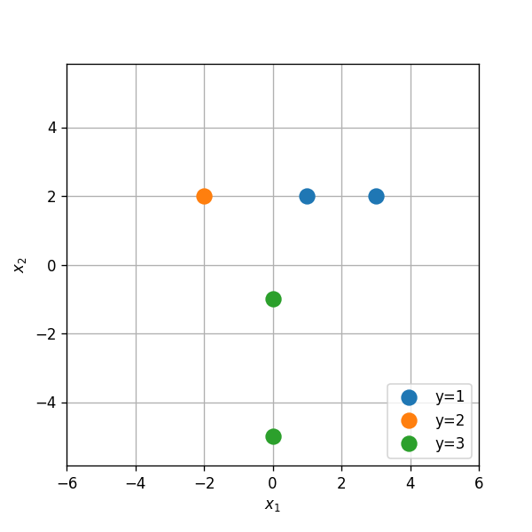
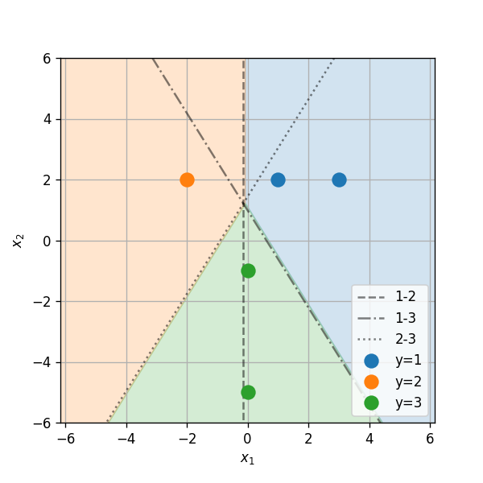
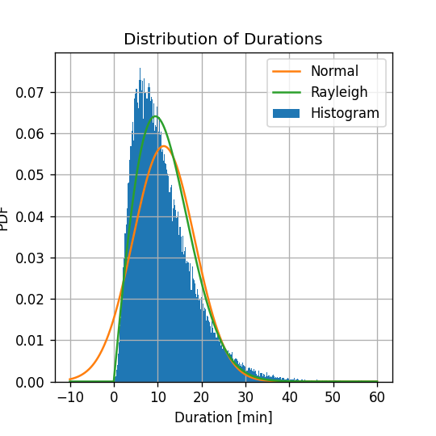
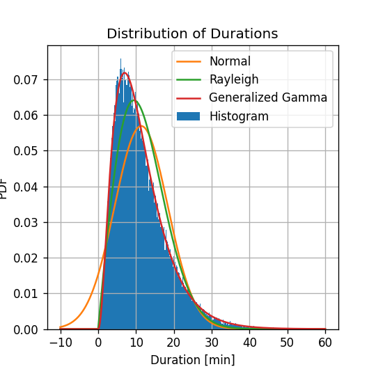

<section class="center">
<section>

# תרגול 8 - שיערוך פילוג בשיטות פרמטריות וסיווג גנרטיבי

<a href="/assets/tutorial08_slides.pdf" class="link-button" target="_blank">PDF</a>

</section><section>

## תקציר התיאוריה

### הבעיה בגישה הלא פרמטרית

* **Curse of dimensionality**: 
  * שיטות לא פרמטריות לומדות את הפילוג בכל איזור על פי הדגימות שנמצאות באותו איזור באופן בלתי תלוי באיזורים האחרים במרחב.
  * לכן, נדרש מספר רב של דוגמאות לכסות את מרחב הדגימות האפשריות.
  * הגודל האפקטיבי של מרחב הדגימות גדל מעריכית עם המימד של הדגימות (האורך של הוקטור $\mathbf{x}$)

* המודלים המתקבלים אינם פונקציות שנוח לעבוד איתן.
  * לדוגמא: חישוב הצפיפות בנקודה מסויימת ב- KDE נעשה באמצעות סכימה על כל הנקודות שנמצאות ב train set.

</section><section>

### הגישה הפרמטרית

 
* נעשה שימוש במודלים פרמטריים בדומה לאופן שבו הדבר נעשה בגישה הדיסקרימינטיבית.
* נחפש פילוג מתוך משפחה פרמטרית מסויימת, על ידי מציאת הפרמטרים האופטימליים.
  * לרוב ננסה למדל את צפיפות הפילוג (הPDF). 

* באופן כללי ישנן 2 דרכים להתייחס לפרמטרי המודל: הגישה הבייסיאנית, והגישה התדירותית (לא בייסיאנית).
 * בגישה הבייסיאנית אנו מתייחסים לפרמטרים כאל משתנים אקראיים.
 * בגישה התדירותית אנו מתייחסים לפרמטרים כקבועים.

</section><section>

#### הגישה הלא-בייסיאנית (קלאסית או תדירותית (**Frequintist**))

* בגישה זו אנו נתייחס לפרמטרים באופן דומה לשיטות הדיסקרימינטיביות.
* תחת גישה זו אין כל העדפה של ערך מסויים של הפרמטרים על פני ערך אחר. את המודל הפרמטרי להסתברות / צפיפות הסתברות של משתנה אקראי $\mathbf{x}$ נסמן ב:

$$
p_{\mathbf{x}}(\boldsymbol{x};\boldsymbol{\theta})
$$

</section><section>

## 

##### משערך Maximum Likelihood Estimator (MLE)

* הדרך הנפוצה ביותר לבחור את הערך של $\boldsymbol{\theta}$ תחת הגישה הלא בייסאנית היא בעזרת MLE.
  * נחפש את הערך של $\boldsymbol{\theta}$ אשר מסביר בצורה הכי טובה את המדגם הנתון.

* נסמן ב $p_{\mathcal{D}}(\mathcal{D};\boldsymbol{\theta})$ את ההסתברות לקבלת מדגם $\mathcal{D}=\{\boldsymbol{x}^{(i)}\}$.

* גודל זה מכונה ה**סבירות** (**likelihood**) של המדגם כפונקציה של $\boldsymbol{\theta}$. 

* כדי להדגיש שהמדגם הוא ״גודל״ ידוע ואילו הגודל הלא ידוע שאותו נרצה לבדוק הינו $\boldsymbol{\theta}$, מקובל לסמן את פונקציית ה likelihood באופן הבא:

$$
\mathcal{L}(\boldsymbol{\theta};\mathcal{D})\triangleq p_{\mathcal{D}}(D;\boldsymbol{\theta})
$$

</section><section>

* משערך ה MLE של $\boldsymbol{\theta}$ הוא הערך שממקסם את ה- likelihood:

$$
\hat{\boldsymbol{\theta}}_{\text{MLE}}
=\underset{\boldsymbol{\theta}}{\arg\max}\ \mathcal{L}(\boldsymbol{\theta};\mathcal{D})
=\underset{\boldsymbol{\theta}}{\arg\min}\ -\mathcal{L}(\boldsymbol{\theta};\mathcal{D})
$$

* כאשר הדגימות במדגם הן i.i.d נוכל להסיק כי:

$$
p_{\mathcal{D}}(\mathcal{D};\boldsymbol{\theta})=\prod_i p_{\mathbf{x}}(\boldsymbol{x}^{(i)};\boldsymbol{\theta})
$$

ולכן:

$$
\hat{\boldsymbol{\theta}}_{\text{MLE}}
=\underset{\boldsymbol{\theta}}{\arg\min}\ -\mathcal{L}(\boldsymbol{\theta};\mathcal{D})
=\underset{\boldsymbol{\theta}}{\arg\min}\ -\prod_i p_{\mathbf{x}}(\boldsymbol{x}^{(i)};\boldsymbol{\theta})
$$

* נוכל להחליף את המכפלה על כל הדגימות בסכום (Maximum Log-Likelihood Estimator):

$$
\hat{\boldsymbol{\theta}}_{\text{MLE}}
=\underset{\boldsymbol{\theta}}{\arg\min}\ -\log\mathcal{L}(\boldsymbol{\theta};\mathcal{D})
=\underset{\boldsymbol{\theta}}{\arg\min}\ -\sum_i \log\left(p_{\mathbf{x}}(\boldsymbol{x}^{(i)};\boldsymbol{\theta})\right)
$$

</section><section>

## 

#### הגישה הבייסיאנית

* וקטור הפרמטרים $\boldsymbol{\theta}$ הינו ריאליזציה של וקטור אקראי בעל פילוג כלשהוא $p_{\boldsymbol{\theta}}(\boldsymbol{\theta})$.

* פילוג זה מכונה ה**א-פריורי** (**a priori distribution**), הפילוג של $\boldsymbol{\theta}$ לפני שראינו את המדגם.

* תחת גישה זו, המודל שלנו יהיה הפילוג של $\mathbf{x}$ **בהינתן** $\boldsymbol{\theta}$:

$$
p_{\mathbf{x}|\boldsymbol{\theta}}(\boldsymbol{x}|\boldsymbol{\theta})
$$

</section><section>

## 

##### משערך Maximum A-posteriori Probaility (MAP)

 
* בגישה זו נבחר את הערך של $\boldsymbol{\theta}$ ע"י משערך MAP.
 

 
* נחפש את הערך הכי סביר של $\boldsymbol{\theta}$ בהינתן המדגם $p_{\boldsymbol{\theta}|\mathcal{D}}(\boldsymbol{\theta}|\mathcal{D})$.

 
* פילוג זה מכונה הפילוג **א-פוסטריורי** (**a posteriori distribution**) (או הפילוג בדיעבד) - הפילוג אחרי שראינו את המדגם.
 

</section><section>

## 

אם כן, משערך ה MAP הוא וקטור הפרמטרים אשר ממקסמים את ההסתברות ה א-פוסטריורית:

$$
\hat{\boldsymbol{\theta}}_{\text{MAP}}
=\underset{\boldsymbol{\theta}}{\arg\max}\ p_{\boldsymbol{\theta}|\mathcal{D}}(\boldsymbol{\theta}|\mathcal{D})
=\underset{\boldsymbol{\theta}}{\arg\min}\ -p_{\boldsymbol{\theta}|\mathcal{D}}(\boldsymbol{\theta}|\mathcal{D})
$$

על פי חוק בייס, נוכל לכתוב זאת כ:

$$
\hat{\boldsymbol{\theta}}_{\text{MAP}}
=\underset{\boldsymbol{\theta}}{\arg\min}\ 
-\frac{
  p_{\mathcal{D}|\boldsymbol{\theta}}(\mathcal{D}|\boldsymbol{\theta})
  p_{\boldsymbol{\theta}}(\boldsymbol{\theta})
}{
  p_{\mathcal{D}}(\mathcal{D})
}
=\underset{\boldsymbol{\theta}}{\arg\min}\ 
-p_{\mathcal{D}|\boldsymbol{\theta}}(\mathcal{D}|\boldsymbol{\theta})
p_{\boldsymbol{\theta}}(\boldsymbol{\theta})
$$

כאשר הדגימות במדגם **בהינתן** $\boldsymbol{\theta}$ הן i.i.d מתקיים כי:

$$
p_{\mathcal{D}|\boldsymbol{\theta}}(\mathcal{D}|\boldsymbol{\theta})=\prod_i p_{\mathbf{x}|\boldsymbol{\theta}}(\boldsymbol{x}^{(i)}|\boldsymbol{\theta})
$$

ולכן:

$$
\hat{\boldsymbol{\theta}}_{\text{MAP}}
=\underset{\boldsymbol{\theta}}{\arg\min}\ 
-p_{\boldsymbol{\theta}}(\boldsymbol{\theta})
\prod_i p_{\mathbf{x}|\boldsymbol{\theta}}(\boldsymbol{x}^{(i)}|\boldsymbol{\theta})
$$

</section><section>

גם כאן נוכל להפוך את המכפלה לסכום על ידי מזעור מינוס הלוג של הפונקציה:

$$
\hat{\boldsymbol{\theta}}_{\text{MAP}}
=\underset{\boldsymbol{\theta}}{\arg\min}\ -\log\left(p_{\boldsymbol{\theta}}(\boldsymbol{\theta})\right)-\sum_i \log\left(p_{\mathbf{x}|\boldsymbol{\theta}}(\boldsymbol{x}^{(i)}|\boldsymbol{\theta})\right)
$$

</section><section>

## Linear Discriminant Analysis (LDA)

LDA הינו אלגוריתם לפתרון בעיות סיווג בגישה גנרטיבית פרמטרית (לא בייסיאנית).

המודל הפרמטרי:

1. את הפילוג של $p_{\text{y}}(y)$ נשערך ישירות מתוך התווית (זה פילוג דיסקרטי).
2. את הפילוג של $p_{\mathbf{x}|\text{y}}(\boldsymbol{x}|y)$ נמדל כפילוג נורמאלי.
3. אנו נניח כי מטריצת ה convariance של הפילוג הנורמאלי אינה תלויה בערך של $\text{y}$.

</section><section>

* נסמן את מטריצת הקווריאנס של הפילוגים הנורמאליים (אותה נרצה לשערך) ב- $\Sigma$.

* בנוסף, בעבור כל מחלקה $c$ של $\text{y}$ נסמן:
  * $\mathcal{I}_c=\{i:\ y^{(i)}=c\}$ - זאת אומרת, אוסף האינדקסים של הדגמים במדגם שמקיימים $y^{(i)}=c$.
  * $|\mathcal{I}_c|$ - מספר האינדקסים ב $\mathcal{I}_c$
  * $\mu_c$ - וקטורי התוחלת של הפילוג הנורמאלי $p_{\mathbf{x}|\text{y}}(\boldsymbol{x}|c)$.

</section><section>

## 

שיערוך של הפרמטריים בעזרת משערך MLE נותן את הפתרון הבא:

$$
\boldsymbol{\mu}_c = \frac{1}{|\mathcal{I}_c|}\sum_{i\in \mathcal{I}_c}\boldsymbol{x}^{(i)}
$$

$$
\Sigma = \frac{1}{N}\sum_{i}\left(\boldsymbol{x}^{(i)}-\boldsymbol{\mu}_{y^{(i)}}\right)\left(\boldsymbol{x}^{(i)}-\boldsymbol{\mu}_{y^{(i)}}\right)^T
$$

</section><section>

## 

### הפרדה לינארית

בעבור המקרה של סיווג בינארי (סיווג לשתי מחלקות) ופונקציית מחיר misclassification rate מתקבל החזאי הבא:

$$
h\left(x\right)=
\begin{cases}
  1\qquad \boldsymbol{a}^T \boldsymbol{x} + b > 0 \\
  0\qquad \text{otherwise}\\
\end{cases}
$$

כאשר:

$$
\boldsymbol{a}=\Sigma^{-1}\left(\boldsymbol{\mu}_1-\boldsymbol{\mu}_0\right)
$$

$$
b=\tfrac{1}{2}\left(\boldsymbol{\mu}_0^T\Sigma^{-1}\boldsymbol{\mu}_0 - \boldsymbol{\mu}_1^T\Sigma^{-1}\boldsymbol{\mu}_1\right) + \log\left(\frac{p_\text{y}\left(1\right)}{p_\text{y}\left(0\right)}\right)
$$

* נשים לב כי תנאי ההחלטה שבין שני התחומים הינו לינארי, ומכאן מקבל האלגוריתם את שמו.

</section><section>

## 

## תרגיל 6.1 - שיערוך MLE

נתון מדגם $\mathcal{D}=\{x^{(i)}\}_{i=1}^N$ של דגימות בלתי תלויות של משתנה אקראי $\text{x}$. מצאו את משערך ה MLE של המודלים הבאים:

 

**1)** פילוג נורמלי: $\text{x}\sim N\left(\mu,\sigma^2\right)$ עם פרמטרים $\mu$ ו$\sigma^2$ לא ידועים.

**2)** פילוג אחיד: $\text{x}\sim U\left[0, \theta\right]$, עם פרמטר $\theta$ לא יודע.

**3)** פילוג אקספוננציאלי (**לקריאה עצמית**): $\text{x}\sim \exp\left(\theta\right)$. עם פרמטר $\theta$ לא ידוע.

</section><section>

## 

### פיתרון 6.1

#### 1)

המודל של פונקציית ה PDF יהיה:

$$
p(x;\boldsymbol{\theta})=\frac{1}{\sqrt{2\pi\sigma^2}_2}\exp\left(-\frac{1}{2\sigma^2}(x-\mu)^2\right)
$$

נסמן את וקטור הפרמטרים: $\boldsymbol{\theta}=[\mu,\sigma^2]^T$. המשערך הינו:

$$
\begin{aligned}
\hat{\boldsymbol{\theta}}_{\text{MLE}}
& = \underset{\boldsymbol{\theta}}{\arg\min}\ -\sum_{i=1}^N\log\left(p(x^{(i)};\boldsymbol{\theta})\right) \\
& = \underset{\boldsymbol{\theta}}{\arg\min}\quad -\sum_{i=1}^N\log\left(\frac{1}{\sqrt{2\pi\theta}_2}\exp\left(-\frac{1}{2\theta_2}\left(x^{(i)}-\theta_1\right)^2\right)\right) \\
& = \underset{\boldsymbol{\theta}}{\arg\min}\quad \frac{N}{2}\log\left(2\pi\theta_2\right)+\sum_{i=1}^N\frac{1}{2\theta}_2\left(x^{(i)}-\theta_1\right)^2 \\
\end{aligned}
$$

</section><section>

נפתור על ידי גזירה והשוואה ל 0 (נסמן ב $f(\boldsymbol{\theta})$ את פונקציית המטרה אותה יש למזער):

$$
\begin{aligned}
& \begin{cases}
  \frac{\partial}{\partial \theta_1}f(\boldsymbol{\theta})=0 \\
  \frac{\partial}{\partial \theta_2}f(\boldsymbol{\theta})=0 \\
\end{cases} \\
\Leftrightarrow & \begin{cases}
  \sum_{i=1}^N\frac{1}{\theta_2}\left(x^{(i)}-\theta_1\right)=0 \\
  \frac{N}{2\theta_2}-\sum_{i=1}^N\frac{1}{2\theta_2^2}\left(x^{(i)}-\theta_1\right)^2=0
\end{cases} \\
\Leftrightarrow & \begin{cases}
  \theta_1=\frac{1}{N}\sum_{i=1}^N x^{(i)} \\
  \theta_2=\frac{1}{N}\sum_{i=1}^N\left(x^{(i)}-\theta_1\right)^2
\end{cases} \\
\end{aligned}
$$

מכאן ש:

$$
\hat{\mu}_{\text{MLE}}=\hat{\theta}_1=\frac{1}{N}\sum_{i=1}^N x^{(i)}
$$

$$
\hat{\sigma^2}_{\text{MLE}}=\hat{\theta}_2=\frac{1}{N}\sum_{i=1}^N\left(x^{(i)}-\hat{\mu}_{\text{MLE}}\right)^2
$$

</section><section>

## 

#### 2)

המודל של פונקציית ה PDF יהיה:

$$
p(x;\theta))
=\begin{cases}
  \tfrac{1}{\theta} & \theta\geq x_i\geq 0 \\
  0 & \text{else}
\end{cases}
$$

ולכן:

$$
\hat{\boldsymbol{\theta}}_{\text{MLE}}
=\underset{\boldsymbol{\theta}}{\arg\max}\ \prod_{i=1}^N p(x^{(i)};\boldsymbol{\theta})
=\begin{cases}
  \tfrac{1}{\theta^N} & \theta\geq x^{(i)}\quad\forall i \\
  0 & \text{else}
\end{cases}
$$

התנאי $\theta\geq x^{(i)}$ לכל $i$ שקול ל $\theta\geq\max_i\{x^{(i)}\}$. מצד אחד נרצה לקיים תנאי זה בכדי שה likelihood לא יתאפס, מצד שני נרצה ש $\theta$ יהיה כמה שיותר קטן בכדי למקסם את $1/\theta^N$. לכן,

$$
\hat{\theta}_{\text{MLE}} = \max_i\{x^{(i)}\}
$$

</section><section>

## 

#### 3)

המודל של פונקציית ה PDF יהיה:

$$
p(x;\boldsymbol{\theta}))=\theta\exp(-\theta x)
$$

משערך ה MLE נתון על ידי:

$$
\begin{aligned}
\hat{\boldsymbol{\theta}}_{\text{MLE}}
& = \underset{\boldsymbol{\theta}}{\arg\min}\ -\sum_{i=1}^N\log\left(p(x^{(i)};\boldsymbol{\theta})\right) \\
& = \underset{\boldsymbol{\theta}}{\arg\min}\ -N\log(\theta)+\theta\sum_{i=1}^N x^{(i)}
\end{aligned}
$$

</section><section>

## 

נפתור על ידי גזירה והשוואה ל 0 (נסמן ב $f(\theta)$ את פונקציית המטרה אותה יש למזער):

$$
\begin{aligned}
& \frac{\partial}{\partial\theta}f(\theta)=0 \\
\Leftrightarrow & -\frac{N}{\theta}+\sum_{i=1}^N x^{(i)}=0 \\
\Leftrightarrow & \theta=\frac{1}{\frac{1}{N}\sum_{i=1}^N x^{(i)}} \\
\end{aligned}
$$

מכאן ש:

$$
\hat{\theta}_{\text{MLE}} = \frac{1}{\frac{1}{N}\sum_{i=1}^N x^{(i)}}
$$

</section><section>

## 

## תרגיל 6.2 - MAP

ביום טוב, עומרי כספי קולע בהסתברות $p$ מהקו. ביום רע, הוא קולע בהסתברות $q$ מהקו. $\alpha$ מהימים הם ימים טובים עבור עומרי.

ביום מסויים זרק עומרי $N$ זריקות וקלע $m$ מתוכם. מאמנו של עומרי צריך לזהות האם מדובר ביום טוב או רע של השחקן (ולהשאיר אותו או להחליף אותו בהתאמה).

**מהו חוק ההחלטה אשר ממקסם את סיכויי המאמן לצדוק?**

* הניחו כי בהינתן המידע של האם יום מסויים הוא טוב או לא, ההסברות לקלוע זריקות שונות הינה הסתברות בלתי תלויה.

</section><section>

## 

### פתרון 6.2

- $\text{x}^{(i)}$ - משתנה אקראי בינארי של האם עומרי קלע בזריקה ה $i$. (0-החטיא, 1-קלע)
- $\text{y}$ - משתנה אקראי בינארי של האם היום הינו יום טוב. (0-יום לא טוב, 1-יום טוב).

על פי הנתונים בשאלה:

$$
p_{\text{x}|\text{y}}(x|0)=\begin{cases}
  1-q & x=0 \\
  q & x=1
\end{cases}
$$

$$
p_{\text{x}|\text{y}}(x|1)=\begin{cases}
  1-p & x=0 \\
  p & x=1
\end{cases}
$$

$$
p_{\text{y}}(y)=\begin{cases}
  1-\alpha & y=0 \\
  \alpha & y=1
\end{cases}
$$
</section><section>

* בכדי למקסם את הסיכוי לחזות האם היום הוא יום טוב בהינתן המדגם נרצה למצוא איזה ערך יותר סביר בהינתן המדגם (יום טוב או רע).
* במילים אחרות אנו רוצים את ה $\text{y}$ הכי סביר בהינתן $\mathcal{D}=\{x^{(i)}\}$

$$
\hat{y}=\underset{y}{\arg\max}\ p_{\text{y}|\mathcal{D}}(y|\mathcal{D})
$$

* זוהי למעשה בעיית MAP קלאסית, כאשר $\text{y}$ משמש למעשה כפרמטר בפילוג של $\text{x}|\text{y}$.
* בכדי לשמור על אחידות עם הסימונים שהגדרנו קודם לבעיות שיערוך נסמן את $\text{y}$ ב $\theta$. 

$$
\hat{\theta}
=\underset{\theta}{\arg\max}\ p_{\theta|\mathcal{D}}(\theta|\mathcal{D})
=\underset{\theta}{\arg\max}\ p_{\mathcal{D}|\theta}(\mathcal{D}|\theta)p_{\theta}(\theta)
=\underset{\theta}{\arg\max}\ p_{\theta}(\theta)\prod_i p_{\text{x}|\theta}(x^{i}|\theta)
$$

</section><section>

מכיוון ש $\theta$ יכול לקבל רק שני ערכים נוכל לבדוק את שניהם ולקבוע מי מהם סביר יותר.

בעבור $\theta=0$ נקבל:

$$
p_{\theta}(0)\prod_i p_{\text{x}|\theta}(x^{(i)}|0)
=(1-\alpha)q^m\left(1-q\right)^{N-m}
$$

בעבור $\theta=1$ נקבל:

$$
p_{\theta}(1)\prod_i p_{\text{x}|\theta}(x^{(i)}|1)
=\alpha p^m\left(1-p\right)^{N-m}
$$

לכן החיזוי האופטימאלי יהיה:

$$
\begin{aligned}
\hat{\theta}
& = \begin{cases}
  0 & (1-\alpha)q^m\left(1-q\right)^{N-m} > \alpha p^m\left(1-p\right)^{N-m} \\
  1 & \text{otherwise}
\end{cases} \\
& = \begin{cases}
  0 & \frac{1-\alpha}{\alpha}\left(\frac{q}{p}\right)^m\left(\frac{1-q}{1-p}\right)^{N-m} > 1 \\
  1 & \text{otherwise}
\end{cases} \\
\end{aligned}
$$

</section><section>

## 

#### תרגיל 6.3 - LDA

* בסוואנה חיים שלושה זני פילים אשר נמצאים בסכנת הכחדה. ידוע כי כל אחד משלושת הזנים ניזון מצמחיה מעט שונה, ועל מנת לשמר את אוכלוסיית הפילים מעוניינים לפזר להם אוכל ברחבי הסוואנה.

* בכדי למקסם את האפקטיביות של פעולה זו מעוניינים לשערך בכל נקודת חלוקה מהו הזן שהכי סביר להמצא באותה נקודה על מנת להתאים את סוג המזון לזן זה.

* הפילוג של זני הפילים על פני הסוואנה אינו ידוע אך נתונות לנו התצפית הבאה של הקואורדינטות בהן נצפו הפילים:

| Type | $\text{x}_1$ | $\text{x}_2$ |
| ---- | ------------ | ------------ |
|   1  |  1           |  2           |
|   1  |  3           |  2           |
|   2  | -2           |  2           |
|   3  |  0           | -1           |
|   3  |  0           | -5           |

</section><section>

## 

השתמשו במסווג LDA על מנת לבנות חזאי אשר ישערך את הזן הנפוץ ביותר בכל קואורדינטה.

</section><section>

## 

### פתרון 6.3

נחשב את הפרמטרים של המודל הפרמטרי של LDA:

נסמן ב $\mathcal{I}_c$ את אוסף כל התצפיות של שבהם הזן הוא $c$:

$$
\mathcal{I}_1=\{1,2\}
$$

$$
\mathcal{I}_2=\{3\}
$$

$$
\mathcal{I}_3=\{4,5\}
$$

נשערך את $p_{\text{y}}(y)$:

$$
p_{\text{y}}(y)=\begin{cases}
  \frac{|\mathcal{I}_1|}{N}=\frac{2}{5} & 1 \\
  \frac{|\mathcal{I}_2|}{N}=\frac{1}{5} & 2 \\
  \frac{|\mathcal{I}_3|}{N}=\frac{2}{5} & 3 \\
\end{cases}
$$

</section><section>

## 

נחשב את התוחלות של כל אחת משלושת הפילוגים $p_{\mathbf{x}|\text{y}}(\boldsymbol{x}|c)$:

$$
\boldsymbol{\mu}_1=\frac{1}{|\mathcal{I}_1|}\sum_{i\in\mathcal{I}_1}\boldsymbol{x}^{(i)}
=\frac{1}{2}\left(\begin{pmatrix}1\\2\end{pmatrix}+\begin{pmatrix}3\\2\end{pmatrix}\right)
=\begin{pmatrix}2\\2\end{pmatrix}
$$

$$
\boldsymbol{\mu}_2=\frac{1}{|\mathcal{I}_2|}\sum_{i\in\mathcal{I}_2}\boldsymbol{x}^{(i)}
=\begin{pmatrix}-2\\2\end{pmatrix}
$$

$$
\boldsymbol{\mu}_3=\frac{1}{|\mathcal{I}_3|}\sum_{i\in\mathcal{I}_3}\boldsymbol{x}^{(i)}
=\frac{1}{2}\left(\begin{pmatrix}0\\-1\end{pmatrix}+\begin{pmatrix}0\\-5\end{pmatrix}\right)
=\begin{pmatrix}0\\-3\end{pmatrix}
$$

נחשב את מטריצת covariance המשותפת של הפילוגים:

$$
\Sigma=\frac{1}{N}\sum_{i}(\boldsymbol{x}^{(i)}-\boldsymbol{\mu}_{y^{(i)}})(\boldsymbol{x}^{(i)}-\boldsymbol{\mu}_{y^{(i)}})^T
$$

</section><section>

## 

דרך נוחה לחשב את הסכום בביטוי זה הינה באופן הבא: נגדיר את המטריצה של התצפיות לאחר חיסור של התוחלת המתאימה לכל זן:

$$
\tilde{X}
=\begin{pmatrix}-\boldsymbol{x}_1-\\-\boldsymbol{x}_2-\\-\boldsymbol{x}_3-\\-\boldsymbol{x}_4-\\-\boldsymbol{x}_5-\end{pmatrix}-\begin{pmatrix}-\boldsymbol{\mu}_{y_1}-\\-\boldsymbol{\mu}_{y_2}-\\ -\boldsymbol{\mu}_{y_3}\\-\boldsymbol{\mu}_{y_4}-\\-\boldsymbol{\mu}_{y_5}-\end{pmatrix}
=\begin{pmatrix}1 & 2 \\ 3 & 2 \\ -2 & 2 \\ 0 & -1 \\ 0 & -5 \end{pmatrix}-\begin{pmatrix} 2 & 2 \\ 2 & 2 \\ -2  & 2 \\ 0 & -3 \\ 0 & -3 \end{pmatrix}
=\begin{pmatrix}-1 & 0 \\ 1 & 0 \\ 0 & 0 \\ 0 & 2 \\ 0 & -2 \end{pmatrix}
$$

ניתן להראות כי ניתן לכתוב את הסכום בביטוי ל $\Sigma$ באופן הבא:

$$
\begin{aligned}
\Sigma
& =\frac{1}{N}\sum_{i}(\boldsymbol{x}^{(i)}-\boldsymbol{\mu}_{y^{(i)}})(\boldsymbol{x}^{(i)}-\boldsymbol{\mu}_{y^{(i)}})^T=\frac{1}{N}\tilde{X}^T\tilde{X}\\
& =\frac{1}{5}\begin{pmatrix}-1 & 1 & 0 & 0 & 0 \\ 0 & 0 & 0 & 2 & -2 \end{pmatrix}\begin{pmatrix}-1 & 0 \\ 1 & 0 \\ 0 & 0 \\ 0 & 2 \\ 0 & -2 \end{pmatrix} =\frac{1}{5}\begin{pmatrix} 2  & 0 \\ 0 & 8 \end{pmatrix}
\end{aligned}
$$

</section><section>

* נשתמש כעת בפילוגים שאותם שיערכנו על מנת לבנות את החזאי.
* האיזור שבו זן 1 הינו הזן הסביר ביותר הינו האיזור שבו מתקיים:

$$
\begin{cases}
p_{\text{y}|\mathbf{x}}(1|\boldsymbol{x}) > p_{\text{y}|\mathbf{x}}(2|\boldsymbol{x}) \\
p_{\text{y}|\mathbf{x}}(1|\boldsymbol{x}) > p_{\text{y}|\mathbf{x}}(3|\boldsymbol{x})
\end{cases}
$$

</section><section>

נחשב את התנאי הראשון

$$
\begin{aligned}
p_{\text{y}|\mathbf{x}}(1|\boldsymbol{x}) &> p_{\text{y}|\mathbf{x}}(2|\boldsymbol{x}) \\
\Leftrightarrow p_{\mathbf{x}|\text{y}}(\boldsymbol{x}|1)p_{\text{y}}(1) &> p_{\mathbf{x}|\text{y}}(\boldsymbol{x}|2)p_{\text{y}}(2) \\
\Leftrightarrow
  \frac{1}{\sqrt{4\pi^2|\Sigma|}}e^{-\tfrac{1}{2}(\boldsymbol{x}-\boldsymbol{\mu}_1)^T\Sigma^{-1}(\boldsymbol{x}-\boldsymbol{\mu}_1)}p_{\text{y}}(1)
  &>
  \frac{1}{\sqrt{4\pi^2|\Sigma|}}e^{-\tfrac{1}{2}(\boldsymbol{x}-\boldsymbol{\mu}_2)^T\Sigma^{-1}(\boldsymbol{x}-\boldsymbol{\mu}_2)}p_{\text{y}}(2) \\
\Leftrightarrow
  -\tfrac{1}{2}(\boldsymbol{x}-\boldsymbol{\mu}_1)^T\Sigma^{-1}(\boldsymbol{x}-\boldsymbol{\mu}_1)+\log\left(p_{\text{y}}(1)\right)
  &>
  -\tfrac{1}{2}(\boldsymbol{x}-\boldsymbol{\mu}_2)^T\Sigma^{-1}(\boldsymbol{x}-\boldsymbol{\mu}_2)+\log\left(p_{\text{y}}(2)\right) \\
\Leftrightarrow
  \boldsymbol{x}^T\Sigma^{-1}(\boldsymbol{\mu}_1-\boldsymbol{\mu}_2)
  +\tfrac{1}{2}(\boldsymbol{\mu}_2^T\Sigma^{-1}\boldsymbol{\mu}_2 &-\boldsymbol{\mu}_1^T\Sigma^{-1}\boldsymbol{\mu}_1)
  +\log\left(\frac{p_{\text{y}}(1)}{p_{\text{y}}(2)}\right)
  >0
\end{aligned}
$$

זוהי למעשה הפרדה לשני תחומים על ידי הקו הבא:

$$
\boldsymbol{a}^T \boldsymbol{x}+b=0
$$

כאשר:

$$
\begin{aligned}
&\boldsymbol{a}=\Sigma^{-1}(\boldsymbol{\mu}_1-\boldsymbol{\mu}_2)
=\begin{pmatrix} 10 \\ 0 \end{pmatrix} \\
& b=\tfrac{1}{2}(\boldsymbol{\mu}_2^T\Sigma^{-1}\boldsymbol{\mu}_2 - \boldsymbol{\mu}_1^T\Sigma^{-1}\boldsymbol{\mu}_1) + \log\left(\frac{p_{\text{y}}(1)}{p_{\text{y}}(2)}\right)
=\log(2)
\end{aligned}
$$

</section><section>

* זוהי כמובן התוצאה עבור מסווג LDA בינארי בין שני הזנים של $\text{y}=1$ ו $\text{y}=2$.

* מכאן שהקו המפריד בין זן 1 ל זן 2 נתון על ידי:

$$
1-2:\quad 10x_1+\log(2)=0
$$

* באופן דומה ניתן לחשב גם את שני קווי ההפרדה האחרים (בין 1 ל 3 ובין 2 ל 3):

$$
1-3:\quad 5x_1+\frac{25}{8}x_2+\frac{55}{16}=0
$$

$$
2-3:\quad -5x_1+\frac{25}{8}x_2+\frac{55}{16}-\log(2)=0
$$

</section><section>

## 

</section><section>

## 

## תרגיל מעשי - שיערוך הפילוג של זמני נסיעה בניו יורק

<a href="./example/" class="link-button" target="_blank">Code</a>

נחזור לבעיה מהתרגול הקודם של שיערוך הפילוג של זמן הנסיעה של מונית מתוך המדגם הבא:

|    |   passenger count |   trip distance |   payment type |   fare amount |   tip amount |   pickup easting |   pickup northing |   dropoff easting |   dropoff northing |   duration |   day of week |   day of month |   time of day |
|---:|------------------:|----------------:|---------------:|--------------:|-------------:|-----------------:|------------------:|------------------:|-------------------:|-----------:|--------------:|---------------:|--------------:|
|  0 |                 2 |        2.76806  |              2 |           9.5 |         0    |          586.997 |           4512.98 |           588.155 |            4515.18 |   11.5167  |             3 |             13 |      12.8019  |
|  1 |                 1 |        3.21868  |              2 |          10   |         0    |          587.152 |           4512.92 |           584.85  |            4512.63 |   12.6667  |             6 |             16 |      20.9614  |
|  2 |                 1 |        2.57494  |              1 |           7   |         2.49 |          587.005 |           4513.36 |           585.434 |            4513.17 |    5.51667 |             0 |             31 |      20.4128  |
|  3 |                 1 |        0.965604 |              1 |           7.5 |         1.65 |          586.649 |           4511.73 |           586.672 |            4512.55 |    9.88333 |             1 |             25 |      13.0314  |
|  4 |                 1 |        2.46229  |              1 |           7.5 |         1.66 |          586.967 |           4511.89 |           585.262 |            4511.76 |    8.68333 |             2 |              5 |       7.70333 |
|  5 |                 5 |        1.56106  |              1 |           7.5 |         2.2  |          585.926 |           4512.88 |           585.169 |            4511.54 |    9.43333 |             3 |             20 |      20.6672  |
|  6 |                 1 |        2.57494  |              1 |           8   |         1    |          586.731 |           4515.08 |           588.71  |            4514.21 |    7.95    |             5 |              8 |      23.8419  |
|  7 |                 1 |        0.80467  |              2 |           5   |         0    |          585.345 |           4509.71 |           585.844 |            4509.55 |    4.95    |             5 |             29 |      15.8314  |
|  8 |                 1 |        3.6532   |              1 |          10   |         1.1  |          585.422 |           4509.48 |           583.671 |            4507.74 |   11.0667  |             5 |              8 |       2.09833 |
|  9 |                 6 |        1.62543  |              1 |           5.5 |         1.36 |          587.875 |           4514.93 |           587.701 |            4513.71 |    4.21667 |             3 |             13 |      21.7831  |

ננסה להתאים מודל פרמטרי בעזרת שיערוך MLE.

</section><section>

## 

### ניסיון 1: פילוג גאוסי

* נשתמש במודל של פילוג נורמלי לתיאור הפילוג של משך הנסיעה. למודל זה שני פרמטרים, התוחלת $\mu$ והשונות $\sigma$ .

סימונים והנחות:

- $N$ - מספר הדגמים במדגם.

- $\boldsymbol{\theta}=\left[\mu,\sigma\right]^T$ - וקטור הפרמטרים של המודל
- $p_\text{normal}\left(x_i;\boldsymbol{\theta}\right)=\frac{1}{\sqrt{2\pi\sigma^2}}\exp\left(-\frac{\left(x_i-\mu\right)^2}{2\sigma^2}\right), i=1,...,N$ - המודל

</section><section>

ראינו כי בעבור המודל הנורמלי, ניתן למצוא את הפרמטרים של משערך הMLE באופן מפורש (אנליטית), והפתרון נתון על ידי:

$$
\begin{aligned}
\mu=\displaystyle{\frac{1}{N}\sum_i x_i} \\
\sigma=\sqrt{\displaystyle{\frac{1}{N}\sum_i\left(x_i-\mu\right)^2}}
\end{aligned}
$$

בעבור המדגם הנתון נקבל:

$$
\hat{\mu} = 11.4\ \text{min}
$$

$$
\hat{\sigma} = 7.0\ \text{min}
$$

</section><section>

ההיסטוגרמה של של משכי הנסיעה יחד עם הפילוג המשוערך:

*  הפילוג הנורמלי נותן קירוב מאד גס לפילוג האמיתי.
* עובדה אחת שמאד מטרידה לגבי הפילוג שקיבלנו הינה שישנו סיכוי לא אפסי לקבל נסיעות עם משך נסיעה שלילי.

</section><section>

## 

### נסיון 2: פילוג Rayleigh

* פילוג Rayleigh מתאר את הפילוג של האורך האוקלידי ($l_2$ norm) של וקטור גאוסי דו מימדי עם תוחלת 0 וחוסר קורלציה ופילוג זהה לשני רכיבי הוקטור.
* במלים אחרות, עבור וקטור בעל הפילוג הבא:

$$
\boldsymbol{Z}\sim N\left(\begin{bmatrix} 0 \\ 0 \end{bmatrix}, \begin{bmatrix} \sigma^2 & 0 \\ 0 & \sigma^2 \end{bmatrix}\right)
$$

* פילוג Rayleigh מתאר את הגודל $\left\lVert\boldsymbol{Z}\right\rVert_2=\sqrt{Z_x^2+Z_y^2}$.

פונקציית צפיפות ההסתברות של פילוג Reyleigh נתונה על ידי:

$$
p_\text{Rayleigh}\left(z;\sigma\right)=\frac{z}{\sigma^2}\exp\left({-\frac{z^2}{2\sigma^2}}\right), \quad z\geq0
$$
</section><section>

## 

פונקציית צפיפות ההסתברות של פילוג Reyligh נתונה על ידי:

$$
p_\text{Rayleigh}\left(z;\sigma\right)=\frac{z}{\sigma^2}\exp\left({-\frac{z^2}{2\sigma^2}}\right), \quad z\geq0
$$

* <u>שימו לב:</u> הפילוג מוגדר רק בעבור ערכים חיוביים.
* לפילוג זה פרמטר יחיד $\sigma$ שנקרא פרמטר סקאלה (scale parameter). בניגוד לפילוג הנורמלי, פה $\sigma$ אינה שווה לסטיית התקן של הפילוג.

</section><section>

#### מוטיבציה לשימוש בפילוג Rayleigh

* נניח שוקטור המחבר את נקודת תחילת הנסיעה עם נקודת סיום הנסיעה הינו וקטור דו מימדי אשר מפולג נרמלית, ולשם הפשטות נניח כי רכיביו מפולגים עם פילוג זהה וחסר קורלציה.

* נניח כי המונית נוסעת בקירוב בקו ישר בין נקודת ההתחלה והסיום. לכן, המרחק אותו נוסעת המכונית יהיה מפולג על פי פילוג Reyleigh.
* נניח בנוסף כי מהירות הנסיעה קבועה ולכן משך הנסיעה פורפורציוני למרחק ולכן גם הוא יהיה מפולג על פי פילוג Reyleigh.

</section><section>

## 

### חישוב

לשם השלמות נסמן את וקטור הפרמטרים ב: $\theta=\left[\sigma\right]$

במקרה זה המודל נתון על ידי:

$$
p_\text{rayleigh}\left(\boldsymbol{x};\theta\right)=\prod_{i=1}^{N}\frac{x_i}{\theta^2}\exp\left(-\frac{x_i^2}{2\theta^2}\right)
$$

ופונקציית ה log likelihood תהיה:

$$
\begin{aligned}
l_\text{rayleigh}\left(\theta\right)
& = \sum_i\log\left(p_\text{rayleigh}\left(x_i;\theta\right)\right) \\
& = \sum_i\log\left(x_i\right)-2N\log\left(\theta\right)-\frac{1}{2\theta^2}\sum_ix_i^2
\end{aligned}
$$

</section><section>

## 

בעיית האופטימיזציה הינה:

$$
\hat{\boldsymbol{\theta}}=\underset{\boldsymbol{\theta}}{\arg\min}\quad-\sum_i\log\left(x_i\right)+2N\log\left(\theta\right)+\frac{1}{2\theta^2}\sum_ix_i^2
$$

גם בעבור המקרה הזה נוכל לפתור את בעיית האופטימיזציה באופן אנליטי על ידי גזירה והשוואה לאפס:

$$
\begin{aligned}
& \frac{\partial l_\text{rayleigh}\left(\theta\right)}{\partial\theta}=0 \\
\Leftrightarrow & -\frac{2N}{\theta}+\frac{\sum_ix^2}{\theta^3}=0 \\
\Leftrightarrow & \hat{\sigma} = \theta=\sqrt{\frac{1}{2N}\sum_i x^2}
\end{aligned}
$$

בעבור המדגם הנתון נקבל:

$$
\hat{\sigma} = 9.5
$$

</section><section>

## 

נוסיף את השיערוך החדש שקיבלנו לגרף ממקודם:

* המודל של פילוג Rayleigh טוב יותר מהמודל הנורמלי.
* אין הסתברות שונה מ0 לקבל משך נסיעה שלילי.

</section><section>

## 

### נסיון 3: Generalized Gamma Distribution

* פילוג Rayleigh הינו מקרה פרטי של משפחה כללית יותר של פונקציות פילוג המכונה Generalized Gamma Distribution.
* פונקציית צפיפות ההסתברות של משפחה זו נתונה על ידי:

$$
p_\text{gengamma}\left(z;\sigma,a,c\right)=
\frac{cz^{ca-1}\exp\left(-\left(z/\sigma\right)^c\right)}{\sigma^{ca-1}\Gamma\left(a\right)}
, \quad z\geq0
$$

* כש- $\Gamma$ היא פונקציה המוכנה [פונקציית גמא (gamma function)](https://en.wikipedia.org/wiki/Gamma_function) 

* למודל זה 3 פרמטרים: $\boldsymbol{\theta}=\left[\sigma, a, c\right]^T$.

* בעבור $c=2$ ו $a=1$ נקבל את פילוג Rayleight כאשר $\sigma_{gamma}=2\sigma_{rayleigh}$ .

</section><section>

## 

* בשונה מהמקרים של פילוג נורמלי ופילוג Rayleigh, לא נוכל למצוא בקלות את הפרמטרים האופטימאלים של המשערך באופן אנליטי.
* לכן, לשם מציאת הפרמטרים נאלץ להעזר בפתרון נומרי.
* נעשה שימוש באחת החבילה של Python הנקראת SciPy. חבילה זו מכילה מודלים הסברותיים רבים ומכילה מספר רב של כלים הקשורים למודלים אלו, כגון מציאת הפרמטרים האופטימאלים בשיטת MLE על סמך מדגם נתון. את הפונקציות הקשורות למודל הGeneralized Gamma Distribution ניתן למצוא [כאן](https://docs.scipy.org/doc/scipy/reference/generated/scipy.stats.gengamma.html#scipy.stats.gengamma). אתם תעשו שימוש בפונקציות אלו בתרגיל הבית הרטוב.

* שימוש בפונקציה הנ"ל, מניב את התוצאות הבאות:

$$
\hat{a} = 4.4
$$

$$
\hat{c} = 0.8
$$

$$
\hat{\sigma} = 1.6
$$

</section><section>

## 

נוסיף את השיערוך החדש שקיבלנו לגרף הקודם:

* המודל של Generalized Gamma Distribution אכן מניב תוצאה אשר דומה מאד לצורת ההיסטוגרמה.

